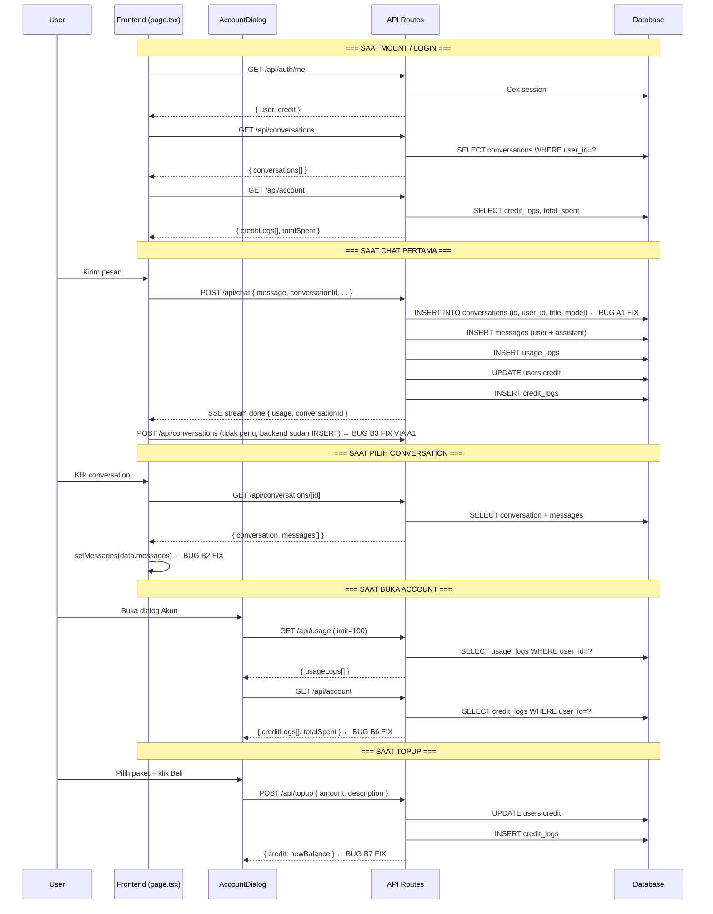
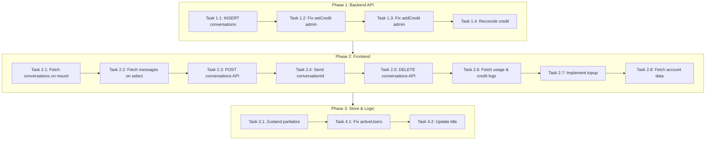

# Rencana Perbaikan: Data Tracking AI Hilang Setelah Refresh

## Ringkasan

Ditemukan **15 bug** yang menyebabkan semua data tracking (chat history, conversations, messages, usage logs, credit logs, token tracking) tidak persisten setelah browser di-refresh. Bug terbagi dalam 3 kategori: **Backend API (4 bug)**, **Frontend React (8 bug)**, **Zustand Store (1 bug)**, dan **Logic Error (2 bug)**.

---

## Daftar Lengkap Bug & Masalah

### 🔴 KATEGORI A: Backend API (Server-Side)

| ID | Prioritas | File | Baris | Deskripsi |
|----|-----------|------|-------|-----------|
| A1 | 🔴 CRITICAL | `src/app/api/chat/route.ts` | ~340-395 | **Conversations tidak pernah INSERT ke database.** Backend menyimpan messages, usage_logs, credit_logs, users.credit, tapi tidak ada `INSERT INTO conversations`. Hanya ada `UPDATE conversations SET updated_at` yang asumsinya conversation sudah ada. |
| A2 | 🟠 HIGH | `src/app/admin/page.tsx` | 416-427 | **`handleSetCredit` hanya update Zustand lokal, tidak panggil API.** Tidak ada `fetch('PUT /api/admin/users')` untuk menyimpan perubahan kredit ke database. |
| A3 | 🟠 HIGH | `src/app/admin/page.tsx` | 429-439 | **`handleAddCredit` hanya update Zustand lokal, tidak panggil API.** Tidak ada `fetch('POST /api/admin/users')` untuk menyimpan topup dari admin ke database. |
| A4 | 🔴 CRITICAL | `src/app/api/chat/route.ts` | ~378-388 | **Credit check hanya estimasi awal, token aktual tidak di-reconcile.** Credit di-cek sebelum stream berdasarkan estimasi, tapi token aktual dari OmniRouter baru diketahui setelah stream selesai. Tidak ada validasi apakah credit mencukupi untuk biaya aktual. |

### 🔴 KATEGORI B: Frontend React (Client-Side)

| ID | Prioritas | File | Baris | Deskripsi |
|----|-----------|------|-------|-----------|
| B1 | 🔴 CRITICAL | `src/app/page.tsx` | 114-116 | **Tidak fetch conversations setelah mount.** `initializeSession()` hanya fetch `/api/auth/me`. Harusnya dilanjutkan dengan `GET /api/conversations` dan `GET /api/account` atau `GET /api/usage`. |
| B2 | 🔴 CRITICAL | `src/app/page.tsx` | 649-652 | **`handleSelectConversation` tidak fetch messages dari server.** Hanya set `activeConversationId` tanpa panggil `GET /api/conversations/[id]`. |
| B3 | 🔴 CRITICAL | `src/app/page.tsx` | 437-452 | **Conversation dibuat hanya di memory Zustand, tidak via POST API.** Saat `init` event dari SSE, `addConversation({...})` hanya menambah ke store lokal. Tidak ada `POST /api/conversations`. |
| B4 | 🟠 HIGH | `src/app/page.tsx` | 277-285 | **`conversationId` tidak dikirim di body request chat.** Backend menerima parameter `conversationId`, tapi frontend tidak mengirimnya. Akibatnya setiap chat membuat conversation ID baru. |
| B5 | 🟠 HIGH | `src/app/page.tsx` | 655-658 | **`handleDeleteConversation` hanya hapus lokal, tidak panggil DELETE API.** Tidak ada `fetch('DELETE /api/conversations/[id]')`. |
| B6 | 🟠 HIGH | `src/components/chat/account-dialog.tsx` | 262-276 | **Account dialog tidak fetch usage logs & credit logs dari server.** `usageLogs` dan `creditLogs` hanya dari memory Zustand. Tidak ada `GET /api/usage` atau `GET /api/account`. |
| B7 | 🟠 HIGH | `src/components/chat/account-dialog.tsx` | 436-446 | **Topup handler hanya show "Fitur Tidak Tersedia".** Tidak pernah memanggil `POST /api/topup` yang sudah ada di backend. |
| B8 | 🟡 MEDIUM | `src/app/page.tsx` | 114-116 | **Tidak fetch data awal (credit, usage, credit logs) setelah login.** `initializeSession` hanya set user dan credit dari `/api/auth/me`, tapi tidak memanggil `/api/account` untuk mendapatkan `creditLogs` dan `totalSpent`. |

### 🟡 KATEGORI C: Zustand Store

| ID | Prioritas | File | Baris | Deskripsi |
|----|-----------|------|-------|-----------|
| C1 | 🟡 MEDIUM | `src/lib/store.ts` | 548-559 | **`partialize` tidak mencakup data tracking.** `conversations`, `messages`, `usageLogs`, `creditLogs` tidak dipersist ke localStorage. |

### 🔴 KATEGORI D: Logic Error

| ID | Prioritas | File | Baris | Deskripsi |
|----|-----------|------|-------|-----------|
| D1 | 🔴 CRITICAL | `src/app/admin/page.tsx` | 483 | **`activeUsers` dihitung dari `modelId` bukan `userId`.** `new Set(usageLogs.map(l => l.modelId)).size` seharusnya menggunakan `userId` atau `conversationId` untuk menghitung active users. |
| D2 | 🟡 MEDIUM | `src/app/api/chat/route.ts` | ~348-395 | **Conversation title tidak pernah diupdate.** Title hanya di-set sekali dari first message dan tidak pernah diupdate meskipun chat berlanjut. |

---

## Arsitektur Solusi

### Diagram Alur Data — Seharusnya



---

## Langkah Implementasi (15 Subtasks)

### Phase 1: Backend API Fixes (4 subtasks)

#### Task 1.1: INSERT conversations di chat/route.ts 🔴 CRITICAL
- **File:** `src/app/api/chat/route.ts`
- **Deskripsi:** Tambah `INSERT INTO conversations` sebelum menyimpan messages. Cek dulu apakah conversation sudah ada di DB. Jika belum (conversation baru), INSERT dengan title dari first message user.
- **Detail:**
  - Sebelum block `try { // Simpan ke database }` di baris ~340, cek apakah `genConversationId` sudah ada di DB via `querySingle('SELECT id FROM conversations WHERE id = ?', [genConversationId])`
  - Jika belum ada, jalankan: `INSERT INTO conversations (id, user_id, title, model, category) VALUES (?, ?, ?, ?, ?)`
  - Title = `message.trim().substring(0, 100)` (first message sebagai judul)
- **Edge case:** Jika DB error, jangan block response streaming. Tetap kirim SSE error.
- **Referensi:** [`src/app/api/conversations/route.ts`](src/app/api/conversations/route.ts:67-70) — pattern INSERT sudah ada di POST handler.

#### Task 1.2: Fix handleSetCredit di admin — panggil PUT API 🔴 CRITICAL
- **File:** `src/app/admin/page.tsx`
- **Deskripsi:** Ubah `handleSetCredit` agar memanggil `PUT /api/admin/users` dengan `{ id, credit }` sebelum update Zustand lokal.
- **Detail:**
  - Tambah `await fetch('/api/admin/users', { method: 'PUT', body: JSON.stringify({ id: userId, credit: amount }) })`
  - Hanya update Zustand `setUserCredit` jika response API sukses.
  - Tambah validasi: jika API error, jangan update lokal.
- **Hilangkan:** `setUserCredit(userId, amount)` langsung tanpa API call.

#### Task 1.3: Fix handleAddCredit di admin — panggil POST API 🔴 CRITICAL
- **File:** `src/app/admin/page.tsx`
- **Deskripsi:** Ubah `handleAddCredit` agar memanggil `POST /api/admin/users` dengan `{ action: 'add-credit', userId, amount }` sebelum update lokal.
- **Detail:**
  - Tambah `await fetch('/api/admin/users', { method: 'POST', body: JSON.stringify({ action: 'add-credit', userId, amount }) })`
  - Hanya update Zustand `addUserCredit` jika response API sukses.
- **Hilangkan:** `addUserCredit(userId, amount)` langsung tanpa API call.
- **Catatan:** Route [`admin/users/route.ts`](src/app/api/admin/users/route.ts:155-203) sudah mendukung `action: 'add-credit'`.

#### Task 1.4: Reconcile credit setelah stream selesai 🟠 HIGH
- **File:** `src/app/api/chat/route.ts`
- **Deskripsi:** Validasi credit menggunakan token aktual dari OmniRouter (bukan hanya estimasi awal). Jika totalCost aktual > creditRemaining, potong sisa credit yang ada dan kirim warning di SSE event.
- **Detail:**
  - Setelah stream selesai dan token aktual diketahui, hitung `cost` dengan token real.
  - Jika `cost.totalCost > creditRemaining`, potong `creditRemaining` (sisa credit yang ada) dan catat selisihnya sebagai hutang.
  - Kirim `actualCost` dan `creditRemaining` di SSE `done` event.

---

### Phase 2: Frontend Fixes (8 subtasks)

#### Task 2.1: Fetch conversations & account data setelah mount 🔴 CRITICAL
- **File:** `src/app/page.tsx`
- **Deskripsi:** Setelah `initializeSession()` sukses (user terautentikasi), lakukan fetch `GET /api/conversations` dan `GET /api/account` untuk load data dari server.
- **Detail:**
  - Buat `useEffect` terpisah yang jalan ketika `isLoggedIn` berubah jadi `true`.
  - `fetch('/api/conversations')` → `setConversations(data.conversations)`
  - `fetch('/api/account')` → `creditLogs` dan `totalSpent` disimpan ke store
- **Edge case:** Jika user tidak login, jangan fetch (conversations tetap []).
- **Loading state:** Tambah `isLoadingConversations` state untuk menghindari flash sidebar kosong.

#### Task 2.2: Fetch messages saat pilih conversation 🔴 CRITICAL
- **File:** `src/app/page.tsx`
- **Deskripsi:** Di `handleSelectConversation`, tambah fetch `GET /api/conversations/[id]` dan set messages dari response.
- **Detail:**
  ```typescript
  const handleSelectConversation = useCallback(async (id: string) => {
    setActiveConversationId(id);
    setMobileSidebarOpen(false);
    setIsLoadingMessages(true);
    try {
      const res = await fetch(`/api/conversations/${id}`);
      if (res.ok) {
        const data = await res.json();
        setMessages(data.messages || []);
      }
    } catch (error) {
      console.error('Failed to load conversation:', error);
    } finally {
      setIsLoadingMessages(false);
    }
  }, [setActiveConversationId, setMessages]);
  ```
- **Edge case:** Jika API error, tampilkan toast error, jangan reset messages.

#### Task 2.3: Panggil POST /api/conversations dari frontend 🟠 HIGH
- **File:** `src/app/page.tsx`
- **Deskripsi:** Saat `init` event dari SSE, panggil `POST /api/conversations` untuk menyimpan conversation ke server, bukan hanya `addConversation` lokal.
- **Detail:**
  ```typescript
  // Di processSSEStream, saat event 'init':
  if (!activeConversationIdRef.current) {
    // Panggil API untuk create conversation di server
    const res = await fetch('/api/conversations', {
      method: 'POST',
      headers: { 'Content-Type': 'application/json' },
      body: JSON.stringify({
        title: title,
        model: activeModelRef.current,
        category: activeCategoryRef.current,
      }),
    });
    // Setelah ini, backend chat/route.ts (Task 1.1) juga akan INSERT
    // Jadi kita perlu pastikan ID konsisten
  }
  ```
- **Sinkronisasi:** Pastikan ID conversation konsisten antara frontend dan backend. Gunakan ID dari `initEvent.conversationId`.

#### Task 2.4: Kirim conversationId di body chat request 🟠 HIGH
- **File:** `src/app/page.tsx`
- **Deskripsi:** Tambah `conversationId` ke body `fetch('/api/chat', ...)` agar backend bisa melanjutkan conversation yang sudah ada.
- **Detail:** Di [`page.tsx:277-285`](src/app/page.tsx:277-285):
  ```typescript
  body: JSON.stringify({
    message,
    model: activeModelRef.current,
    category: activeCategoryRef.current,
    thinkingEnabled: thinkingEnabledRef.current,
    history: conversationHistory,
    conversationId: activeConversationIdRef.current, // ← TAMBAH INI
  }),
  ```

#### Task 2.5: Panggil DELETE /api/conversations/[id] saat hapus 🟠 HIGH
- **File:** `src/app/page.tsx`
- **Deskripsi:** Di `handleDeleteConversation`, tambah `fetch('DELETE /api/conversations/[id]')` sebelum hapus dari Zustand lokal.
- **Detail:**
  ```typescript
  const handleDeleteConversation = useCallback(async (id: string) => {
    try {
      const res = await fetch(`/api/conversations/${id}`, { method: 'DELETE' });
      if (res.ok) {
        removeConversation(id);
        toast({ title: 'Deleted', description: 'Conversation deleted successfully.' });
      } else {
        toast({ title: 'Error', description: 'Failed to delete conversation', variant: 'destructive' });
      }
    } catch (error) {
      toast({ title: 'Error', description: 'Network error', variant: 'destructive' });
    }
  }, [removeConversation, toast]);
  ```

#### Task 2.6: Fetch usage/credit logs saat account dialog dibuka 🟠 HIGH
- **File:** `src/components/chat/account-dialog.tsx`
- **Deskripsi:** Saat dialog akun dibuka (`accountDialogOpen = true`), fetch `GET /api/usage` dan `GET /api/account`. Simpan hasilnya ke Zustand store via `setUsageLogs` dan set credit/totalSpent.
- **Detail:**
  ```typescript
  useEffect(() => {
    if (!accountDialogOpen || !isLoggedIn) return;
    
    async function loadAccountData() {
      try {
        // Fetch usage logs
        const usageRes = await fetch('/api/usage?limit=100');
        if (usageRes.ok) {
          const usageData = await usageRes.json();
          if (usageData.usageLogs) setUsageLogs(usageData.usageLogs);
        }
        
        // Fetch account info (credit logs, total spent)
        const accountRes = await fetch('/api/account');
        if (accountRes.ok) {
          const accountData = await accountRes.json().then(r => r.data || r);
          if (accountData.creditLogs) accountData.creditLogs.forEach(addCreditLog);
        }
      } catch (error) {
        console.error('Failed to load account data:', error);
      }
    }
    
    loadAccountData();
  }, [accountDialogOpen, isLoggedIn]);
  ```

#### Task 2.7: Implementasi topup — panggil POST /api/topup 🟠 HIGH
- **File:** `src/components/chat/account-dialog.tsx`
- **Deskripsi:** Ubah `handleTopup` agar benar-benar memanggil `POST /api/topup` dengan amount yang dipilih, bukan hanya show toast error.
- **Detail:**
  ```typescript
  const handleTopup = useCallback(async (amount: number) => {
    if (!amount || amount <= 0) return;
    setTopupLoading(true);
    try {
      const res = await fetch('/api/topup', {
        method: 'POST',
        headers: { 'Content-Type': 'application/json' },
        body: JSON.stringify({ amount, description: `Top up ${amount} kredit` }),
      });
      const data = await res.json();
      if (res.ok) {
        setCredit(data.credit);
        toast({ title: 'Berhasil', description: `${amount} kredit ditambahkan ke akun Anda` });
        setSelectedPackage(null);
        setCustomAmount('');
      } else {
        toast({ title: 'Gagal', description: data.error || 'Topup gagal', variant: 'destructive' });
      }
    } catch (error) {
      toast({ title: 'Error', description: 'Koneksi server terputus', variant: 'destructive' });
    } finally {
      setTopupLoading(false);
    }
  }, [setCredit, toast]);
  ```
- **Hilangkan:** Toast "Fitur Tidak Tersedia" yang lama.

#### Task 2.8: Fetch account data di initializeSession 🟡 MEDIUM
- **File:** `src/app/page.tsx`
- **Deskripsi:** Setelah login sukses, fetch `GET /api/account` untuk mendapatkan `totalSpent` dan `creditLogs` selain data user.
- **Detail:** Tambah di `useEffect` yang handle login atau di callback `initializeSession`.

---

### Phase 3: Store Fix (1 subtask)

#### Task 3.1: Tambah data tracking ke Zustand partialize 🟡 MEDIUM
- **File:** `src/lib/store.ts`
- **Deskripsi:** Tambah `conversations`, `usageLogs`, `creditLogs` ke `partialize` agar dipersist ke localStorage sebagai cache.
- **Detail:**
  ```typescript
  partialize: (state) => ({
    activeModel: state.activeModel,
    activeCategory: state.activeCategory,
    sidebarOpen: state.sidebarOpen,
    thinkingEnabled: state.thinkingEnabled,
    models: state.models,
    user: state.user ? { id: state.user.id, name: state.user.name, role: state.user.role } : null,
    isLoggedIn: state.isLoggedIn,
    conversations: state.conversations,       // ← TAMBAH
    usageLogs: state.usageLogs.slice(0, 100), // ← TAMBAH (max 100)
    creditLogs: state.creditLogs.slice(0, 50), // ← TAMBAH (max 50)
  }),
  ```
- **Catatan:** `messages` TIDAK perlu dipersist karena akan selalu di-fetch saat pilih conversation (Task 2.2). Persist `conversations` berguna agar sidebar langsung muncul tanpa loading.

---

### Phase 4: Logic Error Fix (2 subtasks)

#### Task 4.1: Fix activeUsers calculation 🔴 CRITICAL
- **File:** `src/app/admin/page.tsx`
- **Deskripsi:** Ubah `activeUsers` dari `modelId` ke `conversationId` atau `userId`. Karena `usageLogs` tidak memiliki `userId` langsung, gunakan `Set` dari `conversationId`.
- **Detail:** Baris 483:
  ```typescript
  // Sebelum (SALAH):
  const activeUsers = new Set((usageLogs || []).map((l) => l.modelId)).size;
  
  // Sesudah (BENAR):
  const activeUsers = new Set((usageLogs || []).map((l) => l.conversationId).filter(Boolean)).size;
  ```
- **Catatan:** `UsageLogEntry` sudah memiliki field `conversationId`. Ini bisa jadi proxy untuk menghitung user unik.

#### Task 4.2: Update conversation title saat chat berlanjut 🟡 MEDIUM
- **File:** `src/app/api/chat/route.ts`
- **Deskripsi:** Setelah menyimpan messages, update title conversation jika title saat ini masih "New Chat" default. Gunakan first user message sebagai title.
- **Detail:** Setelah block INSERT, tambah:
  ```typescript
  // Update title jika masih default
  await query(
    `UPDATE conversations SET title = ? WHERE id = ? AND title = 'New Chat'`,
    [message.trim().substring(0, 100), genConversationId]
  );
  ```

---

## Urutan Implementasi (Prioritized)



---

## Risk Mitigation

| Risiko | Dampak | Mitigasi |
|--------|--------|----------|
| **Duplicate conversations** di DB karena backend INSERT + frontend POST | Tinggi | Backend chat/route.ts harus cek `SELECT id FROM conversations WHERE id = ?` dulu sebelum INSERT. Frontend POST /api/conversations bisa di-skip jika backend sudah handle. |
| **Race condition** antara stream selesai dan DB write | Sedang | Semua DB write dilakukan dalam 1 block try-catch di akhir stream. Jika ada error, user tetap bisa melihat partial response di UI. |
| **Network error** saat fetch conversations | Rendah | Zustand persist (Task 3.1) akan jadi cache. Tampilkan data cached + toast "Gagal memuat data terbaru". |
| **Over-fetching** data akun setiap kali dialog dibuka | Rendah | Tambah minimal interval (misal 30 detik) atau hanya fetch jika data kosong. |

---

## Testing Strategy

### Backend (API)
1. **Test A1:** Chat tanpa login → harus 401. Chat dengan login → conversation muncul di `SELECT * FROM conversations`.
2. **Test A2/A3:** Admin set credit user → cek `SELECT credit FROM users`. Admin add credit → cek credit_logs.
3. **Test A4:** Chat dengan model berbayar → cek `users.credit` berkurang sesuai token aktual.

### Frontend (UI)
1. **Test B1:** Login → refresh → sidebar tampilkan conversations dari server.
2. **Test B2:** Klik conversation → messages muncul. Klik lain → messages berganti.
3. **Test B3:** Chat baru → muncul di sidebar setelah refresh.
4. **Test B4:** Chat lanjutan → masih dalam conversation yang sama (cek URL atau ID).
5. **Test B5:** Hapus conversation → hilang dari sidebar + hilang dari DB setelah refresh.
6. **Test B6:** Buka dialog akun → usage logs & credit logs muncul dari server.
7. **Test B7:** Topup → credit bertambah (butuh integrasi payment gateway untuk production).
8. **Test C1:** Refresh browser → conversations masih muncul (dari localStorage cache).

### E2E Flow
1. User login → lihat conversations kosong.
2. Chat "Halo" → muncul di sidebar.
3. Refresh → sidebar masih tampilkan "Halo".
4. Klik "Halo" → messages dimuat.
5. Chat lagi "Apa kabar?" → masih dalam 1 conversation.
6. Buka akun → lihat usage logs dengan input/output tokens.
7. Admin → set credit user → user lihat credit berubah.
8. Admin → analytics → lihat chart usage.

---

## File yang Akan Diubah (Summary)

| File | Perubahan |
|------|-----------|
| `src/app/api/chat/route.ts` | INSERT conversations (A1), reconcile credit (A4), update title (D2) |
| `src/app/page.tsx` | Fetch on mount (B1), fetch on select (B2), POST conversations (B3), send conversationId (B4), DELETE on delete (B5), fetch account (B8) |
| `src/components/chat/account-dialog.tsx` | Fetch usage/credit logs (B6), implement topup (B7) |
| `src/lib/store.ts` | Tambah data ke partialize (C1) |
| `src/app/admin/page.tsx` | Fix setCredit & addCredit ke API (A2, A3), fix activeUsers (D1) |

---

## Catatan Tambahan

1. **Mekanisme Naming Convention:** Pastikan TypeScript strict mode tidak error. Semua `any` type yang digunakan harus di-consider.
2. **WebSocket Sync:** Setelah topup atau credit change, WebSocket akan broadcast `credit:update` event yang sudah di-handle oleh [`websocket-context.tsx`](src/context/websocket-context.tsx:200-204).
3. **Dependency:** Task 1.1 harus selesai SEBELUM Task 2.3 karena frontend POST /api/conversations bergantung pada backend yang sudah support INSERT.
