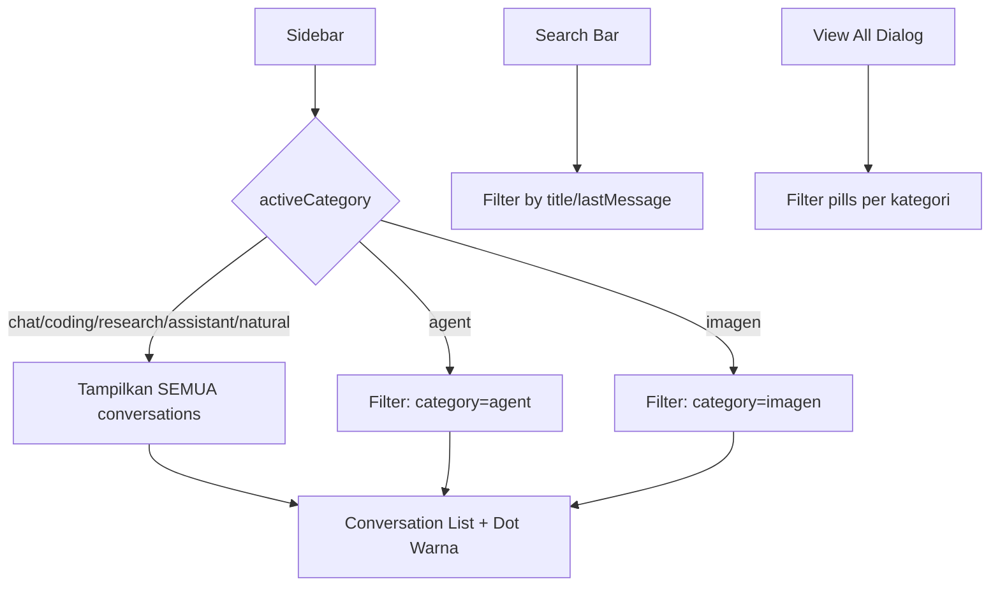

# Rencana: Sidebar Filter + Dot Warna + Search Bar

## 1. Root Cause

`activeCategory` digunakan untuk **dua hal berbeda**:
- **API Chat**: mengirim kategori ke backend (system prompt)
- **Sidebar filter**: menyembunyikan conversations yang tidak sesuai kategori

Akibatnya, saat toggle kategori (coding/research/assistant/natural) diaktifkan, sidebar ikut memfilter conversations — padahal toggle tersebut adalah **sub-mode dari "Chat"**.

## 2. Solusi

**Pisahkan logika filter sidebar dari toggle-only categories.**

Toggle-only categories adalah: `coding`, `research`, `assistant`, `natural` — mereka adalah sub-mode dari "Chat" dan **TIDAK** memfilter sidebar. Hanya mode sidebar (`chat`, `agent`, `imagen`) yang memfilter.

## 3. Perubahan File

Hanya **satu file**: `src/components/chat/sidebar.tsx`

### 3.1. Filter Logic (line 191-193)

```typescript
// SEBELUM:
const filteredConversations = activeCategory === 'chat'
  ? conversations
  : conversations.filter((c) => c.category === activeCategory);

// SESUDAH:
const SIDEBAR_MODES = ['chat', 'agent', 'imagen'];
const sidebarCategory = SIDEBAR_MODES.includes(activeCategory) ? activeCategory : 'chat';
const filteredConversations = sidebarCategory === 'chat'
  ? conversations
  : conversations.filter((c) => c.category === sidebarCategory);
```

### 3.2. Dot Warna di Conversation Item

**Mapping warna** (reuse dari top-bar.tsx):

```typescript
const CATEGORY_DOT_COLORS: Record<string, string> = {
  chat: 'bg-muted-foreground',
  coding: 'bg-sky-500',
  research: 'bg-violet-500',
  assistant: 'bg-emerald-500',
  natural: 'bg-orange-500',
  agent: 'bg-muted-foreground',
  imagen: 'bg-muted-foreground',
};
```

**Render di `renderConversationItem`** — tambahkan dot sebelum icon MessageSquare:

```tsx
<div className="flex items-center gap-1.5 shrink-0">
  <div className={`h-1.5 w-1.5 rounded-full ${CATEGORY_DOT_COLORS[conv.category] || 'bg-muted-foreground'}`} />
  <div className="shrink-0">
    <MessageSquare className={`h-3 w-3 ${isActive ? 'text-primary/70' : 'text-muted-foreground/50'}`} />
  </div>
</div>
```

**Render di View All Dialog** — tambahkan dot yang sama sebelum icon MessageSquare:

```tsx
<div className="shrink-0 flex items-center gap-1.5">
  {conv.category !== 'chat' && (
    <div className={`h-1.5 w-1.5 rounded-full ${CATEGORY_DOT_COLORS[conv.category] || 'bg-muted-foreground'}`} />
  )}
  <MessageSquare className={`h-3 w-3 shrink-0 ${...}`} />
</div>
```

Note: Hanya tampilkan dot jika kategori bukan `chat` (default).

### 3.3. Search Bar

**Tambah state** di komponen Sidebar:

```typescript
const [searchQuery, setSearchQuery] = useState('');
```

**Tambah input** setelah "Recent" header dan sebelum daftar conversations:

```tsx
<div className="px-2 pb-1.5">
  <div className="relative">
    <Search className="absolute left-2 top-1/2 -translate-y-1/2 h-3 w-3 text-muted-foreground/40" />
    <input
      type="text"
      value={searchQuery}
      onChange={(e) => setSearchQuery(e.target.value)}
      placeholder="Cari percakapan..."
      className="w-full rounded-md border border-border/20 bg-muted/20 py-1.5 pl-7 pr-2 text-xs text-foreground placeholder:text-muted-foreground/40 focus:outline-none focus:border-primary/30"
    />
  </div>
</div>
```

**Filter conversations** berdasarkan searchQuery:

```typescript
// Setelah filteredConversations, tambah:
const searchedConversations = searchQuery.trim()
  ? filteredConversations.filter((c) =>
      c.title.toLowerCase().includes(searchQuery.toLowerCase()) ||
      (c.lastMessage?.content || '').toLowerCase().includes(searchQuery.toLowerCase())
    )
  : filteredConversations;
```

Gunakan `searchedConversations` untuk render pinned + regular.

### 3.4. Filter Per Kategori di View All Dialog

**Tambah state** untuk filter kategori:

```typescript
const [viewAllCategoryFilter, setViewAllCategoryFilter] = useState<string>('all');
```

**Dapatkan unique categories** dari regularConversations:

```typescript
const availableCategories = useMemo(() => {
  const cats = new Set(regularConversations.map((c) => c.category));
  return ['all', ...Array.from(cats)];
}, [regularConversations]);
```

**Tambah filter pills** di header dialog:

```tsx
<div className="flex items-center gap-1.5 flex-wrap mt-2">
  <button
    onClick={() => setViewAllCategoryFilter('all')}
    className={`text-[10px] font-medium px-2 py-0.5 rounded-full border transition-colors ${
      viewAllCategoryFilter === 'all'
        ? 'bg-primary/10 border-primary/30 text-primary'
        : 'bg-muted/20 border-border/20 text-muted-foreground/60 hover:text-foreground'
    }`}
  >
    Semua
  </button>
  {Array.from(availableCategories).filter(c => c !== 'all').map((cat) => (
    <button
      key={cat}
      onClick={() => setViewAllCategoryFilter(cat)}
      className={`text-[10px] font-medium px-2 py-0.5 rounded-full border transition-colors ${
        viewAllCategoryFilter === cat
          ? 'bg-primary/10 border-primary/30 text-primary'
          : 'bg-muted/20 border-border/20 text-muted-foreground/60 hover:text-foreground'
      }`}
    >
      <span className={`inline-block h-1.5 w-1.5 rounded-full ${CATEGORY_DOT_COLORS[cat] || 'bg-muted-foreground'} mr-1`} />
      {CATEGORY_LABELS[cat] || cat}
    </button>
  ))}
</div>
```

**Filter** conversations di dialog:

```typescript
const viewAllFiltered = viewAllCategoryFilter === 'all'
  ? regularConversations
  : regularConversations.filter((c) => c.category === viewAllCategoryFilter);
```

Gunakan `viewAllFiltered` untuk render di dialog.

## 4. Ringkasan Perubahan

| # | File | Perubahan |
|---|------|-----------|
| 1 | `src/components/chat/sidebar.tsx` | Filter hanya berdasarkan MODES (chat/agent/imagen), bukan toggle categories |
| 2 | `src/components/chat/sidebar.tsx` | Dot warna di tiap conversation item sesuai kategori |
| 3 | `src/components/chat/sidebar.tsx` | Search bar untuk mencari percakapan |
| 4 | `src/components/chat/sidebar.tsx` | Filter pills per kategori di dialog "Semua Percakapan" |

## 5. Data Flow


