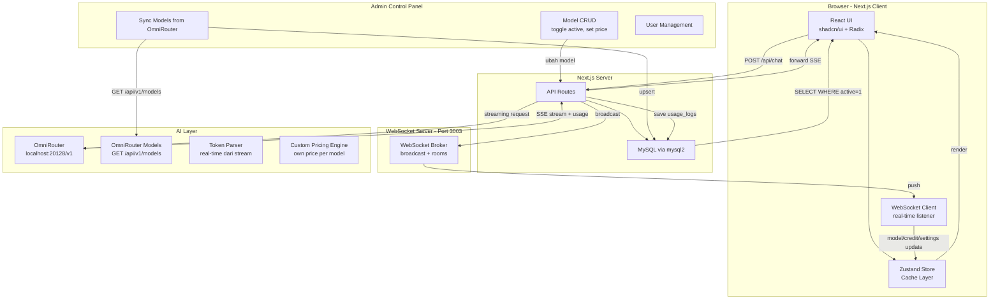
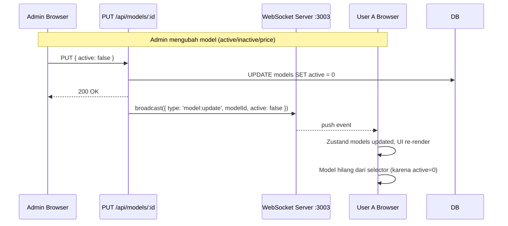
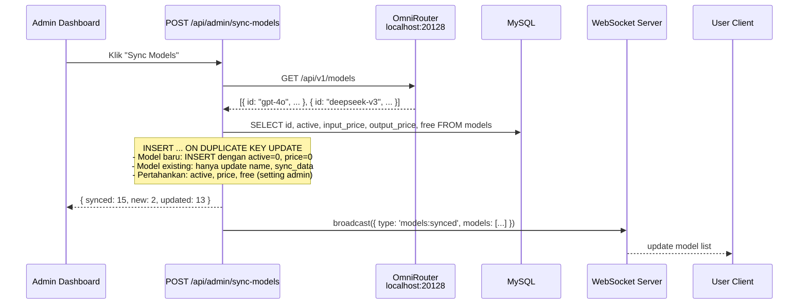
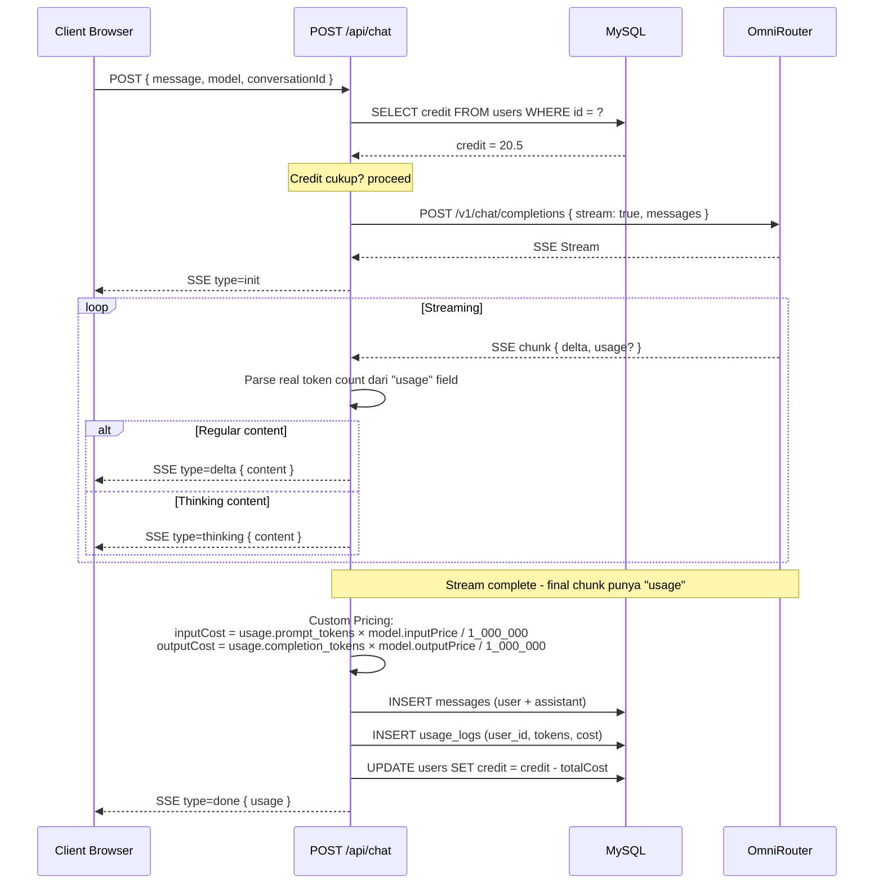

# Rencana Implementasi: Full Replacement — Template WebChat ke ai-chat-web

## Ringkasan

Migrasi total dari project `ai-chat-web` ke `web_chat_template` dengan arsitektur server-side:
- **MySQL** untuk persistence data
- **WebSocket** untuk real-time sync admin → user
- **OmniRouter** (`http://localhost:20128/v1`) sebagai AI provider dengan token real-time
- **Custom pricing** — token dari AI stream, harga sendiri
- **Skip Prisma** — pakai `mysql2` langsung
- **Model sync** — dari OmniRouter `GET /api/v1/models`, dikelola admin via dashboard
- **Password hashing** — bcryptjs

---

## Diagram Arsitektur Lengkap



---

## Arsitektur WebSocket Real-Time Sync



---

## Flow Sync Model dari OmniRouter



---

## Flow Chat dengan OmniRouter + Tracking Token



---

## Flow Filter Model — Admin vs User

```mermaid
flowchart LR
    subgraph Omni[OmniRouter]
        OAPI[GET /api/v1/models]
    end

    subgraph AdminPanel[Admin Panel - /admin]
        SYNC[Sync Button]
        LIST[Semua Model<br/>active=1 + active=0]
        TOGGLE[Toggle Active]
        PRICE[Set Harga]
    end

    subgraph DB[(MySQL models)]
        M1[gpt-4o active=1 price=$2.50]
        M2[o1 active=1 price=$15.00]
        M3[deepseek-v3 active=0 price=$0.27]
        M4[llama-3.1 active=0 price=$3.00]
    end

    subgraph User[User Interface]
        SELECTOR[Model Selector<br/>Hanya model active=1]
        C1[gpt-4o ✓]
        C2[o1 ✓]
        C3[...]
    end

    OAPI -->|sync| SYNC
    SYNC -->|upsert| DB
    TOGGLE -->|UPDATE active| DB
    PRICE -->|UPDATE price| DB
    
    DB -->|SELECT WHERE active=1| SELECTOR
    DB -->|SELECT *| LIST
```

---

## Fase 1: Backup Project Saat Ini

```bash
mkdir -p ../backups/ai-chat-web-pre-migration
xcopy src ../backups/ai-chat-web-pre-migration/src /E /I
copy package.json ../backups/ai-chat-web-pre-migration/
copy tsconfig.json ../backups/ai-chat-web-pre-migration/
copy next.config.ts ../backups/ai-chat-web-pre-migration/
```

---

## Fase 2: Copy Template Files ke Root

```bash
xcopy web_chat_template\src src /E /I /Y
xcopy web_chat_template\public public /E /I /Y
copy web_chat_template\next.config.ts next.config.ts /Y
copy web_chat_template\tsconfig.json tsconfig.json /Y
copy web_chat_template\postcss.config.mjs postcss.config.mjs /Y
copy web_chat_template\components.json components.json /Y
copy web_chat_template\.gitignore .gitignore /Y

# Hapus routing lama
rmdir /S /Q src\app\chat
```

---

## Fase 3: Update package.json & Install Dependencies

```bash
# Core
pnpm add next@^16.1.1 react@^19.0.0 react-dom@^19.0.0 zustand@^5.0.6

# Styling
pnpm add tailwindcss@^4 @tailwindcss/postcss@^4 clsx@^2.1.1 tailwind-merge@^3.3.1 class-variance-authority@^0.7.1 lucide-react@^0.525.0 tailwindcss-animate@^1.0.7 tw-animate-css@^1.3.5

# Animasi
pnpm add framer-motion@^12.23.2 gsap@^3.15.0

# Database + WebSocket + Auth (BARU)
pnpm add mysql2@^3.12.0 ws@^8.18.0 bcryptjs@^2.4.3

# Utility
pnpm add date-fns@^4.1.0 uuid@^11.1.0 sonner@^2.0.6 cmdk@^1.1.1 zod@^4.0.2 react-hook-form@^7.60.0 @hookform/resolvers@^5.1.1 input-otp@^1.4.2 vaul@^1.1.2 embla-carousel-react@^8.6.0

# Charts & Tables
pnpm add recharts@^2.15.4 @tanstack/react-table@^8.21.3

# Markdown & Code
pnpm add react-markdown@^10.1.0 react-syntax-highlighter@^15.6.1

# Theme
pnpm add next-themes@^0.4.6

# Radix UI
pnpm add @radix-ui/react-avatar@^1.1.10 @radix-ui/react-dialog@^1.1.14 @radix-ui/react-dropdown-menu@^2.1.15 @radix-ui/react-select@^2.2.5 @radix-ui/react-slot@^1.2.3 @radix-ui/react-switch@^1.2.5 @radix-ui/react-tabs@^1.1.12 @radix-ui/react-tooltip@^1.2.7 @radix-ui/react-scroll-area@^1.2.9 @radix-ui/react-progress@^1.1.7 @radix-ui/react-popover@^1.1.14 @radix-ui/react-checkbox@^1.3.2 @radix-ui/react-label@^2.1.7 @radix-ui/react-separator@^1.1.7 @radix-ui/react-toast@^1.2.14 @radix-ui/react-toggle@^1.1.9 @radix-ui/react-accordion@^1.2.11 @radix-ui/react-alert-dialog@^1.1.14 @radix-ui/react-context-menu@^2.2.15 @radix-ui/react-hover-card@^1.1.14 @radix-ui/react-menubar@^1.1.15 @radix-ui/react-navigation-menu@^1.2.13 @radix-ui/react-radio-group@^1.3.7 @radix-ui/react-slider@^1.3.5 @radix-ui/react-toggle-group@^1.1.10
pnpm add radix-ui@^1.4.3

# Dev
pnpm add -D @types/react@^19 @types/react-dom@^19 @types/ws@^8 @types/bcryptjs@^2 eslint@^9 eslint-config-next@^16.1.1 typescript@^5 sharp@^0.34.3
```

---

## Fase 4: Setup File Konfigurasi

### `next.config.ts`
```typescript
import type { NextConfig } from "next";
const nextConfig: NextConfig = {
  typescript: { ignoreBuildErrors: true },
  reactStrictMode: false,
};
export default nextConfig;
```

### Lainnya: `tsconfig.json`, `postcss.config.mjs`, `components.json` — dari template

---

## Fase 5: Setup MySQL Database & Schema — 6 Tables

```sql
CREATE DATABASE IF NOT EXISTS ai_chat_web
  CHARACTER SET utf8mb4 COLLATE utf8mb4_unicode_ci;

-- 1. USERS — dengan password hashing (bcryptjs)
CREATE TABLE IF NOT EXISTS users (
  id VARCHAR(64) PRIMARY KEY,
  email VARCHAR(255) NOT NULL UNIQUE,
  name VARCHAR(255) NOT NULL,
  password VARCHAR(255) NOT NULL,      -- bcrypt hash
  role ENUM('admin', 'user') NOT NULL DEFAULT 'user',
  avatar VARCHAR(500) DEFAULT NULL,
  credit DECIMAL(12,4) NOT NULL DEFAULT 25.0000,
  total_spent DECIMAL(14,6) NOT NULL DEFAULT 0.000000,
  api_key VARCHAR(255) DEFAULT NULL,   -- untuk BYOK nanti
  created_at TIMESTAMP DEFAULT CURRENT_TIMESTAMP,
  updated_at TIMESTAMP DEFAULT CURRENT_TIMESTAMP ON UPDATE CURRENT_TIMESTAMP,
  INDEX idx_email (email),
  INDEX idx_role (role)
) ENGINE=InnoDB;

-- 2. CONVERSATIONS
CREATE TABLE IF NOT EXISTS conversations (
  id VARCHAR(64) PRIMARY KEY,
  user_id VARCHAR(64) NOT NULL,
  title VARCHAR(500) DEFAULT 'New Chat',
  model VARCHAR(100) DEFAULT 'gpt-4o',
  category VARCHAR(50) DEFAULT 'assistant',
  pinned TINYINT(1) DEFAULT 0,
  created_at TIMESTAMP DEFAULT CURRENT_TIMESTAMP,
  updated_at TIMESTAMP DEFAULT CURRENT_TIMESTAMP ON UPDATE CURRENT_TIMESTAMP,
  FOREIGN KEY (user_id) REFERENCES users(id) ON DELETE CASCADE,
  INDEX idx_user (user_id),
  INDEX idx_updated (updated_at DESC)
) ENGINE=InnoDB;

-- 3. MESSAGES
CREATE TABLE IF NOT EXISTS messages (
  id VARCHAR(64) PRIMARY KEY,
  conversation_id VARCHAR(64) NOT NULL,
  role ENUM('user', 'assistant') NOT NULL,
  content MEDIUMTEXT NOT NULL,
  thinking_content MEDIUMTEXT,
  input_tokens INT DEFAULT 0,
  output_tokens INT DEFAULT 0,
  input_cost DECIMAL(12,8) DEFAULT 0,
  output_cost DECIMAL(12,8) DEFAULT 0,
  total_cost DECIMAL(12,8) DEFAULT 0,
  created_at TIMESTAMP DEFAULT CURRENT_TIMESTAMP,
  FOREIGN KEY (conversation_id) REFERENCES conversations(id) ON DELETE CASCADE,
  INDEX idx_conv (conversation_id),
  INDEX idx_created (conversation_id, created_at)
) ENGINE=InnoDB;

-- 4. USAGE LOGS — tracking token per user
CREATE TABLE IF NOT EXISTS usage_logs (
  id VARCHAR(64) PRIMARY KEY,
  user_id VARCHAR(64) NOT NULL,
  conversation_id VARCHAR(64),
  message_id VARCHAR(64),
  model_id VARCHAR(100) NOT NULL,
  model_name VARCHAR(255) NOT NULL,
  provider VARCHAR(100) NOT NULL,
  input_tokens INT DEFAULT 0,          -- real dari OmniRouter
  output_tokens INT DEFAULT 0,         -- real dari OmniRouter
  input_cost DECIMAL(12,8) DEFAULT 0,  -- custom pricing
  output_cost DECIMAL(12,8) DEFAULT 0, -- custom pricing
  total_cost DECIMAL(12,8) DEFAULT 0,  -- total
  category VARCHAR(50) DEFAULT 'assistant',
  created_at TIMESTAMP DEFAULT CURRENT_TIMESTAMP,
  FOREIGN KEY (user_id) REFERENCES users(id) ON DELETE CASCADE,
  INDEX idx_user (user_id),
  INDEX idx_created (created_at DESC),
  INDEX idx_model (model_id)
) ENGINE=InnoDB;

-- 5. CREDIT LOGS
CREATE TABLE IF NOT EXISTS credit_logs (
  id VARCHAR(64) PRIMARY KEY,
  user_id VARCHAR(64) NOT NULL,
  type ENUM('topup', 'usage', 'admin_adjust') NOT NULL,
  amount DECIMAL(12,4) NOT NULL,
  balance DECIMAL(12,4) NOT NULL,
  description VARCHAR(500),
  created_at TIMESTAMP DEFAULT CURRENT_TIMESTAMP,
  FOREIGN KEY (user_id) REFERENCES users(id) ON DELETE CASCADE,
  INDEX idx_user (user_id),
  INDEX idx_created (user_id, created_at DESC)
) ENGINE=InnoDB;

-- 6. MODELS — sync dari OmniRouter, dikelola admin
CREATE TABLE IF NOT EXISTS models (
  id VARCHAR(100) PRIMARY KEY,          -- model ID dari OmniRouter
  name VARCHAR(255) NOT NULL,           -- display name (bisa diedit admin)
  provider VARCHAR(100) DEFAULT '',
  description TEXT,
  active TINYINT(1) DEFAULT 0,          -- DEFAULT 0! Admin harus aktifkan manual
  max_context INT DEFAULT 128000,
  thinking TINYINT(1) DEFAULT 0,
  input_price DECIMAL(8,4) DEFAULT 0,   -- harga diisi admin
  output_price DECIMAL(8,4) DEFAULT 0,  -- harga diisi admin
  free TINYINT(1) DEFAULT 0,
  sync_source VARCHAR(50) DEFAULT 'omnirouter',
  sync_data JSON DEFAULT NULL,          -- raw response dari OmniRouter
  created_at TIMESTAMP DEFAULT CURRENT_TIMESTAMP,
  updated_at TIMESTAMP DEFAULT CURRENT_TIMESTAMP ON UPDATE CURRENT_TIMESTAMP,
  INDEX idx_active (active),
  INDEX idx_provider (provider)
) ENGINE=InnoDB;
```

### Seed Data — HANYA 1 ADMIN, TIDAK ADA MODEL!
```sql
-- Password: gunakan bcryptjs hash (bukan plain text!)
-- Contoh hash untuk "admin123" — ganti dengan hash real saat eksekusi
INSERT INTO users (id, email, name, password, role, credit) VALUES
  ('admin', 'admin', 'Admin', '$2a$12$LJ3m4ys3Lk0TSwHnbfOMiOXPm1Qlq0n7q0n7q0n7q0n7q0n7q0n7O', 'admin', 999999.9999);
-- CATATAN: Hash di atas hanya placeholder. Saat eksekusi, hash password real.
```

---

## Fase 6: MySQL Connection Module

File: `src/lib/db.ts`

```typescript
import mysql from 'mysql2/promise';

let pool: mysql.Pool | null = null;

export function getPool(): mysql.Pool {
  if (!pool) {
    const url = process.env.DATABASE_URL;
    if (!url) throw new Error('DATABASE_URL tidak diatur');
    pool = mysql.createPool({
      uri: url,
      waitForConnections: true,
      connectionLimit: 10,
      maxIdle: 5,
      idleTimeout: 60000,
      queueLimit: 0,
      enableKeepAlive: true,
      keepAliveInitialDelay: 0,
    });
  }
  return pool;
}

export async function query<T = any>(sql: string, params?: any[]): Promise<T> {
  const [rows] = await getPool().execute(sql, params || []);
  return rows as T;
}
```

---

## Fase 7: WebSocket Server — Real-Time Sync

### File: `server/websocket.ts`
```typescript
import { WebSocketServer, WebSocket } from 'ws';

const PORT = parseInt(process.env.WS_PORT || '3003');
const wss = new WebSocketServer({ port: PORT });

console.log(`[WS] WebSocket server running on port ${PORT}`);

wss.on('connection', (ws: WebSocket) => {
  console.log('[WS] Client connected');

  ws.on('message', (data: Buffer) => {
    try {
      const msg = JSON.parse(data.toString());
      if (msg.type === 'ping') {
        ws.send(JSON.stringify({ type: 'pong' }));
      }
    } catch { /* ignore */ }
  });

  ws.on('close', () => console.log('[WS] Client disconnected'));
});

export function broadcast(data: object) {
  const message = JSON.stringify(data);
  wss.clients.forEach((client) => {
    if (client.readyState === WebSocket.OPEN) {
      client.send(message);
    }
  });
}
```

### File: `src/lib/ws-events.ts`
```typescript
export type WSEvent =
  | { type: 'model:update'; model: { id: string; active: boolean; inputPrice: number; outputPrice: number; free: boolean } }
  | { type: 'model:delete'; modelId: string }
  | { type: 'model:create'; model: any }
  | { type: 'models:synced'; count: number }
  | { type: 'credit:update'; userId: string; newBalance: number }
  | { type: 'user:update'; user: { id: string; role: string; credit: number } };
```

### File: `src/hooks/use-websocket.ts`
```typescript
'use client';
import { useEffect, useRef, useCallback } from 'react';
import { useChatStore } from '@/lib/store';

export function useWebSocket() {
  const wsRef = useRef<WebSocket | null>(null);
  const reconnectTimeoutRef = useRef<NodeJS.Timeout>();

  const connect = useCallback(() => {
    if (wsRef.current?.readyState === WebSocket.OPEN) return;
    try {
      const ws = new WebSocket(process.env.NEXT_PUBLIC_WS_URL || 'ws://localhost:3003');
      wsRef.current = ws;
      ws.onopen = () => console.log('[WS] Connected');
      ws.onmessage = (event) => {
        try {
          const data = JSON.parse(event.data);
          handleWSEvent(data);
        } catch { /* ignore */ }
      };
      ws.onclose = () => {
        reconnectTimeoutRef.current = setTimeout(connect, 3000);
      };
      ws.onerror = () => ws.close();
    } catch {
      reconnectTimeoutRef.current = setTimeout(connect, 3000);
    }
  }, []);

  useEffect(() => {
    connect();
    return () => {
      clearTimeout(reconnectTimeoutRef.current);
      wsRef.current?.close();
    };
  }, [connect]);
}

function handleWSEvent(event: any) {
  const store = useChatStore.getState();
  switch (event.type) {
    case 'model:update':
      store.updateModel(event.model.id, event.model);
      break;
    case 'model:delete':
      store.removeModel(event.modelId);
      break;
    case 'model:create':
      store.addModel(event.model);
      break;
    case 'credit:update':
      if (event.userId === store.currentUser?.id) {
        store.setCredit(event.newBalance);
      }
      break;
  }
}
```

---

## Fase 8: Adaptasi Routing & Layout

### Layout structure:

| Path | File | Deskripsi |
|------|------|-----------|
| `/` | `src/app/page.tsx` | Main chat (template) |
| `/layout` | `src/app/layout.tsx` | Root layout (ThemeProvider, Geist, Toaster) |
| `/login` | `src/app/login/page.tsx` | Login/register |
| `/admin` | `src/app/admin/page.tsx` | Admin panel (sync models, CRUD) |
| `/api/chat` | `src/app/api/chat/route.ts` | **Rewrite** OmniRouter + custom pricing |
| `/api/auth` | `src/app/api/auth/route.ts` | **Rewrite** bcryptjs + MySQL |
| `/api/conversations` | `src/app/api/conversations/route.ts` | **Rewrite** MySQL CRUD |
| `/api/conversations/[id]/messages` | `src/app/api/conversations/[id]/messages/route.ts` | **BARU** get messages |
| `/api/models` | `src/app/api/models/route.ts` | **Rewrite** query models aktif |
| `/api/topup` | `src/app/api/topup/route.ts` | **Rewrite** credit transaksi |
| `/api/usage` | `src/app/api/usage/route.ts` | **Rewrite** dari MySQL |
| `/api/admin/sync-models` | `src/app/api/admin/sync-models/route.ts` | **BARU** sync dari OmniRouter |
| `/api/admin/broadcast` | `src/app/api/admin/broadcast/route.ts` | **BARU** WebSocket broadcast |

### Hapus (sudah digantikan):
- `src/app/chat/` — routing di root
- `src/app/api/account/` — credit via users table
- `src/app/api/auth/session/` — session via Zustand

---

## Fase 9: Rewrite API Routes

### `POST /api/chat` — Integrasi OmniRouter + Tracking Token

**Flow lengkap:**
1. Parse request: `message`, `model`, `category`, `thinkingEnabled`, `history[]`, `conversationId`
2. Ambil `model` pricing dari MySQL
3. Cek credit user: `SELECT credit FROM users WHERE id = ?`
4. Build messages array: system prompt + history + current
5. `fetch('http://localhost:20128/v1/chat/completions', { stream: true })`
6. Parse SSE stream:
   - `delta.content` → forward `type: delta`
   - `delta.thinking/reasoning_content` → forward `type: thinking`
   - **Cari `usage` field** di tiap chunk → extract `prompt_tokens` + `completion_tokens`
7. Hitung custom pricing:
   ```typescript
   const inputCost = (inputTokens / 1_000_000) * model.inputPrice;
   const outputCost = (outputTokens / 1_000_000) * model.outputPrice;
   ```
8. Simpan ke MySQL: messages, usage_logs, update credit
9. Kirim `type: done` ke client

### `POST /api/auth` — Login dengan bcryptjs

```typescript
import bcrypt from 'bcryptjs';

// Login
const user = await query('SELECT * FROM users WHERE email = ?', [email]);
const isValid = await bcrypt.compare(password, user[0].password);

// Register
const hashedPassword = await bcrypt.hash(password, 12);
await query('INSERT INTO users ... VALUES (?, ?, ?, ?)',
  [id, email, name, hashedPassword]);
```

### `GET /api/models` — Hanya model active=1 untuk user
```sql
SELECT * FROM models WHERE active = 1 ORDER BY provider, name;
```

### `GET /api/models?all=true` — Semua model (admin)
```sql
SELECT * FROM models ORDER BY active DESC, provider, name;
```

### `POST /api/admin/sync-models` — Sync dari OmniRouter

**Core logic:**
```typescript
// 1. Fetch dari OmniRouter
const response = await fetch('http://localhost:20128/api/v1/models');
const { data: remoteModels } = await response.json();

// 2. Ambil model existing dari DB
const existing = await query('SELECT id, active, input_price, output_price, free FROM models');

// 3. Build map existing settings
const existingMap = new Map(existing.map(m => [m.id, m]));

// 4. Upsert — INSERT ... ON DUPLICATE KEY UPDATE
for (const model of remoteModels) {
  const existingModel = existingMap.get(model.id);
  
  await query(`
    INSERT INTO models (id, name, provider, description, sync_data, active, input_price, output_price, free)
    VALUES (?, ?, '', '', ?, '{}', 0, 0, 0, 0)
    ON DUPLICATE KEY UPDATE
      name = VALUES(name),
      sync_data = VALUES(sync_data),
      -- PENTING: tidak mengubah active, input_price, output_price, free!
      active = active,
      input_price = input_price,
      output_price = output_price,
      free = free
  `, [model.id, model.name || model.id, JSON.stringify(model)]);
}

// 5. Broadcast via WebSocket
await fetch(`http://localhost:${WS_PORT}/broadcast`, {
  method: 'POST',
  body: JSON.stringify({ type: 'models:synced', count: remoteModels.length })
});
```

### API Routes lain — CRUD standar ke MySQL

---

## Fase 10: Integrasi OmniRouter + Custom Pricing

### Token Parser (di `POST /api/chat`)

```typescript
// Parse real token dari stream OmniRouter
let inputTokens = 0;
let outputTokens = 0;

sseBuffer = parseSSEBuffer(sseBuffer, (dataStr) => {
  try {
    const parsed = JSON.parse(dataStr);
    
    // Ambil token dari usage field (final chunk)
    if (parsed.usage) {
      inputTokens = parsed.usage.prompt_tokens || 0;
      outputTokens = parsed.usage.completion_tokens || 0;
    }
    
    // Forward delta content ke client
    const delta = parsed.choices?.[0]?.delta;
    if (delta?.content) {
      fullContent += delta.content;
      safeEnqueue(sendEvent({ type: 'delta', content: delta.content }));
    }
  } catch { /* skip unparseable */ }
});
```

### Custom Pricing Calculator
```typescript
function calculateCost(
  inputTokens: number,
  outputTokens: number,
  model: { inputPrice: number; outputPrice: number }
) {
  // Fallback jika OmniRouter tidak kirim token
  if (inputTokens === 0 && outputTokens === 0) {
    return null; // caller akan pakai estimate fallback
  }
  
  return {
    inputCost: (inputTokens / 1_000_000) * model.inputPrice,
    outputCost: (outputTokens / 1_000_000) * model.outputPrice,
    totalCost: ((inputTokens / 1_000_000) * model.inputPrice) +
               ((outputTokens / 1_000_000) * model.outputPrice),
  };
}
```

---

## Fase 11: Adaptasi Zustand Store

### Partialize — hanya cache non-sensitif
```typescript
partialize: (state) => ({
  activeModel: state.activeModel,
  activeCategory: state.activeCategory,
  sidebarOpen: state.sidebarOpen,
  isLoggedIn: state.isLoggedIn,
  user: { id: state.user?.id, name: state.user?.name, role: state.user?.role },
  // JANGAN persist messages, conversations, credit — selalu dari API
})
```

### WebSocket listener auto-update store
`useWebSocket` hook di `src/app/page.tsx` akan auto-sync:
- `model:update` → `store.updateModel()`
- `credit:update` → `store.setCredit()`
- `models:synced` → reload models dari API

---

## Fase 12: Copy Komponen UI

```bash
# shadcn/ui components (40+)
xcopy web_chat_template\src\components\ui src\components\ui /E /I /Y

# Chat components (9 files)
xcopy web_chat_template\src\components\chat src\components\chat /E /I /Y

# Hooks
xcopy web_chat_template\src\hooks src\hooks /E /I /Y

# Utils (override dengan template)
copy web_chat_template\src\lib\utils.ts src\lib\utils.ts /Y
```

---

## Fase 13: Setup Environment Variables

### `.env.local`
```env
# MySQL
DATABASE_URL=mysql://root:@localhost:3306/ai_chat_web

# OmniRouter
OMNIROUTER_BASE_URL=http://localhost:20128/v1
OMNIROUTER_API_KEY=sk-your-key-here

# WebSocket
NEXT_PUBLIC_WS_URL=ws://localhost:3003
WS_PORT=3003

# App
NEXT_PUBLIC_APP_NAME=AI Chat Web
```

---

## Fase 14: Testing & Verifikasi

### Step-by-step:
1. **Setup DB**: `mysql -u root -e "CREATE DATABASE IF NOT EXISTS ai_chat_web"`
2. **Run schema**: `mysql -u root ai_chat_web < src/lib/schema.sql`
3. **Seed admin**: jalankan script seed dengan bcryptjs hash
4. **Start WebSocket**: `node server/websocket.ts`
5. **Start Next.js**: `pnpm dev`
6. **Login admin**: `admin` / password yang di-set
7. **Sync models**: klik "Sync Models" → models dari OmniRouter muncul
8. **Activate + set price**: toggle beberapa model, set harga
9. **Login as user**: buka tab incognito, login
10. **Check model selector**: hanya model active yang muncul
11. **Chat**: kirim pesan, cek streaming, cek credit terpotong
12. **Admin ubah model**: toggle active → WebSocket → user lihat perubahan real-time
13. **Cek MySQL**: `usage_logs` terisi dengan token & cost
14. **Build test**: `pnpm build`

### Verifikasi Checklist
- [ ] Login admin berhasil (bcryptjs verify)
- [ ] Sync models dari OmniRouter
- [ ] Hanya `active=1` muncul di user
- [ ] Chat streaming + token tracking
- [ ] Credit terpotong sesuai custom pricing
- [ ] WebSocket broadcast real-time
- [ ] `usage_logs` terisi lengkap (user_id, tokens, cost)
- [ ] Build success

---

## Fase 15: Cleanup

```bash
# Hapus template source (setelah migrasi sukses)
rmdir /S /Q web_chat_template

# Hapus file template yang tidak diperlukan
del bun.lock
```

---

## Ringkasan Todo Final Checklist

```markdown
[ ] Backup project saat ini
[ ] Copy template files ke root
[ ] Install dependencies (pnpm add ... 60+ packages)
[ ] Setup konfigurasi (next.config, tsconfig, postcss, components.json)
[ ] Setup MySQL: buat database + 6 tables (models.active DEFAULT 0)
[ ] Seed: 1 admin account (bcryptjs hashed) — NO model seed!
[ ] Buat src/lib/db.ts (MySQL connection pool)
[ ] Buat server/websocket.ts (WebSocket server port 3003)
[ ] Buat src/lib/ws-events.ts (event types)
[ ] Buat src/hooks/use-websocket.ts (WebSocket client hook)
[ ] Copy template UI components (40+ shadcn/ui + chat components)
[ ] Rewrite POST /api/chat — OmniRouter fetch + token tracking + custom pricing
[ ] Rewrite POST /api/auth — bcryptjs verify + MySQL query
[ ] Rewrite GET /api/models — hanya WHERE active=1 (user) atau all (admin)
[ ] Rewrite POST /api/conversations — real CRUD ke MySQL
[ ] Rewrite GET /api/conversations — list by user_id
[ ] Rewrite DELETE /api/conversations/:id — hapus cascade
[ ] BUAT BARU GET /api/conversations/:id/messages — ambil messages
[ ] BUAT BARU POST /api/admin/sync-models — fetch OmniRouter + upsert
[ ] BUAT BARU POST /api/admin/broadcast — trigger WebSocket
[ ] Rewrite POST /api/topup — update credit di MySQL + broadcast
[ ] Rewrite GET /api/usage — query dari MySQL usage_logs
[ ] Adaptasi Zustand store partialize (minimal cache)
[ ] Setup .env.local (DATABASE_URL, OMNIROUTER_BASE_URL, WS_URL)
[ ] Modifikasi src/app/admin/page.tsx — tambah sync button + broadcast trigger
[ ] Modifikasi src/app/page.tsx — tambah useWebSocket hook
[ ] Test: build & dev server
[ ] Cleanup: hapus web_chat_template
```

---

## Risiko & Mitigasi

| Risiko | Dampak | Mitigasi |
|--------|--------|----------|
| OmniRouter `GET /api/v1/models` format tidak diketahui | Sync gagal | Adaptasi parser sesuai response aktual; fallback manual add |
| OmniRouter tidak kirim `usage` field | Token = 0 | Fallback `estimateTokens()` |
| WebSocket 3003 benturan port | WS gagal start | Ganti port; deteksi error port |
| bcryptjs async di Edge Runtime | Runtime error | API routes berjalan di Node.js runtime, aman |
| 60+ dependencies install gagal | Build error | Hapus node_modules + pnpm-lock, install ulang |
| Template GSAP di `use client` | Build warning | GSAP harus di useEffect, sudah di template |

---

✅ Plan updated and saved to: `plans/2026-05-16-full-replacement-implementation.md`
