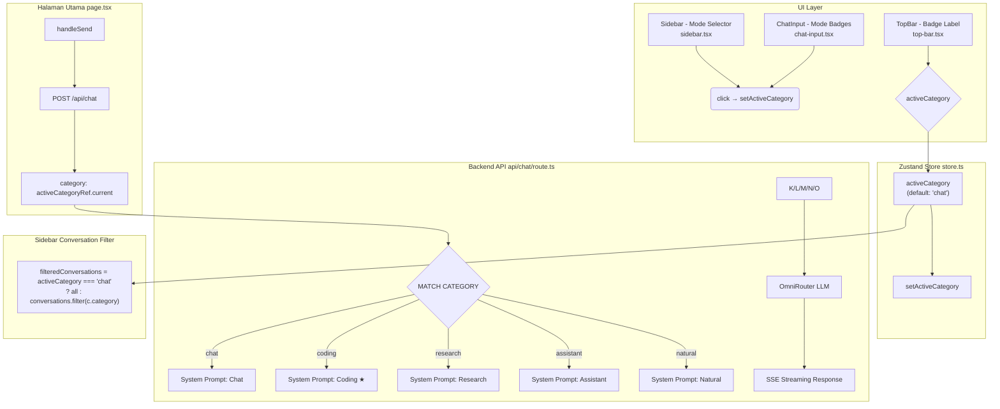

# Rencana Implementasi: 5 Mode Chat (Coding, Research, Assistant, Natural)

## 1. Ringkasan

Mengganti sistem mode chat dari 3 mode (chat, agent, imagen) menjadi 5 mode yang fully functional:
- **Chat** (default)
- **Coding**
- **Research**
- **Assistant**
- **Natural**

Mode `agent` dan `imagen` akan dihapus karena tidak digunakan (comingSoon).

---

## 2. Arsitektur & Data Flow



### Alur Lengkap:

1. User klik mode di **Sidebar** atau **ChatInput badges**
2. `setActiveCategory(modeId)` mengubah state `activeCategory` di Zustand store
3. **TopBar** badge merespon perubahan dengan menampilkan label yang sesuai
4. **Sidebar** memfilter daftar percakapan berdasarkan kategori yang aktif
5. Saat user mengirim pesan, `handleSend` membaca `activeCategoryRef.current` dan mengirim `category` ke API
6. **Backend API** memilih `CATEGORY_PROMPTS[category]` sebagai system prompt
7. AI merespons sesuai dengan instruksi system prompt yang dipilih

---

## 3. Perubahan File per File

### 3.1. Sidebar — `src/components/chat/sidebar.tsx`

**Lokasi:** Line 45-50 (array MODES) + import icons di line 8-29

**A. Hapus mode lama, tambah 6 mode baru:**

```typescript
// HAPUS (line 45-50):
// const MODES = [
//   { id: 'chat', label: 'Chat', icon: MessageSquare, comingSoon: false, description: 'AI Chat assistant' },
//   { id: 'agent', label: 'Agent', icon: Bot, comingSoon: true, description: 'Autonomous agent' },
//   { id: 'imagen', label: 'Imagen', icon: ImageIcon, comingSoon: true, description: 'AI Image generation' },
// ] as const;

// GANTI DENGAN:
const MODES = [
  { id: 'chat',      label: 'Chat',      icon: MessageSquare, comingSoon: false, description: 'Obrolan AI serbaguna dengan respons cepat dan akurat' },
  { id: 'coding',    label: 'Coding',    icon: Code,          comingSoon: false, description: 'Asisten coding expert dengan best practices & clean code' },
  { id: 'research',  label: 'Research',  icon: ScrollText,    comingSoon: false, description: 'Analisis mendalam dengan sumber terpercaya' },
  { id: 'assistant', label: 'Assistant', icon: Bot,           comingSoon: false, description: 'Asisten AI produktif untuk tugas sehari-hari' },
  { id: 'natural',   label: 'Natural',   icon: MessageCircle, comingSoon: false, description: 'Percakapan santai & natural seperti ngobrol' },
] as const;
```

**B. Tambah import icons baru** (di bagian import lucide-react):

```typescript
// TAMBAHKAN di line 8-29:
import {
  Plus, MessageSquare, Bot, Sparkles, Trash2, Shield,
  Sun, Moon, Pin, X, Wallet, ChevronRight, LogOut, User,
  ImageIcon, Lock, Settings, List, Clock, PanelLeftClose,
  Code,          // <-- BARU
  ScrollText,    // <-- BARU
  MessageCircle, // <-- BARU
} from 'lucide-react';
```

**C. HAPUS import `ImageIcon`** karena mode imagen dihapus (opsional, bisa dibiarkan).

**Catatan:** Tidak perlu mengubah logic `filteredConversations` (line 191-193) karena sudah generic menggunakan `activeCategory`.

---

### 3.2. ChatInput Mode Badges — `src/components/chat/chat-input.tsx`

**Lokasi:** Setelah baris web search toggle (line 231), sebelum input container (line 234).

**A. Tambah array mode badges** di dalam komponen:

```typescript
// ─── Mode Selector Badges ───────────────────────────
const MODE_OPTIONS = [
  { id: 'chat',      label: 'Chat',      icon: MessageSquare },
  { id: 'coding',    label: 'Coding',    icon: Code },
  { id: 'research',  label: 'Research',  icon: ScrollText },
  { id: 'assistant', label: 'Assistant', icon: Bot },
  { id: 'natural',   label: 'Natural',   icon: MessageCircle },
];
```

**B. Ambil `activeCategory` dan `setActiveCategory`** dari store di line 27:

```typescript
// SEBELUM:
const { isGenerating, activeModel, models, credit, thinkingEnabled, setThinkingEnabled, webSearchEnabled, setWebSearchEnabled } = useChatStore();

// SESUDAH:
const { isGenerating, activeModel, models, credit, thinkingEnabled, setThinkingEnabled, webSearchEnabled, setWebSearchEnabled, activeCategory, setActiveCategory } = useChatStore();
```

**C. Render mode badges** — tambahkan blok JSX antara toggle bar dan input container:

```tsx
{/* Mode Selector — pilih mode chat */}
<div className="flex items-center gap-1.5 mb-2 px-1 flex-wrap">
  {MODE_OPTIONS.map((mode) => {
    const Icon = mode.icon;
    const isActive = activeCategory === mode.id;
    return (
      <button
        key={mode.id}
        onClick={() => setActiveCategory(mode.id)}
        className={`flex items-center gap-1 rounded-lg border px-2 py-1 transition-all text-xs font-medium ${
          isActive
            ? 'bg-primary/8 border-primary/20 text-primary shadow-sm'
            : 'bg-muted/10 border-border/10 text-muted-foreground/60 hover:bg-muted/30 hover:text-foreground/70'
        }`}
      >
        <Icon className={`h-3 w-3 ${isActive ? 'text-primary/70' : 'text-muted-foreground/40'}`} />
        {mode.label}
      </button>
    );
  })}
</div>
```

**D. Tambah import icons baru** di line 10:

```typescript
// SEBELUM:
import { Send, Square, DollarSign, Lightbulb, LightbulbOff, Globe, AlertTriangle, Ban } from 'lucide-react';

// SESUDAH:
import { Send, Square, DollarSign, Lightbulb, LightbulbOff, Globe, AlertTriangle, Ban, Code, ScrollText, MessageCircle } from 'lucide-react';
```

---

### 3.3. TopBar Labels — `src/components/chat/top-bar.tsx`

**Lokasi:** Line 19-27

```typescript
// SEBELUM:
const CATEGORY_LABELS: Record<string, string> = {
  chat: 'Chat',
  agent: 'Agent',
  imagen: 'Imagen',
  assistant: 'Chat',
  natural: 'Chat',
  coding: 'Chat',
  research: 'Chat',
};

// SESUDAH:
const CATEGORY_LABELS: Record<string, string> = {
  chat: 'Chat',
  coding: 'Coding',
  research: 'Research',
  assistant: 'Assistant',
  natural: 'Natural',
};
```

---

### 3.4. System Prompt Backend — `src/app/api/chat/route.ts`

**Lokasi:** Line 6-19

**A. HAPUS entry `agent`** dari CATEGORY_PROMPTS.

**B. TULIS ULANG prompt `coding`** secara komprehensif.

**C. Prompt lainnya diperbaiki** untuk lebih sesuai dengan masing-masing mode.

```typescript
const CATEGORY_PROMPTS: Record<string, string> = {
  chat:
    'Anda adalah asisten AI yang ramah, cerdas, dan membantu. ' +
    'Gunakan bahasa Indonesia yang natural dan mudah dipahami. ' +
    'Berikan jawaban yang akurat, ringkas, dan langsung ke intinya. ' +
    'Jika diminta membuat atau mengedit file (HTML, kode, dll.), gunakan blok kode markdown dengan nama file di header, ' +
    'contoh: ```html:index.html atau ```javascript:app.js. ' +
    'Jika memodifikasi file yang sudah pernah dibuat, outputkan SELURUH file yang sudah diperbarui, bukan hanya perubahannya.',

  coding:
    'Anda adalah senior software engineer dan expert coding assistant dengan pengalaman bertahun-tahun dalam pengembangan software enterprise. ' +
    'Anda menguasai berbagai bahasa pemrograman (TypeScript, JavaScript, Python, Go, Rust, Java, C#, SQL), ' +
    'framework (React, Next.js, Node.js, Django, Spring Boot), serta arsitektur perangkat lunak modern.\n\n' +

    'PEDOMAN UTAMA:\n' +
    '1. **Kode Production-Ready** — Setiap baris kode harus siap untuk production. Tidak boleh ada placeholder, TODO tanpa implementasi, atau kode yang tidak lengkap. Sertakan error handling, input validation, dan edge cases.\n' +
    '2. **Complete Code Dump** — Saat membuat atau memodifikasi file, outputkan SELURUH file secara lengkap. Tidak boleh menggunakan "..." atau "// sisanya sama".\n' +
    '3. **Best Practices & Clean Code** — Gunakan SOLID principles, separation of concerns, DRY, dan design patterns yang sesuai. Pastikan kode mudah dibaca, diuji, dan dipelihara.\n' +
    '4. **Type Safety** — Selalu gunakan TypeScript untuk keamanan tipe. Hindari penggunaan `any`. Definisikan interface/tipe yang eksplisit.\n' +
    '5. **Security First** — Pertimbangkan injection attacks, XSS, CSRF, authentication, authorization, rate limiting, dan data sanitization dalam setiap solusi.\n' +
    '6. **Performance & Scalability** — Tulis kode yang efisien. Pertimbangkan caching, database indexing, query optimization, dan memory management.\n' +
    '7. **Testing** — Sertakan pertimbangan untuk unit testing, integration testing, dan edge cases. Gunakan pola yang testable.\n' +
    '8. **Arsitektur & Decision Making** — Jelaskan alasan di balik setiap keputusan teknis: mengapa memilih pendekatan tertentu, trade-offs yang dibuat, dan alternatif yang dipertimbangkan.\n' +
    '9. **Format Output** — Gunakan blok kode markdown dengan format: ```language:filename.ext. Contoh: ```typescript:src/services/user-service.ts\n' +
    '10. **Dokumentasi** — Sertakan komentar yang bermakna pada bagian yang kompleks, JSDoc/TSDoc pada fungsi publik, dan README jika diperlukan.\n\n' +

    'Gaya respons: profesional, teknis, dan terstruktur. Prioritaskan ketepatan dan keamanan di atas kecepatan.',

  research:
    'Anda adalah asisten riset yang analitis, objektif, dan teliti. ' +
    'Berikan analisis yang mendalam, terstruktur, dan berbasis fakta. ' +
    'Sertakan referensi dan kutipan dari sumber terpercaya jika relevan. ' +
    'Untuk klaim atau data statistik, sebutkan sumbernya. ' +
    'Jika ada ketidakpastian atau keterbatasan data, akui secara eksplisit. ' +
    'Gunakan format yang terorganisir: poin-poin, sub-bagian, dan kesimpulan. ' +
    'Prioritaskan akurasi dan objektivitas daripada kecepatan.',

  assistant:
    'Anda adalah asisten AI yang sangat produktif dan efisien. ' +
    'Tugas utama Anda adalah membantu pengguna menyelesaikan pekerjaan sehari-hari dengan cepat dan tepat. ' +
    'Anda ahli dalam: menulis dan mengedit dokumen, merangkum informasi, ' +
    'menjawab pertanyaan faktual, membantu brainstorming, perencanaan proyek, ' +
    'dan tugas-tugas administratif lainnya. ' +
    'Gunakan bahasa Indonesia yang formal namun ramah. ' +
    'Jika diminta membuat atau mengedit file, gunakan blok kode markdown dengan nama file di header. ' +
    'Saat memodifikasi file, outputkan SELURUH file yang sudah diperbarui.',

  natural:
    'Anda adalah teman ngobrol yang hangat, natural, dan menyenangkan. ' +
    'Gunakan bahasa Indonesia sehari-hari yang santai dan mengalir seperti obrolan biasa. ' +
    'Jangan terlalu kaku atau formal. Boleh menggunakan gaya bahasa yang lebih personal dan ekspresif. ' +
    'Berikan respons yang singkat dan relevan, seperti sedang berbincang dengan teman. ' +
    'Jika diminta membuat atau mengedit file, gunakan blok kode markdown dengan nama file di header. ' +
    'Saat memodifikasi file, outputkan SELURUH file yang sudah diperbarui.',
};
```

---

## 4. Ringkasan Perubahan

| File | Perubahan |
|------|-----------|
| `src/components/chat/sidebar.tsx` | Array MODES: hapus `agent` & `imagen`, tambah `coding`, `research`, `assistant`, `natural`. Import icons baru. |
| `src/components/chat/chat-input.tsx` | Tambah mode badge selector horizontal (5 tombol) di atas input area. Import icons baru. Destructure `activeCategory` & `setActiveCategory` dari store. |
| `src/components/chat/top-bar.tsx` | Update `CATEGORY_LABELS` — hapus mapping lama, isi dengan label yang benar untuk 5 mode. |
| `src/app/api/chat/route.ts` | Rewrite `CATEGORY_PROMPTS` — hapus `agent`, rewrite `coding` dengan prompt super komprehensif, tingkatkan prompt lainnya. |

**Tidak perlu diubah:**
- `src/lib/store.ts` — `activeCategory` dengan default `'chat'` dan `setActiveCategory()` sudah ada.
- `src/app/page.tsx` — data flow `activeCategoryRef.current` → API call sudah support semua mode.
- `src/components/chat/empty-state.tsx` — `onQuickAction` sudah mengirim category, tidak perlu diubah.

---

## 5. Potensi Risiko & Mitigasi

| Risiko | Mitigasi |
|--------|----------|
| Icon tidak ditemukan | Pastikan semua icon di-import dari `lucide-react` (Code, ScrollText, MessageCircle sudah tersedia di library) |
| Sidebar filter konversasi tidak berfungsi | Logic `filteredConversations` (line 191-193) sudah generic: jika `!== 'chat'`, filter by `activeCategory` |
| Konversi mode lama (agent, imagen) hilang | Tidak ada karena kedua mode belum pernah aktif (comingSoon) |
| System prompt coding terlalu panjang | Token untuk system prompt coding ~400-500 token — masih wajar dalam batas context window model |
| Mode badges bentrok dengan toggle yang ada | Badges ditempatkan di baris terpisah, setelah toggle Thinking/Web Search (gap mb-2) |
| Perubahan tidak direfleksikan tanpa reload | Zustand store reactive — semua UI akan update otomatis saat `activeCategory` berubah |

---

## 6. Testing Strategy

1. **Visual Check:** Sidebar menampilkan 5 mode, semuanya bisa diklik (tidak ada comingSoon)
2. **Visual Check:** ChatInput menampilkan 5 mode badges horizontal
3. **Functional Check:** Klik mode → badge aktif berubah → TopBar label berubah
4. **Functional Check:** Kirim pesan di mode Coding → AI merespons dengan kode production-ready
5. **Functional Check:** Kirim pesan di mode Research → AI merespons dengan analisis mendalam
6. **Functional Check:** Kirim pesan di mode Natural → AI merespons dengan gaya santai
7. **Regression Check:** Mode Chat (default) tetap berfungsi seperti sebelumnya
8. **Regression Check:** Mode Assistant tetap berfungsi (prompt diperbaiki)
9. **Filter Check:** Percakapan di sidebar difilter berdasarkan mode yang aktif
10. **Console Check:** Tidak ada error import atau missing icon di console

---

## 7. Urutan Eksekusi

1. `sidebar.tsx` — Update MODES array + import icons
2. `chat-input.tsx` — Tambah mode badges
3. `top-bar.tsx` — Update CATEGORY_LABELS
4. `api/chat/route.ts` — Rewrite system prompts
5. Test semua mode
