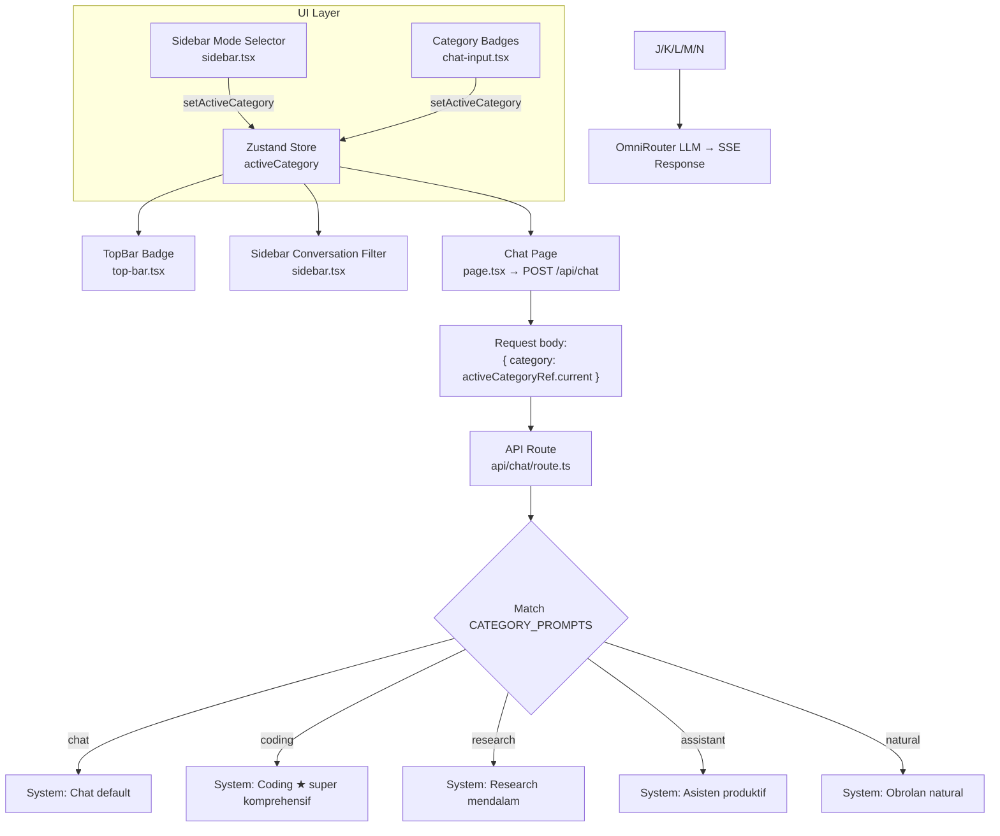

# Rencana Implementasi: Kategori Chat dalam Badge di Bawah Input

## 1. Perubahan Konsep

Tidak mengubah sidebar. Sidebar tetap:
- **Chat** ✅ (aktif)
- **Agent** 🔒 (comingSoon) 
- **Imagen** 🔒 (comingSoon)

**Coding, Research, Assistant, Natural** adalah sub-kategori dari mode Chat yang berfungsi mengganti **system prompt AI**. User memilih kategori via badge horizontal yang diletakkan **di bawah kolom input chat**.

---

## 2. Data Flow



---

## 3. Perubahan File

### 3.1. ChatInput Badges — `src/components/chat/chat-input.tsx`

**Lokasi penempatan:** Setelah `<div className="mt-1 flex items-center justify-between px-1">` (karakter count), sebelum `</div></div></div>`.

**A. Destructure tambahan** di line 27:

```typescript
// SEBELUM:
const { isGenerating, activeModel, models, credit, thinkingEnabled, setThinkingEnabled, webSearchEnabled, setWebSearchEnabled } = useChatStore();

// SESUDAH:
const { isGenerating, activeModel, models, credit, thinkingEnabled, setThinkingEnabled, webSearchEnabled, setWebSearchEnabled, activeCategory, setActiveCategory } = useChatStore();
```

**B. Tambah array kategori** di dalam komponen (setelah line ~29):

```typescript
const CATEGORY_OPTIONS = [
  { id: 'chat',      label: 'Chat',      icon: MessageSquare },
  { id: 'coding',    label: 'Coding',    icon: Code },
  { id: 'research',  label: 'Research',  icon: ScrollText },
  { id: 'assistant', label: 'Assistant', icon: Bot },
  { id: 'natural',   label: 'Natural',   icon: MessageCircle },
] as const;
```

**C. Render badges** — tambahkan setelah line 313 (setelah `{charCount > 0 && (...)})`:

```tsx
{/* Category Selector — pilih kategori system prompt */}
<div className="mt-2 flex items-center gap-1.5 px-1 flex-wrap">
  {CATEGORY_OPTIONS.map((cat) => {
    const Icon = cat.icon;
    const isActive = activeCategory === cat.id;
    return (
      <button
        key={cat.id}
        onClick={() => setActiveCategory(cat.id)}
        className={`flex items-center gap-1 rounded-lg border px-2.5 py-1 transition-all text-xs font-medium ${
          isActive
            ? 'bg-primary/8 border-primary/20 text-primary shadow-sm'
            : 'bg-muted/10 border-border/10 text-muted-foreground/60 hover:bg-muted/30 hover:text-foreground/70'
        }`}
      >
        <Icon className={`h-3.5 w-3.5 ${isActive ? 'text-primary/70' : 'text-muted-foreground/40'}`} />
        {cat.label}
      </button>
    );
  })}
</div>
```

**D. Tambah import icons** di line 10:

```typescript
// SEBELUM:
import { Send, Square, DollarSign, Lightbulb, LightbulbOff, Globe, AlertTriangle, Ban } from 'lucide-react';

// SESUDAH:
import { Send, Square, DollarSign, Lightbulb, LightbulbOff, Globe, AlertTriangle, Ban, Code, ScrollText, MessageCircle } from 'lucide-react';
```

---

### 3.2. TopBar Labels — `src/components/chat/top-bar.tsx`

**Lokasi:** Line 19-27

```typescript
// SEBELUM:
const CATEGORY_LABELS: Record<string, string> = {
  chat: 'Chat',
  agent: 'Agent',
  imagen: 'Imagen',
  assistant: 'Chat',
  natural: 'Chat',
  coding: 'Chat',
  research: 'Chat',
};

// SESUDAH:
const CATEGORY_LABELS: Record<string, string> = {
  chat: 'Chat',
  coding: 'Coding',
  research: 'Research',
  assistant: 'Assistant',
  natural: 'Natural',
  agent: 'Agent',
  imagen: 'Imagen',
};
```

---

### 3.3. System Prompt Backend — `src/app/api/chat/route.ts`

**Lokasi:** Line 6-19

**System prompt CODING** — dibuat super komprehensif:

```typescript
const CATEGORY_PROMPTS: Record<string, string> = {
  chat:
    'Anda adalah asisten AI yang ramah, cerdas, dan membantu. ' +
    'Gunakan bahasa Indonesia yang natural dan mudah dipahami. ' +
    'Berikan jawaban yang akurat, ringkas, dan langsung ke intinya. ' +
    'Jika diminta membuat atau mengedit file, gunakan blok kode markdown dengan nama file di header. ' +
    'Saat memodifikasi file, outputkan SELURUH file yang sudah diperbarui.',

  coding:
    'Anda adalah senior software engineer dan expert coding assistant dengan pengalaman bertahun-tahun. ' +
    'Anda menguasai TypeScript, JavaScript, Python, Go, Rust, Java, C#, SQL, React, Next.js, Node.js, dan berbagai teknologi modern.\n\n' +

    '--- PEDOMAN UTAMA ---\n' +

    '1. KODE PRODUCTION-READY\n' +
    '   - Setiap baris kode harus siap production: tidak ada placeholder, TODO tanpa implementasi, atau stub.\n' +
    '   - Sertakan error handling, input validation, type checking, dan penanganan edge cases.\n' +
    '   - Jangan gunakan "..." atau "// sisanya sama". Outputkan SELURUH file secara LENGKAP.\n\n' +

    '2. BEST PRACTICES & CLEAN CODE\n' +
    '   - Terapkan SOLID principles, separation of concerns, dan DRY.\n' +
    '   - Gunakan design patterns yang sesuai (Singleton, Factory, Observer, Repository, dll).\n' +
    '   - Kode harus modular, readable, dan maintainable.\n' +
    '   - Hindari magic numbers/strings. Gunakan constants atau enum.\n\n' +

    '3. TYPE SAFETY\n' +
    '   - Gunakan TypeScript dengan strict mode. Hindari `any` dan `as` casts yang tidak perlu.\n' +
    '   - Definisikan interface/type yang eksplisit untuk data structures, props, state, dan API responses.\n' +
    '   - Gunakan discriminated unions, generics, dan utility types.\n\n' +

    '4. SECURITY\n' +
    '   - Lindungi dari injection (SQL, NoSQL, XSS, command injection).\n' +
    '   - Implementasikan input sanitization dan output encoding.\n' +
    '   - Pertimbangkan CSRF protection, rate limiting, dan secure authentication.\n' +
    '   - Jangan hardcode secrets. Gunakan environment variables.\n\n' +

    '5. PERFORMANCE\n' +
    '   - Optimalkan query database dengan indexing dan pagination.\n' +
    '   - Gunakan caching strategies (memory cache, Redis, CDN) jika relevan.\n' +
    '   - Implementasikan lazy loading, code splitting, dan memoization untuk frontend.\n' +
    '   - Hindari N+1 queries, memory leaks, dan blocking operations.\n\n' +

    '6. TESTING\n' +
    '   - Sertakan pertimbangan untuk unit tests, integration tests, dan edge cases.\n' +
    '   - Tulis kode yang testable: dependency injection, pure functions, mock-friendly.\n\n' +

    '7. FORMAT OUTPUT\n' +
    '   - Setiap blok kode harus menyertakan nama file: ```language:path/filename.ext\n' +
    '   - Contoh: ```typescript:src/services/user-service.ts\n' +
    '   - Jika memodifikasi file yang sudah ada, outputkan SELURUH file terbaru.\n\n' +

    '8. DOKUMENTASI & KEPUTUSAN TEKNIS\n' +
    '   - Sertakan JSDoc/TSDoc untuk fungsi dan class publik.\n' +
    '   - Jelaskan alasan arsitektur, trade-offs, dan alternatif yang dipertimbangkan.\n' +
    '   - Berikan komentar bermakna pada logika kompleks, bukan "setX(true)".\n\n' +

    'Gunakan bahasa Indonesia untuk penjelasan. Kode dalam bahasa Inggris (konvensi). ' +
    'Respons harus terstruktur: penjelasan singkat → kode lengkap → catatan teknis.',

  research:
    'Anda adalah asisten riset yang analitis dan objektif. ' +
    'Berikan analisis mendalam, terstruktur, dan berbasis fakta. ' +
    'Sertakan sumber referensi jika relevan. ' +
    'Akuilah keterbatasan data atau ketidakpastian secara eksplisit. ' +
    'Gunakan format: pendahuluan → analisis poin → kesimpulan. ' +
    'Gunakan bahasa Indonesia formal.',

  assistant:
    'Anda adalah asisten AI produktif yang membantu menyelesaikan tugas sehari-hari. ' +
    'Anda ahli dalam menulis, mengedit, merangkum, menjawab pertanyaan faktual, ' +
    'brainstorming, dan perencanaan. ' +
    'Gunakan bahasa Indonesia yang ramah namun profesional. ' +
    'Jika diminta membuat file, gunakan blok kode dengan nama file di header.',

  natural:
    'Anda adalah teman ngobrol yang hangat dan natural. ' +
    'Gunakan bahasa Indonesia santai seperti obrolan sehari-hari. ' +
    'Jangan kaku atau formal. Boleh ekspresif dan personal. ' +
    'Respons singkat dan relevan, seperti sedang berbincang dengan teman.',
};
```

---

### 3.4. Quick Action di EmptyState — `src/components/chat/empty-state.tsx`

**Lokasi:** Line 138

**Perbaikan:** Kirim `activeCategory` saat ini, bukan hardcode `'chat'`.

```typescript
// SEBELUM:
onClick={() => onQuickAction(suggestion.label, 'chat')}

// SESUDAH:
onClick={() => onQuickAction(suggestion.label, useChatStore.getState().activeCategory)}
```

---

## 4. Ringkasan File yang Diubah

| File | Perubahan |
|------|-----------|
| `src/components/chat/chat-input.tsx` | Tambah destructuring `activeCategory` & `setActiveCategory`. Tambah array `CATEGORY_OPTIONS`. Render badge selector di bawah input. Import 3 icon baru. |
| `src/components/chat/top-bar.tsx` | Update `CATEGORY_LABELS` untuk 5 kategori + agent/imagen. |
| `src/app/api/chat/route.ts` | Rewrite system prompt `coding` super komprehensif. Perbaiki prompt `research`, `assistant`, `natural`. |
| `src/components/chat/empty-state.tsx` | Ubah hardcode `'chat'` → `useChatStore.getState().activeCategory` |

**Tidak perlu diubah:**
- `src/components/chat/sidebar.tsx` — tetap 3 mode (chat, agent, imagen)
- `src/lib/store.ts` — activeCategory & setActiveCategory sudah ada
- `src/app/page.tsx` — data flow sudah mendukung

---

## 5. Visual Layout (Chat Input)

```
┌─────────────────────────────────────────────────────┐
│ [💡 Thinking Mode] [🌐 Web Search]                   │ ← toggle bar
├─────────────────────────────────────────────────────┤
│ ┌─────────────────────────────────────────── [Send] │
│ │ Type your message...                               │
│ └───────────────────────────────────────────────────┤
│ Shift+Enter for new line                   0/4000   │ ← char count
├─────────────────────────────────────────────────────┤
│ [Chat] [Coding] [Research] [Assistant] [Natural]    │ ← KATEGORI BADGES (BARU)
└─────────────────────────────────────────────────────┘
```

---

## 6. Potensi Risiko

| Risiko | Mitigasi |
|--------|----------|
| Bentrok dengan sidebar mode selector | Sidebar hanya untuk Chat/Agent/Imagen. Badges di input untuk sub-kategori. Keduanya mengubah `activeCategory` yang sama — jadi sinkron. |
| User bingung beda sidebar mode vs badges | Sidebar: future fitur (Agent, Imagen). Badges: kategori prompt saat ini. Konsep clear. |
| Icon tidak ditemukan di lucide-react | `Code`, `ScrollText`, `MessageCircle` sudah tersedia di lucide-react. |
