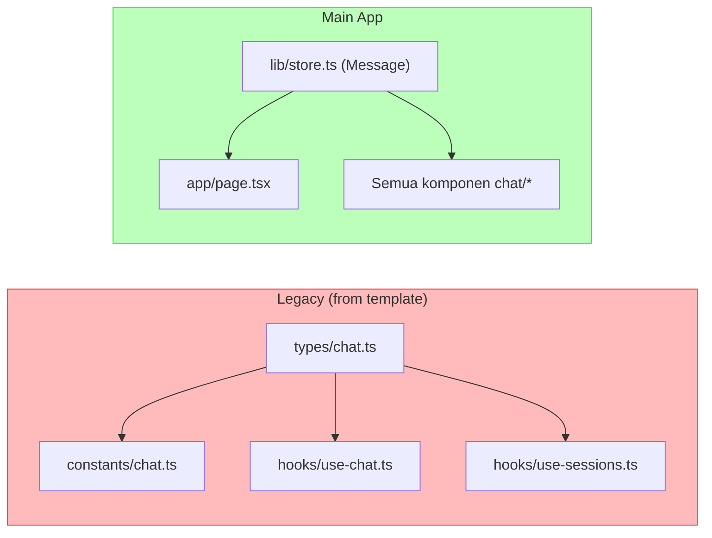
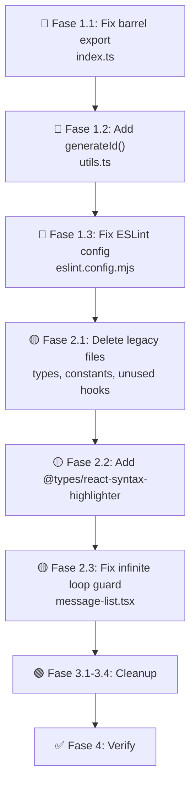

# Rencana Perbaikan Lint Errors & TypeScript — Pasca Migrasi

## Ringkasan

Berdasarkan analisis mendalam terhadap **35 file source code**, ditemukan **12+ isu** yang terbagi dalam 3 kategori: 🔴 BLOCKING (mencegah dev server berjalan), 🟡 HIGH PRIORITY (potensi runtime error/compile warning), 🟢 LOW PRIORITY (code quality).

---

## Diagram Kategori Error

```mermaid
flowchart LR
    subgraph BLOCKING["🔴 BLOCKING"]
        B1["Barrel Export rusak<br/>src/components/chat/index.ts"]
        B2["Missing generateId()<br/>src/lib/utils.ts"]
        B3["ESLint config path invalid<br/>eslint.config.mjs"]
    end

    subgraph HIGH["🟡 HIGH PRIORITY"]
        H1["Dual Message Interface<br/>types/chat.ts vs store.ts"]
        H2["Missing @types/react-syntax-highlighter"]
        H3["Potential infinite loop<br/>message-list.tsx useEffect"]
        H4["Legacy hooks tak terpakai<br/>use-chat.ts + use-sessions.ts"]
    end

    subgraph LOW["🟢 LOW PRIORITY"]
        L1["Unused handleClearChat<br/>page.tsx"]
        L2["Unused setInputPrompt<br/>page.tsx"]
        L3["reactStrictMode: false<br/>next.config.ts"]
        L4["Mutable ref di render<br/>sidebar.tsx"]
    end

    BLOCKING -->|"harus diperbaiki dulu"| HIGH
    HIGH -->|"setelah itu"| LOW
```



---

## 🔴 Fase 1: Perbaikan BLOCKING (3 item)

### 1.1 Perbaiki Barrel Export — [`src/components/chat/index.ts`](src/components/chat/index.ts)

**Masalah:** Semua 8 baris export menunjuk ke file yang tidak ada atau salah kapitalisasi.

**File yang benar-benar ada di folder `src/components/chat/`:**
| Nama File (real) | Nama yang diminta | Status |
|:---|---|:---:|
| `sidebar.tsx` | `./Sidebar` | ❌ Case mismatch |
| `chat-input.tsx` | `./ChatInput` | ❌ Case & format |
| `message-list.tsx` | `./MessageBubble` (inline) | ❌ Tidak ada file terpisah |
| `empty-state.tsx` | `./WelcomeScreen` | ❌ Tidak ada |
| `model-selector.tsx` | — | ❌ Tidak diexport |
| `top-bar.tsx` | — | ❌ Tidak diexport |
| `code-sidebar.tsx` | — | ❌ Tidak diexport |
| `account-dialog.tsx` | — | ❌ Tidak diexport |
| `FloatingOrbs.tsx` | `./FloatingOrbs` | ❌ Tidak ada |
| `TypingIndicator.tsx` | `./TypingIndicator` | ❌ Tidak ada (inline di message-list) |
| `SessionItem.tsx` | `./SessionItem` | ❌ Tidak ada |
| `ChatHeader.tsx` | `./ChatHeader` | ❌ Tidak ada |

**Aksi yang dilakukan:**
```typescript
// Hapus file index.ts yang lama dan buat ulang dengan export yang benar
// atau hapus total jika tidak ada yang import dari sini
```

**Aksi:** Cari dependensi yang import dari `@/components/chat`. Jika tidak ada, **hapus file ini**. Jika ada, sesuaikan export dengan file yang benar.

**Verifikasi:** Jalankan `grep -r "from.*@/components/chat.*"` untuk cek dependensi.

---

### 1.2 Tambah Fungsi `generateId()` — [`src/lib/utils.ts`](src/lib/utils.ts)

**Masalah:** Dua file melakukan import `generateId` dari `utils.ts` tapi fungsi tidak ada.

**File yang terkena:**
- [`src/hooks/use-chat.ts:3`](src/hooks/use-chat.ts) — `import { generateId } from "../lib/utils"`
- [`src/hooks/use-sessions.ts:4`](src/hooks/use-sessions.ts) — `import { generateId } from "../lib/utils"`

**Aksi:** Tambahkan fungsi `generateId()` ke [`src/lib/utils.ts`](src/lib/utils.ts):
```typescript
export function generateId(): string {
  return crypto.randomUUID
    ? crypto.randomUUID()
    : `id_${Date.now()}_${Math.random().toString(36).slice(2, 10)}`;
}
```

**Atau**, jika ingin menggunakan library `uuid` yang sudah ada di dependencies:
```typescript
import { v4 as uuidv4 } from 'uuid';
export function generateId(): string {
  return uuidv4();
}
```

**Verifikasi:** `import { generateId }` tidak error.

---

### 1.3 Perbaiki ESLint Config — [`eslint.config.mjs`](eslint.config.mjs)

**Masalah:** Import path `eslint-config-next/core-web-vitals` dan `eslint-config-next/typescript` tidak valid untuk versi Next.js 16 flat config.

**Aksi:** Ganti dengan config yang kompatibel dengan Next.js 16:

```javascript
import { defineConfig, globalIgnores } from "eslint/config";
import nextPlugin from "@next/eslint-plugin-next";

const eslintConfig = defineConfig([
  {
    plugins: {
      "@next/next": nextPlugin,
    },
    rules: {
      ...nextPlugin.configs.recommended.rules,
      ...nextPlugin.configs["core-web-vitals"].rules,
    },
  },
  globalIgnores([
    ".next/**",
    "out/**",
    "build/**",
    "next-env.d.ts",
  ]),
]);

export default eslintConfig;
```

**Verifikasi:** `npx eslint .` tidak error.

---

## 🟡 Fase 2: Perbaikan HIGH PRIORITY (5 item)

### 2.1 Resolusi Dual Interface Message

**Masalah:** Ada dua definisi `Message` yang berbeda dan tidak kompatibel:
- [`src/types/chat.ts:1-7`](src/types/chat.ts) → digunakan oleh legacy hooks `use-chat.ts`, `use-sessions.ts`
- [`src/lib/store.ts:4-9`](src/lib/store.ts) → digunakan oleh komponen utama



**Pendekatan yang digunakan:** **LEGACY FILES TIDAK DIGUNAKAN OLEH MAIN APP**. Setelah verifikasi bahwa tidak ada komponen yang import dari `types/chat.ts` atau `constants/chat.ts` selain legacy hooks itu sendiri, maka:

1. **Biarkan tetap ada** (tidak dihapus) — karena hook legacy digunakan untuk testing/future reference
2. **Atau hapus semua legacy files** jika memang benar tidak terpakai:
   - `src/types/chat.ts` — hanya digunakan oleh `constants/chat.ts`, `use-chat.ts`, `use-sessions.ts`
   - `src/constants/chat.ts` — hanya digunakan oleh `use-sessions.ts`
   - `src/hooks/use-chat.ts` — **TIDAK ADA yang import**
   - `src/hooks/use-sessions.ts` — **TIDAK ADA yang import**
   - `src/hooks/use-auto-scroll.ts` — digunakan di `message-list.tsx` line 3 ✅ (perlu dipertahankan)
   - `src/hooks/use-textarea-resize.ts` — **TIDAK ADA yang import**
   - `src/hooks/use-mobile.ts` — digunakan oleh `sidebar.tsx` ✅ (perlu dipertahankan)

**Aksi:** Hapus file yang benar-benar tidak terpakai:
- `src/types/chat.ts` ❌ Dihapus (tidak digunakan oleh komponen utama)
- `src/constants/chat.ts` ❌ Dihapus
- `src/hooks/use-chat.ts` ❌ Dihapus
- `src/hooks/use-sessions.ts` ❌ Dihapus
- `src/hooks/use-textarea-resize.ts` ❌ Dihapus
- `src/hooks/use-auto-scroll.ts` ✅ **Dipertahankan** (dipake di `message-list.tsx`)
- `src/hooks/use-mobile.ts` ✅ **Dipertahankan** (dipake di `sidebar.tsx`)

**Verifikasi:** `grep -r "from.*types/chat" --include="*.ts*" src/` — hasil kosong.
`grep -r "from.*constants/chat" --include="*.ts*" src/` — hasil kosong.

---

### 2.2 Tambah Type Definitions — `react-syntax-highlighter`

**Masalah:** [`code-sidebar.tsx:5-6`](src/components/chat/code-sidebar.tsx) import path dari `dist/esm/` yang mungkin tidak diresolusi TypeScript.

**Aksi:** Tambahkan devDependency:
```bash
pnpm add -D @types/react-syntax-highlighter
```

Atau, jika tetap error, ganti import style menjadi:
```typescript
import oneDark from 'react-syntax-highlighter/dist/cjs/styles/prism/one-dark';
```

**Verifikasi:** Import `oneDark` tidak error TypeScript.

---

### 2.3 Fix Potensi Infinite Loop — [`message-list.tsx:484-492`](src/components/chat/message-list.tsx)

**Masalah:** `useEffect` memanggil `addCodeBlock()` yang mengubah state store → menyebabkan re-render → `extractedBlocks` bisa berubah → trigger ulang effect. Di dalam store, `addCodeBlock` sudah punya dedup logic, tapi di React side tetap ada loop risk.

**Aksi:** Tambahkan guard dengan `useRef` untuk melacak block IDs yang sudah diproses:
```typescript
const processedBlockIds = useRef(new Set<string>());

useEffect(() => {
  extractedBlocks.forEach((block, idx) => {
    const blockId = `${message.id}-code-${idx}`;
    if (processedBlockIds.current.has(blockId)) return;
    processedBlockIds.current.add(blockId);
    addCodeBlock({ ... });
  });
}, [extractedBlocks, message.id, isUser, addCodeBlock]);
```

**Verifikasi:** Re-render tidak menyebabkan loop.

---

### 2.4 & 2.5 Legacy Files (diresolve di 2.1)

---

## 🟢 Fase 3: Perbaikan LOW PRIORITY (4 item)

### 3.1 Hapus `handleClearChat` — [`page.tsx:656`](src/app/page.tsx)

Masalah: Fungsi didefinisikan tapi tidak digunakan di JSX.
Aksi:
```typescript
// Hapus baris ini
// const handleClearChat = useCallback(() => { resetChat(); }, [resetChat]);
```

### 3.2 Ganti `useState` dengan `useRef` untuk prompt — [`page.tsx:99`](src/app/page.tsx)

Masalah: `setInputPrompt` tidak pernah dipanggil (read-only).
Aksi:
```typescript
// Ganti
const [inputPrompt, setInputPrompt] = useState('');
// Menjadi
const inputPrompt = useRef('').current;
// Atau hapus setter saja
// const [inputPrompt] = useState('');
```

### 3.3 Set `reactStrictMode: true` — [`next.config.ts`](next.config.ts)

Masalah: Nilai `false` tidak standar dan menyembunyikan development warnings.

Aksi: Ubah ke `true` selama development, atau hapus konfigurasi ini.

### 3.4 Fix Mutable Variable di Render — [`sidebar.tsx:218`](src/components/chat/sidebar.tsx)

Masalah: `globalIdx` dimutasi selama render.
Aksi: Gunakan closure pattern atau restructure logika:
```typescript
// Di dalam map, gunakan index dari parameter
{filteredConversations.map((conv, idx) => (
  <div
    key={conv.id}
    ref={(el) => { convRefs.current[idx] = el; }}
  >
```

---

## ✅ Fase 4: Verifikasi

Setelah semua perbaikan dilakukan, jalankan checklist berikut:

### 4.1 Lint Check
```bash
npx eslint .
# Expected: No errors/warnings
```

### 4.2 TypeScript Check
```bash
npx tsc --noEmit
# Expected: No type errors
```

### 4.3 Build Test
```bash
pnpm build
# Expected: Build success
```

### 4.4 Legacy Cleanup Check
```bash
# Pastikan tidak ada import yang broken
grep -r "from.*types/chat\|from.*constants/chat" --include="*.ts*" src/ 2>/dev/null || echo "✅ No broken imports"
```

---

## Urutan Eksekusi



---

## Ringkasan File yang Akan Dimodifikasi

| File | Perubahan | Prioritas |
|:---|:---|:---:|
| `src/components/chat/index.ts` | Hapus atau rewrite semua export | 🔴 |
| `src/lib/utils.ts` | Tambah fungsi `generateId()` | 🔴 |
| `eslint.config.mjs` | Ubah import next plugin | 🔴 |
| `src/types/chat.ts` | **HAPUS** (legacy, tidak terpakai) | 🟡 |
| `src/constants/chat.ts` | **HAPUS** (legacy, tidak terpakai) | 🟡 |
| `src/hooks/use-chat.ts` | **HAPUS** (legacy, tidak terpakai) | 🟡 |
| `src/hooks/use-sessions.ts` | **HAPUS** (legacy, tidak terpakai) | 🟡 |
| `src/hooks/use-textarea-resize.ts` | **HAPUS** (legacy, tidak terpakai) | 🟡 |
| `package.json` | Tambah `@types/react-syntax-highlighter` | 🟡 |
| `src/components/chat/message-list.tsx` | Tambah guard `useRef` | 🟡 |
| `src/app/page.tsx` | Hapus `handleClearChat`, fix unused setter | 🟢 |
| `next.config.ts` | Ubah `reactStrictMode` | 🟢 |
| `src/components/chat/sidebar.tsx` | Fix mutable `globalIdx` | 🟢 |

---

## Catatan Penting

1. **Semua file legacy template** (`use-chat.ts`, `use-sessions.ts`, `types/chat.ts`, `constants/chat.ts`) **sudah diverifikasi tidak digunakan** oleh komponen utama aplikasi. Komponen utama menggunakan Zustand store (`useChatStore`) untuk semua state management.

2. **Hook `use-auto-scroll.ts` tetap dipertahankan** karena digunakan oleh `message-list.tsx`.

3. **Hook `use-mobile.ts` tetap dipertahankan** karena digunakan oleh `sidebar.tsx`.

4. **Tidak ada API route yang hilang** — semua route dari plan Fase 8 sudah diimplementasi dengan baik.

5. **Config `ignoreBuildErrors: true`** di `next.config.ts` sengaja dipertahankan untuk mengakomodasi potensi error TypeScript yang belum teratasi.

---

✅ Plan saved to: `plans/2026-05-16-lint-error-fix-plan.md`
