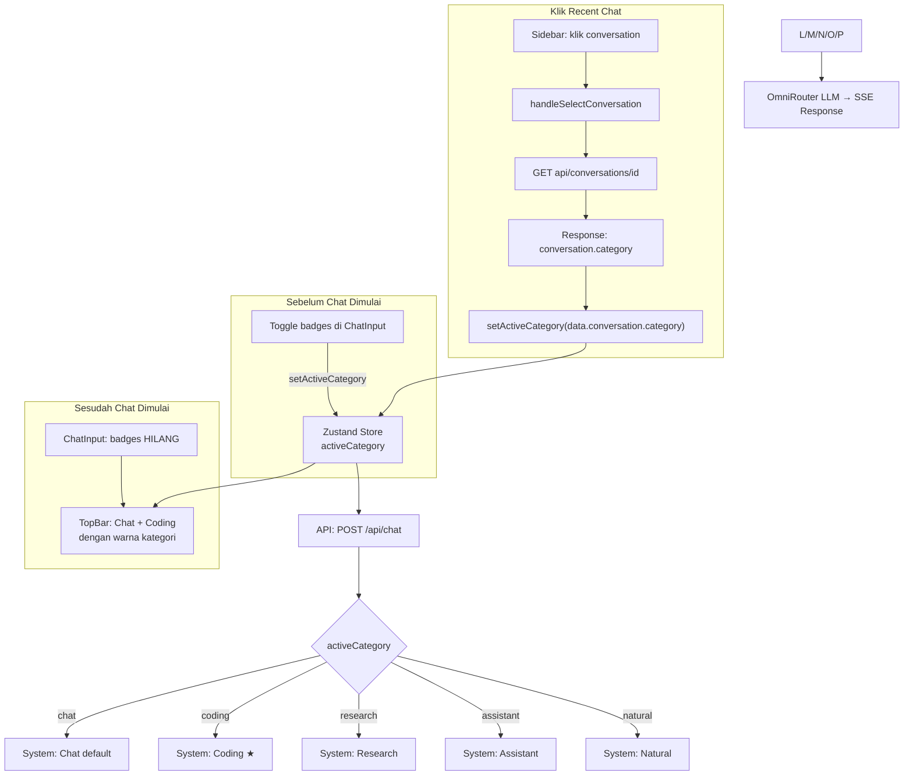

# Rencana Implementasi: Toggle Kategori Chat + Badge Warna di TopBar + Restore Kategori

## 1. Konsep UX

Toggle kategori bersifat **mutually exclusive** dan **kontekstual**:

| Kondisi | Tampilan ChatInput | Tampilan TopBar |
|---------|-------------------|-----------------|
| **Sebelum chat** | Toggle badges muncul di bawah input | Badge `Chat` (muted) |
| **Sesudah chat** | Toggle badges **HILANG** | Badge `Chat + Coding` 🔵 warna |

Perilaku toggle:
- **Tidak ada badge "Chat"** — Chat adalah default
- Klik badge non-aktif → ON (yang lain OFF)
- Klik badge yang sudah ON → OFF (kembali ke Chat)
- **Mutually exclusive**: hanya 1 kategori aktif

### Handle Recent Chat (Restore Kategori)

Saat user klik recent conversation dari sidebar:
1. `handleSelectConversation` fetch dari `/api/conversations/[id]`
2. Response API sudah berisi `conversation.category`
3. **WAJIB** panggil `setActiveCategory(data.conversation.category)` agar kategori konsisten
4. TopBar badge otomatis berubah sesuai kategori yang direstore

---

## 2. Data Flow



---

## 3. Perubahan File

### 3.1. ChatInput Toggle — `src/components/chat/chat-input.tsx`

Line 27 — tambah destructure:

```typescript
const { isGenerating, activeModel, models, credit, thinkingEnabled, setThinkingEnabled, webSearchEnabled, setWebSearchEnabled, activeCategory, setActiveCategory, messages } = useChatStore();
```

Array toggle + handler:

```typescript
const CATEGORY_TOGGLES = [
  { id: 'coding',    label: 'Coding',    icon: Code },
  { id: 'research',  label: 'Research',  icon: ScrollText },
  { id: 'assistant', label: 'Assistant', icon: Bot },
  { id: 'natural',   label: 'Natural',   icon: MessageCircle },
] as const;

const handleCategoryToggle = useCallback((catId: string) => {
  setActiveCategory(activeCategory === catId ? 'chat' : catId);
}, [activeCategory, setActiveCategory]);
```

Render — hanya sebelum chat:

```tsx
{messages.length === 0 && (
  <div className="mt-2 flex items-center gap-1.5 px-1 flex-wrap">
    {CATEGORY_TOGGLES.map((cat) => {
      const Icon = cat.icon;
      const isActive = activeCategory === cat.id;
      return (
        <button
          key={cat.id}
          onClick={() => handleCategoryToggle(cat.id)}
          className={`flex items-center gap-1 rounded-lg border px-2.5 py-1 transition-all text-xs font-medium ${
            isActive
              ? 'bg-primary/8 border-primary/20 text-primary shadow-sm'
              : 'bg-muted/10 border-border/10 text-muted-foreground/50 hover:bg-muted/30 hover:text-foreground/70'
          }`}
        >
          <Icon className={`h-3.5 w-3.5 ${isActive ? 'text-primary/70' : 'text-muted-foreground/40'}`} />
          {cat.label}
          <span className={`ml-1 text-[9px] font-bold uppercase ${
            isActive ? 'text-primary/60' : 'text-muted-foreground/30'
          }`}>
            {isActive ? 'ON' : 'OFF'}
          </span>
        </button>
      );
    })}
  </div>
)}
```

Import tambahan:

```typescript
import { Send, Square, DollarSign, Lightbulb, LightbulbOff, Globe, AlertTriangle, Ban, Code, ScrollText, MessageCircle } from 'lucide-react';
```

---

### 3.2. TopBar Badge Warna — `src/components/chat/top-bar.tsx`

Tambah warna kategori:

```typescript
const CATEGORY_COLORS: Record<string, { badge: string; dot: string }> = {
  chat:      { badge: 'bg-muted/30 text-muted-foreground border-border/20',           dot: 'bg-muted-foreground' },
  coding:    { badge: 'bg-sky-500/10 text-sky-600 dark:text-sky-400 border-sky-500/15', dot: 'bg-sky-500' },
  research:  { badge: 'bg-violet-500/10 text-violet-600 dark:text-violet-400 border-violet-500/15', dot: 'bg-violet-500' },
  assistant: { badge: 'bg-emerald-500/10 text-emerald-600 dark:text-emerald-400 border-emerald-500/15', dot: 'bg-emerald-500' },
  natural:   { badge: 'bg-orange-500/10 text-orange-600 dark:text-orange-400 border-orange-500/15', dot: 'bg-orange-500' },
  agent:     { badge: 'bg-muted/30 text-muted-foreground border-border/20',           dot: 'bg-muted-foreground' },
  imagen:    { badge: 'bg-muted/30 text-muted-foreground border-border/20',           dot: 'bg-muted-foreground' },
};
```

Update labels:

```typescript
const CATEGORY_LABELS: Record<string, string> = {
  chat: 'Chat', coding: 'Coding', research: 'Research',
  assistant: 'Assistant', natural: 'Natural',
  agent: 'Agent', imagen: 'Imagen',
};
```

Ganti render badge di line 207-212:

```tsx
<Badge
  variant="outline"
  className={`text-xs font-medium capitalize hidden sm:flex gap-1 items-center border ${
    CATEGORY_COLORS[activeCategory]?.badge || 'bg-muted/30 text-muted-foreground border-border/20'
  }`}
>
  {activeCategory === 'chat' ? (
    'Chat'
  ) : (
    <>
      Chat<span className="text-muted-foreground/40 mx-0.5">+</span>
      <span className="font-semibold">{CATEGORY_LABELS[activeCategory] || activeCategory}</span>
    </>
  )}
</Badge>
```

---

### 3.3. Restore Kategori di Recent Chat — `src/app/page.tsx`

Di `handleSelectConversation` (line 737), setelah fetch berhasil dan sebelum `setMessages`, tambahkan restore kategori:

```typescript
const handleSelectConversation = useCallback(async (id: string) => {
  setActiveConversationId(id);
  setMobileSidebarOpen(false);
  if (isLoadingMessages) return;
  setIsLoadingMessages(true);
  try {
    const res = await fetch(`/api/conversations/${id}`);
    if (res.ok) {
      const data = await res.json();
      if (data.messages) {
        setMessages(data.messages);
      }
      // [BARU] Restore kategori percakapan agar konsisten
      if (data.conversation?.category) {
        setActiveCategory(data.conversation.category);
      }
    }
  } catch (error) {
    console.error('[DEBUG:B2] Network error loading conversation:', error);
  } finally {
    setIsLoadingMessages(false);
  }
}, [setActiveConversationId, setMessages, setActiveCategory]);
```

**TAMBAH `setActiveCategory` ke dependency array:**

```typescript
// SEBELUM:
}, [setActiveConversationId, setMessages]);

// SESUDAH:
}, [setActiveConversationId, setMessages, setActiveCategory]);
```

**Pastikan `setActiveCategory` sudah di-destructure** di bagian atas komponen (cek apakah sudah ada — jika belum, tambahkan di line 84):

```typescript
// Line 76-84 — pastikan setActiveCategory sudah ada
const {
  activeConversationId, activeCategory, activeModel,
  messages, isGenerating, sidebarOpen, isLoggedIn,
  setActiveConversationId,
  setActiveCategory,    // ← PASTIKAN INI ADA
  addMessage, removeConversation,
  setIsGenerating, resetChat, toggleSidebar,
  ...
} = useChatStore();
```

---

### 3.4. System Prompt Backend — `src/app/api/chat/route.ts`

```typescript
const CATEGORY_PROMPTS: Record<string, string> = {
  chat:
    'Anda adalah asisten AI yang ramah, cerdas, dan membantu. ' +
    'Gunakan bahasa yang dipakai user. ' +
    'Berikan jawaban akurat, ringkas, dan langsung ke intinya. ' +
    'Jika diminta membuat/mengedit file, gunakan blok kode dengan nama file di header. ' +
    'Saat memodifikasi file, outputkan SELURUH file yang sudah diperbarui.',

  coding:
    'Anda adalah AI Coding Assistant. Patuhi SELURUH aturan di bawah secara KETAT. ' +
    'Setiap pelanggaran adalah kesalahan serius.\n\n' +

    '=== BAGIAN 1: IDENTIFIKASI JENIS PERMINTAAN ===\n\n' +

    'Di setiap awal respons, identifikasi jenis permintaan user:\n\n' +

    'JENIS 1 — BUAT BARU\n' +
    'Ciri: "buat", "create", "generate", "mulai project".\n' +
    'Output: struktur folder, kode lengkap tiap file, instruksi setup, contoh penggunaan.\n\n' +

    'JENIS 2 — PERBAIKI / FIX BUG\n' +
    'Ciri: "perbaiki", "fix", "bug", "error", "gagal".\n' +
    'Output: analisis root cause dulu — jangan langsung ubah kode. Lalu kode lengkap + pencegahan.\n\n' +

    'JENIS 3 — TAMBAH FITUR / UPDATE\n' +
    'Ciri: "tambah", "update", "upgrade", "tambahkan fitur".\n' +
    'Output: analisis dampak, backward compatibility, output SEMUA file berubah.\n\n' +

    'JENIS 4 — DEBUG / ANALISIS\n' +
    'Ciri: "debug", "analisis", "kenapa", "cek", "trace".\n' +
    'Output: analisis sistematis step-by-step. Minta data tambahan jika kurang.\n\n' +

    'JENIS 5 — BUAT UI / FRONTEND\n' +
    'Ciri: "buat ui", "tampilan", "desain", "layout", "halaman".\n' +
    'Output: responsive, aksesibilitas, loading/empty/error state, + preview deskripsi.\n\n' +

    '=== BAGIAN 2: ATURAN WAJIB (UNTUK SEMUA JENIS) ===\n\n' +

    'ATURAN 1 — KODE LENGKAP\n' +
    '1.1. WAJIB output SELURUH kode. Dilarang "..." atau "// sisanya sama".\n' +
    '1.2. Dilarang placeholder, stub, TODO tanpa implementasi.\n' +
    '1.3. Setiap fungsi WAJIB memiliki implementasi lengkap.\n\n' +

    'ATURAN 2 — PRODUCTION READY\n' +
    '2.1. WAJIB siap production: error handling, validasi input, edge cases.\n' +
    '2.2. DILARANG console.log di kode final.\n\n' +

    'ATURAN 3 — TYPE SAFETY\n' +
    '3.1. DILARANG type `any`. Pelanggaran berat.\n' +
    '3.2. WAJIB interface/type explicit untuk semua data.\n' +
    '3.3. Gunakan discriminated unions, generics.\n\n' +

    'ATURAN 4 — CLEAN CODE\n' +
    '4.1. Terapkan SOLID, DRY, single responsibility.\n' +
    '4.2. DILARANG magic numbers/strings. Gunakan constants/enum.\n' +
    '4.3. Nama WAJIB deskriptif sesuai konvensi bahasa.\n\n' +

    'ATURAN 5 — SECURITY\n' +
    '5.1. Lindungi dari injection, XSS, CSRF, command injection.\n' +
    '5.2. DILARANG hardcode secrets. Gunakan env variables.\n' +
    '5.3. Parameterized queries untuk database.\n\n' +

    'ATURAN 6 — PERFORMANCE\n' +
    '6.1. Optimalkan query: indexing, pagination, hindari N+1.\n' +
    '6.2. Gunakan caching untuk data jarang berubah.\n' +
    '6.3. Hindari blocking operations, memory leaks.\n\n' +

    'ATURAN 7 — TESTING\n' +
    '7.1. Kode WAJIB testable: dependency injection, pure functions.\n' +
    '7.2. Sertakan pertimbangan unit test.\n\n' +

    'ATURAN 8 — FORMAT OUTPUT\n' +
    '8.1. WAJIB ```language:path/file.ext. Contoh benar: ```typescript:src/service.ts\n' +
    '8.2. Contoh SALAH: ```typescript (tanpa path).\n' +
    '8.3. Outputkan SELURUH file saat modifikasi.\n\n' +

    'ATURAN 9 — DOKUMENTASI\n' +
    '9.1. Fungsi publik WAJIB JSDoc/TSDoc (parameter, return, throws).\n' +
    '9.2. Komentar untuk logika kompleks, bukan trivial.\n\n' +

    'ATURAN 10 — RESPON\n' +
    '10.1. Bahasa user untuk penjelasan, Inggris untuk kode.\n' +
    '10.2. Struktur: identifikasi jenis → analisis → kode lengkap → catatan.\n' +
    '10.3. Akui jika tidak yakin atau ada keterbatasan.',

  research:
    'Anda adalah asisten riset yang analitis dan objektif. ' +
    'Berikan analisis mendalam, terstruktur, dan berbasis fakta. ' +
    'Sertakan sumber referensi jika relevan. ' +
    'Akui keterbatasan data secara eksplisit. ' +
    'Format: pendahuluan → analisis → kesimpulan.',

  assistant:
    'Anda adalah asisten AI produktif untuk tugas sehari-hari. ' +
    'Ahli dalam menulis, mengedit, merangkum, menjawab pertanyaan faktual, ' +
    'brainstorming, dan perencanaan. ' +
    'Gunakan bahasa yang ramah namun profesional.',

  natural:
    'Anda adalah teman ngobrol yang hangat dan natural. ' +
    'Gunakan bahasa santai seperti obrolan sehari-hari. ' +
    'Jangan kaku atau formal. Boleh ekspresif dan personal. ' +
    'Respons singkat dan relevan.',
};
```

---

### 3.5. EmptyState Quick Action — `src/components/chat/empty-state.tsx`

```typescript
// SEBELUM:
onClick={() => onQuickAction(suggestion.label, 'chat')}

// SESUDAH:
onClick={() => onQuickAction(suggestion.label, useChatStore.getState().activeCategory)}
```

---

## 4. Ringkasan Perubahan

| # | File | Perubahan |
|---|------|-----------|
| 1 | `src/components/chat/chat-input.tsx` | Toggle badges (coding/research/assistant/natural) — hanya muncul jika `messages.length === 0`. |
| 2 | `src/components/chat/top-bar.tsx` | Tambah `CATEGORY_COLORS` (warna per kategori). Badge jadi `Chat` atau `Chat + Coding` dengan warna. |
| 3 | **`src/app/page.tsx`** | **Restore kategori saat buka recent chat** — `setActiveCategory(data.conversation.category)` di `handleSelectConversation`. |
| 4 | `src/app/api/chat/route.ts` | System prompt coding: 5 jenis permintaan + 10 aturan wajib. |
| 5 | `src/components/chat/empty-state.tsx` | Hardcode `'chat'` → `useChatStore.getState().activeCategory`. |

---

## 5. Warna Per Kategori

| Kategori | Warna | TopBar Badge |
|----------|-------|--------------|
| `chat` (default) | Muted | `Chat` |
| `coding` | **Sky/Biru** 🔵 | `Chat + Coding` |
| `research` | **Violet/Ungu** 🟣 | `Chat + Research` |
| `assistant` | **Emerald/Hijau** 🟢 | `Chat + Assistant` |
| `natural` | **Orange/Jingga** 🟠 | `Chat + Natural` |

---

## 6. Layout

### Sebelum Chat:

```
┌────────────────────────────────────────────────────┐
│ [💡 Thinking Mode] [🌐 Web Search]                  │
├────────────────────────────────────────────────────┤
│ ┌──────────────────────────────────────── [Send] ┐ │
│ │ Type your message...                           │ │
│ └────────────────────────────────────────────────┘ │
│ Shift+Enter for new line                   0/4000  │
├────────────────────────────────────────────────────┤
│ Coding ON   Research OFF   Assistant OFF   Natural │ ← BADGES
└────────────────────────────────────────────────────┘
TopBar: [Chat]
```

### Sesudah Chat:

```
┌────────────────────────────────────────────────────┐
│ [💡 Thinking Mode] [🌐 Web Search]   [Chat+Coding] │ ← WARNA 🔵
├────────────────────────────────────────────────────┤
│ ┌──────────────────────────────────────── [Send] ┐ │
│ │ Type your message...                           │ │
│ └────────────────────────────────────────────────┘ │
│ Shift+Enter for new line                   0/4000  │
├────────────────────────────────────────────────────┤
│ ← BADGES HILANG                                    │
└────────────────────────────────────────────────────┘
```

### Klik Recent Chat:

```
User klik "My Project" di sidebar → 
API return category='coding' → 
setActiveCategory('coding') → 
TopBar otomatis jadi [Chat+Coding] 🔵
```

---

## 7. Perilaku Toggle

| Aksi | `activeCategory` | ChatInput | TopBar |
|------|-----------------|-----------|--------|
| Default | `'chat'` | Semua OFF | `Chat` |
| Klik Coding | `'coding'` | Coding ON | `Chat + Coding` 🔵 |
| Kirim pesan | `'coding'` | **HILANG** | `Chat + Coding` 🔵 |
| Klik Research | `'research'` | Research ON | `Chat + Research` 🟣 |
| Klik Coding lagi | `'chat'` | Semua OFF | `Chat` |
| Buka recent chat coding | `'coding'` (restore) | HILANG (karena messages > 0) | `Chat + Coding` 🔵 |
| Buka recent chat default | `'chat'` (restore) | TAMPAK (karena resetChat) | `Chat` |
