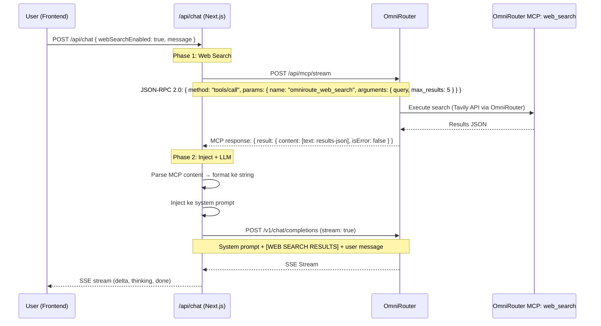

# Implementasi Web Search via OmniRouter MCP StreamableHTTP

## Endpoint MCP

OmniRouter StreamableHTTP endpoint:
```
POST http://127.0.0.1:20128/api/mcp/stream
Content-Type: application/json

{
  "jsonrpc": "2.0",
  "id": "request-1",
  "method": "tools/call",
  "params": {
    "name": "omniroute_web_search",
    "arguments": {
      "query": "...",
      "max_results": 5
    }
  }
}
```

Mengapa MCP StreamableHTTP? Karena MCP (Model Context Protocol) adalah standar terbuka untuk integrasi tool — jadi jika nanti ganti provider atau tambah tool lain, formatnya tetap sama.

## Arsitektur Final

Tidak perlu API key Tavily di project Next.js. Semua API key dikelola oleh **OmniRouter**. Backend kita panggil MCP tool `omniroute_web_search` via endpoint `POST /api/mcp/stream` OmniRouter, lalu inject hasilnya ke system prompt sebelum panggil LLM.



## File yang Diubah

| # | File | Tindakan | Deskripsi |
|---|------|----------|-----------|
| 1 | `src/lib/web-search/index.ts` | **BUAT** | Panggil MCP tool `omniroute_web_search` via `POST /api/mcp/stream` |
| 2 | `src/app/api/chat/route.ts` | **UBAH** | Inject hasil web search ke system prompt sebelum panggil LLM |
| 3 | `src/lib/store.ts` | **UBAH** | Tambah state + action `webSearchEnabled` |
| 4 | `src/components/chat/chat-input.tsx` | **UBAH** | Toggle Web Search (seperti Thinking toggle) |
| 5 | `src/app/page.tsx` | **UBAH** | Kirim `webSearchEnabled` ke API |

**Tidak perlu** ubah `.env.local` — semua API key tetap di OmniRouter.

---

## 1. BUAT: `src/lib/web-search/index.ts`

```typescript
// src/lib/web-search/index.ts
// Web Search via OmniRouter MCP StreamableHTTP
// Semua API key dikelola OmniRouter — tidak perlu API key di project ini
//
// Protokol: MCP JSON-RPC 2.0 via StreamableHTTP
// Endpoint: POST /api/mcp/stream
//
// Format request:
//   { jsonrpc: "2.0", id: "...", method: "tools/call",
//     params: { name: "omniroute_web_search", arguments: { query, max_results } } }
//
// Format response:
//   { jsonrpc: "2.0", id: "...", result: { content: [...], isError: false } }

export interface WebSearchResult {
  title: string;
  url: string;
  content: string;
  score: number;
  publishedDate?: string;
  source: string;
}

export interface WebSearchOptions {
  maxResults?: number;
  searchDepth?: 'basic' | 'advanced';
}

// Derive MCP URL dari OMNIROUTER_BASE_URL
// OMNIROUTER_BASE_URL = http://localhost:20128/v1
// MCP endpoint = http://localhost:20128/api/mcp/stream
const OMNIROUTER_BASE = process.env.OMNIROUTER_BASE_URL || 'http://localhost:20128/v1';
const OMNIROUTER_API_KEY = process.env.OMNIROUTER_API_KEY || '';

// MCP StreamableHTTP endpoint — derive from base URL
const MCP_STREAM_URL = OMNIROUTER_BASE.replace('/v1', '/api/mcp/stream');

/**
 * Panggil MCP tool omniroute_web_search via StreamableHTTP
 * Menggunakan protokol MCP JSON-RPC 2.0
 *
 * StreamableHTTP adalah transport MCP yang disederhanakan —
 * tidak perlu initialize session, cukup kirim tools/call langsung.
 *
 * Format request:
 *   { jsonrpc: "2.0", id: "...", method: "tools/call",
 *     params: { name: "omniroute_web_search", arguments: { query, max_results } } }
 *
 * Format response:
 *   { jsonrpc: "2.0", id: "...", result: { content: [...], isError: boolean } }
 */
export async function searchViaOmniRouter(
  query: string,
  options: WebSearchOptions = {}
): Promise<WebSearchResult[]> {
  const maxResults = options.maxResults || 5;
  const requestId = `ws-${Date.now()}-${Math.random().toString(36).slice(2, 8)}`;

  try {
    // ─── Call MCP tool langsung ──────────────────────────────
    // StreamableHTTP tidak perlu initialize — cukup tools/call
    const callPayload = {
      jsonrpc: '2.0',
      id: requestId,
      method: 'tools/call',
      params: {
        name: 'omniroute_web_search',
        arguments: {
          query,
          max_results: maxResults,
          search_depth: options.searchDepth || 'advanced',
        },
      },
    };

    const callRes = await fetch(MCP_STREAM_URL, {
      method: 'POST',
      headers: {
        'Content-Type': 'application/json',
        'Authorization': `Bearer ${OMNIROUTER_API_KEY}`,
      },
      body: JSON.stringify(callPayload),
    });

    if (!callRes.ok) {
      const errText = await callRes.text().catch(() => 'unknown error');
      console.error(`[WebSearch] MCP tools/call error ${callRes.status}: ${errText}`);
      return [];
    }

    const callData = await callRes.json();

    // ─── Step 3: Parse MCP response ─────────────────────────
    // MCP response format: { jsonrpc: "2.0", id: "...", result: { content: [...], isError: boolean } }
    // Setiap item content punya tipe: "text" | "resource"
    if (callData?.error) {
      console.error('[WebSearch] MCP error:', callData.error);
      return [];
    }

    const result = callData?.result;
    if (!result || result.isError) {
      console.error('[WebSearch] MCP tool returned error:', result);
      return [];
    }

    // Parse content items
    const allResults: WebSearchResult[] = [];
    const contentItems = result.content || [];

    for (const item of contentItems) {
      if (item.type === 'text' && item.text) {
        // Text content bisa berupa JSON string atau teks biasa
        try {
          const parsed = JSON.parse(item.text);
          if (Array.isArray(parsed)) {
            allResults.push(...parsed.map(normalizeResult));
          } else if (parsed.results) {
            allResults.push(...parsed.results.map(normalizeResult));
          }
        } catch {
          // Bukan JSON — skip
        }
      }
    }

    return allResults;
  } catch (error) {
    console.error('[WebSearch] MCP network error:', error);
    return [];
  }
}

function normalizeResult(r: any): WebSearchResult {
  return {
    title: r.title || r.name || 'No title',
    url: r.url || r.link || '',
    content: r.content || r.snippet || r.description || '',
    score: r.score || r.relevance || r.relevance_score || 0,
    publishedDate: r.published_date || r.publishedDate || r.date || undefined,
    source: r.source || r.engine || r.provider || 'web',
  };
}

/**
 * Deteksi apakah query butuh web search berdasarkan keyword
 * 
 * Level confidence:
 * - high: keyword temporal/eksplisit → langsung search
 * - medium: question words + proper noun / query panjang → search
 * - low: skip search
 */
const TEMPORAL_KEYWORDS = [
  'berita', 'news', 'terbaru', 'latest', 'hari ini', 'today',
  'tadi malam', 'yesterday', 'this week', 'this month',
  'sekarang', 'currently', 'real-time', 'real time',
  'cuaca', 'weather', 'harga', 'price', 'saham', 'stock',
  'nilai tukar', 'exchange rate', 'kurs', 'bitcoin', 'crypto',
  'update', 'current', 'perkiraan', 'forecast', 'prediksi',
];

const EXPLICIT_SEARCH_KEYWORDS = [
  'cari di google', 'search google', 'cari di internet',
  'googling', 'search the web', 'look up', 'cari tahu',
  'google it', 'search for', 'cari di web',
];

export function detectWebSearchIntent(
  query: string,
  category: string
): { shouldSearch: boolean; confidence: 'high' | 'medium' | 'low' } {
  const lower = query.toLowerCase().trim();

  if (category === 'research') {
    return { shouldSearch: true, confidence: 'high' };
  }

  if (EXPLICIT_SEARCH_KEYWORDS.some((kw) => lower.includes(kw))) {
    return { shouldSearch: true, confidence: 'high' };
  }

  if (TEMPORAL_KEYWORDS.some((kw) => lower.includes(kw))) {
    return { shouldSearch: true, confidence: 'high' };
  }

  const questionWords = ['siapa', 'apa', 'kapan', 'dimana', 'who', 'what', 'when', 'where'];
  if (questionWords.some((w) => lower.startsWith(w)) && query.length > 15) {
    return { shouldSearch: true, confidence: 'medium' };
  }

  if (query.length > 80) {
    return { shouldSearch: true, confidence: 'medium' };
  }

  return { shouldSearch: false, confidence: 'low' };
}

/**
 * Format hasil search jadi string untuk di-inject ke system prompt
 */
export function formatSearchResults(results: WebSearchResult[], query: string): string {
  if (results.length === 0) return '';

  return `

[WEB SEARCH RESULTS]
Pencarian untuk: "${query}"
${results
  .map(
    (r, i) =>
      `[${i + 1}] ${r.title}
URL: ${r.url}
Konten: ${r.content.substring(0, 1500)}
${r.publishedDate ? `Tanggal: ${r.publishedDate}` : ''}
Skor Relevansi: ${(r.score * 100).toFixed(0)}%`
  )
  .join('\n\n')}
[/WEB SEARCH RESULTS]

Instruksi: Gunakan informasi di ATAS untuk menjawab pertanyaan user.
- Selalu sebutkan sumber URL jika menggunakan informasi dari web search.
- Jika tidak ada informasi yang relevan dari web search, jawab berdasarkan pengetahuan sendiri.
- Jika hasil web search tidak cukup, akui saja dan jangan berasumsi.`;
}

/**
 * Main function: detect intent → search via OmniRouter → format
 */
export async function webSearchAndFormat(
  query: string,
  options: WebSearchOptions & { category?: string } = {}
): Promise<string> {
  const { category, ...searchOpts } = options;

  const intent = detectWebSearchIntent(query, category || 'chat');
  if (!intent.shouldSearch) {
    return '';
  }

  console.log(`[WebSearch] Searching via OmniRouter: "${query.substring(0, 50)}..." (confidence: ${intent.confidence})`);

  const results = await searchViaOmniRouter(query, searchOpts);
  if (results.length === 0) {
    console.log('[WebSearch] No results from OmniRouter');
    return '';
  }

  console.log(`[WebSearch] Got ${results.length} results`);
  return formatSearchResults(results, query);
}
```

---

## 2. UBAH: `src/app/api/chat/route.ts`

### Perubahan A: Tambah parameter `webSearchEnabled` di destructuring

File: `src/app/api/chat/route.ts` — cari sekitar baris 102-110:

**SEARCH (yang sekarang):**
```typescript
    const {
      message,
      model: modelId = 'gpt-4o',
      category = 'chat',
      thinkingEnabled = false,
      history = [],
      conversationId,
      timezone,
    } = body;
```

**REPLACE (yang baru):**
```typescript
    const {
      message,
      model: modelId = 'gpt-4o',
      category = 'chat',
      thinkingEnabled = false,
      webSearchEnabled = false,
      history = [],
      conversationId,
      timezone,
    } = body;
```

### Perubahan B: Inject web search results ke system prompt

File: `src/app/api/chat/route.ts` — cari sekitar baris 124-135 (bagian `// Build messages array`):

**SEARCH (yang sekarang — kode build llmMessages):**
```typescript
    const systemPrompt = CATEGORY_PROMPTS[category] || CATEGORY_PROMPTS.chat;
    const timeContext = buildTimeContext(timezone);

    // Build messages array
    const llmMessages: { role: string; content: string }[] = [
      { role: 'system', content: `${systemPrompt}\n\n${timeContext}` },
    ];
    if (Array.isArray(history)) {
      for (const msg of history) {
        if (msg.role === 'user' || msg.role === 'assistant') {
          llmMessages.push({ role: msg.role, content: msg.content });
        }
      }
    }
    llmMessages.push({ role: 'user', content: message.trim() });
```

**REPLACE (yang baru — dengan web search injection):**
```typescript
    const systemPrompt = CATEGORY_PROMPTS[category] || CATEGORY_PROMPTS.chat;
    const timeContext = buildTimeContext(timezone);

    // ─── Web Search Injection via OmniRouter MCP Tool ───────────
    let webSearchContext = '';

    if (webSearchEnabled && message.trim().length > 10) {
      try {
        const { webSearchAndFormat, detectWebSearchIntent } = await import('@/lib/web-search');

        const intent = detectWebSearchIntent(message, category);
        if (intent.shouldSearch) {
          webSearchContext = await webSearchAndFormat(message, {
            maxResults: 5,
            searchDepth: 'advanced',
            category,
          });

          if (webSearchContext) {
            console.log('[WebSearch] Context injected ke system prompt');
          }
        } else {
          console.log('[WebSearch] Skipped — no search intent detected');
        }
      } catch (e) {
        console.error('[WebSearch] Error:', e);
        // Graceful degradation — tetap lanjut tanpa web search
      }
    }

    // Build system content dengan optional web search context
    let systemContent = `${systemPrompt}\n\n${timeContext}`;
    if (webSearchContext) {
      systemContent += `\n\n${webSearchContext}`;
    }

    // Build messages array
    const llmMessages: { role: string; content: string }[] = [
      { role: 'system', content: systemContent },
    ];
    if (Array.isArray(history)) {
      for (const msg of history) {
        if (msg.role === 'user' || msg.role === 'assistant') {
          llmMessages.push({ role: msg.role, content: msg.content });
        }
      }
    }
    llmMessages.push({ role: 'user', content: message.trim() });
```

---

## 3. UBAH: `src/lib/store.ts`

4 perubahan di file ini:

### Perubahan A: Tambah di interface ChatState

Cari `thinkingEnabled: boolean;` di interface (sekitar baris 111), tambahkan setelahnya:
```typescript
  webSearchEnabled: boolean;
```

### Perubahan B: Tambah action type di interface

Cari `setThinkingEnabled: (enabled: boolean) => void;` (sekitar baris 169), tambahkan setelahnya:
```typescript
  setWebSearchEnabled: (enabled: boolean) => void;
```

### Perubahan C: Initial state

Cari `thinkingEnabled: true,` (sekitar baris 204), tambahkan setelahnya:
```typescript
      webSearchEnabled: false,
```

### Perubahan D: Action implementation

Cari `setThinkingEnabled: (enabled) => set({ thinkingEnabled: enabled }),` (sekitar baris 529), tambahkan setelahnya:
```typescript
      setWebSearchEnabled: (enabled) => set({ webSearchEnabled: enabled }),
```

### Perubahan E: Persist state

Cari `thinkingEnabled: state.thinkingEnabled,` di partialize (sekitar baris 554), tambahkan setelahnya:
```typescript
        webSearchEnabled: state.webSearchEnabled,
```

---

## 4. UBAH: `src/components/chat/chat-input.tsx`

### Perubahan A: Import Globe icons

Cari import dari lucide-react (baris 10), ubah:
```typescript
import { Send, Square, DollarSign, Lightbulb, LightbulbOff, Globe, GlobeOff, AlertTriangle, Ban } from 'lucide-react';
```

### Perubahan B: Ambil state dari store

Cari line `const { isGenerating, activeModel, models, credit, thinkingEnabled, setThinkingEnabled } = useChatStore();`

Ubah jadi:
```typescript
  const { isGenerating, activeModel, models, credit, thinkingEnabled, setThinkingEnabled, webSearchEnabled, setWebSearchEnabled } = useChatStore();
```

### Perubahan C: Tambah toggle Web Search setelah Thinking toggle

Cari bagian `{isThinkingModel && isModelAvailable && (` (blok toggle Thinking — sekitar baris 169-200). **Setelah** button group Thinking (setelah `</div>` penutup di baris ~199), tambahkan:

```tsx
        {/* Web Search toggle — selalu muncul, tidak tergantung model */}
        <div className="flex items-center gap-2 mb-2 px-1">
          <button
            onClick={() => setWebSearchEnabled(!webSearchEnabled)}
            className={`flex items-center gap-2 rounded-lg border px-3 py-1.5 transition-all ${
              webSearchEnabled
                ? 'bg-sky-500/[0.06] border-sky-500/15 hover:bg-sky-500/[0.08]'
                : 'bg-muted/20 border-border/15 hover:bg-muted/40'
            }`}
          >
            {webSearchEnabled ? (
              <Globe className="h-3.5 w-3.5 text-sky-500/70" />
            ) : (
              <GlobeOff className="h-3.5 w-3.5 text-muted-foreground/50" />
            )}
            <span className={`text-xs font-medium transition-colors ${
              webSearchEnabled
                ? 'text-sky-600/80 dark:text-sky-400/70'
                : 'text-muted-foreground/60'
            }`}>
              Web Search
            </span>
            <span className={`text-[10px] font-semibold px-1.5 py-0.5 rounded transition-colors ${
              webSearchEnabled
                ? 'bg-sky-500/10 text-sky-600/80 dark:text-sky-400/70'
                : 'bg-muted/30 text-muted-foreground/50'
            }`}>
              {webSearchEnabled ? 'ON' : 'OFF'}
            </span>
          </button>
        </div>
```

> **Catatan:** Web Search toggle **tidak** tergantung model — selalu muncul. Toggle Thinking tetap muncul hanya untuk model yang support thinking.

---

## 5. UBAH: `src/app/page.tsx`

### Perubahan A: Ambil `webSearchEnabled` dari store

Cari destructuring store di sekitar baris 67-103. Tambahkan setelah `thinkingEnabled`:
```typescript
    // web search
    webSearchEnabled,
    // streaming
```

### Perubahan B: Kirim `webSearchEnabled` ke API

Cari body JSON di handleSend (sekitar baris 339-349), tambahkan:
```typescript
              webSearchEnabled: webSearchEnabled,
```

Sehingga body lengkapnya menjadi:
```typescript
          body: JSON.stringify({
            message,
            model: activeModelRef.current,
            category: activeCategoryRef.current,
            thinkingEnabled: thinkingEnabledRef.current,
            webSearchEnabled: webSearchEnabled,
            history: conversationHistory,
            conversationId: activeConversationIdRef.current,
            timezone: userTimezone,
          }),
```

---

## Alur Lengkap

```mermaid
flowchart TD
    User[User mengirim chat] --> FE[Frontend]
    FE --> STORE{Zustand Store<br/>webSearchEnabled?}
    
    STORE -->|"false"| NORMAL[POST /api/chat<br/>tanpa web search]
    STORE -->|"true"| API[POST /api/chat<br/>webSearchEnabled: true]
    
    API --> DETECT{detectWebSearchIntent<br/>perlu search?}
    
    DETECT -->|"low confidence"| SKIP[Skip search<br/>proses normal]
    DETECT -->|"high/medium"| SEARCH["POST /api/mcp/stream<br/>MCP JSON-RPC 2.0<br/>tools/call"]
    
    SEARCH --> OMNI[OmniRouter execute search<br/>via Tavily / Brave]
    OMNI --> REST[Response: content items]
    
    REST --> INJECT[Parse MCP content + format]
    INJECT --> PROMPT[Inject ke system prompt<br/>sebagai [WEB SEARCH RESULTS]]
    
    PROMPT --> LLM["POST /v1/chat/completions<br/>(streaming)"]
    SKIP --> LLM
    
    LLM --> SSE[SSE stream ke frontend]
    SSE --> RENDER[Tampilkan + sources]
    
    style SEARCH fill:#4fc3f7,color:#000
    style INJECT fill:#ff7043,color:#fff
    style LLM fill:#f9a825,color:#000
```

## Catatan Penting

1. **Tidak perlu API key Tavily di project** — semua dikelola OmniRouter
2. **Graceful degradation** — jika tools/call error atau timeout, chat tetap jalan tanpa web search
3. **Streaming tetap normal** — web search selesai sebelum LLM dipanggil, jadi streaming lancar
4. **Auto-detection** — tidak semua query perlu search. `detectWebSearchIntent` filter yang tidak perlu.
5. **Biaya** — tergantung biaya OmniRouter untuk tool `omniroute_web_search`

## Cara Testing

1. Buka chat
2. Pastikan toggle **Web Search ON** (biru)
3. Kirim: *"berita terbaru AI hari ini"*
4. Cek console backend: `[WebSearch] Searching via OmniRouter: "berita terbaru AI..." (confidence: high)`
5. Cek console backend: `[WebSearch] Got X results`
6. Response harus menyertakan URL sumber

Test tanpa toggle:
1. Toggle **Web Search OFF**
2. Kirim pesan yang sama
3. Response hanya berdasarkan pengetahuan model — tanpa info real-time
