# Rencana Implementasi: Peningkatan Dashboard Analytics Admin

## Ringkasan Hasil Audit

### 1. Data Flow Issue (KRITIS)
- **Lokasi**: [`src/app/admin/page.tsx:496-542`](src/app/admin/page.tsx:496)
- **Masalah**: `AnalyticsSection` menggunakan `usageLogs` dari Zustand store yang diisi dari `GET /api/usage` dengan filter `WHERE user_id = ?` ([`src/app/api/usage/route.ts:20`](src/app/api/usage/route.ts:20))
- **Dampak**: Admin hanya melihat data pemakaian dirinya sendiri, bukan seluruh sistem
- **Severity**: KRITIS - data yang ditampilkan salah dan menyesatkan

### 2. Bug Card Ke-4 "Active Models"
- **Lokasi**: [`src/app/admin/page.tsx:537-539`](src/app/admin/page.tsx:537)
- **Kode**:
  ```typescript
  // [FIX D1] Gunakan conversationId sebagai proxy untuk menghitung user unik
  const activeUsers = new Set((usageLogs || []).map((l) => l.conversationId).filter(Boolean)).size;
  ```
- **Masalah**:
  - Variable bernama `activeUsers` tapi label card bertuliskan "Active Models"
  - Menghitung unique `conversationId`, bukan models atau users
  - Data berasal dari store per-user, bukan system-wide
- **Severity**: SEDANG

### 3. Tidak Ada Aggregation API
- **Lokasi**: `src/app/api/admin/` tidak ada `analytics` endpoint
- **Akibat**: Frontend tidak punya akses ke metrik agregat seluruh sistem
- **Severity**: KRITIS

### 4. Landing Default
- **Lokasi**: [`src/app/admin/page.tsx:128`](src/app/admin/page.tsx:128)
- **Kode**: `const [activeSection, setActiveSection] = useState<AdminSection>('models');`
- **Masalah**: Admin langsung masuk ke tab Models, bukan overview dashboard
- **Severity**: RENDAH

### 5. Tipe AdminSection
- **Lokasi**: [`src/app/admin/page.tsx:84`](src/app/admin/page.tsx:84)
- **Kode**: `type AdminSection = 'models' | 'users' | 'analytics' | 'settings';`
- **Masalah**: Tidak ada section `'overview'` dan `'logs'`
- **Severity**: SEDANG (perlu ditambah)

### 6. Schema Database yang Tersedia (tapi tidak digunakan untuk analytics)

| Tabel | Field Potensial | Kegunaan Analytics |
|---|---|---|
| `users` | `id, created_at, credit, total_spent, role` | Total users, registrasi, spending |
| `usage_logs` | `user_id, model_id, input_tokens, output_tokens, total_cost, created_at` | Semua metrik penggunaan |
| `conversations` | `id, user_id, created_at` | Total convs, tren |
| `credit_logs` | `type, amount, created_at` | Revenue top-up |
| `models` | `id, status, provider` | Model health |

---

## Arsitektur Solusi

### Flow Data Baru

```mermaid
graph TD
    A[GET /api/admin/analytics] --> B[Backend Query Agregasi]
    B --> B1["SELECT COUNT(*) as totalUsers FROM users"]
    B --> B2["SELECT COUNT(*) as totalConvs FROM conversations"]
    B --> B3["SELECT SUM(amount) as revenue FROM credit_logs WHERE type='topup'"]
    B --> B4["SELECT COUNT(DISTINCT user_id) FROM usage_logs WHERE created_at > ..."]
    B --> B5["SELECT DATE(created_at), COUNT(*) FROM users GROUP BY DATE"]
    B --> B6["SELECT u.name, u.email, u.total_spent FROM users ORDER BY total_spent DESC"]
    B --> B7["SELECT model_id, model_name, COUNT(*) FROM usage_logs GROUP BY model_id"]

    A --> C[Frontend: AdminPage]
    C --> C1["OverviewSection landing"]
    C --> C2["Fix card #4: ganti data + label"]
    C --> C3["Summary cards di Overview"]
    C --> C4["Chart: New Users over Time"]
    C --> C5["Table: Top Users by Spending"]
    C --> C6["Date range filter"]
    C --> C7["Export CSV/JSON"]

    D[GET /api/admin/logs] --> E[Backend: SELECT semua usage_logs + user info]
    D --> F[LogsSection halaman terpisah di sidebar]
```



### Struktur Response API `GET /api/admin/analytics`

```typescript
interface AdminAnalyticsResponse {
  // Summary metrics
  summary: {
    // Users
    totalUsers: number;            // COUNT(*) FROM users
    newUsers24h: number;           // COUNT(*) FROM users WHERE created_at >= 24h
    newUsers7d: number;            // COUNT(*) FROM users WHERE created_at >= 7d
    activeUsers30d: number;        // DISTINCT user_id in usage_logs last 30 days

    // Conversations
    totalConversations: number;    // COUNT(*) FROM conversations
    totalMessages: number;         // COUNT(*) FROM messages

    // Revenue & Cost
    totalRevenue: number;          // SUM(amount) FROM credit_logs WHERE type='topup'
    totalCost: number;             // SUM(total_cost) FROM usage_logs
    profit: number;                // totalRevenue - totalCost

    // Usage
    totalRequests: number;         // COUNT(*) FROM usage_logs
    totalTokens: number;           // SUM(input_tokens + output_tokens) FROM usage_logs
    avgTokensPerRequest: number;   // totalTokens / totalRequests

    // Models
    totalModels: number;           // COUNT(*) FROM models
    activeModels: number;          // COUNT(*) FROM models WHERE status='active'
  };

  // Charts
  requestsPerModel: { name: string; requests: number }[];
  usageOverTime: { time: string; tokens: number }[];
  tokenByProvider: { name: string; value: number }[];
  newUsersOverTime: { date: string; count: number }[];

  // Tables
  topUsersBySpending: {
    name: string; email: string; totalSpent: number;
    credit: number; requestCount: number
  }[];

  // Period filter
  period: 'today' | '24h' | '7d' | '30d' | '1y';
}
```

### Struktur Response API `GET /api/admin/logs`

```typescript
interface UsageLogDetail {
  id: string;
  userName: string;
  userEmail: string;
  modelName: string;
  provider: string;
  inputTokens: number;
  outputTokens: number;
  totalCost: number;
  category: string;
  createdAt: string;
}

interface UsageLogsResponse {
  logs: UsageLogDetail[];
  total: number;         // Total logs (for pagination)
  page: number;
  limit: number;
  totalPages: number;
}
```

---

## Tahapan Implementasi

### TAHAP 0: Backend API (PRIORITAS TERTINGGI)

#### 0.1 Buat endpoint utama `GET /api/admin/analytics/route.ts`

**File baru**: `src/app/api/admin/analytics/route.ts`

Endpoint ini menjadi **single source of truth** untuk semua data analytics.

**Database queries**:

```sql
-- Total users
SELECT COUNT(*) as total FROM users;

-- New users (24h, 7d)
SELECT
  SUM(CASE WHEN created_at >= NOW() - INTERVAL 1 DAY THEN 1 ELSE 0 END) as new_users_24h,
  SUM(CASE WHEN created_at >= NOW() - INTERVAL 7 DAY THEN 1 ELSE 0 END) as new_users_7d
FROM users;

-- Users registered over time (for chart)
SELECT DATE(created_at) as date, COUNT(*) as count
FROM users
WHERE created_at >= ?
GROUP BY DATE(created_at)
ORDER BY date;

-- Total conversations & messages
SELECT
  (SELECT COUNT(*) FROM conversations) as total_conversations,
  (SELECT COUNT(*) FROM messages) as total_messages;

-- Revenue (top-up total)
SELECT COALESCE(SUM(amount), 0) as total
FROM credit_logs
WHERE type = 'topup';

-- Profit (revenue - cost)
SELECT
  COALESCE((SELECT SUM(amount) FROM credit_logs WHERE type='topup'), 0) -
  COALESCE((SELECT SUM(total_cost) FROM usage_logs), 0) as profit;

-- Active users (unique users with usage in period)
SELECT COUNT(DISTINCT user_id) as active
FROM usage_logs
WHERE created_at >= ?;

-- Total requests, tokens, avg tokens per request
SELECT
  COUNT(*) as total_requests,
  COALESCE(SUM(input_tokens + output_tokens), 0) as total_tokens,
  COALESCE(SUM(total_cost), 0) as total_cost
FROM usage_logs
WHERE created_at >= ?;

-- Requests per model (for bar chart)
SELECT model_name as name, COUNT(*) as requests
FROM usage_logs
WHERE created_at >= ?
GROUP BY model_name
ORDER BY requests DESC;

-- Token by provider (for pie chart)
SELECT provider, SUM(input_tokens + output_tokens) as value
FROM usage_logs
WHERE created_at >= ?
GROUP BY provider;

-- Usage over time (for line chart)
SELECT DATE(created_at) as time, SUM(input_tokens + output_tokens) as tokens
FROM usage_logs
WHERE created_at >= ?
GROUP BY DATE(created_at)
ORDER BY time;

-- Top users by spending
SELECT
  u.name, u.email, u.total_spent, u.credit,
  (SELECT COUNT(*) FROM usage_logs ul WHERE ul.user_id = u.id AND ul.created_at >= ?) as request_count
FROM users u
ORDER BY u.total_spent DESC
LIMIT 10;

-- Model counts
SELECT
  (SELECT COUNT(*) FROM models) as total_models,
  (SELECT COUNT(*) FROM models WHERE status='active') as active_models;
```

**Auth**: Hanya admin (`verifyAuth` + check role admin).

**Parameter**: `period` (optional, default `'30d'`).

**Dependency**: [`src/lib/db.ts`](src/lib/db.ts) - fungsi `query`, `querySimple`, `querySingle` sudah tersedia.

#### 0.2 Buat endpoint `GET /api/admin/logs/route.ts`

**File baru**: `src/app/api/admin/logs/route.ts`

Endpoint khusus untuk menampilkan usage log detail semua user dengan pagination, search, dan filter. Dipisah dari endpoint analytics karena data lebih detail dan punya use case sendiri.

**SQL Query**:
```sql
SELECT
  ul.id, u.name as user_name, u.email as user_email,
  ul.model_name, ul.provider,
  ul.input_tokens, ul.output_tokens, ul.total_cost,
  ul.category, ul.created_at
FROM usage_logs ul
JOIN users u ON u.id = ul.user_id
WHERE (ul.created_at >= ? OR ? IS NULL)
  AND (ul.model_name LIKE ? OR ? = '')
  AND (u.name LIKE ? OR u.email LIKE ? OR ? = '')
ORDER BY ul.created_at DESC
LIMIT ? OFFSET ?;
```

**Parameters**: `page`, `limit` (default 50), `search` (optional search by model/user), `period`.

**Return**: `{ logs: UsageLogDetail[], total, page, limit, totalPages }`

---

### TAHAP 1: Overview Dashboard (Landing Page)

#### 1.1 Tambah `overview` ke `AdminSection`
- **Lokasi**: [`src/app/admin/page.tsx:84`](src/app/admin/page.tsx:84)
- **Perubahan**:
  ```typescript
  type AdminSection = 'overview' | 'models' | 'users' | 'analytics' | 'logs' | 'settings';
  ```

#### 1.2 Tambah sidebar item untuk Overview dan Logs
- **Lokasi**: [`src/app/admin/page.tsx:86-91`](src/app/admin/page.tsx:86)
- **Tambah**:
  - Item `id: 'overview'`, icon `LayoutDashboard`
  - Item `id: 'logs'`, icon `FileText`

#### 1.3 Ubah default landing jadi 'overview'
- **Lokasi**: [`src/app/admin/page.tsx:128`](src/app/admin/page.tsx:128)
- **Perubahan**: `useState<AdminSection>('overview')`

#### 1.4 Buat `OverviewSection` component

**Komponen baru** yang ditaruh di bawah `SettingsSection`:

```typescript
+ {activeSection === 'overview' && <OverviewSection />}
```

**Struktur OverviewSection**:
```
┌─────────────────────────────────────────────────────────────┐
│ [Overview] [Models] [Users] [Analytics] [Logs] [Settings]  │
├─────────────────────────────────────────────────────────────┤
│ 🔍 [Date Range: 7d ▾]  [📥 Export CSV ▾]                  │
├─────────────────────────────────────────────────────────────┤
│ ┌──────────┐ ┌──────────┐ ┌──────────┐ ┌──────────┐      │
│ │ Total    │ │ Percakapn│ │ Revenue  │ │ Active   │      │
│ │ Users    │ │          │ │          │ │ Users 30d│      │
│ │ 1.2K     │ │ 5.6K     │ │ $89.45   │ │ 342      │      │
│ └──────────┘ └──────────┘ └──────────┘ └──────────┘      │
│ ┌──────────┐ ┌──────────┐ ┌──────────┐                    │
│ │ Total    │ │ Total    │ │ Avg Tok  │                    │
│ │ Requests │ │ Token    │ │ /Req     │                    │
│ │ 12.4K    │ │ 8.2M     │ │ 661      │                    │
│ └──────────┘ └──────────┘ └──────────┘                    │
├─────────────────────────────────────────────────────────────┤
│ ┌──────────────────┐  ┌──────────────────┐                │
│ │ New Users Over   │  │ Requests per     │                │
│ │ Time (Line)      │  │ Model (Bar)      │                │
│ └──────────────────┘  └──────────────────┘                │
├─────────────────────────────────────────────────────────────┤
│ ┌──────────────────────────────────────────────────────┐   │
│ │ Top Users by Spending                          View All│ │
│ │ #  Name         Spent       Kredit      Requests      │ │
│ │ 1  John Doe     $0.0123     $23.4567     42          │ │
│ │ 2  Jane Smith   $0.0098     $25.0000     38          │ │
│ └──────────────────────────────────────────────────────┘   │
└─────────────────────────────────────────────────────────────┘
```

**Data loading**: Fetch dari `GET /api/admin/analytics?period={period}` di `useEffect`.

**States**: `{ loading, data, error, period }`

**Export button**: Dropdown untuk pilih CSV atau JSON.

---

### TAHAP 2: Fix Bug & Perbaikan Analytics Tab

#### 2.1 Fix card ke-4 di AnalyticsSection
- **Lokasi**: [`src/app/admin/page.tsx:1622-1629`](src/app/admin/page.tsx:1622)
- **Perubahan**:
  - Icon: `Users` → `Activity`
  - Label: "Active Models" → "Active Users 30d"
  - Data: dari API `summary.activeUsers30d` (bukan dari store)
  - Data source: gunakan `GET /api/admin/analytics` bukan store

#### 2.2 Refactor data source AnalyticsSection
Berbeda dengan sebelumnya yang hanya membaca store, sekarang `AnalyticsSection` juga melakukan fetch ke API:

```typescript
// Tambah state
const [analyticsData, setAnalyticsData] = useState<AdminAnalyticsResponse | null>(null);
const [analyticsLoading, setAnalyticsLoading] = useState(true);
const [analyticsError, setAnalyticsError] = useState<string | null>(null);

// Fetch di useEffect
useEffect(() => {
  setAnalyticsLoading(true);
  fetch('/api/admin/analytics?period=all')
    .then(res => res.json())
    .then(data => setAnalyticsData(data.data || data))
    .catch(err => setAnalyticsError(err.message))
    .finally(() => setAnalyticsLoading(false));
}, []);
```

### TAHAP 3: Logs Section (Menu Terpisah)

#### 3.1 Buat `LogsSection` component

**Komponen baru** di `src/app/admin/page.tsx`:

```typescript
+ {activeSection === 'logs' && <LogsSection />}
```

**Fitur**:
- **Full page** (bukan modal) — akses dari sidebar menu "Logs"
- Search bar untuk mencari berdasarkan nama user, email, atau model
- Date range filter (today / 24h / 7d / 30d / 1y) — reusable dari Overview
- Pagination (50 per page default)
- **Table columns**:

| # | User | Email | Model | Provider | Input Tokens | Output Tokens | Total Cost | Kategori | Waktu |
|---|------|-------|-------|----------|-------------|--------------|------------|----------|-------|

- **Total row** di footer: total cost, total tokens untuk halaman saat ini
- **Export** button untuk download semua visible rows sebagai CSV
- **Loading skeleton** saat fetch
- **Empty state**: "Belum ada data usage log"

**Data source**: Fetch dari `GET /api/admin/logs?page={page}&limit={limit}&search={search}&period={period}`

**Struktur halaman**:
```
┌──────────────────────────────────────────────────────────┐
│ Logs Usage                                          [📥] │
│ Seluruh log penggunaan AI sistem                         │
├──────────────────────────────────────────────────────────┤
│ 🔍 [Cari user/model...]    [Date Range: 7d ▾]          │
├──────────────────────────────────────────────────────────┤
│ ┌──────────────────────────────────────────────────────┐ │
│ │ #  User   Email   Model   Tokens   Cost    Waktu    │ │
│ │ 1  John   j@e.co  GPT-4o  1.2K    $0.001  16 Mei   │ │
│ │ 2  Jane   j2@e.co Claude  890     $0.002  16 Mei   │ │
│ │ 3  ...                                               │ │
│ │                                      Total: $0.045   │ │
│ └──────────────────────────────────────────────────────┘ │
│ ← Sebelumnya  Halaman 2 dari 10  Berikutnya →           │
└──────────────────────────────────────────────────────────┘
```

#### 3.2 Akses dari sidebar

Sidebar sekarang punya 6 item:
```
[Overview] [Models] [Users] [Analytics] [Logs] [Settings]
```

Icon `Logs`: `FileText` atau `ScrollText` dari `lucide-react`.

---

### TAHAP 4: Chart "New Users over Time"

#### Frontend
- **Lokasi**: Di `OverviewSection`
- **Tipe**: Line chart (sama seperti existing `LineChart`)
- **Data**: `newUsersOverTime: { date: string; count: number }[]`
- **Config**:
  - X-axis: `date` (formatted sebagai "DD MMM")
  - Y-axis: `count`
  - Line color: `#8b5cf6` (purple untuk membedakan dengan chart token)
  - Height: 280px
  - Empty state: "Belum ada data pengguna"

#### Backend
- Query: `SELECT DATE(created_at) as date, COUNT(*) as count FROM users WHERE created_at >= ? GROUP BY DATE(created_at) ORDER BY date`

---

### TAHAP 5: Table "Top Users by Spending"

#### Frontend
- **Lokasi**: Di `OverviewSection`
- **Tipe**: Card dengan tabel (mirip `ModelsSection` table styling)
- **Data**: `topUsersBySpending: { name, email, totalSpent, credit, requestCount }[]`
- **Columns**: Rank, Name/Email, Total Spent, Current Credit, Total Requests
- **Limit**: 10 users
- **Empty state**: "Belum ada data pengguna"

#### Contoh struktur tabel:
```
| # | Pengguna        | Total Spent       | Kredit         | Requests |
|---|-----------------|-------------------|----------------|----------|
| 1 | John Doe        | $0.00123456       | $23.4567       | 42       |
| 2 | Jane Smith      | $0.00098765       | $25.0000       | 38       |
```

**Format**: `totalSpent` dan `credit` menggunakan `formatCurrency8()`, `requestCount` angka biasa.

---

### TAHAP 6: Date Range Filter

#### Implementasi
- **Lokasi**: Di `OverviewSection` dan `LogsSection` header
- **Tipe**: Dropdown `Select` component (reuse existing pattern)
- **Options**:
  - `today`: Hari ini
  - `24h`: 24 jam terakhir
  - `7d`: 7 hari terakhir (default)
  - `30d`: 30 hari terakhir
  - `1y`: 1 tahun terakhir
- **State**: `period` di masing-masing section
- **Trigger**: Saat period berubah, re-fetch API dengan parameter `?period={period}`

#### Backend
- Terima parameter `period` di query string
- Konversi ke timestamp untuk filter `WHERE created_at >= ?`
- Logika:
  - `today`: `CURDATE()` (dari jam 00:00 hari ini)
  - `24h`: `NOW() - INTERVAL 1 DAY`
  - `7d`: `NOW() - INTERVAL 7 DAY`
  - `30d`: `NOW() - INTERVAL 30 DAY`
  - `1y`: `NOW() - INTERVAL 1 YEAR`

---

### TAHAP 7: Export CSV/JSON

#### Implementasi
- **Lokasi**: Button di header `OverviewSection` dan `LogsSection`
- **Tipe**: Dropdown button dengan 2 pilihan (CSV / JSON)
- **Fungsi**: Export data dari API response ke file download
- **Trigger**: Download otomatis via `URL.createObjectURL` + `<a>` click

#### Kode pattern:
```typescript
function exportAnalytics(format: 'csv' | 'json', data: AdminAnalyticsResponse) {
  if (format === 'json') {
    const blob = new Blob([JSON.stringify(data, null, 2)], { type: 'application/json' });
    downloadBlob(blob, `analytics-${new Date().toISOString().slice(0, 10)}.json`);
  } else {
    const headers = ['Metric', 'Value'];
    const rows = [
      ['Total Users', data.summary.totalUsers],
      ['Total Conversations', data.summary.totalConversations],
      ['Total Revenue', data.summary.totalRevenue],
      ['Total Cost', data.summary.totalCost],
      ['Profit', data.summary.profit],
      ['Active Users 30d', data.summary.activeUsers30d],
      ['Total Requests', data.summary.totalRequests],
      ['Total Tokens', data.summary.totalTokens],
      ['Avg Tokens/Request', data.summary.avgTokensPerRequest],
      ['Total Models', data.summary.totalModels],
      ['Active Models', data.summary.activeModels],
    ];
    const csvContent = [headers, ...rows].map(r => r.join(',')).join('\n');
    const blob = new Blob([csvContent], { type: 'text/csv;charset=utf-8;' });
    downloadBlob(blob, `analytics-${new Date().toISOString().slice(0, 10)}.csv`);
  }
}

function downloadBlob(blob: Blob, fileName: string) {
  const url = URL.createObjectURL(blob);
  const a = document.createElement('a');
  a.href = url;
  a.download = fileName;
  document.body.appendChild(a);
  a.click();
  document.body.removeChild(a);
  URL.revokeObjectURL(url);
}
```

---

## Daftar File yang Berubah

| File | Tipe Perubahan | Deskripsi |
|---|---|---|
| `src/app/api/admin/analytics/route.ts` | **BARU** | Endpoint utama agregasi system-wide |
| `src/app/api/admin/logs/route.ts` | **BARU** | Endpoint usage logs terpisah dengan pagination |
| `src/app/admin/page.tsx` | **EDIT** | Tambah OverviewSection, LogsSection, fix card #4, ubah default landing, date filter, export |

## Daftar Bug yang Diperbaiki

| Bug | Lokasi | Fix |
|---|---|---|
| Card "Active Models" hitung conversationId | [`src/app/admin/page.tsx:539`](src/app/admin/page.tsx:539) | Ganti dengan `activeUsers30d` dari API + fix label |
| Data analytics hanya per-user | `useChatStore().usageLogs` | Tambah source API `/api/admin/analytics` untuk Overview & Analytics |

---

## Urutan Implementasi

```mermaid
graph LR
    subgraph "Phase 0: Backend APIs"
        A[0.1 Buat /api/admin/analytics] --> A1[0.2 Buat /api/admin/logs]
    end

    subgraph "Phase 1: Overview Landing"
        B[1.1 Tambah AdminSection type] --> B1[1.2 Tambah sidebar items]
        B1 --> B2[1.3 Ubah default landing]
        B2 --> B3[1.4 Buat OverviewSection + fetch API]
    end

    subgraph "Phase 2: Fix & Logs"
        C[2.1 Fix card #4] --> C1[2.2 Refactor data source ke API]
        C1 --> C2[3.0 Buat LogsSection component + fetch API]
    end

    subgraph "Phase 3: Overview Components"
        D[4. Chart New Users] --> D1[5. Table Top Users]
        D1 --> D2[6. Date range filter]
        D2 --> D3[7. Export CSV/JSON]
    end

    A1 --> B
    B3 --> C
    C2 --> D
```



---

## Panduan UI/UX Design

### A. Informasi Hirarki (Information Hierarchy)

Setiap halaman harus punya hirarki visual yang jelas:

```
1. Judul & Subtitle → Judul section besar, deskripsi kecil
2. Filter & Actions → Toolbar dengan date range + export
3. Summary Cards → Angka besar, icon, label kecil
4. Charts → Visualisasi data
5. Tables → Data detail
```

Pattern yang reusable:

```tsx
// Hirarki setiap section
<PageHeader title="..." subtitle="..." actions={[...]} />
<Toolbar filters={[...]} />
<SummaryCardsGrid cards={[...]} />
<ChartsRow charts={[...]} />
<DataTable data={[...]} />
<Pagination ... />
```

### B. Color System untuk Chart & Visualisasi (FIX VISIBILITAS)

#### Masalah Saat Ini
- Semua chart menggunakan hue 155 (sage green) yang sama: `['#10b981', '#78716c', '#0ea5e9', '#8b5cf6', '#f97316', '#f43f5e', '#06b6d4']`
- Di [`src/app/admin/page.tsx:94`](src/app/admin/page.tsx:94): `PIE_COLORS` menggunakan 7 warna default
- Tema global menggunakan OKLCH dengan hue 155 dan chroma sangat rendah
- **Akibat**: Warna nyaru, sulit dibedakan antar data points

#### Solusi: Color Palette Berbeda untuk Tiap Use Case

Gunakan 3 set warna berbeda tergantung konteks — **bukan** hue 155 untuk semuanya:

**A. Chart Colors (Recharts) — Kontras Tinggi**

Warna-warna dengan perbedaan hue yang jelas (bukan hue 155):

```typescript
// Data visualization colors - diverse hues, sufficient chroma
const CHART_COLORS = [
  '#10b981', // Emerald (existing - keep as primary)
  '#6366f1', // Indigo (kontras dengan emerald)
  '#f59e0b', // Amber (kontras tinggi)
  '#ec4899', // Pink
  '#06b6d4', // Cyan
  '#8b5cf6', // Violet
  '#f97316', // Orange
  '#14b8a6', // Teal
  '#e11d48', // Rose
  '#0ea5e9', // Sky
];

// Untuk Pie Chart - pastikan adjacent colors berbeda hue
const PIE_COLORS = ['#10b981', '#6366f1', '#f59e0b', '#ec4899', '#06b6d4', '#f97316'];
```

**B. Summary Card Colors — Warna Solid dengan Label**

Setiap card punya warna icon yang distinct:

```tsx
// Mapping card type → icon color (dengan dark mode variant)
const CARD_STYLES = {
  totalUsers: { icon: Users, color: 'text-primary', bg: 'bg-primary/10' },
  conversations: { icon: MessageSquare, color: 'text-indigo-500', bg: 'bg-indigo-500/10' },
  revenue: { icon: DollarSign, color: 'text-emerald-500', bg: 'bg-emerald-500/10' },
  activeUsers: { icon: Activity, color: 'text-amber-500', bg: 'bg-amber-500/10' },
  totalRequests: { icon: BarChart3, color: 'text-violet-500', bg: 'bg-violet-500/10' },
  totalTokens: { icon: Zap, color: 'text-cyan-500', bg: 'bg-cyan-500/10' },
  totalCost: { icon: TrendingDown, color: 'text-rose-500', bg: 'bg-rose-500/10' },
  avgTokens: { icon: Gauge, color: 'text-sky-500', bg: 'bg-sky-500/10' },
} as const;
```

**C. Status Badge Colors — Kontras Tinggi**

Badges yang jelas di light AND dark mode:

```tsx
const BADGE_COLORS = {
  active: 'bg-emerald-500/10 text-emerald-600 dark:text-emerald-400 border-emerald-500/20',
  maintenance: 'bg-amber-500/10 text-amber-600 dark:text-amber-400 border-amber-500/20',
  disabled: 'bg-muted/30 text-muted-foreground border-border/40',
  free: 'bg-primary/10 text-primary border-primary/20',
  paid: 'bg-muted/30 text-muted-foreground border-border/40',
  profit: 'bg-emerald-500/10 text-emerald-600 dark:text-emerald-400',
  loss: 'bg-rose-500/10 text-rose-600 dark:text-rose-400',
} as const;
```

**D. Line/Bar Chart Colors — Guaranteed Distinguishable**

```typescript
// Line chart - distinct colors per dataset
const LINE_COLORS = {
  tokens: '#10b981',      // Emerald
  users: '#8b5cf6',       // Violet (beda hue dari tokens)
  requests: '#f59e0b',    // Amber
  cost: '#ec4899',        // Pink
};

// Bar chart - single color with direction indicator
const BAR_COLOR = '#10b981';
const BAR_HOVER_COLOR = '#059669';
const BAR_ACTIVE_COLOR = '#047857';
```

### C. Design Tokens Khusus Admin

Gunakan CSS variable untuk konsistensi:

```css
/* Di globals.css — tambah untuk admin section */
:root {
  --admin-card-bg: var(--card);
  --admin-card-border: var(--border);
  --admin-chart-grid: oklch(0.90 0.006 155 / 30%);
  --admin-chart-tooltip-bg: var(--popover);
  --admin-chart-tooltip-border: var(--border);
}

.dark {
  --admin-chart-grid: oklch(1 0 0 / 8%);
}
```

### D. Layout Spesifik

#### OverviewSection Layout
```
Grid: grid-cols-1 md:grid-cols-2 lg:grid-cols-3 xl:grid-cols-4
Spacing: gap-4 (cards), gap-6 (sections)
Max width: full (stretch ke container)
```

#### Summary Cards
```
Height: fixed h-[110px]
Content: icon + label (top), value (bottom large)
Hover: slight scale + shadow (transition-all duration-200)
Gap: consistent 2px between label & value
Font: label 10px uppercase tracking-widest, value 24px bold
```

#### Charts
```
Height: h-[280px] fixed (prevent layout shift)
Empty state: centered text with muted-foreground
Tooltip: card background, border, rounded-lg, shadow
Grid: opacity 30% untuk mengurangi noise
```

#### Tables
```
Header: bg-muted/30, text-xs font-semibold uppercase
Row: hover:bg-accent/50, group for action buttons
Cell padding: px-4 py-3
Striped: optional (every other row bg-muted/10)
```

### E. Dark Mode Considerations

Semua komponen harus punya dark mode:

```tsx
// Pattern untuk dark mode:
className="bg-white dark:bg-gray-800 text-foreground"
className="text-muted-foreground dark:text-muted-foreground/80"
className="border-border/40 dark:border-border/20"

// Shadows di dark mode:
className="shadow-sm dark:shadow-none dark:border dark:border-border/10"
```

### F. Accessibility & Readability

1. **Color Contrast minimum WCAG AA**:
   - Normal text: contrast ratio ≥ 4.5:1
   - Large text (≥18px bold or ≥24px): contrast ratio ≥ 3:1
   - Non-text elements (charts): contrast ratio ≥ 3:1

2. **Interactive elements**:
   - Buttons: visible focus ring (`focus-visible:ring-2`)
   - Clickable cards: cursor pointer + hover effect
   - Links: underline or distinct color

3. **Empty states**:
   - Semua chart dan tabel harus punya empty state
   - Empty state: centered, muted text + optional icon
   - Pesan informatif: "Belum ada data pengguna untuk periode ini"

### G. Loading States (Skeleton)

Setiap data-fetching component butuh loading skeleton untuk mencegah layout shift (CLS):

```tsx
// Skeleton card
<div className="animate-pulse h-[110px] rounded-lg bg-muted/30" />

// Skeleton chart
<div className="animate-pulse h-[280px] rounded-lg bg-muted/20" />

// Skeleton table row
<div className="animate-pulse h-12 bg-muted/20 rounded" />

// Timing: muncul setelah 300ms loading, minimal tampil 500ms
// Pattern: gunakan useEffect + setTimeout untuk delay skeleton
```

### H. Responsive Behavior

| Breakpoint | Cards per Row | Chart Layout | Sidebar |
|---|---|---|---|
| `< 768px` (mobile) | 2 cards | stack vertical | mini (icons only) |
| `768-1024px` (tablet) | 3 cards | 1+1 (satu kolom penuh) | mini |
| `1024-1280px` | 4 cards | 2 charts side-by-side | full |
| `> 1280px` | 4-6 cards | 2 charts side-by-side | full |

---

## Verifikasi Kelengkapan Permintaan

### Checklist Permintaan User vs Plan

| # | Permintaan | Status di Plan | Lokasi di Plan |
|---|---|---|---|
| 1 | Fix card ke-4 "Active Models" | ✅ | Tahap 2.1 |
| 2 | Summary cards: Total Users | ✅ | Struktur Response API → `summary.totalUsers` |
| 3 | Summary cards: Total Conversations | ✅ | Struktur Response API → `summary.totalConversations` |
| 4 | Summary cards: Revenue | ✅ | Struktur Response API → `summary.totalRevenue` |
| 5 | Summary cards: Active Users (real) | ✅ | Struktur Response API → `summary.activeUsers30d` |
| 6 | Landing default ke overview dashboard | ✅ | Tahap 1.3 |
| 7 | Chart "New Users over Time" | ✅ | Tahap 4 |
| 8 | Table "Top Users by Spending" | ✅ | Tahap 5 |
| 9 | Date range filter | ✅ | Tahap 6 |
| 10 | Export CSV/JSON | ✅ | Tahap 7 |
| 11 | Users metrics (total, new users trend, active) | ✅ | `summary.totalUsers, newUsers24h, newUsers7d, activeUsers30d` |
| 12 | Revenue metrics (top-up, profit, spending/user) | ✅ | `summary.totalRevenue, profit` + tabel Top Users |
| 13 | Conversations metrics (total) | ✅ | `summary.totalConversations, totalMessages` |
| 14 | Models metrics (popularity, health) | ✅ | `requestsPerModel` chart + `totalModels, activeModels` |
| 15 | Usage Logs menu terpisah (bukan modal) | ✅ | Tahap 3: LogsSection + sidebar item "Logs" |
| 16 | UI/UX informatif dan mudah dipahami | ✅ | Panduan UI/UX Section A-H |
| 17 | Warna tidak nyaru, kontras terjaga | ✅ | Panduan UI/UX Section B: Color System |

### Fitur Tambahan yang Termasuk (di luar permintaan awal)

| Fitur | Justifikasi |
|---|---|
| `totalMessages` | Melengkapi metrik Conversations |
| `profit` (revenue - cost) | Memberikan insight bisnis langsung |
| `avgTokensPerRequest` | Membantu monitoring efisiensi |
| `newUsers24h` + `newUsers7d` | Tren pertumbuhan jangka pendek |
| Endpoint `/api/admin/logs` terpisah | Memisahkan concern analytics vs detail logs |
| Pagination + search di Logs | Handle ribuan data tanpa degrade performa |
| Dark mode support di semua komponen | Konsisten dengan existing theme |
| Loading skeleton | Mencegah layout shift dan memberikan UX halus |
| Empty states | Informative feedback saat belum ada data |

---

## Pertimbangan

### Error Handling
- Semua fetch harus punya error state dengan pesan yang user-friendly
- Loading skeleton untuk setiap card, chart, dan tabel
- Retry mechanism (1x) untuk fetch API
- Empty state untuk chart, tabel, dan logs saat data kosong

### Performance
- API response bisa besar jika banyak data → limit data points untuk chart (max 30 titik)
- Gunakan `useMemo` untuk komputasi client-side
- Logs endpoint harus punya pagination (default 50 per page)
- Pertimbangkan caching di backend untuk repeated queries

### Security
- Endpoint harus verify admin role (sama seperti existing endpoints)
- Jangan expose data sensitif (password, API keys)
- Usage logs expose user info (name, email) — hanya untuk admin

### Testing
- Test endpoint dengan berbagai parameter period
- Test empty state (database kosong)
- Test loading state
- Test error state
- Test data boundary (ribuan user, tahunan data)
- Test pagination di logs section
- Test search/filter di logs section
- Test dark mode vs light mode kontras warna

## Risiko dan Mitigasi

| Risiko | Mitigasi |
|---|---|
| API endpoint lambat karena aggregasi data besar | Optimasi dengan parallel queries, gunakan `Promise.all` |
| Breakdown chart jika terlalu banyak model | Limit ke top 10 model + sisanya "Others" |
| Data inconsistency antara overview dan analytics tab | Single source of truth: API yang sama |
| Timezone issue pada perhitungan harian | Standardisasi ke UTC di backend, formatting di frontend |
| Logs page lambat dengan ribuan data | Pagination wajib, default 50 per page |
| Warna chart masih nyaru di dark mode | Setiap chart punya 2 set warna (light & dark) diverifikasi kontrasnya |
