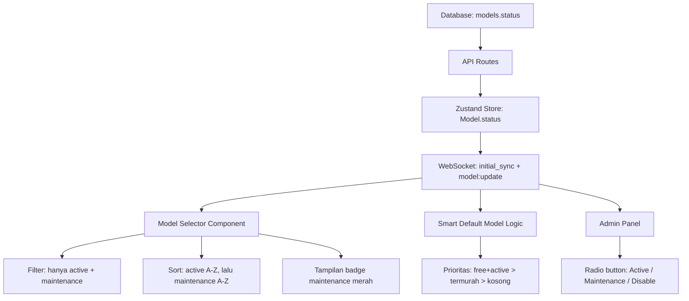
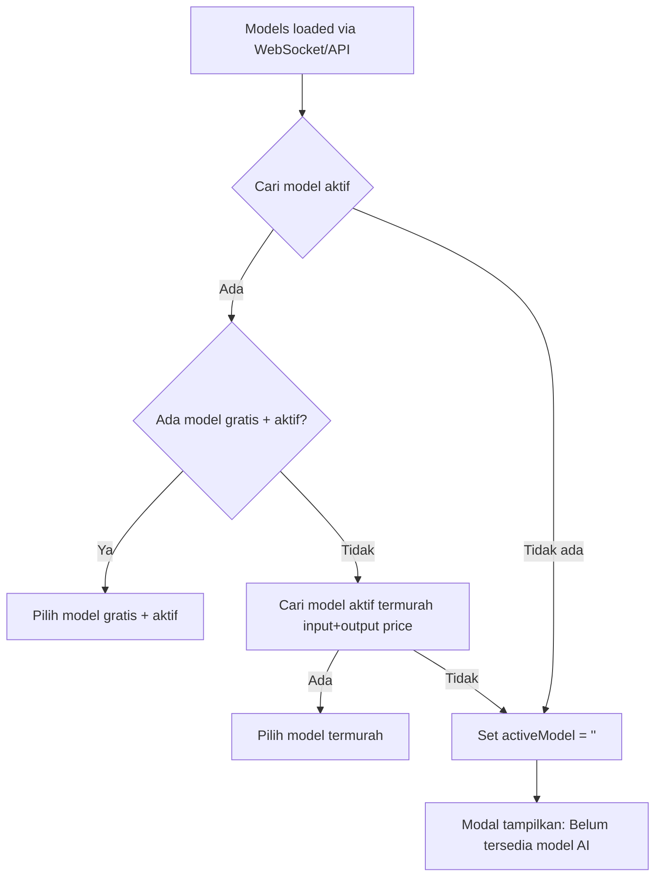
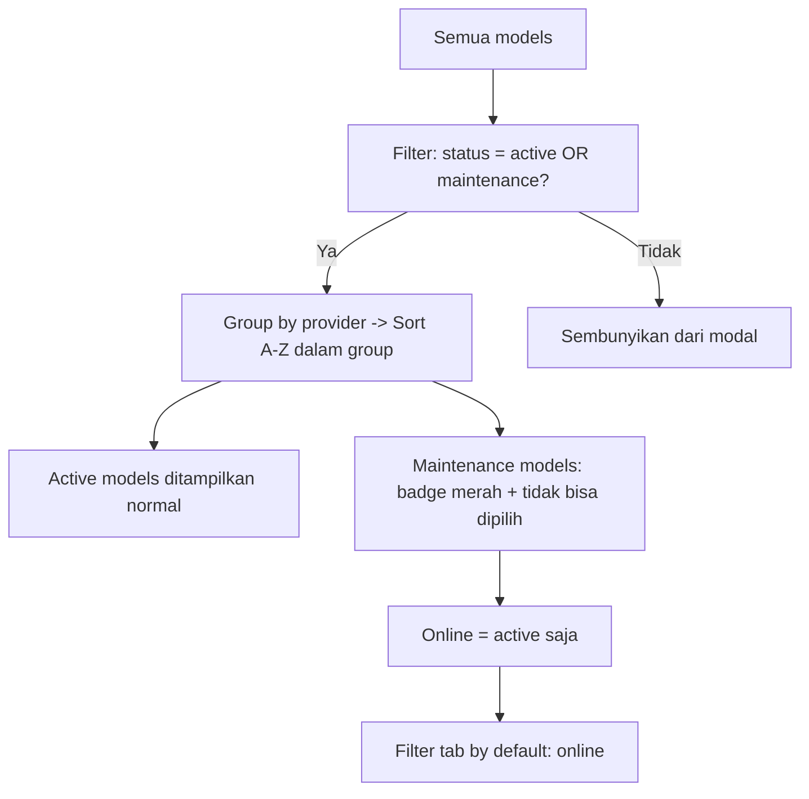

# Rencana Overhaul Status Model — Active/Maintenance/Disable

## 1. Latar Belakang

Saat ini sistem hanya memiliki flag `active: boolean` (1/0) yang tidak cukup fleksibel. Masalah yang dihadapi:
- Model dengan `active=0` (offline) masih muncul di modal pilihan AI dengan tampilan gelap
- Model `gpt-4o` di-hardcode sebagai default meskipun statusnya offline
- Tidak ada status "maintenance" untuk model yang sedang diperbaiki
- Filter modal pilihan AI menampilkan semua model termasuk yang nonaktif
- Admin panel hanya punya toggle on/off sederhana

**Solusi:** Ubah `active: boolean` menjadi `status: 'active' | 'maintenance' | 'disabled'` dengan perubahan menyeluruh di semua layer.

---

## 2. Arsitektur Perubahan

### 2.1 Layer Diagram



### 2.2 Alur Default Model Selection



### 2.3 Filter & Sort Modal Pilihan



---

## 3. Perubahan Spesifik per File

### 3.1 Database Schema — [`src/lib/schema.sql`](src/lib/schema.sql)

**Perubahan:**
- Kolom `active TINYINT(1) DEFAULT 0` → `status VARCHAR(20) DEFAULT 'disabled'`
- Hapus `INDEX idx_active (active)` → tambah `INDEX idx_status (status)`

**Migrasi data (manual/script):**
```sql
ALTER TABLE models CHANGE active status VARCHAR(20) DEFAULT 'disabled';
UPDATE models SET status = 'active' WHERE active = 1;
UPDATE models SET status = 'disabled' WHERE active = 0;
CREATE INDEX idx_status ON models(status);
DROP INDEX idx_active ON models;
```

### 3.2 Tipe Model — [`src/lib/store.ts`](src/lib/store.ts)

**Perubahan pada interface `Model`:**
```ts
// SEBELUM:
export interface Model {
  // ...
  active: boolean;
  // ...
}

// SESUDAH:
export type ModelStatus = 'active' | 'maintenance' | 'disabled';

export interface Model {
  id: string;
  name: string;
  provider: string;
  description: string;
  status: ModelStatus;
  maxContext: number;
  thinking: boolean;
  inputPrice: number;
  outputPrice: number;
  free: boolean;
}
```

**Perubahan default `activeModel` di state:**
```ts
// SEBELUM:
activeModel: 'gpt-4o',

// SESUDAH:
activeModel: '',
```

### 3.3 API Models — [`src/app/api/models/route.ts`](src/app/api/models/route.ts)

**Perubahan pada `GET`:**
- Query: `WHERE active = 1` → `WHERE status IN ('active', 'maintenance')`
- Mapping: `active: Boolean(m.active)` → `status: m.status || 'disabled'`
- Order: `ORDER BY active DESC` → `ORDER BY FIELD(status, 'active', 'maintenance', 'disabled'), provider, name`

**Perubahan pada `PUT`:**
- Parameter `active` → `status` dengan validasi nilai ('active' | 'maintenance' | 'disabled')
- Update query: `active = ?` → `status = ?`
- Broadcast: kirim `status` bukan `active`

### 3.4 WebSocket Context — [`src/context/websocket-context.tsx`](src/context/websocket-context.tsx)

**Perubahan:**
- Setelah `setModels(data.models)`, tambahkan **smart default model selection logic**:

```ts
case 'response:initial_sync':
  if (data.models) {
    store.getState().setModels(data.models);
    
    // Smart default model selection
    const state = store.getState();
    const currentActive = state.activeModel;
    const modelList = data.models as Model[];
    
    // 1. Check if current model is still active
    const stillActive = modelList.find(
      (m) => m.id === currentActive && m.status === 'active'
    );
    if (stillActive) break; // No change needed
    
    // 2. Find free + active model
    const freeActive = modelList.find((m) => m.free && m.status === 'active');
    if (freeActive) {
      store.getState().setActiveModel(freeActive.id);
      break;
    }
    
    // 3. Find cheapest active model (inputPrice + outputPrice)
    const cheapestActive = modelList
      .filter((m) => m.status === 'active')
      .sort((a, b) => (a.inputPrice + a.outputPrice) - (b.inputPrice + b.outputPrice))[0];
    if (cheapestActive) {
      store.getState().setActiveModel(cheapestActive.id);
      break;
    }
    
    // 4. No active models at all
    store.getState().setActiveModel('');
  }
  break;
```

**Update pada `model:update` handler** — sesuaikan dengan properti `status`:
```ts
case 'model:update':
  store.getState().updateModel(data.model.id, data.model);
  // Auto-fallback jika model yang di-update adalah activeModel dan statusnya berubah
  const updatedModel = store.getState().models.find(m => m.id === data.model.id);
  if (updatedModel && data.model.id === store.getState().activeModel && updatedModel.status !== 'active') {
    triggerSmartDefault(store.getState().models);
  }
  break;
```

### 3.5 Model Selector — [`src/components/chat/model-selector.tsx`](src/components/chat/model-selector.tsx)

#### 3.5.1 Filter Perubahan

```ts
// SEBELUM:
const [filter, setFilter] = useState<FilterTab>('all');

// SESUDAH:
const [filter, setFilter] = useState<FilterTab>('online');

// SEBELUM:
const filteredModels = useMemo(() => {
  let result = [...models];
  if (filter === 'online') result = result.filter((m) => m.active);
  if (filter === 'free') result = result.filter((m) => m.free);
  // ...
}, [models, filter, search, selectedProviders]);

// SESUDAH:
const filteredModels = useMemo(() => {
  // BASE: hanya model dengan status active atau maintenance
  let result = models.filter(
    (m) => m.status === 'active' || m.status === 'maintenance'
  );
  
  // Filter tab
  if (filter === 'online') {
    result = result.filter((m) => m.status === 'active');
  } else if (filter === 'free') {
    result = result.filter((m) => m.free);
  }
  
  // ... sisanya tetap
}, [models, filter, search, selectedProviders]);
```

#### 3.5.2 Sort Default: A-Z dengan Active di Utama

```ts
const sortedModels = useMemo(() => {
  let result = [...filteredModels];
  
  // DEFAULT SORT: active dulu (A-Z), lalu maintenance (A-Z)
  if (sort === 'default') {
    result.sort((a, b) => {
      // Urutkan status: active dulu, baru maintenance
      if (a.status === 'active' && b.status !== 'active') return -1;
      if (a.status !== 'active' && b.status === 'active') return 1;
      // Dalam status yang sama, sort A-Z by name
      return a.name.localeCompare(b.name);
    });
  } else {
    // Sort options lain tetap sama
    switch (sort) {
      case 'expensive': // ...
      case 'cheap': // ...
      case 'fastest': // ...
      case 'slowest': // ...
    }
  }
  return result;
}, [filteredModels, sort]);
```

#### 3.5.3 Maintenance Badge

```ts
// Ganti badge "Offline" dengan "Maintenance" warna merah:
{model.status === 'maintenance' && (
  <Badge 
    variant="secondary" 
    className="text-[9px] px-1 py-0 shrink-0 leading-tight bg-red-500/15 text-red-600/90 dark:text-red-400/80 font-semibold border border-red-500/20"
  >
    <Lock className="h-2.5 w-2.5 mr-0.5" />
    Maintenance
  </Badge>
)}
```

#### 3.5.4 Visual Maintenance Card

```ts
// Render maintenance model dengan opacity lebih tinggi dari sebelumnya:
const renderModelCard = (model: Model) => {
  const isSelected = activeModel === model.id;
  const modelStatus = model.status; // 'active' | 'maintenance'
  
  return (
    <button
      key={model.id}
      onClick={() => handleSelect(model.id)}
      className={`... ${
        modelStatus === 'maintenance'
          ? 'opacity-60 cursor-not-allowed border-red-500/20 bg-red-500/[0.02]'
          : isSelected
          ? 'border-primary/20 bg-primary/[0.03] cursor-pointer'
          : 'border-border/15 bg-card/50 hover:border-border/30 hover:bg-accent/20 cursor-pointer'
      }`}
    >
      {/* ... */}
    </button>
  );
};
```

#### 3.5.5 Online Count & Free Count

```ts
// SEBELUM:
const onlineCount = models.filter((m) => m.active).length;

// SESUDAH:
const onlineCount = models.filter((m) => m.status === 'active').length;
```

#### 3.5.6 Empty State — Tidak Ada Model Aktif

Di dalam `filteredModels`, jika setelah filter tidak ada hasil:

```tsx
{filteredModels.length === 0 ? (
  <div className="flex flex-col items-center justify-center py-20 text-center">
    <Cpu className="h-12 w-12 text-muted-foreground/15 mb-3" />
    <p className="text-sm font-semibold text-muted-foreground">
      Belum Ada Model AI Tersedia
    </p>
    <p className="text-xs text-muted-foreground/50 mt-1 max-w-[260px]">
      Saat ini belum ada model AI yang aktif. Silakan hubungi admin untuk mengaktifkan model.
    </p>
  </div>
) : // ... existing model list
```

#### 3.5.7 HandleSelect — Hanya Aktif

```ts
const handleSelect = useCallback(
  (modelId: string) => {
    const model = models.find((m) => m.id === modelId);
    if (model?.status === 'active') {
      setActiveModel(modelId);
      setOpen(false);
    }
  },
  [models, setActiveModel]
);
```

#### 3.5.8 Filter Tabs — Default Online

```tsx
// Hanya 2 tab: Online (default) dan Free
{([
  { id: 'online' as FilterTab, label: 'Online', count: onlineCount },
  { id: 'free' as FilterTab, label: 'Free', count: freeCount },
]).map((tab) => { /* ... */ })}
```

### 3.6 Admin Panel — [`src/app/admin/page.tsx`](src/app/admin/page.tsx)

#### 3.6.1 Status Radio Button (Edit Dialog)

**Ganti checkbox `active` dengan radio button `status`:**

```tsx
// State form:
const [editForm, setEditForm] = useState({
  // ...
  status: 'active' as ModelStatus,
});

// UI Radio Button:
<div className="space-y-2">
  <Label className="text-xs font-semibold">Status Model</Label>
  <div className="flex gap-4">
    {[
      { value: 'active' as ModelStatus, label: 'Active', desc: 'Model dapat digunakan' },
      { value: 'maintenance' as ModelStatus, label: 'Maintenance', desc: 'Model dalam perbaikan' },
      { value: 'disabled' as ModelStatus, label: 'Disable', desc: 'Model dinonaktifkan' },
    ].map((opt) => (
      <div key={opt.value} className="flex items-start gap-2">
        <RadioGroup
          value={editForm.status}
          onValueChange={(val) => setEditForm((p) => ({ ...p, status: val as ModelStatus }))}
        >
          <div className="flex items-center gap-2">
            <RadioGroupItem value={opt.value} id={`status-${opt.value}`} />
            <Label htmlFor={`status-${opt.value}`} className="text-xs font-medium cursor-pointer">
              {opt.label}
            </Label>
          </div>
        </RadioGroup>
      </div>
    ))}
  </div>
</div>
```

**Catatan:** Perlu import `RadioGroup` dan `RadioGroupItem` dari `@/components/ui/radio-group`.

#### 3.6.2 Save Edit Model — Status Field

```ts
const handleSaveEditModel = useCallback(() => {
  // ...
  updateModel(editingModel.id, {
    name: editForm.name,
    provider: editForm.provider,
    description: editForm.description,
    inputPrice: ip,
    outputPrice: op,
    maxContext: isNaN(mc) ? 128000 : mc,
    thinking: editForm.thinking,
    free: editForm.free,
    status: editForm.status,  // GANTI active -> status
  });
  // ...
}, [editingModel, editForm, updateModel, toast]);
```

#### 3.6.3 Toggle Action — Ubah jadi Set Status

```ts
// Fungsi baru untuk set status langsung dari table row action:
const handleSetModelStatus = useCallback((modelId: string, newStatus: ModelStatus) => {
  updateModel(modelId, { status: newStatus });
  // API call ke /api/models dengan status
  fetch(`/api/models`, {
    method: 'PUT',
    headers: { 'Content-Type': 'application/json' },
    body: JSON.stringify({ id: modelId, status: newStatus }),
  }).catch(console.error);
  toast({
    title: 'Berhasil',
    description: `Status model diubah ke ${newStatus}`,
  });
}, [updateModel, toast]);
```

#### 3.6.4 Model Filter — Status-Aware

```ts
// Ganti filter 'active' | 'inactive' | 'free' | 'paid' menjadi:
type ModelFilter = 'all' | 'active' | 'maintenance' | 'disabled' | 'free' | 'paid';

// Di filteredModels:
switch (activeFilter) {
  case 'active':
    if (model.status !== 'active') return false;
    break;
  case 'maintenance':
    if (model.status !== 'maintenance') return false;
    break;
  case 'disabled':
    if (model.status !== 'disabled') return false;
    break;
  case 'free':
    if (!model.free) return false;
    break;
  case 'paid':
    if (model.free) return false;
    break;
}
```

#### 3.6.5 Status Badge di Table Row

```tsx
<TableCell className="text-center">
  {model.status === 'active' && (
    <Badge className="text-[10px] bg-emerald-500/10 text-emerald-600 dark:text-emerald-400 border-emerald-500/20">
      Active
    </Badge>
  )}
  {model.status === 'maintenance' && (
    <Badge className="text-[10px] bg-amber-500/10 text-amber-600 dark:text-amber-400 border-amber-500/20">
      Maintenance
    </Badge>
  )}
  {model.status === 'disabled' && (
    <Badge variant="outline" className="text-[10px] text-muted-foreground">
      Disabled
    </Badge>
  )}
</TableCell>
```

#### 3.6.6 Hapus Toggle/Tombol ToggleLeft/ToggleRight

Hapus bagian yang menggunakan `onToggleActive` dari ModelsSection. Ganti dengan tombol dropdown atau langsung render status badge saja (edit dilakukan via Edit dialog).

### 3.7 API Chat — [`src/app/api/chat/route.ts`](src/app/api/chat/route.ts)

**Perubahan minor:**
- Validasi model status sebelum memproses chat — tambahkan pengecekan `status` dari DB
- Jika model yang diminta bukan `active`, return error 503

```ts
const dbModel = await querySingle<any>(
  'SELECT id, name, provider, input_price, output_price, free, status FROM models WHERE id = ?', 
  [modelId]
);

if (dbModel && dbModel.status !== 'active') {
  return new Response(JSON.stringify({ 
    error: `Model "${modelId}" sedang tidak tersedia (${dbModel.status})` 
  }), {
    status: 503,
    headers: { 'Content-Type': 'application/json' },
  });
}
```

### 3.8 Sync Models — [`src/app/api/admin/sync-models/route.ts`](src/app/api/admin/sync-models/route.ts)

**Perubahan:**
- INSERT new model: `active=0` → `status='disabled'`
- Tidak ada perubahan lain karena status model baru selalu disabled

### 3.9 WebSocket Events — [`src/lib/ws-events.ts`](src/lib/ws-events.ts)

**Perubahan tipe event:**
```ts
export type WSEvent =
  | { type: 'model:update'; model: { id: string; status: ModelStatus; inputPrice: number; outputPrice: number; free: boolean } }
  // ... lainnya tetap
```

---

## 4. Urutan Implementasi

| # | File | Perubahan | Prioritas |
|---|------|-----------|-----------|
| 1 | [`src/lib/store.ts`](src/lib/store.ts) | Ubah `Model.active: boolean` → `Model.status: ModelStatus` + default `activeModel: ''` | **Critical** |
| 2 | [`src/lib/schema.sql`](src/lib/schema.sql) | Ubah kolom `active` → `status` | **Critical** |
| 3 | [`src/app/api/models/route.ts`](src/app/api/models/route.ts) | Sesuaikan query, mapping, update untuk `status` | **Critical** |
| 4 | [`src/app/api/admin/sync-models/route.ts`](src/app/api/admin/sync-models/route.ts) | Insert model baru: `status = 'disabled'` | **Critical** |
| 5 | [`src/context/websocket-context.tsx`](src/context/websocket-context.tsx) | Validasi activeModel + smart default logic | **High** |
| 6 | [`src/components/chat/model-selector.tsx`](src/components/chat/model-selector.tsx) | Filter, sort, maintenance badge, empty state | **High** |
| 7 | [`src/app/admin/page.tsx`](src/app/admin/page.tsx) | Radio button status + filter status-aware | **High** |
| 8 | [`src/lib/ws-events.ts`](src/lib/ws-events.ts) | Tipe event `active` → `status` | **High** |
| 9 | [`src/app/api/chat/route.ts`](src/app/api/chat/route.ts) | Validasi model status sebelum chat | **Medium** |

---

## 5. Kompatibilitas Mundur

Karena perubahan kolom database dari `active` → `status`, perlu strategi migrasi:

### Opsi A: Migration Script (Direkomendasikan)
1. Buat migration SQL manual (lihat section 3.1)
2. Jalankan di production sebelum deploy kode baru

### Opsi B: Dual Write (Jika downtime tidak acceptable)
- Tambah kolom `status` baru sambil pertahankan `active`
- Tulis ke kedua kolom selama 1 siklus release
- Hapus `active` di release berikutnya

**Rekomendasi:** Opsi A karena proyek masih dalam tahap pengembangan, downtime singkat acceptable.

---

## 6. Edge Cases & Penanganan

| Skenario | Penanganan |
|----------|-----------|
| Tidak ada model active sama sekali | `activeModel = ''` → tombol trigger tampilkan "Pilih Model" → modal tampilkan empty state "Belum Ada Model AI Tersedia" |
| Model yang sedang dipilih diubah statusnya jadi maintenance/disabled | Auto-fallback ke model aktif lain saat WebSocket `model:update` diterima |
| User mencoba chat dengan model yang tiba-tiba disabled | API chat return error 503 → toast error |
| Semua model dalam maintenance | Empty state muncul, tidak bisa chat |
| Admin pull models baru | Model baru otomatis `status='disabled'`, tidak mengganggu model yang sudah aktif |
| Filter tab default 'online' | Hanya menampilkan model dengan `status='active'` |
| Migrasi data dari `active=1` ke `status='active'` | SQL UPDATE script, dijalankan sekali |

---

## 7. Testing Strategy

### 7.1 Unit Test (Manual)

1. **Default Model Selection:**
   - Load models dengan 1 model free+active → harus terpilih
   - Load models dengan 0 free, tapi ada active termurah → harus terpilih
   - Load models dengan 0 active → `activeModel` jadi `''`
   - Model yang sedang dipilih diubah ke maintenance → auto-fallback

2. **Model Selector UI:**
   - Modal terbuka dengan default tab 'online' → hanya model active
   - Maintenance model muncul dengan badge merah + opacity 60%
   - Disabled model tidak muncul sama sekali
   - Empty state saat filter tidak menghasilkan apa-apa
   - Sort A-Z dalam group provider

3. **Admin Panel:**
   - Radio button active/maintenance/disable berfungsi
   - Status tersimpan ke DB dan ter-reflect di UI
   - Filter 'maintenance' dan 'disabled' berfungsi

4. **API Chat:**
   - Request dengan model 'maintenance' → 503 error
   - Request dengan model 'disabled' → 503 error
   - Request dengan model 'active' → sukses

### 7.2 Integration Test

- Pull models dari OmniRouter → semua model baru `status='disabled'`
- Admin set model ke 'active' → muncul di modal user
- Admin set model ke 'maintenance' → badge merah di modal, tidak bisa dipilih
- Admin set model ke 'disabled' → hilang dari modal user

---

## 8. Ringkasan File yang Berubah

| File | Tipe Perubahan |
|------|---------------|
| `src/lib/schema.sql` | Schema: kolom + index |
| `src/lib/store.ts` | Interface + default |
| `src/app/api/models/route.ts` | Query + mapping |
| `src/app/api/admin/sync-models/route.ts` | Default insert |
| `src/app/api/chat/route.ts` | Validasi status |
| `src/context/websocket-context.tsx` | Smart default + validasi |
| `src/components/chat/model-selector.tsx` | Filter, sort, UI, badge, empty state |
| `src/app/admin/page.tsx` | Radio button, filter status-aware |
| `src/lib/ws-events.ts` | Tipe event |
| `server/websocket.js` *(perlu dicek)* | Event broadcast |
