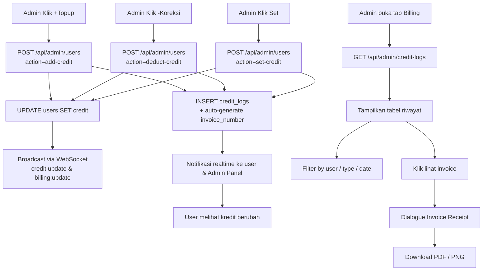
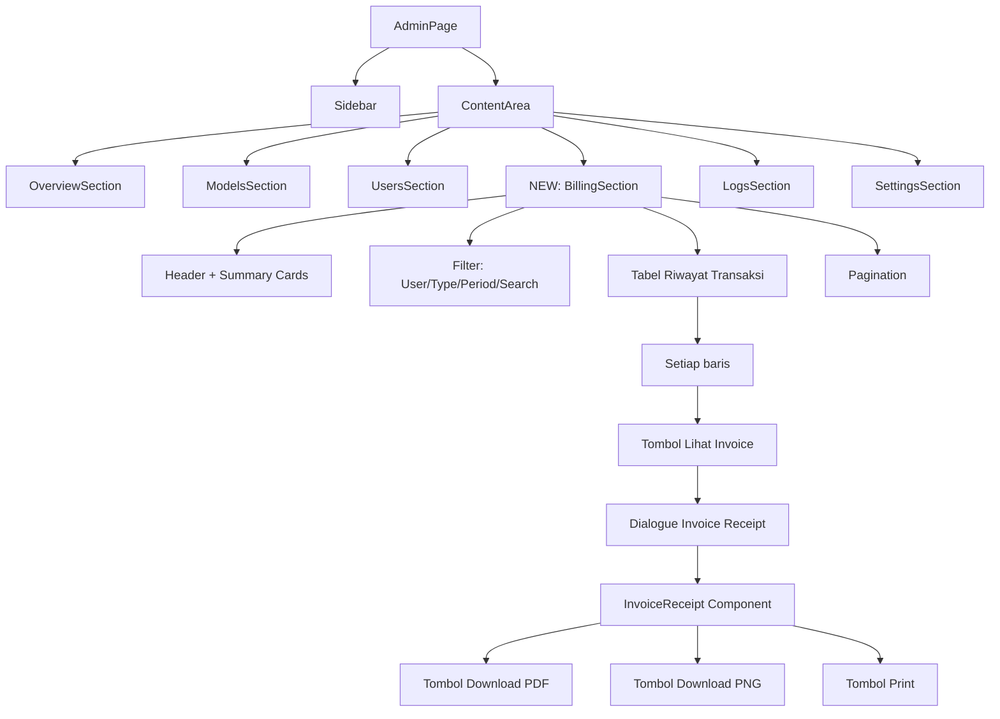
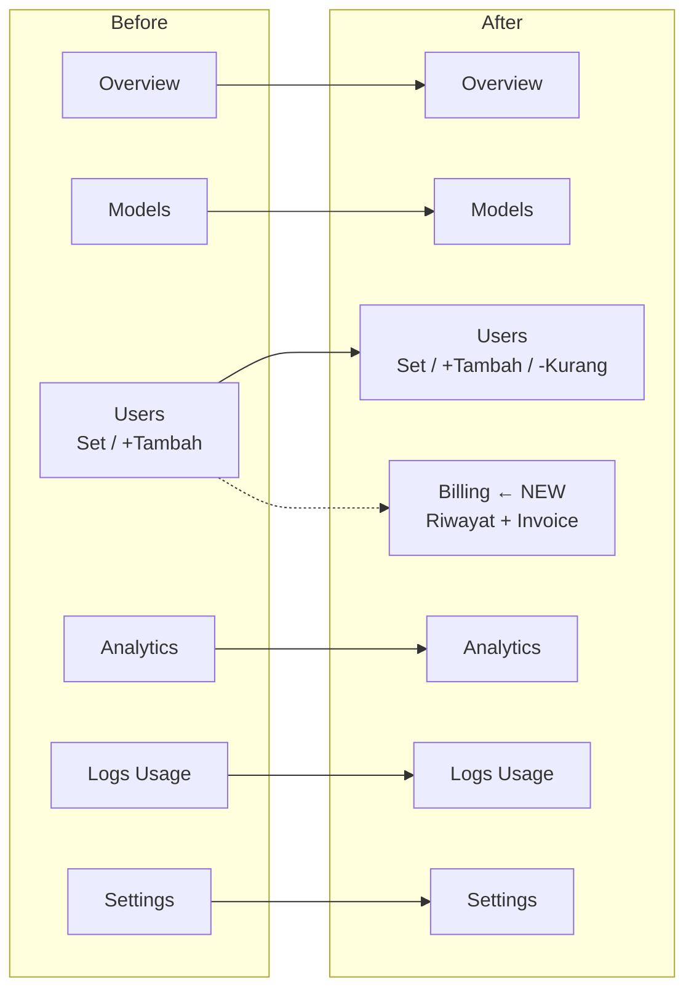

# Rencana Implementasi: Sistem Billing & Kredit Lengkap di Admin Panel

## 1. Ringkasan

Membangun sistem billing/kredit yang **informatif, transparan, dan auditable** di Control Panel Admin. Setiap perubahan kredit (top-up/koreksi) akan tercatat, memiliki invoice/receipt, dapat diexport PDF/PNG, dan admin dapat melihat riwayat transaksi dengan filter lengkap.

---

## 2. Arsitektur Data Flow



---

## 3. Perubahan Database

### 3.1. Migration SQL — `src/lib/migration-billing.sql`

```sql
-- Migration: Billing & Invoice System
-- Menambahkan kolom invoice support ke credit_logs

ALTER TABLE credit_logs
  ADD COLUMN IF NOT EXISTS invoice_number VARCHAR(32) DEFAULT NULL,
  ADD COLUMN IF NOT EXISTS operator_id VARCHAR(64) DEFAULT NULL COMMENT 'Admin yang melakukan perubahan',
  ADD COLUMN IF NOT EXISTS operator_name VARCHAR(255) DEFAULT NULL,
  ADD COLUMN IF NOT EXISTS note TEXT DEFAULT NULL COMMENT 'Catatan admin untuk invoice';

-- Index untuk pencarian cepat
ALTER TABLE credit_logs
  ADD INDEX IF NOT EXISTS idx_invoice (invoice_number),
  ADD INDEX IF NOT EXISTS idx_type (type),
  ADD INDEX IF NOT EXISTS idx_operator (operator_id);
```

### 3.2. Update `credit_logs` ENUM

Type `admin_adjust` dipecah menjadi:
- `topup` — penambahan kredit oleh user atau admin
- `deduct` — pengurangan kredit oleh admin (koreksi)
- `admin_set` — set kredit absolut oleh admin
- `usage` — pemakaian kredit oleh sistem (sudah ada)

### 3.3. Generate Invoice Number

Format: `INV-YYYYMMDD-XXXXX`
- YYYYMMDD = tanggal transaksi
- XXXXX = counter 5 digit, reset per hari

Logika: `SELECT COUNT(*) FROM credit_logs WHERE DATE(created_at) = CURDATE()` → counter + 1

---

## 4. API Endpoints

### 4.1. Fix & Update `POST /api/admin/users` (EXISTING)

**File:** `src/app/api/admin/users/route.ts`

**Ubah action handler:**

| Action | Deskripsi | Logika |
|--------|-----------|--------|
| `add-credit` (+) | Tambah kredit | `credit = credit + amount` → INSERT `credit_logs` type=`topup` |
| `deduct-credit` (-) | Kurangi kredit | `credit = credit - amount` → INSERT `credit_logs` type=`deduct` |
| `set-credit` (=) | Set mutlak | `credit = amount` → INSERT `credit_logs` type=`admin_set` |
| (HAPUS) | Hapus `PUT` handler | Pindahkan semua logika ke `POST` agar konsisten |

**Request body:**
```json
{
  "action": "add-credit" | "deduct-credit" | "set-credit",
  "userId": "user-uuid",
  "amount": 10,
  "note": "Topup bonus referral"
}
```

**Response:**
```json
{
  "success": true,
  "data": {
    "credit": 35,
    "previousCredit": 25,
    "amount": 10,
    "type": "topup",
    "invoiceNumber": "INV-20260517-00001",
    "balance": 35,
    "createdAt": "2026-05-17T..."
  }
}
```

**Semua action WAJIB:**
1. Validasi user exists
2. Validasi amount valid (>0 untuk add, >0 untuk deduct, >=0 untuk set)
3. Untuk `deduct`: validasi `credit >= amount` (saldo cukup)
4. UPDATE `users SET credit = ?`
5. INSERT ke `credit_logs` dengan semua field (invoice_number, operator_id, operator_name, note)
6. Broadcast WebSocket:
   - `credit:update` (untuk user yang bersangkutan)
   - `billing:update` (untuk semua admin agar tabel billing terupdate otomatis)
7. Return response lengkap

### 4.2. NEW: `GET /api/admin/credit-logs`

**File:** `src/app/api/admin/credit-logs/route.ts`

**Query Parameters:**
| Param | Type | Default | Description |
|-------|------|---------|-------------|
| `page` | number | 1 | Halaman |
| `limit` | number | 20 | Item per halaman (max 100) |
| `userId` | string | - | Filter by user ID |
| `type` | enum | - | Filter: `topup`, `deduct`, `admin_set`, `usage` |
| `period` | enum | `30d` | `today`, `24h`, `7d`, `30d`, `1y`, `all` |
| `search` | string | - | Cari nama/email user |
| `sortBy` | enum | `created_at` | `created_at`, `amount`, `balance` |
| `sortOrder` | enum | `DESC` | `ASC`, `DESC` |

**Response:**
```json
{
  "success": true,
  "data": {
    "logs": [
      {
        "id": "uuid",
        "userId": "user-uuid",
        "userName": "Budi",
        "userEmail": "budi@email.com",
        "type": "topup",
        "amount": 10,
        "balance": 35,
        "previousBalance": 25,
        "description": "Topup dari admin",
        "invoiceNumber": "INV-20260517-00001",
        "operatorName": "Admin",
        "note": "Bonus referral",
        "createdAt": "2026-05-17T10:30:00.000Z"
      }
    ],
    "total": 150,
    "page": 1,
    "limit": 20,
    "totalPages": 8,
    "summary": {
      "totalTopup": 500,
      "totalDeduct": 50,
      "totalUsage": 300,
      "netCredit": 150
    }
  }
}
```

### 4.3. NEW: `GET /api/admin/credit-logs/[id]/invoice`

**File:** `src/app/api/admin/credit-logs/[id]/route.ts`

Mengembalikan data invoice lengkap untuk satu transaksi, termasuk data admin yang melakukan.

---

## 5. TypeScript Types

### 5.1. Update `CreditLogEntry` di `src/lib/store.ts`

```typescript
export type CreditLogType = 'topup' | 'deduct' | 'admin_set' | 'usage';

export interface CreditLogEntry {
  id: string;
  type: CreditLogType;
  amount: number;       // positive untuk topup/admin_add, negative untuk usage/deduct
  previousBalance: number; // balance BEFORE transaksi
  balance: number;      // balance AFTER transaksi
  description: string;
  invoiceNumber: string | null;
  operatorName: string | null;  // nama admin yang melakukan
  note: string | null;          // catatan admin
  createdAt: string;
}
```

### 5.2. Type Invoice

```typescript
export interface Invoice {
  invoiceNumber: string;
  type: CreditLogType;
  userName: string;
  userEmail: string;
  operatorName: string;
  amount: number;
  previousBalance: number;
  newBalance: number;
  description: string;
  note: string | null;
  createdAt: string;       // ISO string
  createdAtFormatted: string; // untuk display
}
```

---

## 6. Store Actions — Update `src/lib/store.ts`

Tambahkan action baru:

```typescript
// Di interface ChatState
setAdminCreditLogs: (logs: CreditLogEntry[]) => void;
addAdminCreditLog: (log: CreditLogEntry) => void;

// Implementasi
setAdminCreditLogs: (logs) => set({ adminCreditLogs: logs }),
addAdminCreditLog: (log) =>
  set((state) => ({ adminCreditLogs: [log, ...state.adminCreditLogs] })),
```

Tambahkan state baru:
```typescript
adminCreditLogs: CreditLogEntry[],
```

---

## 7. Component Tree — Admin Panel UI



### 7.1. Sidebar — Tambah item baru

Di `SIDEBAR_ITEMS` di `src/app/admin/page.tsx`, tambah:

```typescript
{ id: 'billing', label: 'Billing', icon: Wallet }
```

Letakkan setelah `users` (urutan ke-3):

```typescript
const SIDEBAR_ITEMS: { id: AdminSection; label: string; icon: typeof Cpu }[] = [
  { id: 'overview', label: 'Overview', icon: LayoutDashboard },
  { id: 'models', label: 'Models', icon: Cpu },
  { id: 'users', label: 'Users', icon: Users },
  { id: 'billing', label: 'Billing', icon: Wallet },       // NEW
  { id: 'analytics', label: 'Analytics', icon: BarChart3 },
  { id: 'logs', label: 'Logs', icon: FileText },
  { id: 'settings', label: 'Settings', icon: Settings },
];
```

Update type `AdminSection`:
```typescript
type AdminSection = 'overview' | 'models' | 'users' | 'billing' | 'analytics' | 'logs' | 'settings';
```

### 7.2. Render Conditional

```tsx
// Di dalam content area
{activeSection === 'billing' && <BillingSection />}
```

---

## 8. BillingSection Component — DETAIL

### 8.1. Layout

```
┌─────────────────────────────────────────────────────────────┐
│  Billing / Riwayat Transaksi Kredit                         │
│  150 total transaksi                                         │
│                                       [➕ Kelola Kredit] ← NEW│
├─────────────────────────────────────────────────────────────┤
│  ┌──────────┐ ┌──────────┐ ┌──────────┐ ┌──────────┐       │
│  │ Total    │ │ Total    │ │ Total    │ │ Kredit   │       │
│  │ Topup    │ │ Deduct   │ │ Usage    │ │ Bersih   │       │
│  │ $500     │ │ $50      │ │ $300     │ │ $150     │       │
│  └──────────┘ └──────────┘ └──────────┘ └──────────┘       │
├─────────────────────────────────────────────────────────────┤
│  [🔍 Cari user...] [📅 Period: 30 Hari ▼] [Type: All ▼]   │
├─────────────────────────────────────────────────────────────┤
│  ┌──────────────────────────────────────────────────────┐   │
│  │ # │ Invoice │ User │ Type │ Amount │ Balance │ Admin │   │
│  ├──────────────────────────────────────────────────────┤   │
│  │ 1 │ INV-... │ Budi │ Topup │ +$10   │ $35    │ Admin │   │
│  │   │         │      │       │        │        │ [📄]  │   │
│  │ 2 │ INV-... │ Siti │ Usage │ -$2    │ $25    │ -     │   │
│  │   │         │      │       │        │        │ [📄]  │   │
│  └──────────────────────────────────────────────────────┘   │
├─────────────────────────────────────────────────────────────┤
│  Halaman 1 dari 8 (150 logs)     [Prev] [1] [2] [3] [Next] │
└─────────────────────────────────────────────────────────────┘
```

### 8.2. Summary Cards

4 kartu ringkasan di bagian atas:
| Kartu | Warna | Icon | Data |
|-------|-------|------|------|
| Total Topup | Hijau | `TrendingUp` | Sum amount WHERE type='topup' |
| Total Deduct | Merah | `TrendingDown` | Sum amount WHERE type='deduct' |
| Total Usage | Orange | `Activity` | Sum amount WHERE type='usage' |
| Kredit Bersih | Biru | `Wallet` | Topup - Deduct - Usage |

Menggunakan data dari response `summary` API.

### 8.3. Filter Bar

3 filter horizontal:
1. **Search Input** — cari nama/email user (dengan debounce 400ms)
2. **Period Select** — Today / 24h / 7d / 30d / 1y / All
3. **Type Select** — All / Topup / Deduct / Admin Set / Usage

Setiap perubahan filter → reset ke page 1 → fetch ulang.

### 8.4. Tabel Riwayat

Columns:
| # | Invoice | User | Type | Amount | Before | After | Tgl | Admin | Aksi |
|---|---------|------|------|--------|--------|-------|-----|-------|------|

- **Invoice**: `INV-20260517-00001` — klikable untuk lihat detail
- **User**: Avatar (inisial) + Nama + Email
- **Type**: Badge dengan warna:
  - Topup → hijau `bg-emerald-500/10 text-emerald-600` icon `↑`
  - Deduct → merah `bg-red-500/10 text-red-600` icon `↓`
  - Admin Set → biru `bg-sky-500/10 text-sky-600` icon `=`
  - Usage → orange `bg-amber-500/10 text-amber-600` icon `↗`
- **Amount**: Format `+$10.00` (hijau) / `-$2.00` (merah)
- **Before**: Currency format
- **After**: Currency format (bold)
- **Tgl**: Format `17 Mei 2026, 10:30`
- **Admin**: Nama admin yang melakukan (atau `-` jika sistem)
- **Aksi**: Tombol icon `📄` untuk lihat invoice

### 8.5. Pagination

Sama seperti di UsersSection: Prev/Next + halaman + total items.

---

## 9. Credit Management Modal — NEW

### 9.1. Fungsi & UI
Modal terpusat untuk melakukan perubahan kredit user.

**Elemen Modal:**
- **User Selector**: Dropdown searchable (Combobox) untuk memilih user dari database.
- **Action Toggle**: Tab atau Radio Group untuk memilih `+ Topup`, `- Koreksi`, atau `= Set Saldo`.
- **Amount Input**: Input angka dengan format currency.
- **Note Input**: Textarea untuk catatan admin (akan muncul di invoice).
- **Submit Button**: Tombol "Simpan Perubahan" yang memicu API dan menampilkan Invoice.

---

## 10. InvoiceReceipt Component — DETAIL

### 10.1. Trigger

1. **Admin Side**: Tombol "Lihat Invoice" di tabel Billing $\rightarrow$ buka dialog.
2. **Admin Side**: Otomatis muncul setelah admin melakukan topup/deduct/set via Modal Manajemen Kredit.
3. **User Side**: Tombol "Unduh Riwayat" di `AccountDialog` $\rightarrow$ generate PDF/PNG dari seluruh riwayat kredit user.

### 9.2. Dialog Invoice

```tsx
<Dialog open={invoiceDialogOpen} onOpenChange={setInvoiceDialogOpen}>
  <DialogContent className="sm:max-w-[520px]">
    <DialogHeader>
      <DialogTitle>Invoice #{invoiceNumber}</DialogTitle>
    </DialogHeader>
    <InvoiceReceipt invoice={invoiceData} />
    <div className="flex justify-end gap-2 pt-4 border-t">
      <Button onClick={handleDownloadPNG}>Download PNG</Button>
      <Button onClick={handleDownloadPDF}>Download PDF</Button>
      <Button variant="outline" onClick={handlePrint}>Print</Button>
    </div>
  </DialogContent>
</Dialog>
```

### 9.3. InvoiceReceipt Component Visual

```
┌──────────────────────────────────────┐
│         INVOICE / RECEIPT            │
│                                      │
│   MI-Labs Chat                       │
│   AI-Powered Chat Platform           │
│                                      │
│   ─────────────────────────────      │
│                                      │
│   No. Invoice: INV-20260517-00001   │
│   Tanggal:    17 Mei 2026 10:30 WIB │
│   Tipe:       Top Up / Koreksi       │
│                                      │
│   ─────────────────────────────      │
│                                      │
│   Pengguna:   Budi Santoso           │
│   Email:      budi@email.com         │
│                                      │
│   ─────────────────────────────      │
│                                      │
│   Keterangan: Topup bonus referral   │
│   Catatan:    -                      │
│                                      │
│   ─────────────────────────────      │
│                                      │
│   Saldo Sebelum:  $25.00000000      │
│   Jumlah:        +$10.00000000      │
│   ─────────────────────────          │
│   Saldo Akhir:    $35.00000000      │
│                                      │
│   ─────────────────────────────      │
│                                      │
│   Operator: Admin                    │
│                                      │
│   ─────────────────────────────      │
│                                      │
│   Terima kasih telah menggunakan     │
│   layanan MI-Labs Chat              │
│                                      │
└──────────────────────────────────────┘
```

### 9.4. Desain Receipt (Tailwind)

- Layout: card putih dengan border subtle
- Font: system, dengan monospace untuk angka
- Warna: hitam/abu-abu (grayscale-friendly untuk print)
- Header: logo (inisial MI) + nama platform
- Garis pemisah: `border-dashed` atau `border-dotted`
- Amount: hijau untuk positif, merah untuk negatif
- `invoiceNumber` dan `balance` dibold

### 9.5. Export PDF

Library: `jspdf` + `html2canvas`

```typescript
import html2canvas from 'html2canvas';
import jsPDF from 'jspdf';

async function handleDownloadPDF() {
  const element = receiptRef.current;
  const canvas = await html2canvas(element, {
    scale: 2,
    useCORS: true,
    backgroundColor: '#ffffff',
  });
  const imgData = canvas.toDataURL('image/png');
  const pdf = new jsPDF('p', 'mm', 'a4');
  const imgWidth = 190;
  const imgHeight = (canvas.height * imgWidth) / canvas.width;
  pdf.addImage(imgData, 'PNG', 10, 10, imgWidth, imgHeight);
  pdf.save(`invoice-${invoiceNumber}.pdf`);
}
```

### 9.6. Export PNG

Library: `html-to-image`

```typescript
import { toPng } from 'html-to-image';

async function handleDownloadPNG() {
  const element = receiptRef.current;
  const dataUrl = await toPng(element, {
    quality: 1,
    pixelRatio: 2,
    backgroundColor: '#ffffff',
  });
  const link = document.createElement('a');
  link.download = `invoice-${invoiceNumber}.png`;
  link.href = dataUrl;
  link.click();
}
```

### 9.7. Print & User-Side Export

1. **Print**: Menggunakan CSS `@media print` untuk hasil cetak fisik yang rapi.
2. **User-Side Export**: Implementasi fungsi export yang sama (`jspdf` & `html-to-image`) di dalam `src/components/chat/account-dialog.tsx` agar user bisa mengunduh riwayat kredit mereka dalam format PDF/PNG.

```css
@media print {
  body * {
    visibility: hidden;
  }
  .invoice-receipt,
  .invoice-receipt * {
    visibility: visible;
  }
  .invoice-receipt {
    position: absolute;
    left: 0;
    top: 0;
    width: 100%;
  }
}
```

Dan tombol print:
```typescript
function handlePrint() {
  window.print();
}
```

---

## 10. Integrasi dengan Users Section

### 10.1. Update Dialog Set Kredit

Saat admin klik "Atur Kredit" di UsersSection, tampilkan dialog yang sama seperti sekarang, tapi **setelah sukses, otomatis buka InvoiceReceipt**.

### 10.2. Tambah Opsi Deduct (-) di UsersSection

Di samping tombol "Set" dan "+Tambah", tambahkan tombol "-Kurang" yang memanggil action `deduct-credit`.

---

## 11. Daftar Library Baru

Install via pnpm:

```bash
pnpm add jspdf html2canvas html-to-image
```

Atau jika ingin ringan, gunakan `window.print()` saja untuk PDF (print to PDF native browser). Tapi untuk pengalaman yang lebih baik, gunakan jspdf.

Rekomendasi: **Gunakan `html-to-image` untuk PNG** dan **`window.print()` atau `jspdf` untuk PDF**.

---

## 12. Implementation Sequence

### Phase 1: Database & Types
1. Buat migration file `src/lib/migration-billing.sql`
2. Update `CreditLogEntry` type di store — tambah field baru
3. Update `CreditLogType` — tambah `deduct`, `admin_set`

### Phase 2: API Backend
4. Refactor `PUT /api/admin/users` — pindah logika ke `POST`, hapus PUT handler
5. Update `POST /api/admin/users` — tambah action `deduct-credit` dan `set-credit`, generate invoice_number
6. Buat `GET /api/admin/credit-logs/route.ts` — endpoint riwayat dengan filter lengkap
7. Buat `GET /api/admin/credit-logs/[id]/route.ts` — endpoint detail invoice

### Phase 3: Admin UI & User Export
8. Install library export (`html-to-image`, `jspdf`, `html2canvas`)
9. Update `AdminSection` type dan sidebar items
10. Buat `BillingSection` component dengan:
    - Summary cards
    - Filter bar
    - Tabel riwayat (dengan listener WebSocket `billing:update` untuk update realtime)
    - Pagination
11. Buat `InvoiceReceipt` component (Reusable untuk Admin & User)
12. Integrasi invoice dialog di BillingSection
13. Implementasi export PDF dan PNG di Admin Panel
14. Implementasi fitur "Unduh Riwayat Kredit" (PDF/PNG) di `AccountDialog` untuk sisi User

### Phase 4: Integrasi & Polish
15. Tambah auto-show invoice setelah admin action (topup/deduct/set)
16. Update UsersSection — tambah tombol "-Kurang" (deduct)
17. Handle error states: saldo tidak cukup untuk deduct, user tidak ditemukan, dll
18. Testing all flows (End-to-end: Admin Action $\rightarrow$ WS Broadcast $\rightarrow$ User Update $\rightarrow$ Admin Billing Update $\rightarrow$ Export PDF/PNG)

---

## 13. Edge Cases & Validasi

| Skenario | Penanganan |
|----------|-----------|
| Deduct amount > credit | Return error 400: "Saldo tidak mencukupi" |
| Amount = 0 | Return error 400: "Jumlah harus lebih dari 0" |
| User ID tidak valid | Return error 404: "User tidak ditemukan" |
| Amount desimal dengan >4 digit | Round ke 4 desimal, return warning |
| Invoice number duplicate | Lock table row / gunakan UUID sebagai fallback |
| Network error saat broadcast WS | Silent catch (seperti sekarang) |
| Filter tidak menghasilkan data | Tampilkan empty state: "Tidak ada transaksi" |
| Export PDF saat receipt tidak visible | Pastikan receipt dirender dulu sebelum export |
| User melakukan topup sendiri (via `/api/topup`) | Juga generate invoice_number dengan operator_name = null |

---

## 14. Ringkasan File yang Dibuat/Diubah

### NEW FILES:
| File | Path | Deskripsi |
|------|------|-----------|
| Migration SQL | `src/lib/migration-billing.sql` | Migration kolom baru |
| API Credit Logs | `src/app/api/admin/credit-logs/route.ts` | Endpoint GET riwayat |
| API Invoice Detail | `src/app/api/admin/credit-logs/[id]/route.ts` | Endpoint GET detail invoice |
| Invoice Receipt | `src/components/admin/invoice-receipt.tsx` | Komponen receipt printable |
| Billing Section | `src/components/admin/billing-section.tsx` | Section billing di admin panel |

### MODIFIED FILES:
| File | Path | Perubahan |
|------|------|-----------|
| Admin Users API | `src/app/api/admin/users/route.ts` | Refactor PUT→POST, tambah deduct, generate invoice |
| Admin Page | `src/app/admin/page.tsx` | Tambah billing section, invoice dialog |
| Store | `src/lib/store.ts` | Update CreditLogEntry type, tambah state adminCreditLogs |
| Types | `src/types/chat.ts` (atau `src/lib/store.ts`) | Update CreditLogType & CreditLogEntry interface |

---

## 15. Diagram Perubahan di Halaman Admin



---

## 16. Conclusion

Sistem ini akan memberikan:
1. **Audit trail lengkap** — setiap perubahan kredit tercatat dengan invoice number
2. **Invoice profesional** — bisa di-download PDF/PNG untuk keperluan administrasi
3. **Filter informatif** — cari transaksi berdasarkan user, tipe, periode
4. **Ringkasan finansial** — total topup, deduct, usage dalam sekejap
5. **Koreksi fleksibel** — admin bisa + (topup), - (deduct), = (set)
6. **Transparansi penuh** — user bisa melihat riwayat kredit di account dialog mereka

✅ Plan saved to: `plans/2026-05-17-sistem-billing-kredit-admin-panel.md`
