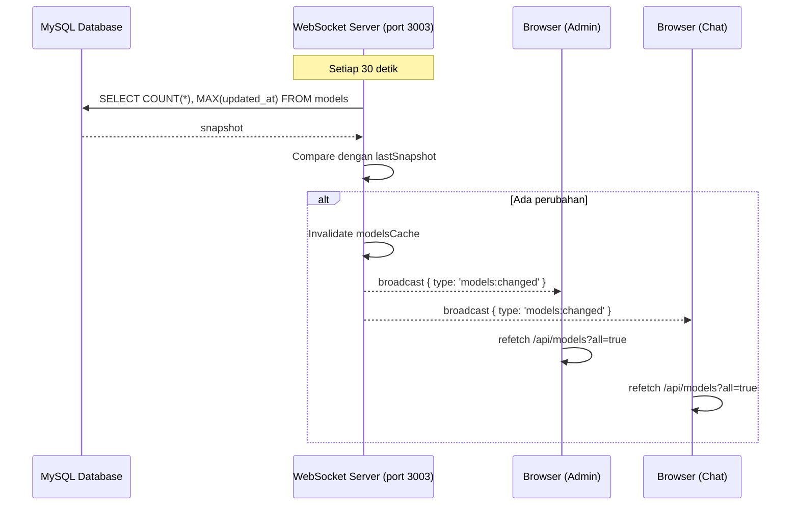
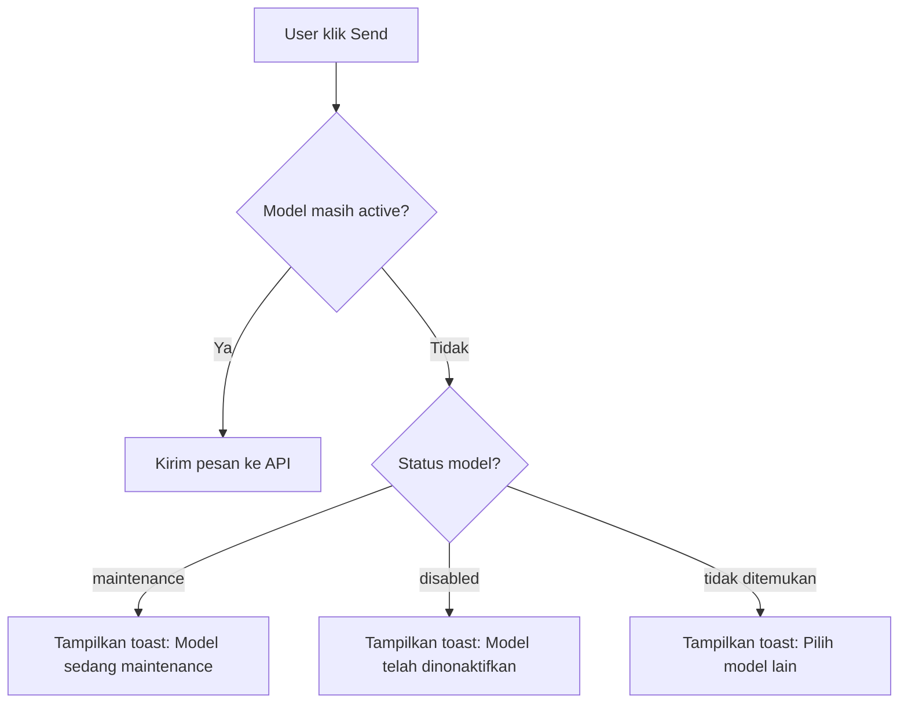

# Plan: WebSocket Real-Time Sync + Model Status Validation

## Latar Belakang

Ada beberapa masalah yang perlu diperbaiki:
1. **Bug `active` column**: [`src/app/api/admin/sync-models/route.ts:38`](src/app/api/admin/sync-models/route.ts:38) masih query `SELECT id, active, ...` padahal kolom sudah berubah menjadi `status`
2. **Broadcast ke WS salah endpoint**: [`src/app/api/models/route.ts:108-123`](src/app/api/models/route.ts:108) broadcast ke WS tanpa path `/broadcast` dan tanpa `x-api-key` header, jadi ditolak 401
3. **Tidak ada polling periodic**: WebSocket server tidak ngecek perubahan di DB secara periodik, jadi hapus/edit via HeidiSQL tidak terdeteksi
4. **UI tidak validasi status model**: `ChatInput` dan halaman chat utama tidak ngecek apakah model yang dipilih masih `active` sebelum kirim pesan
5. **ModelSelector trigger tidak kasih indikator merah**: Jika model yang sedang dipilih tiba-tiba berubah jadi `maintenance`/`disabled`, trigger button di top bar tidak menunjukkan visual warning

## Arsitektur Solusi

### 1. Perbaikan Bug di Backend

#### a. [`src/app/api/admin/sync-models/route.ts`](src/app/api/admin/sync-models/route.ts:38)
Ubah query dari:
```sql
SELECT id, active, input_price, output_price, free FROM models
```
Menjadi:
```sql
SELECT id, status, input_price, output_price, free FROM models
```

#### b. [`src/app/api/models/route.ts`](src/app/api/models/route.ts:107-123)
Ubah broadcast URL ke `http://localhost:${WS_PORT}/broadcast` dan tambahkan header `x-api-key`.

### 2. WebSocket Server: Periodic Polling (30 detik)

Di [`server/websocket.js`](server/websocket.js), tambahkan polling interval yang:
- Hitung row count + hash dari tabel `models` setiap 30 detik
- Bandingkan dengan snapshot sebelumnya
- Jika ada perubahan (INSERT/UPDATE/DELETE), broadcast event `models:changed` ke semua client
- Client-side akan handle event ini dengan fetch ulang `/api/models`



### 3. Client-Side: Handle `models:changed` Event

Di [`src/context/websocket-context.tsx`](src/context/websocket-context.tsx:128), tambahkan handler untuk event `models:changed`:
- Fetch `/api/models` (user) atau `/api/models?all=true` (admin)
- Update Zustand store dengan data baru
- Auto-switch model aktif jika model yang dipilih sudah tidak `active`

### 4. Model Status Validation

#### a. [`src/components/chat/chat-input.tsx`](src/components/chat/chat-input.tsx:56-63)
Modifikasi `handleSend` untuk cek status model:
- Jika model status = `maintenance`: tampilkan toast "Model [name] sedang maintenance"
- Jika model status = `disabled`: tampilkan toast "Model [name] telah dinonaktifkan"
- Jika model tidak ditemukan di store: tampilkan toast "Model tidak tersedia"



#### b. [`src/components/chat/model-selector.tsx`](src/components/chat/model-selector.tsx:412-429)
Trigger button di top bar — tambahkan indikator visual:
- Jika model yang dipilih status = `maintenance` atau `disabled`:
  - Border button menjadi merah (`border-red-500`)
  - Background button menjadi merah samar
  - Tambahkan badge "⚠ Maintenance" atau "⛔ Disabled"
  - Tampilkan toast warning

### 5. Perbaiki `admin/page.tsx` untuk Edit Model via API

Di [`src/app/admin/page.tsx`](src/app/admin/page.tsx:255-278), `handleSaveEditModel` harus panggil API `/api/models` dengan method `PUT` supaya perubahan juga broadcast via WS.

## Daftar Todo (Execution Order)

1. **[Fix] `src/app/api/admin/sync-models/route.ts:38`** — Ubah query `active` → `status`
2. **[Fix] `src/app/api/models/route.ts:107-123`** — Perbaiki URL broadcast WS + header `x-api-key`
3. **[New] `server/websocket.js`** — Tambahkan periodic polling tiap 30 detik, bandingkan snapshot, broadcast `models:changed`
4. **[Fix] `src/context/websocket-context.tsx`** — Tambahkan handler untuk `models:changed`, fetch ulang models, auto-switch model
5. **[New] `src/components/chat/chat-input.tsx`** — Tambahkan validasi status model sebelum `handleSend`, tampilkan toast sesuai status
6. **[New] `src/components/chat/model-selector.tsx`** — Trigger button berubah warna merah + badge jika model terpilih tidak `active`
7. **[Fix] `src/app/admin/page.tsx`** — `handleSaveEditModel` panggil API `/api/models` PUT bukan langsung update store
8. **[Fix] `src/app/admin/page.tsx`** — `handleAddModel` panggil API POST `/api/models`
9. **[Fix] `src/app/admin/page.tsx`** — `handleRemoveModel` panggil API DELETE `/api/models`
10. **[Chore]** Lint + build test + perbaiki error

## Risk & Mitigation

| Risk | Mitigation |
|------|------------|
| WS polling tambah beban DB | Query ringan (COUNT + MAX), interval 30 detik |
| User pakai versi lama (localStorage persist) | Zustand persist tetap jalan, data overwrite saat fetch baru |
| Broadcast ke WS gagal | Sudah ada try-catch, fallback diam |
| Model berubah di tengah streaming | Cek status model di awal `handleSend` saja, tidak di tengah |
