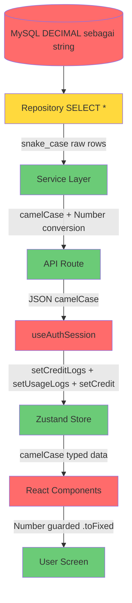

# Rencana Remediasi Komprehensif: Admin Panel & Data Flow

**Tanggal**: 2026-05-20  
**Versi**: 3.0 (Final - Berdasarkan Audit Mendalam)  
**Status Database**: MySQL 8.4.7 (Existing, tidak ada perubahan skema diperlukan)

---

## 1. HASIL AUDIT MENDALAM

### 1.1 Peta Alur Data (Ditemukan Saat Audit)

```
Database (snake_case, DECIMAL sebagai string)
    ↓
Repository (SELECT * tanpa mapping — MASALAH)
    ↓
Service (partial mapping — tergantung file)
    ↓
API Route (mapping dilakukan di sini — INKONSISTEN)
    ↓
Hook (fetch API, sebagian tidak di-store — MASALAH)
    ↓
Zustand Store (camelCase — interface benar)
    ↓
UI Component (akses camelCase, .toFixed() tanpa guard — CRASH)
```

### 1.2 Temuan Bug Kritis (Diurutkan berdasarkan Prioritas)

---

## BUG #1 — CRASH: TypeError: e.toFixed is not a function
**Tingkat Keparahan**: KRITIS — Menyebabkan halaman crash total  
**File**: [`src/components/admin/admin-user-table.tsx`](src/components/admin/admin-user-table.tsx:18)  
**Baris**: 18-20

**Kode Bermasalah**:
```typescript
function formatCurrency8(n: number): string {
  return `$${n.toFixed(8)}`; // CRASH jika n adalah string atau undefined
}
```

**Penyebab Root Cause**:
- `useAdminUsers` memanggil `GET /api/admin/users`
- API route `src/app/api/admin/users/route.ts` memanggil `AdminService.listUsers()`
- `AdminService.listUsers()` memanggil `UserRepository.listUsers()`
- `UserRepository.listUsers()` melakukan `SELECT * FROM users` — mengembalikan `credit` dan `total_spent` sebagai **string** (MySQL DECIMAL dikembalikan sebagai string oleh driver mysql2)
- Data dikirim ke frontend tanpa konversi `Number()`
- `formatCurrency8(user.credit)` dipanggil dengan string → `"25.0000".toFixed(8)` → TypeError!

**Fix yang Diperlukan**:
```typescript
function formatCurrency8(n: number | string | null | undefined): string {
  const num = Number(n ?? 0);
  if (isNaN(num)) return '$0.00000000';
  return `$${num.toFixed(8)}`;
}
```

---

## BUG #2 — CRASH: model.inputPrice.toFixed is not a function
**Tingkat Keparahan**: KRITIS — Menyebabkan tabel model crash  
**File**: [`src/app/admin/page.tsx`](src/app/admin/page.tsx:602)  
**Baris**: 602, 605

**Kode Bermasalah**:
```typescript
// Baris 602
<span className="text-sm font-mono text-foreground">${model.inputPrice.toFixed(2)}</span>
// Baris 605
<span className="text-sm font-mono text-foreground">${model.outputPrice.toFixed(2)}</span>
```

**Status Saat Ini**:
- `ModelService.getModels()` SUDAH melakukan mapping yang benar di [`src/services/model.service.ts`](src/services/model.service.ts:20):
  ```typescript
  inputPrice: Number(m.input_price) || 0,  // ✅ SUDAH mapping
  outputPrice: Number(m.output_price) || 0, // ✅ SUDAH mapping
  ```
- **Tetapi** jika `m.input_price` adalah `null` atau `undefined`, `Number(null) = 0` — aman
- **Namun** ada kasus tepi: jika data dari store Zustand masih tersimpan dalam format lama (snake_case dari cache persist), `model.inputPrice` bisa `undefined`

**Fix yang Diperlukan**:
```typescript
// Baris 602 - tambahkan safe conversion
<span className="text-sm font-mono text-foreground">${Number(model.inputPrice ?? 0).toFixed(2)}</span>
// Baris 605
<span className="text-sm font-mono text-foreground">${Number(model.outputPrice ?? 0).toFixed(2)}</span>
```

**Juga di baris 553** — `model.discountPercent > 0` bisa gagal jika undefined:
```typescript
const hasDiscount = (model.discountPercent ?? 0) > 0 && model.discountType !== 'none';
```

---

## BUG #3 — DATA HILANG: Credit Logs Tidak Muncul di Profil
**Tingkat Keparahan**: TINGGI — Fitur tidak berfungsi  
**File**: [`src/hooks/useAuthSession.ts`](src/hooks/useAuthSession.ts:62)  
**Baris**: 62-112

**Analisis Alur Data**:
1. `GET /api/account` mengembalikan `{ user, creditLogs }` — **API SUDAH BENAR** (lihat [`src/app/api/account/route.ts`](src/app/api/account/route.ts:27))
2. `useAuthSession.fetchServerData()` memanggil `/api/account` — baris 80
3. **MASALAH**: Kode hanya membaca `accountData.totalSpent` (baris 86-89) tapi **TIDAK** memanggil `setCreditLogs(accountData.creditLogs)`!

**Kode Saat Ini (Bermasalah)**:
```typescript
if (accountRes.ok) {
  const accountJson = await accountRes.json();
  const accountData = accountJson.data || accountJson;
  if (!cancelled) {
    if (accountData.totalSpent !== undefined) {
      setTotalSpent(accountData.totalSpent);
    }
    // ❌ TIDAK ADA: setCreditLogs(accountData.creditLogs)
    // ❌ TIDAK ADA: setCredit(accountData.user.credit)
  }
}
```

**Perhatikan juga**: Store `useChatDataStore` memiliki `setCreditLogs` (baris 481 di store.ts), tetapi hook `useAuthSession` tidak mendestruct fungsi ini dari store!

**Fix yang Diperlukan**:
Di [`src/hooks/useAuthSession.ts`](src/hooks/useAuthSession.ts:8), tambahkan `setCreditLogs` dan `setCredit`:
```typescript
const {
  isLoggedIn,
  login,
  logout,
  setConversations,
  setTotalSpent,
  setUsageLogs,
  setCreditLogs,  // ← TAMBAHKAN INI
  setCredit,
} = useChatDataStore();
```

Dan di bagian fetch `/api/account` (baris 82-91):
```typescript
if (accountRes.ok) {
  const accountJson = await accountRes.json();
  const accountData = accountJson.data || accountJson;
  if (!cancelled) {
    if (accountData.totalSpent !== undefined) {
      setTotalSpent(accountData.totalSpent);
    }
    // ← TAMBAHKAN INI
    if (accountData.user?.credit !== undefined) {
      setCredit(accountData.user.credit);
    }
    if (Array.isArray(accountData.creditLogs)) {
      setCreditLogs(accountData.creditLogs);
    }
  }
}
```

**Perhatikan struktur response dari `/api/account`**:
```json
{
  "success": true,
  "data": {
    "user": { "id": "...", "credit": 25.0, "totalSpent": 0.0, ... },
    "creditLogs": [{ "id": "...", "type": "topup", "amount": 25, ... }]
  }
}
```
Jadi `accountData = accountJson.data` → `accountData.user` dan `accountData.creditLogs`.

---

## BUG #4 — DATA HILANG: lastMessage.createdAt Undefined di Sidebar
**Tingkat Keparahan**: TINGGI — Preview percakapan tidak tampil  
**File**: [`src/services/chat-persistence.service.ts`](src/services/chat-persistence.service.ts:19)  
**Baris**: 11-20

**Analisis**:
`ChatRepository.getConversationsByUserId()` melakukan SQL query dengan `JSON_OBJECT`:
```sql
JSON_OBJECT('id', m.id, 'role', m.role, 'content', ..., 'created_at', m.created_at) as last_message
```

`ChatPersistenceService.getUserConversations()` kemudian memetakan:
```typescript
return conversations.map(c => ({
  id: c.id,
  title: c.title || 'New Chat',
  // ...
  createdAt: c.created_at,    // ✅ Benar
  updatedAt: c.updated_at,    // ✅ Benar
  lastMessage: c.last_message, // ❌ MASALAH: last_message masih menggunakan created_at (snake_case)
}));
```

**Masalah**: `c.last_message` adalah objek `{ id, role, content, created_at }` dari JSON_OBJECT MySQL.  
Tapi `ConversationPreview` di store mengharapkan `lastMessage.createdAt` (camelCase).

**Sidebar (`src/components/chat/sidebar.tsx`)** mengakses `conv.lastMessage.createdAt` untuk menampilkan waktu percakapan — hasilnya `undefined`, sehingga preview waktu tidak muncul.

**Fix yang Diperlukan**:
Di [`src/services/chat-persistence.service.ts`](src/services/chat-persistence.service.ts:19), ubah:
```typescript
lastMessage: c.last_message ? {
  id: c.last_message.id,
  role: c.last_message.role,
  content: c.last_message.content,
  createdAt: c.last_message.created_at, // ← mapping snake_case ke camelCase
} : null,
```

---

## BUG #5 — INKONSISTENSI: Interface Model di types/index.ts vs store.ts
**Tingkat Keparahan**: SEDANG — Potensi crash dan kebingungan tipe  
**File**: [`src/types/index.ts`](src/types/index.ts:77), [`src/lib/store.ts`](src/lib/store.ts:36)

**Konflik yang Ditemukan**:

| Property | `types/index.ts` (DB Layer) | `store.ts` (UI Layer) |
|---|---|---|
| `max_context` | `max_context: number` | `maxContext: number` |
| `thinking` | `thinking: number` (0 or 1) | `thinking: boolean` |
| `input_price` | `input_price: number` | `inputPrice: number` |
| `output_price` | `output_price: number` | `outputPrice: number` |
| `free` | `free: number` (0 or 1) | `free: boolean` |
| `discount_percent` | `discount_percent: number` | `discountPercent: number` |
| `discount_type` | `discount_type: string` | `discountType: DiscountType` |

`ModelRepository.getModels()` menggunakan `Model` dari `types/index.ts` (snake_case), tapi data dikembalikan mentah ke store tanpa mapping di Repository.  
`ModelService.getModels()` melakukan mapping yang benar (snake_case → camelCase), sehingga sudah aman.

**Namun**: Fungsi `ModelRepository.updateModel()` di [`src/repositories/model.repo.ts`](src/repositories/model.repo.ts:31) menerima `Partial<Model>` dari `types/index.ts` (snake_case), sedangkan `ModelService.updateModel()` di [`src/services/model.service.ts`](src/services/model.service.ts:41) mengirim `data.input_price` (snake_case) ke repository — ini sudah konsisten.

**Tetapi** ada masalah ketika `updateModelData` di hook `useAdminModels.ts` mengirim `{ id: modelId, ...updates }` di mana `updates` bisa berisi `camelCase` dari UI (misal: `{ inputPrice: 0.5 }`) — ini tidak akan ditangkap oleh `model.service.ts` karena service hanya memeriksa `data.input_price`.

**Fix yang Diperlukan**: Update `ModelService.updateModel()` untuk juga menerima `camelCase`:
```typescript
if (data.input_price !== undefined) updates.input_price = data.input_price;
if (data.inputPrice !== undefined) updates.input_price = data.inputPrice; // ← TAMBAH
if (data.output_price !== undefined) updates.output_price = data.output_price;
if (data.outputPrice !== undefined) updates.output_price = data.outputPrice; // ← TAMBAH
// dst...
```

---

## BUG #6 — INKONSISTENSI: CreditLogType tidak Sinkron
**Tingkat Keparahan**: SEDANG — Potensi masalah tampilan  
**File**: [`src/types/index.ts`](src/types/index.ts:65), [`src/lib/store.ts`](src/lib/store.ts:85)

**Konflik**:
- `types/index.ts`: `CreditLogType = 'topup' | 'usage' | 'admin_adjust'`
- `store.ts` `CreditLogEntry.type`: `'topup' | 'usage'`
- `migration-billing.sql` akan mengubah ENUM menjadi: `'topup' | 'deduct' | 'admin_set' | 'usage'`

**Dampak**: Setelah migrasi dijalankan, data `admin_set` dan `deduct` tidak akan dirender dengan benar di `AccountDialog` karena tipe tidak mencakup nilai-nilai tersebut.

**Fix yang Diperlukan**: Update `CreditLogType` di `types/index.ts` dan `CreditLogEntry.type` di `store.ts`:
```typescript
// types/index.ts
export type CreditLogType = 'topup' | 'usage' | 'deduct' | 'admin_set' | 'admin_adjust';

// store.ts
export interface CreditLogEntry {
  id: string;
  type: 'topup' | 'usage' | 'deduct' | 'admin_set';
  // ...
}
```

---

## BUG #7 — UX: Tidak Ada Error Boundary di Tabel Admin
**Tingkat Keparahan**: SEDANG — Satu data rusak meruntuhkan seluruh halaman  
**File**: [`src/app/admin/page.tsx`](src/app/admin/page.tsx)

**Situasi Saat Ini**: `ModelsSection` dan `AdminUserTable` tidak dibungkus `ErrorBoundary`. Jika satu baris data model/user menyebabkan error render (seperti Bug #1 dan #2), seluruh halaman admin akan crash dengan "Something went wrong".

**Fix yang Diperlukan**: Bungkus setiap section dengan `ErrorBoundary` dari `src/components/ui/error-boundary.tsx`:
```tsx
{activeSection === 'models' && (
  <ErrorBoundary>
    <ModelsSection ... />
  </ErrorBoundary>
)}
{activeSection === 'users' && (
  <ErrorBoundary>
    <AdminUserTable ... />
  </ErrorBoundary>
)}
```

---

## BUG #8 — DATA HILANG: Usage Logs - Struktur Response Tidak Cocok
**Tingkat Keparahan**: TINGGI — Usage logs mungkin tidak tersimpan ke store  
**File**: [`src/hooks/useAuthSession.ts`](src/hooks/useAuthSession.ts:94)  
**Baris**: 94-103

**Analisis**:
`GET /api/usage?limit=100` mengembalikan:
```json
{
  "success": true,
  "data": { "usageLogs": [...] }
}
```

Hook melakukan:
```typescript
const usageJson = await usageRes.json();
const usageData = usageJson.data || usageJson;
if (!cancelled && usageData.usageLogs) {
  setUsageLogs(usageData.usageLogs);
}
```

Ini **SUDAH BENAR** — `usageData = usageJson.data` → `usageData.usageLogs` tersedia.  
**Namun** perlu diverifikasi bahwa `apiSuccess` membungkus dalam `.data`.

Lihat [`src/lib/api-response.ts`](src/lib/api-response.ts) — perlu diperiksa struktur wrapper.

---

## BUG #9 — POTENSI: AdminService.listUsers tidak Map credit ke Number
**Tingkat Keparahan**: TINGGI — Akar penyebab crash admin-user-table  
**File**: [`src/services/admin.service.ts`](src/services/admin.service.ts:52)  
**Baris**: 52-60

**Analisis**:
```typescript
async listUsers(page: number, limit: number, search?: string) {
  return UserRepository.listUsers(page, limit, search);
}
```

`UserRepository.listUsers()` mengembalikan data mentah dari database termasuk `credit` (DECIMAL sebagai string) dan `total_spent` (DECIMAL sebagai string).

API Route `GET /api/admin/users` kemudian mengirim data ini ke frontend. Frontend `AdminUserTable` menggunakan `user.credit` dan `user.totalSpent` yang masih berupa string. Inilah **akar penyebab sesungguhnya** Bug #1.

**Fix yang Diperlukan** di [`src/services/admin.service.ts`](src/services/admin.service.ts:52) atau di API route:
```typescript
async listUsers(page: number, limit: number, search?: string) {
  const result = await UserRepository.listUsers(page, limit, search);
  return {
    ...result,
    users: result.users.map(u => ({
      ...u,
      credit: Number(u.credit),
      total_spent: Number(u.total_spent),
    }))
  };
}
```

**ATAU** di API route `src/app/api/admin/users/route.ts` — mapping sebelum dikirim ke client.

---

## 2. URUTAN EKSEKUSI PERBAIKAN

### Fase 1: Perbaikan Crash Kritis (Prioritas Tertinggi)
1. **Fix #1**: Perbaiki `formatCurrency8()` di `admin-user-table.tsx` dengan safe number conversion
2. **Fix #9**: Tambahkan mapping `Number()` untuk `credit` dan `total_spent` di `AdminService.listUsers()` atau API route
3. **Fix #2**: Tambahkan null guard di `admin/page.tsx` baris 553, 602, 605

### Fase 2: Pemulihan Data (Prioritas Tinggi)
4. **Fix #3**: Tambahkan `setCreditLogs` di `useAuthSession.ts` untuk menyimpan credit logs ke store
5. **Fix #4**: Perbaiki mapping `lastMessage.created_at → createdAt` di `ChatPersistenceService`

### Fase 3: Konsistensi Tipe (Prioritas Sedang)
6. **Fix #5**: Update `ModelService.updateModel()` untuk menerima baik `camelCase` maupun `snake_case`
7. **Fix #6**: Sinkronisasi `CreditLogType` di `types/index.ts` dan `store.ts`

### Fase 4: Ketahanan Sistem
8. **Fix #7**: Tambahkan `ErrorBoundary` di sekitar setiap section di `admin/page.tsx`

### Fase 5: Migrasi Database (Opsional/Terpisah)
9. Jalankan `migration-billing.sql` untuk update skema `credit_logs`
   - **CATATAN**: Skema database saat ini sudah kompatibel. Migrasi ini opsional dan hanya diperlukan jika fitur invoice/operator diperlukan. Jalankan dengan hati-hati karena mengubah ENUM dan menambah kolom.

---

## 3. DETAIL PERUBAHAN FILE

### File 1: `src/components/admin/admin-user-table.tsx`
**Perubahan**: Baris 18-20
```typescript
// SEBELUM
function formatCurrency8(n: number): string {
  return `$${n.toFixed(8)}`;
}

// SESUDAH
function formatCurrency8(n: number | string | null | undefined): string {
  const num = Number(n ?? 0);
  if (isNaN(num)) return '$0.00000000';
  return `$${num.toFixed(8)}`;
}
```

### File 2: `src/app/admin/page.tsx`
**Perubahan 1** (Baris 553):
```typescript
// SEBELUM
const hasDiscount = model.discountPercent > 0 && model.discountType !== 'none';
// SESUDAH
const hasDiscount = (model.discountPercent ?? 0) > 0 && model.discountType !== 'none';
```

**Perubahan 2** (Baris 602-605):
```typescript
// SEBELUM
<span>${model.inputPrice.toFixed(2)}</span>
<span>${model.outputPrice.toFixed(2)}</span>
// SESUDAH
<span>${Number(model.inputPrice ?? 0).toFixed(2)}</span>
<span>${Number(model.outputPrice ?? 0).toFixed(2)}</span>
```

**Perubahan 3** (Sekitar baris 309-343, tambahkan ErrorBoundary):
```tsx
{activeSection === 'models' && (
  <ErrorBoundary>
    <ModelsSection ... />
  </ErrorBoundary>
)}
{activeSection === 'users' && (
  <ErrorBoundary>
    <AdminUserTable ... />
  </ErrorBoundary>
)}
```

### File 3: `src/hooks/useAuthSession.ts`
**Perubahan 1** (Baris 8-16, tambahkan setCreditLogs):
```typescript
const {
  isLoggedIn,
  login,
  logout,
  setConversations,
  setTotalSpent,
  setUsageLogs,
  setCreditLogs,  // ← TAMBAH
  setCredit,
} = useChatDataStore();
```

**Perubahan 2** (Baris 82-91, tambahkan setCreditLogs dan setCredit):
```typescript
if (accountRes.ok) {
  const accountJson = await accountRes.json();
  const accountData = accountJson.data || accountJson;
  if (!cancelled) {
    if (accountData.totalSpent !== undefined) {
      setTotalSpent(accountData.totalSpent);
    }
    if (accountData.user?.credit !== undefined) {
      setCredit(accountData.user.credit);
    }
    if (Array.isArray(accountData.creditLogs)) {
      setCreditLogs(accountData.creditLogs);
    }
  }
}
```

### File 4: `src/services/chat-persistence.service.ts`
**Perubahan** (Baris 11-20):
```typescript
return conversations.map(c => ({
  id: c.id,
  title: c.title || 'New Chat',
  model: c.model || 'gpt-4o',
  category: c.category || 'assistant',
  pinned: Boolean(c.pinned),
  createdAt: c.created_at,
  updatedAt: c.updated_at,
  lastMessage: c.last_message ? {  // ← UBAH ini
    id: c.last_message.id,
    role: c.last_message.role,
    content: c.last_message.content,
    createdAt: c.last_message.created_at,  // ← TAMBAH mapping
  } : null,
}));
```

### File 5: `src/services/admin.service.ts`
**Perubahan** (Baris 52-60, tambahkan Number() conversion):
```typescript
async listUsers(page: number, limit: number, search?: string) {
  const result = await UserRepository.listUsers(page, limit, search);
  return {
    ...result,
    users: result.users.map((u: any) => ({
      ...u,
      credit: Number(u.credit),
      total_spent: Number(u.total_spent),
    }))
  };
},
```

### File 6: `src/services/model.service.ts`
**Perubahan** (Baris 41-51, tambahkan dukungan camelCase):
```typescript
if (data.input_price !== undefined) updates.input_price = data.input_price;
if (data.inputPrice !== undefined) updates.input_price = data.inputPrice;  // ← TAMBAH
if (data.output_price !== undefined) updates.output_price = data.output_price;
if (data.outputPrice !== undefined) updates.output_price = data.outputPrice;  // ← TAMBAH
if (data.free !== undefined) updates.free = data.free ? 1 : 0;
if (data.name !== undefined) updates.name = data.name;
if (data.provider !== undefined) updates.provider = data.provider;
if (data.description !== undefined) updates.description = data.description;
if (data.thinking !== undefined) updates.thinking = data.thinking ? 1 : 0;
if (data.max_context !== undefined) updates.max_context = data.max_context;
if (data.maxContext !== undefined) updates.max_context = data.maxContext;  // ← TAMBAH
if (data.speed !== undefined) updates.speed = data.speed;
if (data.discount_percent !== undefined) updates.discount_percent = data.discount_percent;
if (data.discountPercent !== undefined) updates.discount_percent = data.discountPercent;  // ← TAMBAH
if (data.discount_type !== undefined) updates.discount_type = data.discount_type;
if (data.discountType !== undefined) updates.discount_type = data.discountType;  // ← TAMBAH
```

### File 7: `src/types/index.ts`
**Perubahan** (Baris 65):
```typescript
// SEBELUM
export type CreditLogType = 'topup' | 'usage' | 'admin_adjust';

// SESUDAH  
export type CreditLogType = 'topup' | 'usage' | 'admin_adjust' | 'deduct' | 'admin_set';
```

### File 8: `src/lib/store.ts`
**Perubahan** (Baris 85):
```typescript
// SEBELUM
export interface CreditLogEntry {
  id: string;
  type: 'topup' | 'usage';
  // ...
}

// SESUDAH
export interface CreditLogEntry {
  id: string;
  type: 'topup' | 'usage' | 'deduct' | 'admin_set' | 'admin_adjust';
  // ...
}
```

---

## 4. DIAGRAM ALUR DATA BARU



**Merah = Bermasalah, Kuning = Perlu Perhatian, Hijau = Sudah Benar**

---

## 5. STRATEGI MIGRASI DATABASE

Skrip `src/lib/migration-billing.sql` mengubah struktur `credit_logs`:
- Mengganti ENUM `type` dari `('topup', 'usage', 'admin_adjust')` ke `('topup', 'deduct', 'admin_set', 'usage')`
- Menambahkan kolom: `previous_balance`, `invoice_number`, `operator_id`, `operator_name`, `note`

**PERINGATAN**: Migrasi ini mengubah ENUM. MySQL memerlukan ALTER TABLE yang bisa mengunci tabel. Lakukan di maintenance window.

**Langkah eksekusi yang aman**:
1. Backup database: `mysqldump -u root -p ai_chat_web > backup.sql`
2. Jalankan skrip di HeidiSQL atau via CLI: `mysql -u root -p ai_chat_web < src/lib/migration-billing.sql`
3. Verifikasi: `DESCRIBE credit_logs;`

---

## 6. VERIFIKASI PASCA-PERBAIKAN

### Checklist Manual:
- [ ] Buka `/admin` → klik menu "Users" → tidak ada crash
- [ ] Buka `/admin` → klik menu "Models" → tabel tampil dengan harga yang benar
- [ ] Login sebagai user → buka Account Dialog → tab "Overview" → credit logs muncul
- [ ] Sidebar percakapan → timestamp lastMessage tampil dengan benar
- [ ] Lakukan top-up → credit logs bertambah di Account Dialog

### Checklist Teknis:
- [ ] Tidak ada `TypeError: .toFixed is not a function` di console
- [ ] `accountData.creditLogs` tersimpan ke Zustand store
- [ ] `conv.lastMessage.createdAt` tidak `undefined` di sidebar
- [ ] `model.inputPrice` selalu bertipe `number` di store

---

✅ Plan saved to: plans/2026-05-20-remediasi-data-admin.md
