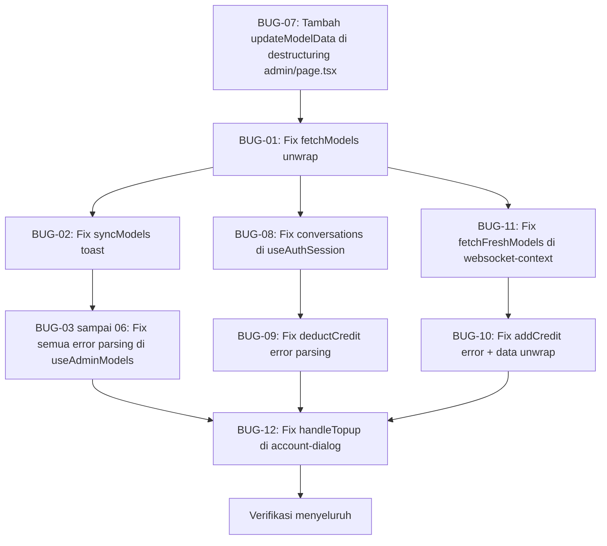

# Rencana Perbaikan Bug: Audit Mendalam API Response Unwrapping & Runtime Errors

**Tanggal:** 2026-05-21  
**Dibuat oleh:** Audit Arsitektur Mendalam  
**Status:** Siap Implementasi  
**Prioritas:** KRITIS — beberapa bug menyebabkan fitur inti tidak berfungsi sama sekali

---

## 1. Ringkasan Eksekutif

Audit mendalam terhadap seluruh codebase frontend menemukan **10 bug aktif** yang tersebar di 6 file. Semua bug bersumber dari satu akar masalah yang sama: **ketidakkonsistenan cara membaca respons API** yang menggunakan wrapper standar `apiSuccess()`.

### Akar Masalah (Root Cause)

File [`src/lib/api-response.ts`](src/lib/api-response.ts) mendefinisikan dua fungsi wrapper:

```typescript
// Semua respons sukses dibungkus dalam kunci `data`
export function apiSuccess<T>(data: T, status = 200) {
  return NextResponse.json({ success: true, data }, { status });
  // Struktur: { success: true, data: { ...payload } }
}

// Semua respons error menggunakan kunci `error.message`, bukan `error` langsung
export function apiError(message: string, ...) {
  return NextResponse.json({
    success: false,
    error: { message, code, details }
  }, { status });
  // Struktur: { success: false, error: { message: "...", code: "..." } }
}
```

**Semua API route di `src/app/api/`** menggunakan `apiSuccess()` dengan benar.  
**Hampir semua hook frontend** membaca data dari level root (`data.models`, `data.synced`) alih-alih dari `data.data.models`, `data.data.synced`.

### Pola yang Benar (Referensi)

File [`src/hooks/useAdminUsers.ts`](src/hooks/useAdminUsers.ts) adalah **satu-satunya** hook yang mengimplementasikan pola yang benar:

```typescript
const result = await response.json();
// ✅ Benar: unwrap dari data.data
if (response.ok && result.success && result.data?.users) {
  return { users: result.data.users, total: result.data.total || 0 };
}
// ✅ Benar: error ada di result.error.message, bukan result.error
const errorMessage = result.error?.message || result.error || 'Gagal';
```

---

## 2. Daftar Lengkap Bug yang Ditemukan

### Klasifikasi Prioritas

| Prioritas | Kriteria |
|-----------|----------|
| 🔴 KRITIS | Fitur inti tidak berfungsi sama sekali / data tidak pernah di-set |
| 🟠 TINGGI | Data salah ditampilkan / runtime error yang tersembunyi |
| 🟡 SEDANG | Error message tidak tampil dengan benar / UX degradasi |

---

### BUG-01 — `fetchModels` Tidak Pernah Update State
**Prioritas:** 🔴 KRITIS  
**File:** [`src/hooks/useAdminModels.ts`](src/hooks/useAdminModels.ts) — baris 19–31  
**Dampak:** Tabel model admin tidak pernah diperbarui dari server. Filter "gratis" selalu kosong karena `setModels` tidak pernah dipanggil.

**Kode Bermasalah (baris 22–25):**
```typescript
const data = await response.json();
if (data.models) {        // ❌ data.models selalu undefined
  setModels(data.models); // ❌ tidak pernah dieksekusi
}
```

**Respons API aktual:**
```json
{ "success": true, "data": { "models": [...] } }
```

**Perbaikan:**
```typescript
const json = await response.json();
const data = json.data;               // ✅ unwrap dari json.data
if (data?.models) {
  setModels(data.models);             // ✅ sekarang berfungsi
}
```

---

### BUG-02 — `syncModels` Toast Menampilkan "undefined"
**Prioritas:** 🔴 KRITIS  
**File:** [`src/hooks/useAdminModels.ts`](src/hooks/useAdminModels.ts) — baris 131–151  
**Dampak:** Toast sukses sinkronisasi selalu menampilkan: *"Berhasil sinkronisasi undefined model. Baru: undefined, Diperbarui: undefined"*

**Kode Bermasalah (baris 135–141):**
```typescript
const data = await response.json();
// ...
description: `Berhasil sinkronisasi ${data.synced} model. Baru: ${data.new}, Diperbarui: ${data.updated}`
// ❌ data.synced, data.new, data.updated semuanya undefined
```

**Respons API aktual (`/api/admin/sync-models`):**
```json
{ "success": true, "data": { "synced": 42, "new": 5, "updated": 37, "disabled": 0 } }
```

**Perbaikan:**
```typescript
const json = await response.json();
if (!response.ok) throw new Error(json.error?.message || 'Gagal sinkronisasi');
const data = json.data;               // ✅ unwrap
// ...
description: `Berhasil sinkronisasi ${data.synced} model. Baru: ${data.new}, Diperbarui: ${data.updated}`
```

---

### BUG-03 — `addModel` Error Message Adalah Object, Bukan String
**Prioritas:** 🟡 SEDANG  
**File:** [`src/hooks/useAdminModels.ts`](src/hooks/useAdminModels.ts) — baris 42–44  
**Dampak:** Toast error menampilkan `[object Object]` alih-alih pesan error yang bermakna.

**Kode Bermasalah:**
```typescript
const err = await response.json();
throw new Error(err.error || 'Gagal menambahkan model');
// ❌ err.error adalah objek: { message: "...", code: "..." }
// toString() menghasilkan "[object Object]"
```

**Perbaikan:**
```typescript
const err = await response.json();
throw new Error(err.error?.message || 'Gagal menambahkan model');
// ✅ ambil string message dari objek error
```

---

### BUG-04 — `updateModelData` Error Message Adalah Object
**Prioritas:** 🟡 SEDANG  
**File:** [`src/hooks/useAdminModels.ts`](src/hooks/useAdminModels.ts) — baris 68–70  
**Dampak:** Sama dengan BUG-03 — toast error tidak bermakna.

**Kode Bermasalah:**
```typescript
const err = await response.json();
throw new Error(err.error || 'Gagal memperbarui model'); // ❌
```

**Perbaikan:**
```typescript
throw new Error(err.error?.message || 'Gagal memperbarui model'); // ✅
```

---

### BUG-05 — `deleteModel` Error Message Adalah Object
**Prioritas:** 🟡 SEDANG  
**File:** [`src/hooks/useAdminModels.ts`](src/hooks/useAdminModels.ts) — baris 90–92  
**Dampak:** Sama dengan BUG-03.

**Kode Bermasalah:**
```typescript
throw new Error(err.error || 'Gagal menghapus model'); // ❌
```

**Perbaikan:**
```typescript
throw new Error(err.error?.message || 'Gagal menghapus model'); // ✅
```

---

### BUG-06 — `toggleFreeStatus` Error Message Adalah Object
**Prioritas:** 🟡 SEDANG  
**File:** [`src/hooks/useAdminModels.ts`](src/hooks/useAdminModels.ts) — baris 114–116  
**Dampak:** Sama dengan BUG-03.

**Kode Bermasalah:**
```typescript
throw new Error(err.error || 'Gagal mengubah status gratis'); // ❌
```

**Perbaikan:**
```typescript
throw new Error(err.error?.message || 'Gagal mengubah status gratis'); // ✅
```

---

### BUG-07 — `updateModelData` Tidak Di-destructure di `admin/page.tsx`
**Prioritas:** 🔴 KRITIS  
**File:** [`src/app/admin/page.tsx`](src/app/admin/page.tsx) — baris 29 dan 114–116  
**Dampak:** `ReferenceError: updateModelData is not defined` saat user mencoba mengedit model dari admin panel. Halaman crash di runtime.

**Kode Bermasalah (baris 29):**
```typescript
const { models, fetchModels, deleteModel, toggleFreeStatus, syncModels, isSyncing } = useAdminModels();
// ❌ updateModelData tidak di-destructure

// Lalu di baris 114:
onUpdateModel={async (modelId, updates) => {
  await updateModelData(modelId, updates); // ❌ ReferenceError!
}}
```

**Perbaikan:**
```typescript
const { models, fetchModels, deleteModel, toggleFreeStatus, syncModels, isSyncing, updateModelData } = useAdminModels();
// ✅ tambahkan updateModelData dalam destructuring
```

---

### BUG-08 — `fetchServerData` Conversations Tidak Pernah Di-set
**Prioritas:** 🔴 KRITIS  
**File:** [`src/hooks/useAuthSession.ts`](src/hooks/useAuthSession.ts) — baris 71–75  
**Dampak:** Daftar percakapan user tidak pernah di-load dari server saat login. Sidebar percakapan selalu kosong setelah refresh halaman.

**Kode Bermasalah:**
```typescript
const convData = await convRes.json();
if (!cancelled && convData.conversations) { // ❌ convData.conversations selalu undefined
  setConversations(convData.conversations); // ❌ tidak pernah dieksekusi
}
```

**Respons API aktual (`/api/conversations`):**
```json
{ "success": true, "data": { "conversations": [...] } }
```

**Perbaikan:**
```typescript
const convJson = await convRes.json();
const convData = convJson.data;               // ✅ unwrap
if (!cancelled && convData?.conversations) {
  setConversations(convData.conversations);   // ✅ sekarang berfungsi
}
```

---

### BUG-09 — `deductCredit` Double JSON Parse → Runtime Error
**Prioritas:** 🔴 KRITIS  
**File:** [`src/hooks/useChatActions.ts`](src/hooks/useChatActions.ts) — baris 159–165  
**Dampak:** Setelah error deduct kredit, mencoba parse response body kedua kali → `TypeError: body used already`. Pemotongan kredit gagal diam-diam, state tidak terupdate.

**Kode Bermasalah:**
```typescript
if (!response.ok) {
  const error = await response.json(); // ← parse pertama (baris 161)
  throw new Error(error.error || 'Gagal mengurangi kredit');
}
const data = await response.json();   // ← parse KEDUA dari body yang sama (baris 165)
// ❌ Jika !response.ok → throw. Jika response.ok, lanjut ke sini.
// Namun jika response.ok, baris 161 tidak dieksekusi, jadi baris 165 aman.
// TETAPI: error.error harus jadi error.error?.message
```

**Analisis lebih lanjut:** Secara teknis double-parse tidak terjadi karena ada early throw, namun `error.error` adalah object (`{ message, code }`), bukan string. Toast akan menampilkan `[object Object]`.

**Perbaikan (baris 161–162):**
```typescript
const error = await response.json();
throw new Error(error.error?.message || 'Gagal mengurangi kredit'); // ✅
```

**Dan juga unwrap data sukses (baris 165–172):**
```typescript
const json = await response.json();
const data = json.data;                          // ✅ unwrap
store.setCredit(data?.credit ?? store.credit - amount);
if (data?.totalSpent !== undefined) {
  store.setTotalSpent(data.totalSpent);
}
if (data?.creditLog) {
  const existing = store.creditLogs.find(l => l.id === data.creditLog.id);
  if (!existing) {
    store.setCreditLogs([data.creditLog, ...store.creditLogs]);
  }
}
```

---

### BUG-10 — `addCredit` Error Message Adalah Object + Data Tidak Di-unwrap
**Prioritas:** 🟠 TINGGI  
**File:** [`src/hooks/useChatActions.ts`](src/hooks/useChatActions.ts) — baris 206–220  
**Dampak:** Toast error topup menampilkan `[object Object]`. Credit tidak terupdate dengan benar setelah topup sukses.

**Kode Bermasalah:**
```typescript
// Error path (baris 208–209):
const error = await response.json();
throw new Error(error.error || 'Gagal menambahkan kredit'); // ❌ error.error adalah object

// Success path (baris 212–220):
const data = await response.json();
store.setCredit(data.credit ?? store.credit + amount); // ❌ data.credit undefined (ada di data.data.credit)
if (data.creditLog) { ... }                            // ❌ data.creditLog undefined
```

**Perbaikan:**
```typescript
// Error path:
throw new Error(error.error?.message || 'Gagal menambahkan kredit'); // ✅

// Success path:
const json = await response.json();
const data = json.data;                                  // ✅ unwrap
store.setCredit(data?.credit ?? store.credit + amount);
if (data?.creditLog) {
  const existing = store.creditLogs.find(l => l.id === data.creditLog.id);
  if (!existing) store.setCreditLogs([data.creditLog, ...store.creditLogs]);
}
```

---

### BUG-11 — `fetchFreshModels` di WebSocket Context Tidak Unwrap
**Prioritas:** 🔴 KRITIS  
**File:** [`src/context/websocket-context.tsx`](src/context/websocket-context.tsx) — baris 58–79  
**Dampak:** Ketika WebSocket menerima event `models:changed`, fungsi `fetchFreshModels` dipanggil untuk refresh data model. Namun model tidak pernah diperbarui di store karena `data.models` selalu undefined. Perubahan model oleh admin tidak ter-reflect di client secara real-time.

**Kode Bermasalah (baris 63–66):**
```typescript
const data = await response.json();
if (data.models) {          // ❌ data.models selalu undefined
  state.setModels(data.models); // ❌ tidak pernah dieksekusi
  const bestModel = ensureValidActiveModel(data.models, state.activeModel); // ❌
}
```

**Perbaikan:**
```typescript
const json = await response.json();
const data = json.data;         // ✅ unwrap
if (data?.models) {
  state.setModels(data.models);
  const bestModel = ensureValidActiveModel(data.models, state.activeModel);
  if (bestModel !== state.activeModel) {
    state.setActiveModel(bestModel);
  }
  console.log('[WS-Global] Models refreshed after DB change');
}
```

---

### BUG-12 — `handleTopup` di AccountDialog Tidak Unwrap Credit
**Prioritas:** 🟠 TINGGI  
**File:** [`src/components/chat/account-dialog.tsx`](src/components/chat/account-dialog.tsx) — baris 431–458  
**Dampak:** Setelah topup berhasil, `setCredit(data.credit)` menerima `undefined` karena kredit ada di `data.data.credit`. Saldo kredit tidak terupdate di UI setelah topup dari dialog akun.

**Kode Bermasalah (baris 440–443):**
```typescript
const data = await res.json();
if (res.ok) {
  setCredit(data.credit);  // ❌ data.credit undefined, seharusnya data.data.credit
}
```

**Respons API aktual (`/api/topup`):**
```json
{ "success": true, "data": { "credit": 1500, "creditLog": {...} } }
```

**Perbaikan:**
```typescript
const json = await res.json();
if (res.ok) {
  const data = json.data;         // ✅ unwrap
  setCredit(data?.credit);        // ✅ sekarang mendapat nilai yang benar
} else {
  const errMsg = json.error?.message || json.error || 'Topup gagal'; // ✅ error parsing benar
  toast({ title: 'Gagal', description: errMsg, variant: 'destructive' });
}
```

---

## 3. Ringkasan Seluruh Bug

| No | Bug | File | Baris | Prioritas | Dampak Utama |
|----|-----|------|-------|-----------|--------------|
| 01 | `fetchModels` tidak unwrap `data.data` | `useAdminModels.ts` | 22–25 | 🔴 KRITIS | Model tidak pernah di-load ke store |
| 02 | `syncModels` toast menampilkan "undefined" | `useAdminModels.ts` | 135–141 | 🔴 KRITIS | Toast info tidak bermakna |
| 03 | `addModel` error adalah `[object Object]` | `useAdminModels.ts` | 43–44 | 🟡 SEDANG | Toast error tidak readable |
| 04 | `updateModelData` error adalah `[object Object]` | `useAdminModels.ts` | 69–70 | 🟡 SEDANG | Toast error tidak readable |
| 05 | `deleteModel` error adalah `[object Object]` | `useAdminModels.ts` | 91–92 | 🟡 SEDANG | Toast error tidak readable |
| 06 | `toggleFreeStatus` error adalah `[object Object]` | `useAdminModels.ts` | 115–116 | 🟡 SEDANG | Toast error tidak readable |
| 07 | `updateModelData` tidak di-destructure | `admin/page.tsx` | 29, 115 | 🔴 KRITIS | `ReferenceError` saat edit model |
| 08 | Conversations tidak pernah di-load | `useAuthSession.ts` | 71–75 | 🔴 KRITIS | Sidebar conversation selalu kosong |
| 09 | `deductCredit` error message `[object Object]` | `useChatActions.ts` | 161–162 | 🟠 TINGGI | Toast error tidak readable |
| 10 | `addCredit` error + data tidak di-unwrap | `useChatActions.ts` | 208–220 | 🟠 TINGGI | Credit tidak update setelah topup via chat |
| 11 | `fetchFreshModels` tidak unwrap `data.data` | `websocket-context.tsx` | 63–66 | 🔴 KRITIS | Real-time model update tidak berfungsi |
| 12 | `handleTopup` credit tidak di-unwrap | `account-dialog.tsx` | 440–443 | 🟠 TINGGI | Credit tidak update setelah topup via dialog |

**Total: 12 bug aktif** — 6 KRITIS, 3 TINGGI, 3 SEDANG

---

## 4. Analisis Konsistensi `useAuthSession.ts`

Perlu dicatat bahwa di [`src/hooks/useAuthSession.ts`](src/hooks/useAuthSession.ts), fetch untuk `account` dan `usage` sudah menggunakan pola fallback yang semi-benar:

```typescript
// Baris 84–85 — account data (semi-benar ✅)
const accountJson = await accountRes.json();
const accountData = accountJson.data || accountJson; // ← fallback heuristic

// Baris 104–105 — usage logs (semi-benar ✅)  
const usageJson = await usageRes.json();
const usageData = usageJson.data || usageJson; // ← fallback heuristic
```

Pola `json.data || json` bekerja dalam kasus ini karena `json.data` adalah truthy (object). Namun **hanya conversations (baris 71–75) yang TIDAK menggunakan fallback ini** — itulah mengapa conversations saja yang tidak berfungsi.

**Rekomendasi:** Ganti semua pola heuristic `json.data || json` dengan `json.data` secara eksplisit untuk konsistensi dan kejelasan kode.

---

## 5. Urutan Implementasi yang Direkomendasikan

Perbaiki dalam urutan prioritas ini untuk meminimalkan risiko:



### Fase 1 — Perbaikan KRITIS (Harus dilakukan pertama)

1. **[`src/app/admin/page.tsx`](src/app/admin/page.tsx) baris 29** — tambah `updateModelData` ke destructuring
2. **[`src/hooks/useAdminModels.ts`](src/hooks/useAdminModels.ts) baris 19–31** — fix `fetchModels` unwrap
3. **[`src/hooks/useAdminModels.ts`](src/hooks/useAdminModels.ts) baris 131–151** — fix `syncModels` toast
4. **[`src/hooks/useAuthSession.ts`](src/hooks/useAuthSession.ts) baris 71–75** — fix conversations unwrap
5. **[`src/context/websocket-context.tsx`](src/context/websocket-context.tsx) baris 63–66** — fix `fetchFreshModels` unwrap

### Fase 2 — Perbaikan TINGGI

6. **[`src/hooks/useChatActions.ts`](src/hooks/useChatActions.ts) baris 159–172** — fix `deductCredit`
7. **[`src/hooks/useChatActions.ts`](src/hooks/useChatActions.ts) baris 206–221** — fix `addCredit`
8. **[`src/components/chat/account-dialog.tsx`](src/components/chat/account-dialog.tsx) baris 440–451** — fix `handleTopup`

### Fase 3 — Perbaikan SEDANG

9. **[`src/hooks/useAdminModels.ts`](src/hooks/useAdminModels.ts) baris 43–44** — fix `addModel` error parsing
10. **[`src/hooks/useAdminModels.ts`](src/hooks/useAdminModels.ts) baris 69–70** — fix `updateModelData` error parsing
11. **[`src/hooks/useAdminModels.ts`](src/hooks/useAdminModels.ts) baris 91–92** — fix `deleteModel` error parsing
12. **[`src/hooks/useAdminModels.ts`](src/hooks/useAdminModels.ts) baris 115–116** — fix `toggleFreeStatus` error parsing

---

## 6. Pola Standar yang Harus Dipatuhi

Setelah perbaikan, **semua consumer API** harus mengikuti pola ini:

### Pola Fetch Sukses (Response Unwrap)
```typescript
const response = await fetch('/api/some-endpoint');
const json = await response.json();

if (!response.ok) {
  // Error: struktur { success: false, error: { message, code } }
  throw new Error(json.error?.message || 'Terjadi kesalahan');
}

// Sukses: struktur { success: true, data: { ...payload } }
const data = json.data;
// Gunakan data.fieldName, bukan json.fieldName
```

### Pola Error Parsing
```typescript
// ✅ BENAR
throw new Error(err.error?.message || 'Fallback message');

// ❌ SALAH
throw new Error(err.error || 'Fallback message'); // err.error adalah object
```

---

## 7. Strategi Pengujian Pasca-Perbaikan

### Manual Testing Checklist

| Fitur | Skenario | Expected Result |
|-------|----------|-----------------|
| Admin Models | Buka halaman `/admin`, tab Models | Tabel terisi data model dari server |
| Admin Models | Filter "gratis" | Menampilkan hanya model gratis |
| Admin Models | Klik "Pull Models" | Toast menampilkan angka yang benar (bukan "undefined") |
| Admin Models | Edit model → Save | Tidak ada ReferenceError, data tersimpan |
| Admin Models | Toggle gratis/berbayar gagal | Toast menampilkan pesan error string yang bermakna |
| Chat | Login → Refresh halaman | Sidebar conversation terisi percakapan sebelumnya |
| Chat | Kirim pesan (deduct kredit) gagal | Toast menampilkan pesan error string yang bermakna |
| Account | Topup kredit dari dialog | Saldo kredit terupdate di UI setelah topup |
| Account | Topup via chat actions | Saldo kredit terupdate di UI setelah topup |
| WebSocket | Admin update model | Perubahan ter-reflect di client secara real-time |

### Automated Testing

Tambahkan unit test di [`src/hooks/__tests__/`](src/hooks/__tests__/) untuk:

1. `useAdminModels.fetchModels` — mock `fetch` dengan response `{ success: true, data: { models: [...] } }`, verifikasi `setModels` dipanggil dengan data yang benar
2. `useAdminModels.syncModels` — verifikasi toast description berisi angka yang benar
3. `useAuthSession.fetchServerData` — verifikasi `setConversations` dipanggil setelah fetch sukses
4. `useChatActions.deductCredit` — verifikasi credit store terupdate setelah API sukses

---

## 8. Risiko dan Mitigasi

| Risiko | Kemungkinan | Dampak | Mitigasi |
|--------|-------------|--------|----------|
| Perbaikan satu hook merusak hook lain | Rendah | Tinggi | Test setiap perubahan secara terisolasi |
| API endpoint berubah struktur di masa depan | Sedang | Tinggi | Buat utility function `unwrapApiResponse(json)` untuk sentralisasi |
| `useAdminAnalytics` masih pakai pola heuristic | Rendah | Sedang | Standarisasi di iterasi berikutnya |

### Rekomendasi Jangka Panjang

Buat helper utility function untuk menghindari bug serupa di masa depan:

```typescript
// src/lib/api-client.ts (file baru yang direkomendasikan)
export function unwrapApiData<T>(json: ApiResponse<T>): T {
  if (!json.success) {
    throw new Error(json.error?.message || 'API Error');
  }
  return json.data as T;
}

// Penggunaan:
const json = await response.json();
const data = unwrapApiData(json); // ← otomatis throw jika error, return data jika sukses
```

---

## 9. File yang Harus Dimodifikasi

| File | Jenis Perubahan | Bug yang Diperbaiki |
|------|----------------|---------------------|
| [`src/hooks/useAdminModels.ts`](src/hooks/useAdminModels.ts) | Modifikasi | BUG-01, 02, 03, 04, 05, 06 |
| [`src/app/admin/page.tsx`](src/app/admin/page.tsx) | Modifikasi | BUG-07 |
| [`src/hooks/useAuthSession.ts`](src/hooks/useAuthSession.ts) | Modifikasi | BUG-08 |
| [`src/hooks/useChatActions.ts`](src/hooks/useChatActions.ts) | Modifikasi | BUG-09, 10 |
| [`src/context/websocket-context.tsx`](src/context/websocket-context.tsx) | Modifikasi | BUG-11 |
| [`src/components/chat/account-dialog.tsx`](src/components/chat/account-dialog.tsx) | Modifikasi | BUG-12 |

**Total: 6 file dimodifikasi, 12 bug diperbaiki**

---

*Dokumen ini dibuat berdasarkan audit mendalam seluruh codebase frontend pada 2026-05-21. Semua bug telah diverifikasi dengan membaca source code aktual dan memeriksa struktur respons API.*
