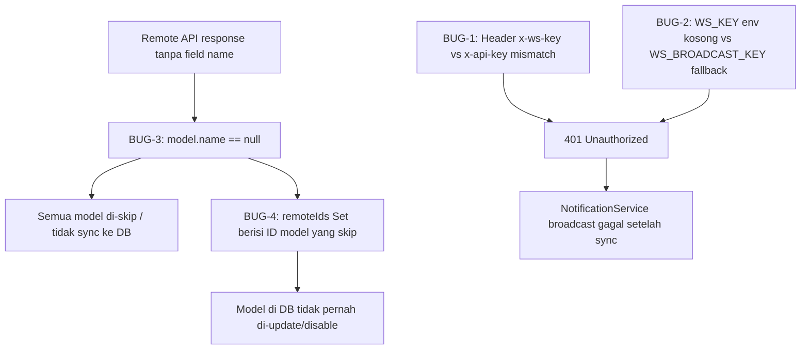
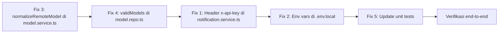

# Plan Perbaikan: Model Sync & WebSocket Notification Bug

**Tanggal:** 2026-05-21  
**Status:** Draft  
**Scope:** `src/services/notification.service.ts`, `src/repositories/model.repo.ts`, `server/websocket.js`, `.env.local`

---

## 1. Ringkasan Masalah

Dua kelompok bug yang saling terkait ditemukan dari log error produksi:

### Grup A — Model Sync: Semua model dari remote API di-skip

```
[ModelService] Skipping model due to missing id or name {
  id: 'openrouter/meta-llama/llama-3.3-70b-instruct:free',
  ...
}
```

### Grup B — WebSocket Broadcast: 401 Unauthorized

```
[NotificationService] Broadcast Error: WS Broadcast failed with status 401:
{"success":false,"error":"Unauthorized: Invalid or missing API Key"}
```

---

## 2. Root Cause Analysis (RCA)

### BUG-1 — Header Key Mismatch (KRITIS)

| Sisi | Header yang Digunakan |
|------|----------------------|
| `NotificationService.broadcast()` | `'x-ws-key': wsKey` |
| `server/websocket.js` (baris 87) | `req.headers['x-api-key']` |

**Kode saat ini di [`notification.service.ts:19`](src/services/notification.service.ts:19):**
```typescript
headers: {
  'Content-Type': 'application/json',
  'x-ws-key': wsKey,   // ← SALAH, server expect 'x-api-key'
}
```

**Kode di [`server/websocket.js:87`](server/websocket.js:87):**
```javascript
const apiKey = req.headers['x-api-key'];   // ← server baca 'x-api-key'
```

Karena nama header tidak cocok, WebSocket server selalu menerima `undefined` sebagai `apiKey`, sehingga validasi `apiKey !== requiredKey` selalu `true` → 401 Unauthorized.

---

### BUG-2 — Env Var `WS_KEY` Tidak Ada di `.env.local` (KRITIS)

File [`.env.local`](.env.local) saat ini:
```env
WS_PORT=3003
# WS_KEY tidak ada!
# WS_BROADCAST_KEY tidak ada!
```

`NotificationService` membaca `process.env.WS_KEY` dengan fallback `''` (string kosong), sedangkan `websocket.js` membaca `process.env.WS_BROADCAST_KEY` dengan fallback `'strong-fallback-key-12345'`.

Meskipun header diperbaiki (BUG-1), broadcast tetap gagal karena value key tidak cocok: `'' !== 'strong-fallback-key-12345'`.

---

### BUG-3 — Remote API Tidak Mengirim Field `name` (KRITIS)

Remote API (`OMNIROUTER_BASE_URL`) mengembalikan model dalam format:
```json
{
  "id": "openrouter/meta-llama/llama-3.3-70b-instruct:free",
  "object": "model",
  "owned_by": "openrouter",
  "root": "meta-llama/llama-3.3-70b-instruct:free",
  "custom": true,
  "capabilities": { "tool_calling": true, "reasoning": true }
}
```

**Tidak ada field `name`!** Namun guard di [`model.repo.ts:98`](src/repositories/model.repo.ts:98) melakukan:
```typescript
if (model.id == null || model.name == null) {
  console.warn('[ModelService] Skipping model...');
  continue;  // ← semua model di-skip karena name selalu null/undefined
}
```

Akibatnya: **0 model berhasil di-sync**, semua di-lewati.

---

### BUG-4 — `remoteIds` Set Berisi ID Model yang Di-skip (SEKUNDER)

Di [`model.repo.ts:79`](src/repositories/model.repo.ts:79):
```typescript
const remoteIds = new Set(models.map((m) => m.id));
```

Set ini dibangun dari **semua** model remote (termasuk yang akan di-skip karena `name == null`). Lalu di baris 86:
```typescript
if (!remoteIds.has(existing.id) && existing.status === 'active') {
  // disable model
}
```

Artinya model yang sudah ada di DB **tidak akan di-disable** (karena ID-nya ada di `remoteIds`), tapi juga **tidak di-update** (karena di-skip). Ini menyebabkan model di DB menjadi stale — tidak pernah dapat update dari remote.

Jika suatu saat model yang seharusnya di-disable justru tetap aktif, atau sebaliknya — data inconsistency.

---

### BUG-5 — Env Var `WS_BROADCAST_KEY` Tidak Terdefinisi di Runtime (SEKUNDER)

`server/websocket.js` baris 88:
```javascript
const requiredKey = process.env.WS_BROADCAST_KEY || 'strong-fallback-key-12345';
```

Jika `WS_BROADCAST_KEY` tidak di-set di environment WebSocket server, ia menggunakan fallback hardcoded. Ini adalah security risk dan menyebabkan mismatch key.

---

## 3. Dependency Map Bug



---

## 4. Rencana Perbaikan Detail

### Fix 1: Perbaiki Header di NotificationService

**File:** [`src/services/notification.service.ts`](src/services/notification.service.ts)

**Sebelum:**
```typescript
headers: {
  'Content-Type': 'application/json',
  'x-ws-key': wsKey,
},
```

**Sesudah:**
```typescript
headers: {
  'Content-Type': 'application/json',
  'x-api-key': wsKey,   // sesuaikan dengan yang dibaca websocket.js
},
```

**Catatan:** Nama env var tetap bisa `WS_KEY`, yang berubah hanya nama HTTP header yang dikirim.

---

### Fix 2: Tambahkan Env Var yang Dibutuhkan di `.env.local`

**File:** [`.env.local`](.env.local)

Tambahkan:
```env
# WebSocket Broadcast Key — harus sama dengan WS_BROADCAST_KEY di websocket server
WS_KEY=strong-fallback-key-12345
WS_BROADCAST_KEY=strong-fallback-key-12345
```

**Penting:** Nilai `WS_KEY` (dibaca oleh `notification.service.ts`) harus identik dengan `WS_BROADCAST_KEY` (dibaca oleh `server/websocket.js`). Di production, gunakan key yang kuat dan unik, bukan fallback.

---

### Fix 3: Perbaiki Field Mapping Remote Model

**File:** [`src/services/model.service.ts`](src/services/model.service.ts)

Tambahkan fungsi normalisasi sebelum data dikirim ke `syncModels()`:

```typescript
/**
 * Normalize model object dari remote API ke format internal.
 * Remote API (OmniRouter) tidak selalu mengirim semua field.
 * Lakukan field mapping dan derivasi nama dari id/root jika name tidak ada.
 */
function normalizeRemoteModel(raw: any): any {
  // Derive name dari root, lalu id jika name tidak ada
  const derivedName = raw.name 
    ?? raw.root 
    ?? raw.id 
    ?? null;

  // Derive provider dari id (format: "provider/model-name")
  const derivedProvider = raw.provider 
    ?? raw.owned_by 
    ?? (raw.id?.includes('/') ? raw.id.split('/')[0] : null)
    ?? null;

  return {
    ...raw,
    name: derivedName,
    provider: derivedProvider,
    // Map capabilities ke field internal
    max_context: raw.context_length ?? raw.max_context ?? 128000,
    max_output_tokens: raw.max_output_tokens ?? null,
    thinking: raw.capabilities?.reasoning ? 1 : 0,
  };
}
```

Lalu di `syncModelsFromRemote()`, normalisasi sebelum sync:
```typescript
const remoteModels = (data.data || []).map(normalizeRemoteModel);
```

---

### Fix 4: Perbaiki `remoteIds` Set — Hanya Sertakan Model yang Akan Di-insert

**File:** [`src/repositories/model.repo.ts`](src/repositories/model.repo.ts)

**Sebelum:**
```typescript
const remoteIds = new Set(models.map((m) => m.id));
```

**Sesudah:**
```typescript
// Hanya sertakan model yang valid (memiliki id dan name) di remoteIds
// agar model yang di-skip tidak salah dikira "masih ada di remote"
const validModels = models.filter(m => m.id != null && m.name != null);
const remoteIds = new Set(validModels.map((m) => m.id));
```

Dan iterasi `for (const model of models)` diganti ke `for (const model of validModels)` agar konsisten — skip yang tidak valid dilakukan di awal, tidak di tengah loop.

Refactored code:
```typescript
async syncModels(models: any[]): Promise<{ created: number; updated: number; disabled: number }> {
  const safe = (v: any): any => (v === undefined ? null : v);
  const { transaction, query } = await import('@/lib/db');

  // Pisahkan model valid sebelum membangun set ID
  const validModels = models.filter(m => {
    if (m.id == null || m.name == null) {
      console.warn('[ModelService] Skipping model due to missing id or name', m);
      return false;
    }
    return true;
  });

  const existingModels = await query<{ id: string; status: string }[]>(
    'SELECT id, status FROM models'
  );
  const existingMap = new Map(existingModels.map((m) => [m.id, m]));
  const remoteIds = new Set(validModels.map((m) => m.id));  // ← hanya valid models

  let created = 0, updated = 0, disabled = 0;

  await transaction(async (conn) => {
    // 1. Disable models yang tidak ada di remote (dari valid models saja)
    for (const existing of existingModels) {
      if (!remoteIds.has(existing.id) && existing.status === 'active') {
        await conn.execute('UPDATE models SET status = ? WHERE id = ?', ['disabled', existing.id]);
        disabled++;
      }
    }

    // 2. Insert/Update hanya valid models
    for (const model of validModels) {
      const isExisting = existingMap.has(model.id);
      const syncDataValue = model.sync_data !== undefined
        ? JSON.stringify(model.sync_data)
        : JSON.stringify(model);

      await conn.execute(
        `INSERT INTO models (...) VALUES (...)
         ON DUPLICATE KEY UPDATE ...`,
        [/* params */]
      );

      isExisting ? updated++ : created++;
    }
  });

  return { created, updated, disabled };
}
```

---

### Fix 5: Update Unit Test NotificationService

**File:** [`src/services/__tests__/notification.service.test.ts`](src/services/__tests__/notification.service.test.ts)

Update ekspektasi header dari `'x-ws-key'` ke `'x-api-key'`:

```typescript
// Sebelum
expect(global.fetch).toHaveBeenCalledWith(
  'http://localhost:8080/broadcast',
  {
    method: 'POST',
    headers: {
      'Content-Type': 'application/json',
      'x-ws-key': '',   // ← lama
    },
    body: JSON.stringify(event),
  }
);

// Sesudah
expect(global.fetch).toHaveBeenCalledWith(
  'http://localhost:8080/broadcast',
  {
    method: 'POST',
    headers: {
      'Content-Type': 'application/json',
      'x-api-key': '',   // ← baru, sesuai dengan websocket.js
    },
    body: JSON.stringify(event),
  }
);
```

---

## 5. Urutan Implementasi



**Urutan prioritas implementasi:**
1. **Fix 3** — `normalizeRemoteModel()` di `model.service.ts` *(paling kritikal, model sync tidak jalan sama sekali)*
2. **Fix 4** — `validModels` filter di `model.repo.ts` *(menghindari disable model yang masih valid)*
3. **Fix 1** — Header `x-api-key` di `notification.service.ts` *(broadcast 401 fix)*
4. **Fix 2** — Tambahkan env var di `.env.local` *(prerequisite untuk Fix 1 bekerja)*
5. **Fix 5** — Update unit tests *(pastikan test tidak broken)*

---

## 6. Perubahan File per Bug

| Bug | File yang Diubah | Jenis Perubahan |
|-----|-----------------|-----------------|
| BUG-1 | `src/services/notification.service.ts` | Ganti `x-ws-key` → `x-api-key` |
| BUG-2 | `.env.local` | Tambah `WS_KEY` dan `WS_BROADCAST_KEY` |
| BUG-3 | `src/services/model.service.ts` | Tambah fungsi `normalizeRemoteModel()` |
| BUG-4 | `src/repositories/model.repo.ts` | Pisahkan `validModels` sebelum `remoteIds` Set |
| TEST | `src/services/__tests__/notification.service.test.ts` | Update header assertion |

---

## 7. Verifikasi Setelah Fix

### Checklist Verifikasi

- [ ] Jalankan model sync — tidak ada log `[ModelService] Skipping model due to missing id or name`
- [ ] Cek DB: model-model dari remote berhasil masuk ke tabel `models`
- [ ] Jalankan broadcast — tidak ada error `401 Unauthorized`
- [ ] Unit test `npm test` semua hijau
- [ ] Cek WebSocket client di browser — model list ter-update setelah sync

### Test Command
```bash
# Jalankan semua unit tests
pnpm test

# Jalankan hanya model-related tests
pnpm test src/services/__tests__/model.service.test.ts
pnpm test src/services/__tests__/notification.service.test.ts
pnpm test src/repositories/__tests__/model.repo.test.ts
```

---

## 8. Risiko & Mitigasi

| Risiko | Dampak | Mitigasi |
|--------|--------|----------|
| `normalizeRemoteModel` menghasilkan `name` tidak deskriptif | Model tampil dengan nama ID-nya | Acceptable — lebih baik dari skip total; admin bisa edit nama manual |
| Model yang sebelumnya di-skip kini masuk ke DB dengan status `disabled` | Admin perlu aktifkan satu per satu | Buat script one-time untuk bulk-activate model baru hasil sync |
| Mengubah nama header HTTP bisa break WebSocket server versi lama | Broadcast gagal jika WS server belum di-restart | Deploy WS server terlebih dahulu, lalu deploy Next.js app |
| Env var `WS_KEY` di `.env.local` bersifat lokal | Di deployment production (Vercel/server) perlu di-set manual | Update dokumentasi deployment; tambah ke secrets manager |

---

## 9. Security Notes

- **Jangan commit `.env.local` ke git.** File ini sudah ada di `.gitignore`.
- Ganti nilai fallback `'strong-fallback-key-12345'` di `server/websocket.js` dengan nilai yang lebih kuat, atau wajibkan env var (throw error jika tidak ada).
- Di production, gunakan key dengan entropy tinggi (min 32 byte hex) untuk `WS_BROADCAST_KEY` dan `WS_KEY`.

---

*Plan ini dibuat berdasarkan audit kode dan log error pada 2026-05-21.*
