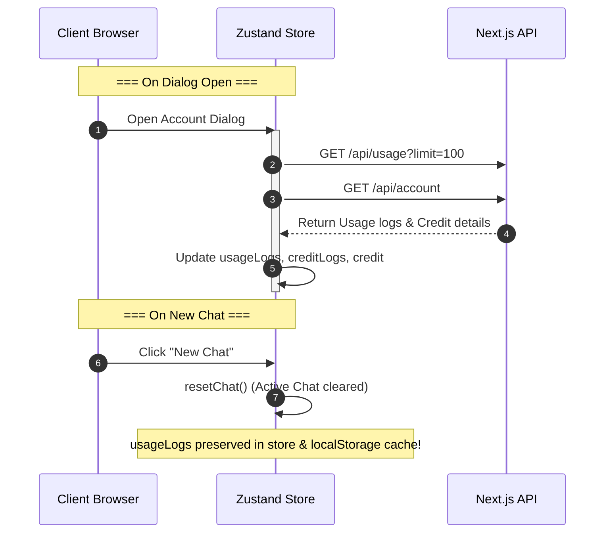

# Blueprint Plan: Fix Missing Account & Usage Logs

This blueprint maps out the solution to fix the missing logs issue in the "Akun & Penggunaan" (Account & Usage) dialog. Currently, both the left panel (usage statistics, charts, cost per model breakdown) and the right panel (timeline history) are empty or not updating correctly.

---

## A. SYSTEM OVERVIEW

The "Akun & Penggunaan" dialog relies on two main datasets managed by the Zustand store (`useChatDataStore`):
1. **`usageLogs`** (Array of `UsageLogEntry`): Stores token usage, inputs, outputs, models, providers, and costs. Used for all left-panel statistics/charts and right-panel timeline usage entries.
2. **`creditLogs`** (Array of `CreditLogEntry`): Stores wallet balance changes (top-ups, bonuses, deductions).

### The Primary Bug (State Overwrite)
When starting a new session or clicking "New Chat", the client store's `resetChat` action is called. Due to an oversight, this action sets `usageLogs: []`. Because `usageLogs` is configured to persist in `localStorage` as cache (via `partialize` configuration), this action destroys the client's cache instantly. No automatic re-fetch mechanism is triggered on subsequent dialog opens, causing the UI to show an empty state.

---

## B. FILE MAPPING

Below are the files that will be modified to fix this issue:

```
src/
├── lib/
│   └── store.ts (Modify: Remove usageLogs from resetChat action)
├── components/
│   └── chat/
│       └── account-dialog/
│           └── index.tsx (Modify: Add safety re-fetch on dialog open)
└── hooks/
    └── useChatStream.ts (Modify: Sync credit logs on client-side)
```

---

## C. MODULE SPECIFICATIONS

### 1. Zustand Store Slice
* **File:** [`src/lib/store.ts`](src/lib/store.ts:505)
* **Function:** `resetChat()`
* **Logic:**
  * Reset chat-specific states: `activeConversationId`, `messages`, `codeBlocks`, `selectedCodeBlock`.
  * **Do NOT** reset billing-specific states like `usageLogs`.

### 2. Account Dialog Controller
* **File:** [`src/components/chat/account-dialog/index.tsx`](src/components/chat/account-dialog/index.tsx)
* **Hook:** `useEffect` (trigger on dialog open)
* **Logic:**
  * When `accountDialogOpen === true` and `isLoggedIn === true`, execute background HTTP `GET` requests to `/api/usage?limit=100` and `/api/account`.
  * Update store states with fresh data: `setUsageLogs`, `setCreditLogs`, `setCredit`.
  * This acts as a robust safety net to ensure statistics are accurate and synced across devices/tabs.

### 3. SSE Stream Consumer
* **File:** [`src/hooks/useChatStream.ts`](src/hooks/useChatStream.ts:419)
* **Hook:** `useChatStream`
* **Logic:**
  * Upon receiving the `done` event containing final usage, besides updating `usageLogs` and `credit`, reconstruct and append a matching `CreditLogEntry` to `creditLogs` locally in real-time so that the timeline displays immediately without a page refresh.

---

## D. DATA FLOW & ERROR HANDLING

### Data Flow for Logs Recovery



### Error Handling
- **API Failures:** If background re-fetches fail, gracefully fall back to existing persisted/cached `localStorage` states without showing blocking UI error screens.
- **Race Conditions:** Ensure that background fetches do not trigger state overrides if user logs out mid-flight.

---

## E. EXECUTION SEQUENCE

### Step 1: Fix Zustand Store
Modify `resetChat` in [`src/lib/store.ts`](src/lib/store.ts:505) to stop clearing the usage logs cache.

### Step 2: Implement Background Re-fetch
Add an automated fetch hook in [`src/components/chat/account-dialog/index.tsx`](src/components/chat/account-dialog/index.tsx) to pull the latest usage logs and credit records when the modal opens.

### Step 3: Implement Live Client-side Credit Log Sync
In [`src/hooks/useChatStream.ts`](src/hooks/useChatStream.ts:419), synthesize a credit log entry on stream completion so the user can see their credit deduction instantly in the right-side timeline.

---

## F. VERIFICATION CHECKLIST
- [ ] Create a new chat session using any reasoning/non-reasoning model.
- [ ] Open "Akun & Penggunaan" dialog.
- [ ] Verify that Left Panel stats (Spent, Request count, Input/Output Tokens) populate correctly.
- [ ] Verify that "Biaya per Model" displays a populated bar chart.
- [ ] Verify that Right Panel timeline shows recent usages.
- [ ] Click "New Chat", go back to the dialog, and verify that the logs are **still fully present** (persisted).
