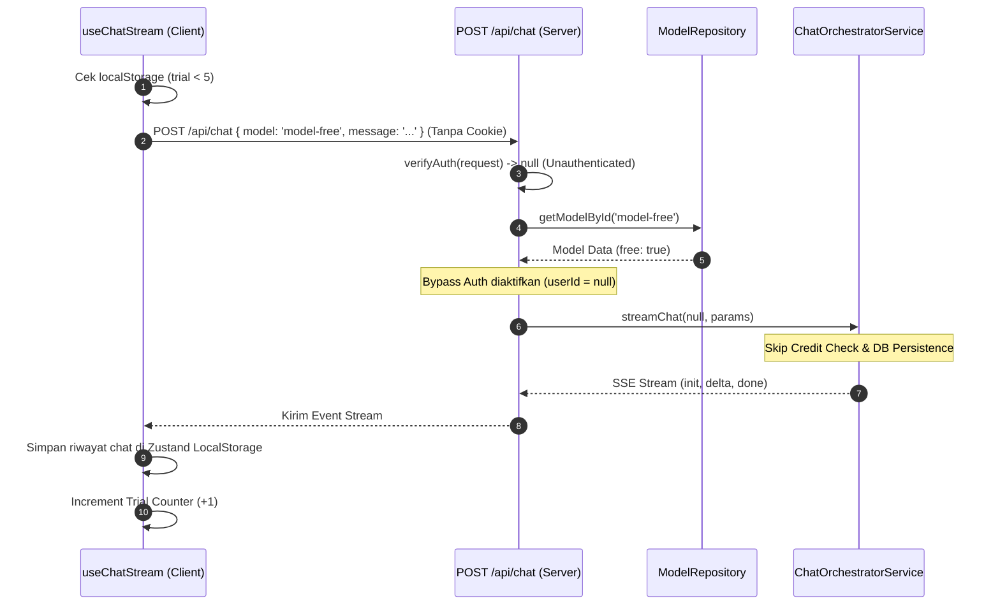

# Blueprint: Perbaikan Autentikasi Anonymous User untuk Chat Model Free

Dokumen ini mendefinisikan rencana arsitektur dan spesifikasi modul untuk memperbaiki masalah kegagalan chat user anonymous pada model Free (Error 401 Unauthorized dan kegagalan Foreign Key database).

---

## A. RINGKASAN SISTEM

### Target Arsitektur
Sistem yang dirancang akan mengizinkan pengguna anonim (belum masuk/tidak memiliki sesi) untuk mengirim pesan hingga **maksimal 5 kali** khusus pada model-model kategori **Free** (misal: model gratis). 

- **Client-Side:** Mengontrol pembatasan trial gratis menggunakan `localStorage` (`anonymous_trial_count`) dengan batas maksimal 5 pesan.
- **Server-Side:** Melewati pengecekan JWT/autentikasi wajib pada endpoint `/api/chat` *hanya* jika model yang diminta dikonfigurasi sebagai model **Free**. Untuk pengguna anonim, semua operasi penulisan database (simpan percakapan, simpan pesan, pencatatan log penggunaan) akan **di-skip** untuk mencegah pelanggaran integritas data (*Foreign Key Constraints*).

### Scope Perubahan
- **API `/api/chat` Route:** Memodifikasi validasi autentikasi agar bersikap kondisional (mengizinkan bypass jika model adalah Free).
- **Chat Orchestrator Service:** Mengadaptasi fungsionalitas agar menerima parameter `userId` bernilai `null` / `undefined`, serta melompati proses pembacaan kredit, penyimpanan percakapan/pesan, dan penulisan log jika `userId` kosong.

---

## B. PEMETAAN FILE

Perubahan akan difokuskan pada dua file utama berikut:

```
src/
├── app/
│   └── api/
│       └── chat/
│           └── route.ts             # Ditambahkan bypass auth kondisional untuk model Free
└── services/
    └── chat-orchestrator.service.ts # Ditambahkan bypass credit check & skip DB write jika userId falsy
```

---

## C. SPESIFIKASI MODUL

### 1. `/src/app/api/chat/route.ts`
Modul ini menangani permintaan POST chat. Kita harus mengizinkan request tanpa token valid dengan syarat model yang dipilih adalah model Free.

- **Fungsi `POST`:**
  - Kloning/Baca data `model` dari request body sebelum proses autentikasi.
  - Cari detail model di database menggunakan `ModelRepository.getModelById(modelId)`.
  - Jika token autentikasi tidak valid ATAU tidak ada:
    - Jika model tidak ditemukan atau `model.free !== true`, kembalikan error `401 Unauthorized`.
    - Jika model ditemukan dan `model.free === true`, teruskan eksekusi dengan `userId = null`.
  - Jika token autentikasi ada dan valid, gunakan `userId` dari token tersebut.

### 2. `/src/services/chat-orchestrator.service.ts`
Modul orchestrator harus mendukung `userId` opsional (`string | null`).

- **Fungsi `streamChat(userId: string | null, params: ...)`:**
  - **Pengecekan Kredit (Baris ~197):** Jalankan `getCreditRemaining` hanya jika `userId` bernilai truthy.
  - **Pembuatan ID Percakapan (Baris ~203):** Jika `userId` falsy, lewati `ChatPersistenceService.ensureConversation`. Cukup generate `genConversationId` acak langsung di memory tanpa menulis ke tabel `conversations` database.
  - **Pengecekan Kredit Estimasi (Baris ~383):** Pastikan pengecekan kredit di-bypass penuh jika `userId` falsy.
  - **Penyimpanan Pesan & Log Penggunaan (Baris ~521):** Modifikasi blok `if (userId)` untuk memastikan pesan dan log penggunaan tidak disimpan ke database untuk sesi anonim.
  - **Pemotongan Kredit (Baris ~577):** Bypass pengurangan kredit jika `userId` falsy.

---

## D. ALUR DATA & ERROR

### Alur Data Pengguna Anonim (Model Free)



### Penanganan Error (Failure Handling)

1. **User Anonim Memilih Model Berbayar:**
   - Server-side akan mendeteksi `auth === null` dan `model.free !== true`.
   - Mengembalikan response `401 Unauthorized` dengan pesan bahasa Indonesia: `"Silakan masuk dengan akun untuk menggunakan model premium ini."`
2. **Batas Trial Tercapai:**
   - Client-side di `useChatStream.ts` mendeteksi `trialCount >= 5`.
   - Menolak mengirim request API dan langsung memunculkan asisten bubble internal dengan ajakan registrasi/login.

---

## E. URUTAN EKSEKUSI

Berikut adalah langkah-step implementasi mendetail untuk fase pengkodean (*Code Mode*):

### Langkah 1: Perbaikan Auth Gate di API Route
Edit file [`src/app/api/chat/route.ts`](src/app/api/chat/route.ts:21):
- Ubah pemanggilan `verifyAuth` agar mengambil body secara dinamis terlebih dahulu.
- Hubungkan pencarian model ke `ModelRepository`.
- Buat logika fallback jika token tidak ada, validasi kebebasan model, dan definisikan `userId` kondisional.

### Langkah 2: Perbaikan Orchestrator Service
Edit file [`src/services/chat-orchestrator.service.ts`](src/services/chat-orchestrator.service.ts:109):
- Izinkan parameter `userId` bertipe `string | null | undefined`.
- Tambahkan proteksi `if (userId)` di sekeliling pembacaan kredit awal.
- Buat logic fallback untuk `genConversationId` tanpa memanggil `ensureConversation` di DB jika `userId` falsy:
  ```typescript
  const genConversationId = conversationId || `conv_anon_${Date.now()}_${Math.random().toString(36).slice(2, 6)}`;
  ```
- Tambahkan proteksi di sekeliling pengecekan kredit sebelum eksekusi API LLM.
- Pastikan penyimpanan pesan ke database (`ChatPersistenceService.saveMessage`) tidak dijalankan jika `userId` falsy (sudah dibungkus `if (userId)` tapi harus dikonfirmasi).

### Langkah 3: Pengujian Fungsionalitas
- Jalankan test suite: `pnpm test`
- Uji alur chat anonim di UI dengan mengosongkan cookie auth dan menggunakan model berlabel Free.
- Pastikan tidak ada log error `401` maupun constraint database di server terminal.
