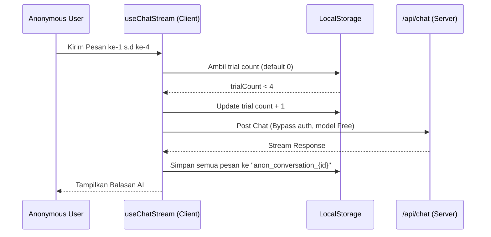
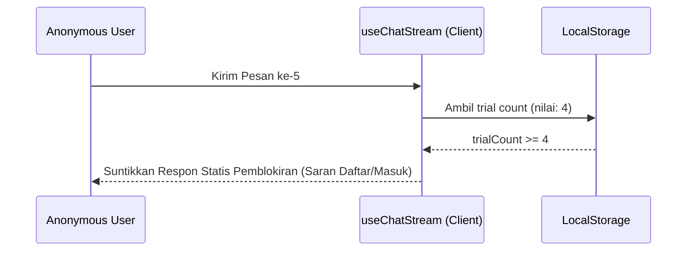

# Blueprint: Anonymous User Trial & Local Storage Persistence Fix

Dokumen ini mendefinisikan rancangan arsitektur dan spesifikasi modul untuk melakukan pembatasan trial chat anonymous user (maksimal 4 pesan), melakukan persistensi riwayat chat di client-side (localStorage) agar percakapan anonymous tidak hilang saat dimuat ulang, serta membersihkan riwayat chat lokal tersebut saat user berhasil login atau register akun baru.

---

## A. RINGKASAN SISTEM

### Target Arsitektur
1. **Limit 4 Pesan (Trial Guard):** Pengguna anonim dibatasi hanya bisa mengirim maksimal 4 pesan pada model gratis. Pesan ke-5 akan diblokir dengan memberikan balasan sistem statis yang menganjurkan pengguna untuk mendaftar/masuk akun.
2. **Local Storage Persistence untuk Anonymous:**
   - Semua percakapan anonymous disimpan di client-side melalui state store dan localStorage.
   - Pesan-pesan untuk percakapan anonymous disimpan secara lokal dengan key format `anon_conversation_{conversationId}`.
   - Sidebar hanya menampilkan percakapan anonymous yang masih memiliki data pesan di localStorage. Jika kosong, percakapan tidak akan ditampilkan.
   - Membuka percakapan anonymous tidak akan menembak API backend (`/api/conversations/*`), melainkan mengambil riwayat pesan langsung dari localStorage.
3. **Pembersihan Data saat Login/Register:**
   - Ketika proses login atau registrasi berhasil, semua data percakapan anonymous (baik di state store maupun di localStorage) harus dihapus secara bersih.
   - Sesi baru yang sudah terautentikasi akan dimulai tanpa membawa riwayat anonymous demi menjaga konsistensi integritas database dan data user.

---

## B. PEMETAAN FILE

| File | Perubahan | Deskripsi |
|---|---|---|
| [`src/hooks/useChatStream.ts`](src/hooks/useChatStream.ts) | Modifikasi `handleSend` & `processSSEStream` | Mengubah batas trial ke 4 pesan. Menyimpan array pesan ke localStorage untuk percakapan anonymous ketika streaming selesai. |
| [`src/components/chat/chat-input.tsx`](src/components/chat/chat-input.tsx) | Modifikasi `handleSend` | Menyesuaikan perhitungan toast reminder agar bersesuaian dengan batas maksimal 4 pesan. |
| [`src/hooks/useChatActions.ts`](src/hooks/useChatActions.ts) | Modifikasi `handleLoadConversation` | Mencegah API call untuk ID percakapan anonymous (`conv_anon_*`) dan mengambil pesan dari localStorage sebagai gantinya. |
| [`src/lib/store.ts`](src/lib/store.ts) | Modifikasi `login` action | Menambahkan logika pembersihan (cleanup) data anonymous (percakapan, pesan, dan trial count) dari state store dan localStorage. |
| [`src/components/chat/sidebar.tsx`](src/components/chat/sidebar.tsx) | Modifikasi penyaringan daftar percakapan | Memfilter percakapan anonymous agar hanya ditampilkan jika riwayat pesannya terdeteksi ada di localStorage. |

---

## C. SPESIFIKASI MODUL

### 1. Batas Trial Guard (`src/hooks/useChatStream.ts`)
- **Key Storage:** `anonymous_trial_count`
- **Max Limit:** `4`
- **Modifikasi:**
  ```typescript
  const TRIAL_KEY = 'anonymous_trial_count';
  const MAX_TRIAL = 4; // Berubah dari 5 menjadi 4
  ```

### 2. Penyimpanan Riwayat Pesan Lokal (`src/hooks/useChatStream.ts`)
- Ketika streaming asisten selesai pada model Free dan user belum login (`!isLoggedIn`):
  ```typescript
  const key = `anon_conversation_${convId}`;
  const currentMessages = useChatStore.getState().messages;
  localStorage.setItem(key, JSON.stringify(currentMessages));
  ```

### 3. Pemuatan Percakapan Lokal (`src/hooks/useChatActions.ts`)
- Di dalam `handleLoadConversation(id)`:
  ```typescript
  if (id.startsWith('conv_anon_')) {
    const key = `anon_conversation_${id}`;
    const stored = localStorage.getItem(key);
    if (stored) {
      const messages = JSON.parse(stored);
      setMessages(messages);
      setActiveCategory('chat');
      setActiveConversationId(id);
    } else {
      toast({
        title: 'Percakapan tidak ditemukan',
        description: 'Percakapan lokal telah kedaluwarsa atau dihapus.',
        variant: 'destructive',
      });
    }
    return; // Bypass fetch API
  }
  ```

### 4. Pembersihan Data Anonymous (`src/lib/store.ts`)
- Di dalam action `login(user)`:
  ```typescript
  login: (user) => {
    // 1. Dapatkan daftar percakapan saat ini
    const { conversations } = useChatDataStore.getState();
    
    // 2. Bersihkan localStorage dari riwayat anonymous
    conversations.forEach((c) => {
      if (c.id.startsWith('conv_anon_')) {
        localStorage.removeItem(`anon_conversation_${c.id}`);
      }
    });
    localStorage.removeItem('anonymous_trial_count');

    // 3. Filter keluar percakapan anonymous dari state store
    const cleanConversations = conversations.filter((c) => !c.id.startsWith('conv_anon_'));

    set({
      user,
      isLoggedIn: true,
      conversations: cleanConversations,
      messages: [], // Reset active messages
      activeConversationId: null,
    });
  }
  ```

### 5. Filtering Sidebar (`src/components/chat/sidebar.tsx`)
- Pada saat merender `conversations`, pastikan percakapan anonymous difilter secara aman:
  ```typescript
  const visibleConversations = conversations.filter((c) => {
    if (c.id.startsWith('conv_anon_')) {
      const stored = localStorage.getItem(`anon_conversation_${c.id}`);
      return stored && JSON.parse(stored).length > 0;
    }
    return true;
  });
  ```

---

## D. ALUR DATA & ERROR

### Alur Normal Pengiriman Pesan & Penyimpanan


### Alur Batas Trial Tercapai (Pesan ke-5)


---

## E. URUTAN EKSEKUSI

1. **Ubah Batas Maksimum:** Edit [`src/hooks/useChatStream.ts`](src/hooks/useChatStream.ts) dan [`src/components/chat/chat-input.tsx`](src/components/chat/chat-input.tsx) untuk membatasi `MAX_TRIAL = 4`.
2. **Implementasikan Logika Penyimpanan Lokal:** Tambahkan penyimpanan array pesan ke `localStorage` setelah streaming selesai di [`src/hooks/useChatStream.ts`](src/hooks/useChatStream.ts) baik untuk respon sukses streaming maupun fallback non-streaming.
3. **Bypass API pada Load Conversation:** Modifikasi [`src/hooks/useChatActions.ts`](src/hooks/useChatActions.ts) agar memuat dari `localStorage` jika ID diawali dengan `conv_anon_`.
4. **Implementasikan Filter Sidebar:** Edit [`src/components/chat/sidebar.tsx`](src/components/chat/sidebar.tsx) agar menyaring percakapan anonim yang tidak memiliki riwayat data di `localStorage`.
5. **Tambahkan Cleanup pada Auth Login:** Edit `login` action di [`src/lib/store.ts`](src/lib/store.ts) untuk mendeteksi dan menghapus seluruh percakapan serta riwayat anonymous.
6. **Verifikasi dan Uji Coba:** Jalankan tes unit/integrasi untuk memastikan tidak ada pemanggilan API yang bocor untuk user anonim dan batas pengiriman berfungsi tepat 4 kali.
