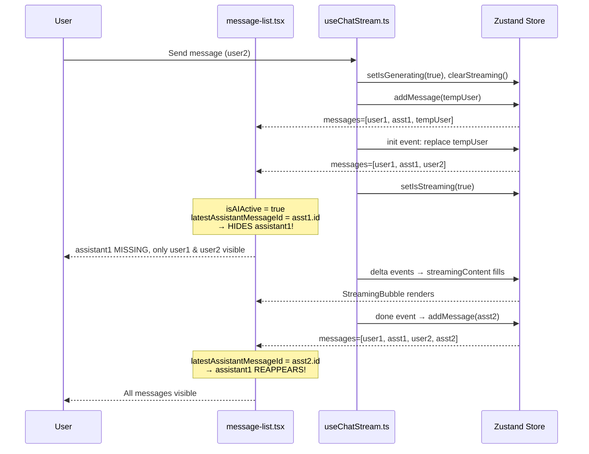
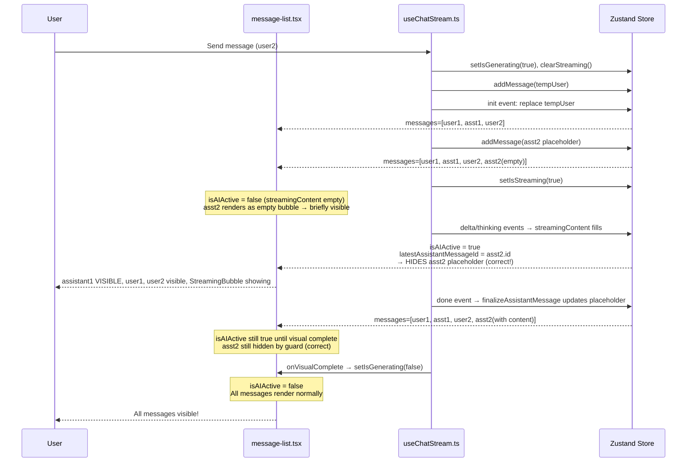

# Blueprint: Fix Assistant Bubble Disappearing During Streaming

## A. RINGKASAN SISTEM

### Bug Description
When a user sends the 2nd message (user2), the fake stream animation begins but the **previous** AI bubble (assistant1) disappears for several seconds, then reappears after streaming completes.

### Root Cause
The rendering logic in [`message-list.tsx`](../src/components/chat/message-list.tsx:508-511) conditionally hides the "latest assistant message" during streaming:

```tsx
// Line 498
const isAIActive = isGenerating && (isThinkingStreaming || streamingThinkingContent.length > 0 || streamingContent.length > 0);

// Lines 444-449
const latestAssistantMessageId = useMemo(() => {
  for (let i = messages.length - 1; i >= 0; i--) {
    if (messages[i].role === 'assistant') return messages[i].id;
  }
  return null;
}, [messages]);

// Lines 508-511 — THE BUG
{messages.map((msg) => {
  if (isAIActive && msg.id === latestAssistantMessageId) {
    return null; // ← hides the WRONG message
  }
  return <MessageBubble key={msg.id} ... />;
})}
```

**Critical timing gap:**
1. `handleSend()` → sets `isGenerating=true`, `clearStreaming()`, adds temp user message
2. `init` event → replaces temp user with real user message, sets `isStreaming(true)` → triggers `isAIActive = true`
3. **BUT** the new assistant message has NOT been added to `messages[]` yet — it's only added on `done` event
4. `latestAssistantMessageId` scans `messages[]` from the end → finds `assistant1.id` (the previous assistant)
5. `isAIActive && msg.id === latestAssistantMessageId` → hides assistant1!

### Fix Strategy (2 changes in `useChatStream.ts`)

| # | File | Change | Purpose |
|---|------|--------|---------|
| 1 | `useChatStream.ts:293` (init handler) | After `setMessages(updatedMessages)`, add assistant placeholder via `addMessage()` | Makes `latestAssistantMessageId` point to the NEW assistant |
| 2 | `useChatStream.ts:178-201` (finalizeAssistantMessage) | Replace `if (alreadyExists) return;` with update-in-place logic | Updates placeholder content instead of skipping |

---

## B. PEMETAAN FILE

### Files to Modify

```
src/
├── hooks/
│   └── useChatStream.ts        ← MODIFY (2 locations)
│       ├── Line 293: Add assistant placeholder in `init` event handler
│       └── Line 186-200: Rewrite `finalizeAssistantMessage` update logic
```

### Files NOT Modified (For Context)

| File | Role | Reason Unchanged |
|------|------|-----------------|
| `src/components/chat/message-list.tsx` | Rendering logic with `isAIActive` guard | The fix makes `latestAssistantMessageId` resolve correctly, so the guard will hide the correct (new, empty) placeholder instead of the previous assistant |
| `src/lib/store.ts` | Zustand store with `addMessage()`, `setMessages()` | Already has all methods needed |
| `src/components/chat/message-bubble.tsx` | Individual bubble rendering | No changes needed |

---

## C. SPESIFIKASI MODUL

### Change 1: Add Assistant Placeholder in `init` Handler

**File:** [`src/hooks/useChatStream.ts`](../src/hooks/useChatStream.ts:277-314)

**Current code (lines 277-314):**
```tsx
case 'init': {
  // ... (replaces temp user with real user message)
  useChatStore.getState().setMessages(updatedMessages);
  setIsStreaming(true);
  
  // Set active conversation ID...
  // ... (rest of init handler)
  break;
}
```

**Problem:** After `setMessages(updatedMessages)`, the `messages[]` array contains `[user1, assistant1, user2]`. There is no assistant2 yet. When `isAIActive` becomes true (via `setIsStreaming(true)`), `latestAssistantMessageId` finds assistant1.

**Fix:** Add an empty assistant placeholder immediately after the temp user replacement:

```tsx
case 'init': {
  // ... existing code: replace temp user ...
  useChatStore.getState().setMessages(updatedMessages);
  
  // ★ NEW: Add assistant placeholder so latestAssistantMessageId points to the NEW assistant
  const assistantPlaceholder = {
    id: event.assistantMessageId,
    role: 'assistant' as const,
    content: '',
    createdAt: new Date().toISOString(),
  };
  useChatStore.getState().addMessage(assistantPlaceholder);
  
  setIsStreaming(true);
  // ... rest unchanged ...
  break;
}
```

**Effect:** `messages[]` becomes `[user1, assistant1, user2, assistant2(empty)]`. `latestAssistantMessageId` now returns `assistant2.id`. The guard hides the empty assistant2 placeholder (rendered as `null`) while the `StreamingBubble` shows the animation alongside it.

### Change 2: Rewrite `finalizeAssistantMessage` to Update In-Place

**File:** [`src/hooks/useChatStream.ts`](../src/hooks/useChatStream.ts:178-203)

**Current code (lines 178-203):**
```tsx
const finalizeAssistantMessage = useCallback(
  (assistantMsgId: string, content: string, thinkingContent: string, isThinkingEnabled: boolean) => {
    let finalContent = '';
    if (thinkingContent && isThinkingEnabled) {
      finalContent += `<details>\n<summary>💭 Proses Berpikir</summary>\n\n${thinkingContent}\n\n</details>\n\n`;
    }
    finalContent += content;

    const currentMessages = useChatStore.getState().messages;
    const alreadyExists = currentMessages.find((m) => m.id === assistantMsgId);
    if (alreadyExists) return;  // ← THIS IS THE PROBLEM: exits early when placeholder exists

    const messagesWithResponse = [
      ...currentMessages,
      {
        id: assistantMsgId,
        role: 'assistant' as const,
        content: finalContent,
        createdAt: new Date().toISOString(),
      },
    ];
    useChatStore.getState().setMessages(messagesWithResponse);
    parseAndSaveCodeBlocks(content, assistantMsgId);
  },
  [parseAndSaveCodeBlocks]
);
```

**Problem:** After Change 1, the placeholder exists in `messages[]`. The guard `if (alreadyExists) return;` prevents the final content from being stored.

**Fix:** Replace the skip-on-exist pattern with an update-in-place pattern:

```tsx
const finalizeAssistantMessage = useCallback(
  (assistantMsgId: string, content: string, thinkingContent: string, isThinkingEnabled: boolean) => {
    let finalContent = '';
    if (thinkingContent && isThinkingEnabled) {
      finalContent += `<details>\n<summary>💭 Proses Berpikir</summary>\n\n${thinkingContent}\n\n</details>\n\n`;
    }
    finalContent += content;

    const currentMessages = useChatStore.getState().messages;
    const existingIndex = currentMessages.findIndex((m) => m.id === assistantMsgId);
    
    if (existingIndex >= 0) {
      // ★ CHANGED: Update placeholder content in-place
      const updated = [...currentMessages];
      updated[existingIndex] = {
        ...updated[existingIndex],
        content: finalContent,
      };
      useChatStore.getState().setMessages(updated);
    } else {
      // Fallback: append new (non-streaming / partial content path)
      useChatStore.getState().setMessages([
        ...currentMessages,
        {
          id: assistantMsgId,
          role: 'assistant' as const,
          content: finalContent,
          createdAt: new Date().toISOString(),
        },
      ]);
    }
    
    parseAndSaveCodeBlocks(content, assistantMsgId);
  },
  [parseAndSaveCodeBlocks]
);
```

**Effect:** When `done` event fires, the empty placeholder is updated with the real final content. The fallback path handles edge cases where `finalizeAssistantMessage` is called without a prior placeholder (e.g., `handleStop`, partial content on error, non-streaming fallback).

---

## D. ALUR DATA & ERROR

### Normal Flow (With Fix)

```
T0: User clicks Send
    messages[] = [user1, assistant1]
    handleSend() called
    → setIsGenerating(true)
    → clearStreaming()  (resets streamingContent, streamingThinkingContent to '')
    → addMessage(tempUser)  → messages[] = [user1, assistant1, tempUser]
    → isAIActive = false (streamingContent is empty)

T1: SSE 'init' event arrives
    → setMessages(updatedMessages)  → messages[] = [user1, assistant1, user2]
    → addMessage(assistantPlaceholder)  → messages[] = [user1, assistant1, user2, assistant2(empty)]
    → setIsStreaming(true)
    → isAIActive = true (isStreaming=true, streamingContent='' but isThinkingStreaming? No—streamingContent.length===0 initially)
    
    Wait—there's a subtlety: `isAIActive` checks `streamingContent.length > 0`. After clearStreaming(), 
    streamingContent is ''. Will isAIActive be true immediately?
    
    isAIActive = isGenerating(true) && (isThinkingStreaming(false) || streamingThinkingContent.length(0) > 0 || streamingContent.length(0) > 0)
    → isAIActive = false initially after init!
    
    But as soon as 'thinking' or 'delta' event fires:
    → appendStreamingThinkingContent() → streamingThinkingContent.length > 0 → isAIActive = true
    → OR appendStreamingContent() → streamingContent.length > 0 → isAIActive = true
    
    So there's still a brief moment after init where isAIActive is false.
    But that's acceptable—the placeholder exists in messages[] so it renders as a normal (empty) bubble.
    And when isAIActive becomes true, latestAssistantMessageId points to assistant2, not assistant1!

T2: SSE 'thinking' events
    → appendStreamingThinkingContent(chunk) → streamingThinkingContent.length > 0
    → isAIActive = true
    → StreamingBubble renders (thinking phase)
    → MessageList hides assistant2 (empty placeholder) — same as before, but correct message

T3: SSE 'delta' events
    → appendStreamingContent(chunk) → streamingContent.length > 0
    → StreamingBubble transitions to responding phase
    → assistant2 still hidden (correctly)

T4: SSE 'done' event
    → setIsStreaming(false)
    → finalizeAssistantMessage(assistantMsgId, fullContent, ...)
      → Finds existingIndex (placeholder exists)
      → setMessages(updated)  → messages[] = [user1, assistant1, user2, assistant2(with content)]
    → latestAssistantMessageId recalculates → still assistant2.id (correct)

T5: StreamingBubble visual completion
    → onVisualComplete fires → setIsGenerating(false)
    → isAIActive = false
    → All messages render normally
```

### Error Flow

**Case: Stream interrupted mid-way (no 'done' event)**
```
→ Line 438-441: if (!streamDone && fullContent.length > 0)
  → finalizeAssistantMessage(assistantMsgId, fullContent, ...)
    → Finds existingIndex → updates placeholder with partial content ✓
```

**Case: Read error in stream**
```
→ Line 445-449: if (fullContent.length > 0 || fullThinkingContent.length > 0)
  → finalizeAssistantMessage(assistantMsgId, fullContent, ...)
    → Finds existingIndex → updates placeholder with partial content ✓
```

**Case: User clicks Stop**
```
→ handleStop() at line 762-788
  → Currently creates a NEW assistant message with msg_a_stopped_${Date.now()} id
  → This creates a DUPLICATE if placeholder already exists!
  
  ★ Requires separate fix: handleStop should check for existing placeholder
```

**Case: Non-streaming fallback (handleNonStreamingResponse)**
```
→ Line 520: addMessage(assistantMessage) directly
  → No placeholder exists → normal append ✓
```

### handleStop Edge Case

The `handleStop` function (line 762) currently creates a **new** assistant message ID (`msg_a_stopped_${Date.now()}`). With a placeholder already in `messages[]`, this would create a duplicate assistant message.

**Recommended fix in `handleStop`:**

```tsx
const handleStop = useCallback(() => {
  if (abortControllerRef.current) {
    abortControllerRef.current.abort();
  }
  const { streamingContent, streamingThinkingContent, messages: currentMessages } = useChatStore.getState();
  
  if (streamingContent.length > 0 || streamingThinkingContent.length > 0) {
    let finalContent = '';
    if (streamingThinkingContent) {
      finalContent += `<details>\n<summary>💭 Proses Berpikir</summary>\n\n${streamingThinkingContent}\n\n</details>\n\n`;
    }
    finalContent += streamingContent;

    // ★ Check if placeholder already exists from init event
    const existingIndex = currentMessages.findIndex((m) => m.id.startsWith('msg_a_'));
    
    if (existingIndex >= 0) {
      // Update existing placeholder
      const updated = [...currentMessages];
      updated[existingIndex] = { ...updated[existingIndex], content: finalContent };
      useChatStore.getState().setMessages(updated);
    } else {
      // Fallback: add new
      const assistantMsgId = `msg_a_stopped_${Date.now()}`;
      useChatStore.getState().setMessages([
        ...currentMessages,
        { id: assistantMsgId, role: 'assistant', content: finalContent, createdAt: new Date().toISOString() },
      ]);
    }
  }
  clearStreaming();
  setIsGenerating(false);
}, [clearStreaming, setIsGenerating]);
```

---

## E. URUTAN EKSEKUSI (Step-by-Step for Code Mode)

### Step 1: Open `src/hooks/useChatStream.ts`

### Step 2: Modify `init` Event Handler (~line 293)

After `useChatStore.getState().setMessages(updatedMessages);` at line 293 (and BEFORE `setIsStreaming(true);` at line 294), insert:

```tsx
// Add assistant placeholder so latestAssistantMessageId resolves correctly
const assistantPlaceholder: Message = {
  id: event.assistantMessageId,
  role: 'assistant',
  content: '',
  createdAt: new Date().toISOString(),
};
useChatStore.getState().addMessage(assistantPlaceholder);
```

**Requires import:** `Message` from `@/lib/store` (check if already imported — `useChatDataStore` is imported at line 4).

If `Message` type is not already imported, add to line 4:
```tsx
import { useChatStore, useChatDataStore, type Message, type UsageLogEntry } from '@/lib/store';
```

### Step 3: Modify `finalizeAssistantMessage` (~lines 178-201)

Replace the entire function body:

```tsx
const finalizeAssistantMessage = useCallback(
  (assistantMsgId: string, content: string, thinkingContent: string, isThinkingEnabled: boolean) => {
    let finalContent = '';
    if (thinkingContent && isThinkingEnabled) {
      finalContent += `<details>\n<summary>💭 Proses Berpikir</summary>\n\n${thinkingContent}\n\n</details>\n\n`;
    }
    finalContent += content;

    const currentMessages = useChatStore.getState().messages;
    const existingIndex = currentMessages.findIndex((m) => m.id === assistantMsgId);

    if (existingIndex >= 0) {
      // Update existing placeholder with final content
      const updated = [...currentMessages];
      updated[existingIndex] = {
        ...updated[existingIndex],
        content: finalContent,
      };
      useChatStore.getState().setMessages(updated);
    } else {
      // Fallback: append new (non-streaming / partial content path)
      useChatStore.getState().setMessages([
        ...currentMessages,
        {
          id: assistantMsgId,
          role: 'assistant' as const,
          content: finalContent,
          createdAt: new Date().toISOString(),
        },
      ]);
    }

    parseAndSaveCodeBlocks(content, assistantMsgId);
  },
  [parseAndSaveCodeBlocks]
);
```

### Step 4: (Optional) Fix `handleStop` (~lines 762-788)

Update to check for existing placeholder before creating a duplicate message. See recommended code in Section D above.

### Step 5: Run Tests

```bash
pnpm test
```

Pay special attention to:
- `src/hooks/__tests__/useChatStream.test.tsx` — existing tests for streaming logic
- Any visual regression tests for message rendering

### Step 6: Verify Manually

1. Start dev server: `pnpm dev`
2. Open chat UI
3. Send first message → wait for full response
4. Send second message → **observe that assistant1 bubble stays visible** during streaming
5. Wait for streaming complete → **assistant2 bubble appears with content**
6. Repeat 2-3 more times to ensure no regression

---

## F. DIAGRAM: Data Flow Comparison

### Before Fix (Buggy)


### After Fix (Correct)


---

## G. VERIFIKASI & TESTING

### Test Scenarios

| # | Scenario | Expected Result | Verification Method |
|---|----------|-----------------|-------------------|
| 1 | Send 2nd message, streaming begins | assistant1 stays visible | Visual inspection |
| 2 | Streaming in progress | StreamingBubble shows, previous bubbles intact | Visual inspection |
| 3 | Streaming completes | assistant2 appears with full content | Visual inspection |
| 4 | Stop mid-stream | Partial content saved, no duplicate messages | Visual + console |
| 5 | Error during streaming | Partial content saved as assistant message | Visual + console |
| 6 | Rapid send (3rd, 4th message) | No disappearing bubbles at any point | Visual inspection |

### Regression Risks

1. **`handleStop` creates duplicate** if placeholder exists → requires optional fix in Step 4
2. **`Message` type import** may need adding to imports if not already present
3. **Temporary flash of empty placeholder** between `addMessage(placeholder)` and first `delta` event — the empty bubble renders briefly before `isAIActive` becomes true. This is a minor cosmetic issue that could be addressed by making the placeholder invisible (e.g., CSS `opacity: 0` or `display: none` when content is empty).

### Suggested Improvement: Prevent Empty Bubble Flash

If the brief flash of an empty placeholder is undesirable, add a CSS class to hide messages with empty content during streaming:

In [`message-list.tsx`](../src/components/chat/message-list.tsx:508-522), modify the render:

```tsx
{messages.map((msg) => {
  if (isAIActive && msg.id === latestAssistantMessageId) {
    return null;
  }
  return (
    <MessageBubble
      key={msg.id}
      message={msg}
      isLatestUserMessage={msg.id === latestUserMessageId}
      isLatestAssistantMessage={msg.id === latestAssistantMessageId}
      onEditConfirm={handleEditConfirm}
      onRegenerate={handleRegenerate}
      className={!msg.content && isAIActive ? 'hidden' : ''}
    />
  );
})}
```

But since this guard already returns `null` for `latestAssistantMessageId` when `isAIActive`, the empty placeholder is already hidden via `null` return. **The flash only happens in the brief window between init and first delta.** This is negligible and may not require a fix.
