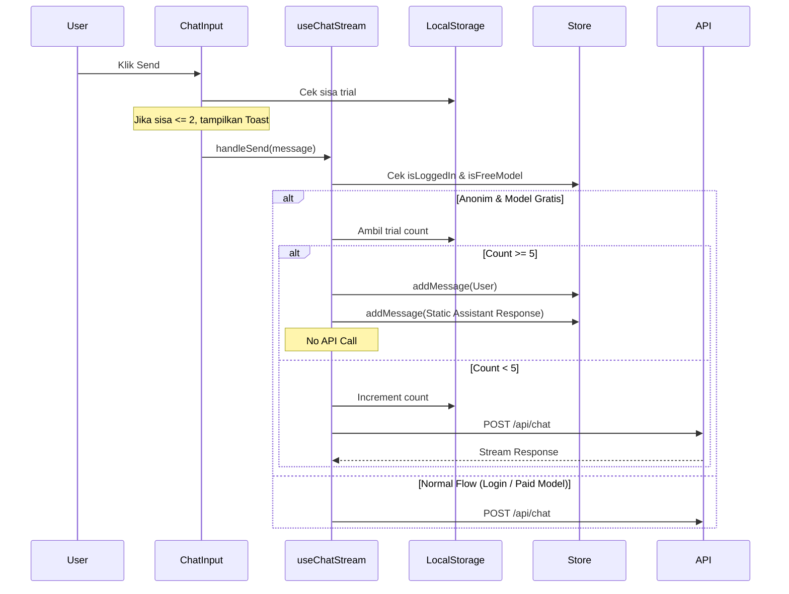

# Blueprint: Anonymous Trial Protection (Option C)

## A. RINGKASAN SISTEM
Implementasi sistem trial terbatas untuk pengguna anonim (belum login). Pengguna diperbolehkan mengirim hingga 5 pesan menggunakan model gratis sebelum akhirnya diblokir dan diarahkan untuk membuat akun melalui respon AI statis yang disisipkan secara lokal.

**Scope Fitur:**
- **Trial Counter:** Pelacakan jumlah pesan anonim menggunakan `localStorage`.
- **Model Gating:** Hanya model dengan properti `free: true` yang mendapatkan jatah trial.
- **Static AI Response:** Intersepsi pengiriman pesan untuk menyuntikkan balasan sistem jika limit tercapai.
- **UI Reminder:** Notifikasi toast saat sisa trial menipis.

## B. PEMETAAN FILE

| File | Perubahan | Tujuan |
|---|---|---|
| [`src/hooks/useChatStream.ts`](src/hooks/useChatStream.ts) | Modifikasi `handleSend` | Logika utama cek trial, counter increment, dan injeksi respon statis. |
| [`src/components/chat/chat-input.tsx`](src/components/chat/chat-input.tsx) | Modifikasi `handleSend` | UI feedback (toast) saat sisa trial menipis. |
| [`src/lib/store.ts`](src/lib/store.ts) | Referensi State | Penggunaan `isLoggedIn` dan `models` dari store. |

## C. SPESIFIKASI MODUL

### 1. Logika Trial Counter (`useChatStream.ts`)
- **Key Storage:** `anonymous_trial_count`
- **Max Limit:** 5
- **Alur Kerja:**
    1. Ambil state `isLoggedIn` dari `useChatDataStore`.
    2. Identifikasi model aktif via `activeModel`.
    3. Jika `!isLoggedIn && currentModel.free`:
        - Baca `currentCount` dari `localStorage`.
        - Jika `currentCount >= 5`:
            - Hentikan proses API call.
            - Tambahkan pesan user ke store (untuk feedback visual).
            - Tambahkan pesan asisten statis: *"Maaf, Anda telah mencapai batas percobaan gratis (5 pesan). Silakan Masuk dengan Akun untuk melanjutkan layanan dan menikmati fitur lengkap kami!"*
            - Selesai.
        - Jika `currentCount < 5`:
            - Increment counter di `localStorage`.
            - Lanjutkan proses pengiriman pesan ke API.

### 2. Notifikasi UI (`chat-input.tsx`)
- Tambahkan pengecekan sisa trial sebelum memanggil `onSend`.
- Jika `remaining <= 2 && remaining > 0`, tampilkan toast: *"Sisa percobaan gratis Anda: [X]. Segera masuk agar percakapan tidak terputus!"*

## D. ALUR DATA & ERROR

## E. URUTAN EKSEKUSI (Code Mode)

1. **Implementasi Logic Trial di `useChatStream.ts`**:
    - Tambahkan konstanta `MAX_ANONYMOUS_TRIAL = 5`.
    - Sisipkan blok pengecekan di awal `handleSend`.
    - Pastikan pesan statis memiliki format yang konsisten dengan pesan AI lainnya.
2. **Implementasi UI Hint di `chat-input.tsx`**:
    - Tambahkan logika pembacaan `localStorage` di dalam `handleSend`.
3. **Verifikasi**:
    - Login sebagai tamu, coba kirim 5 pesan ke model gratis.
    - Coba ganti ke model berbayar (pastikan terblokir oleh logic kredit yang sudah ada).
    - Login dengan akun, pastikan limit tidak berlaku.