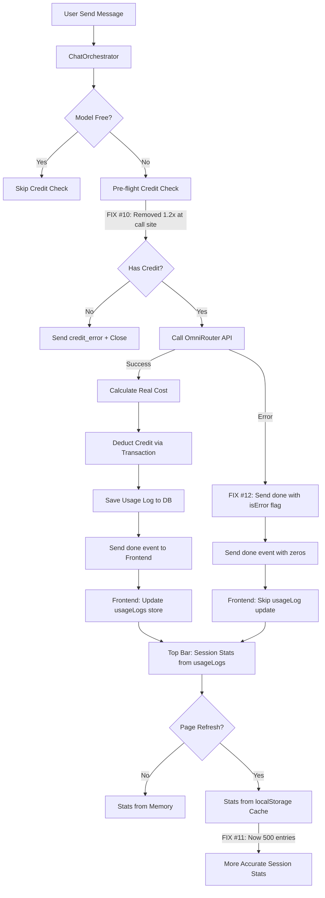

# Blueprint: Billing Accuracy Fixes — Token Estimation, Credit Check & Store Persistence

> **Date:** 2026-06-02
> **Scope:** 3 targeted fixes to improve billing accuracy
> **Priority:** High (user-facing credit impact)

---

## A. RINGKASAN SISTEM

### Target Arsitektur
Project ini menggunakan sistem billing berbasis token untuk AI chat. Setiap request menghasilkan:
- **Input tokens** — dari OmniRouter API (`prompt_tokens`)
- **Output tokens** — dari OmniRouter API (`completion_tokens`)
- **Cost** — dihitung dari `tokens / 1_000_000 × pricePerMillionTokens`
- **Credit deduction** — dikurangi dari `users.credit`

### Temuan yang Perlu Diperbaiki

| # | Temuan | Severity | Lokasi |
|---|--------|----------|--------|
| 10 | Pre-flight credit check double-buffer (144%) | 🐛 Bug | [`chat-orchestrator.service.ts:388`](src/services/chat-orchestrator.service.ts:388) + [`chat-usage-tracking.service.ts:101`](src/services/chat-usage-tracking.service.ts:101) |
| 11 | Store persistence limit (max 100 logs) | ⚠️ Limitasi | [`store.ts:506`](src/lib/store.ts:506) |
| 12 | Error path sends inaccurate usage data | ⚠️ Minor | [`chat-orchestrator.service.ts:605`](src/services/chat-orchestrator.service.ts:605) |

---

## B. PEMETAAN FILE

### File yang Diubah

```
src/
├── services/
│   ├── chat-usage-tracking.service.ts    ← Fix #10: Turunkan buffer checkCredit
│   └── chat-orchestrator.service.ts      ← Fix #10: Hapus * 1.2 di call site + Fix #12: Error path
├── lib/
│   └── store.ts                          ← Fix #11: Tingkatkan usageLogs persist limit
└── hooks/
    └── useChatStream.ts                  ← Fix #12: Tambah flag untuk track error path
```

---

## C. SPESIFIKASI MODUL

### Fix #10: Turunkan Pre-flight Credit Check Buffer

**Masalah:**
Pre-flight credit check menggunakan buffer ganda (double multiplier):
1. [`chat-orchestrator.service.ts:388`](src/services/chat-orchestrator.service.ts:388): `estimatedCost.totalCost * 1.2`
2. [`chat-usage-tracking.service.ts:101`](src/services/chat-usage-tracking.service.ts:101): `estimatedCost * 1.2`

Efek: User membutuhkan **144%** dari estimated cost (1.2 × 1.2 = 1.44). User dengan kredit cukup mungkin ditolak.

**Solusi:**
Hapus buffer di call site ([`chat-orchestrator.service.ts:388`](src/services/chat-orchestrator.service.ts:388)), pertahankan buffer 1.2 di [`checkCredit`](src/services/chat-usage-tracking.service.ts:101). Ini memberikan safety margin 20% yang wajar.

**Perubahan Code:**

#### File: [`src/services/chat-orchestrator.service.ts`](src/services/chat-orchestrator.service.ts:388)

**SEARCH** (line 388):
```typescript
              await ChatUsageTrackingService.checkCredit(userId, estimatedCost.totalCost * 1.2, false);
```

**REPLACE:**
```typescript
              await ChatUsageTrackingService.checkCredit(userId, estimatedCost.totalCost, false);
```

**Rationale:** 
- `checkCredit` di [`chat-usage-tracking.service.ts:101`](src/services/chat-usage-tracking.service.ts:101) sudah menerapkan `minRequired = estimatedCost * 1.2` (20% buffer)
- Tidak perlu buffer lagi di call site
- User hanya perlu 120% dari estimated cost, bukan 144%

---

### Fix #11: Tingkatkan Store Persistence Limit

**Masalah:**
[`store.ts:506`](src/lib/store.ts:506) membatasi `usageLogs` hanya 100 entry di localStorage:
```typescript
usageLogs: state.usageLogs.slice(0, 100),
```
Setelah refresh, session stats bisa **incomplete** jika user memiliki banyak percakapan (>100 usage logs).

**Solusi:**
Tingkatkan limit dari 100 ke 500. Ini cukup untuk ~500 percakapan (rata-rata 1 log per request, 1 request per message). Storage impact minimal (~500 × ~200 bytes = ~100KB).

**Perubahan Code:**

#### File: [`src/lib/store.ts`](src/lib/store.ts:506)

**SEARCH** (line 506):
```typescript
        usageLogs: state.usageLogs.slice(0, 100),
```

**REPLACE:**
```typescript
        usageLogs: state.usageLogs.slice(0, 500),
```

---

### Fix #12: Error Path Usage Data Accuracy

**Masalah:**
Ketika upstream error terjadi di [`chat-orchestrator.service.ts:605`](src/services/chat-orchestrator.service.ts:605):
```typescript
const doneEvent = sendDone();  // Tanpa usage data
```
`sendDone()` tanpa argumen akan menggunakan fallback estimation:
- `inputTokens = 0` (karena `inputTokens` masih 0 di scope)
- `outputTokens = ChatUsageTrackingService.estimateTokens(fullContent)` (estimation)
- Cost dihitung dari estimation

Ini mengirim data token yang **kurang akurat** ke frontend. User melihat token/cost yang tidak akurat di session stats.

**Solusi:**
Saat error terjadi, tetap kirim `done` event dengan flag `isError: true` agar frontend dapat menandai log ini sebagai "estimasi". Tidak perlu mengubah logika backend — cukup tambah metadata agar frontend tahu ini bukan data akurat.

**Perubahan Code:**

#### File: [`src/services/chat-orchestrator.service.ts`](src/services/chat-orchestrator.service.ts:605)

**SEARCH** (line 605):
```typescript
          const doneEvent = sendDone();
```

**REPLACE:**
```typescript
          const doneEvent = sendDone({ isError: true });
```

#### File: [`src/services/chat-orchestrator.service.ts`](src/services/chat-orchestrator.service.ts:230)

Ubah `sendDone` function untuk meneruskan flag `isError`:

**SEARCH** (lines 230-254):
```typescript
    const sendDone = (finalUsage?: any, finalCredit?: number) => {
      if (doneSent) return null;
      doneSent = true;

      const realInputTokens = finalUsage?.inputTokens ?? (inputTokens > 0 ? inputTokens : 0);
      const realOutputTokens = finalUsage?.outputTokens ?? (outputTokens > 0 ? outputTokens : ChatUsageTrackingService.estimateTokens(fullContent));
      const cost = finalUsage?.cost ?? ChatUsageTrackingService.calculateCost(realInputTokens, realOutputTokens, modelPricing);

      return sendEvent({
        type: 'done',
        usage: {
          modelId: modelId,
          modelName: modelPricing.name,
          provider: modelPricing.provider,
          inputTokens: realInputTokens,
          outputTokens: realOutputTokens,
          inputCost: cost?.inputCost || 0,
          outputCost: cost?.outputCost || 0,
          totalCost: cost?.totalCost || 0,
          creditRemaining: finalCredit ?? creditRemaining,
          logId,
          createdAt: new Date().toISOString(),
        },
      });
    };
```

**REPLACE:**
```typescript
    const sendDone = (finalUsage?: any, finalCredit?: number) => {
      if (doneSent) return null;
      doneSent = true;

      const isError = finalUsage?.isError === true;
      const realInputTokens = isError ? 0 : (finalUsage?.inputTokens ?? (inputTokens > 0 ? inputTokens : 0));
      const realOutputTokens = isError ? 0 : (finalUsage?.outputTokens ?? (outputTokens > 0 ? outputTokens : ChatUsageTrackingService.estimateTokens(fullContent)));
      const cost = isError ? null : (finalUsage?.cost ?? ChatUsageTrackingService.calculateCost(realInputTokens, realOutputTokens, modelPricing));

      return sendEvent({
        type: 'done',
        usage: {
          modelId: modelId,
          modelName: modelPricing.name,
          provider: modelPricing.provider,
          inputTokens: realInputTokens,
          outputTokens: realOutputTokens,
          inputCost: cost?.inputCost || 0,
          outputCost: cost?.outputCost || 0,
          totalCost: cost?.totalCost || 0,
          creditRemaining: finalCredit ?? creditRemaining,
          logId,
          createdAt: new Date().toISOString(),
          isError,
        },
      });
    };
```

#### File: [`src/hooks/useChatStream.ts`](src/hooks/useChatStream.ts:53)

Tambahkan `isError` ke interface `SSEDoneEvent`:

**SEARCH** (lines 53-67):
```typescript
interface SSEDoneEvent {
  type: 'done';
  usage: {
    modelId: string;
    modelName: string;
    provider: string;
    inputTokens: number;
    outputTokens: number;
    inputCost: number;
    outputCost: number;
    totalCost: number;
    creditRemaining: number;
    logId: string;
    createdAt: string;
  };
}
```

**REPLACE:**
```typescript
interface SSEDoneEvent {
  type: 'done';
  usage: {
    modelId: string;
    modelName: string;
    provider: string;
    inputTokens: number;
    outputTokens: number;
    inputCost: number;
    outputCost: number;
    totalCost: number;
    creditRemaining: number;
    logId: string;
    createdAt: string;
    isError?: boolean;
  };
}
```

#### File: [`src/hooks/useChatStream.ts`](src/hooks/useChatStream.ts:397)

Skip persisting usage log ke frontend store saat error:

**SEARCH** (lines 395-421):
```typescript
                      // Update frontend store with usage data from backend response
                      // Backend already saved usage_log to DB — we only update the UI store here
                      if (event.usage) {
                        const usageEntry: UsageLogEntry = {
                          id: event.usage.logId,
                          conversationId: convId,
                          modelId: event.usage.modelId,
                          modelName: event.usage.modelName,
                          provider: event.usage.provider,
                          inputTokens: event.usage.inputTokens,
                          outputTokens: event.usage.outputTokens,
                          inputCost: event.usage.inputCost,
                          outputCost: event.usage.outputCost,
                          totalCost: event.usage.totalCost,
                          category: activeCategoryRef.current,
                          createdAt: event.usage.createdAt,
                        };
                        const currentLogs = useChatDataStore.getState().usageLogs;
                        if (!currentLogs.find((l) => l.id === usageEntry.id)) {
                          useChatDataStore.getState().setUsageLogs([usageEntry, ...currentLogs]);
                        }

                        // Update credit balance from backend response
                        if (event.usage.creditRemaining !== undefined) {
                          useChatDataStore.getState().setCredit(event.usage.creditRemaining);
                        }
                      }
```

**REPLACE:**
```typescript
                      // Update frontend store with usage data from backend response
                      // Backend already saved usage_log to DB — we only update the UI store here
                      // Skip usage log update on error — data is inaccurate (estimated only)
                      if (event.usage && !event.usage.isError) {
                        const usageEntry: UsageLogEntry = {
                          id: event.usage.logId,
                          conversationId: convId,
                          modelId: event.usage.modelId,
                          modelName: event.usage.modelName,
                          provider: event.usage.provider,
                          inputTokens: event.usage.inputTokens,
                          outputTokens: event.usage.outputTokens,
                          inputCost: event.usage.inputCost,
                          outputCost: event.usage.outputCost,
                          totalCost: event.usage.totalCost,
                          category: activeCategoryRef.current,
                          createdAt: event.usage.createdAt,
                        };
                        const currentLogs = useChatDataStore.getState().usageLogs;
                        if (!currentLogs.find((l) => l.id === usageEntry.id)) {
                          useChatDataStore.getState().setUsageLogs([usageEntry, ...currentLogs]);
                        }
                      }

                      // Update credit balance from backend response (always, even on error)
                      if (event.usage?.creditRemaining !== undefined) {
                        useChatDataStore.getState().setCredit(event.usage.creditRemaining);
                      }
```

---

## D. ALUR DATA & ERROR HANDLING

### Data Flow Diagram



### Error Handling

| Error Type | Current Behavior | After Fix |
|------------|-----------------|-----------|
| Insufficient credit | User blocked with message | Same (but less aggressive threshold) |
| OmniRouter error | Done event with estimated tokens → inaccurate stats | Done event with `isError: true` → frontend skips logging |
| DB save failure | Continues silently | Same (no change) |
| Credit deduction failure | Logs error, continues | Same (no change) |

---

## E. URUTAN EKSEKUSI

### Step-by-step untuk Code Mode

1. **Fix #10** — Edit [`src/services/chat-orchestrator.service.ts`](src/services/chat-orchestrator.service.ts:388)
   - Line 388: Hapus `* 1.2` dari `estimatedCost.totalCost * 1.2`
   - Change to: `estimatedCost.totalCost`
   - **Testing:** `pnpm test -- --testNamePattern="credit"` (run relevant tests)

2. **Fix #11** — Edit [`src/lib/store.ts`](src/lib/store.ts:506)
   - Line 506: Ubah `slice(0, 100)` ke `slice(0, 500)`
   - **Testing:** Manual — refresh page setelah banyak chat, cek session stats tetap ada

3. **Fix #12** — Edit 4 file secara berurutan:
   - a. [`src/services/chat-orchestrator.service.ts`](src/services/chat-orchestrator.service.ts:230) — Ubah `sendDone` function (add `isError` handling)
   - b. [`src/services/chat-orchestrator.service.ts`](src/services/chat-orchestrator.service.ts:605) — Ubah error path `sendDone()` ke `sendDone({ isError: true })`
   - c. [`src/hooks/useChatStream.ts`](src/hooks/useChatStream.ts:53) — Tambah `isError?: boolean` ke `SSEDoneEvent`
   - d. [`src/hooks/useChatStream.ts`](src/hooks/useChatStream.ts:397) — Skip usage log update saat `isError`
   - **Testing:** `pnpm test -- --testNamePattern="useChatStream"`

4. **Final Validation**
   - `pnpm lint` — Pastikan tidak ada lint error
   - `pnpm test` — Semua test pass
   - `pnpm test:coverage` — Coverage tidak turun

---

## F. RISIKO & MITIGASI

| Risiko | Probabilitas | Dampak | Mitigasi |
|--------|-------------|--------|----------|
| Fix #10: User dengan kredit tipis lolos pre-flight tapi gagal saat deduction | Rendah | Medium | `checkCredit` sudah apply 1.2x buffer, `deductCredit` punya double-check di transaction |
| Fix #11: localStorage lebih besar | Rendah | Low | 500 entries ≈ 100KB — masih jauh di bawah limit 5MB localStorage |
| Fix #12: Frontend tidak log error requests | N/A | Low | Intentional — error requests tidak menghasilkan billing, logging-nya tidak perlu |
| Fix #12: `creditRemaining` tidak update saat error | Nereah | Medium | Sudah di-mitigasi: credit balance update dipisahkan dari usage log logging |

---

## G. TESTING CHECKLIST

- [ ] `pnpm test` — Semua existing tests pass
- [ ] `pnpm lint` — Tidak ada lint error baru
- [ ] Manual test: Kirim chat dengan model berbayar → cek session stats akurat
- [ ] Manual test: Kirim chat → refresh page → cek session stats masih ada
- [ ] Manual test: Simulasi error (putus koneksi) → cek tidak ada inaccurate stats
- [ ] Manual test: Login user dengan kredit pas-pasan → cek pre-flight tidak terlalu aggressive
