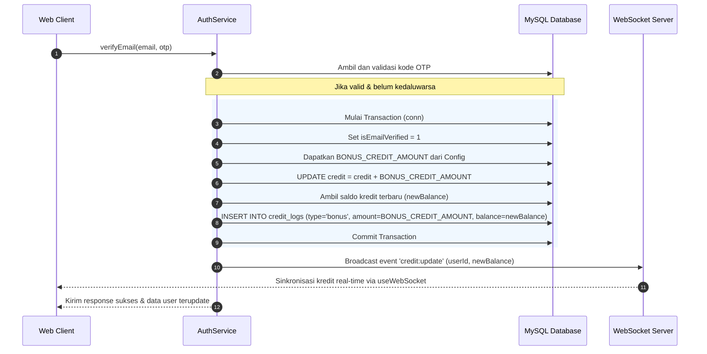

# Blueprint: Fitur Bonus 5 Kredit untuk Akun Baru Terverifikasi

Dokumen ini mendefinisikan rancangan arsitektur, spesifikasi modul, skema database, dan alur data untuk memberikan bonus kredit kepada akun baru setelah email mereka berhasil diverifikasi via OTP. Fitur ini dirancang agar mudah dikonfigurasi menggunakan environment variables sehingga tidak memerlukan perubahan kode di masa mendatang.

---

## A. RINGKASAN SISTEM

### Target Arsitektur
1. **Configurable Credit Management:**
   - Jumlah bonus kredit (`BONUS_CREDIT_AMOUNT`) dikonfigurasi melalui `.env.local` (default: 5).
   - Saldo awal pendaftaran (`DEFAULT_CREDIT_AMOUNT`) dikonfigurasi melalui `.env.local` (default: 0, sehingga user baru yang belum verifikasi memiliki 0 kredit).
2. **Otomatisasi Pemberian Bonus:**
   - Ketika pengguna berhasil melakukan verifikasi OTP via email, sistem akan meningkatkan kredit pengguna tersebut sebesar nilai konfigurasi bonus.
   - Pemberian bonus disertai pencatatan riwayat transaksi dengan tipe transaksi khusus (`'bonus'`).
3. **Transparansi Riwayat Kredit:**
   - Riwayat transaksi jenis `'bonus'` akan ditampilkan dengan ikon khusus (Gift) dan warna yang berbeda (Amber) pada riwayat akun pengguna agar pengguna mengetahui asal-usul penambahan kredit tersebut.
4. **Real-time Synchronization:**
   - Perubahan kredit langsung disebarkan ke klien secara real-time via WebSocket broadcast segera setelah transaksi diselesaikan dalam database.

---

## B. PEMETAAN FILE

Berikut adalah daftar file yang akan dibuat atau diubah beserta tujuannya:

```
├── .env.local                                                  # Modifikasi: Tambah variabel konfigurasi
├── src/
│   ├── config/
│   │   └── index.ts                                            # Modifikasi: Ekspor variabel konfigurasi dari process.env
│   ├── types/
│   │   └── index.ts                                            # Modifikasi: Tambah 'bonus' ke CreditLogType
│   ├── lib/
│   │   ├── schema.sql                                          # Modifikasi: Update default credit ke 0 dan tambah ENUM 'bonus'
│   │   ├── store.ts                                            # Modifikasi: Sinkronkan CreditLogEntry type
│   │   └── migration-bonus-credit.sql                          # Baru: SQL skrip migrasi database
│   ├── services/
│   │   └── auth.service.ts                                     # Modifikasi: Implementasi bonus credit logic di verifyEmail()
│   └── components/
│       └── chat/
│           └── account-dialog/
│               └── components/
│                   └── credit-log-item.tsx                     # Modifikasi: UI render untuk log berjenis 'bonus'
```

---

## C. SPESIFIKASI MODUL & DATABASE SCHEMA

### 1. Database Migrations (`src/lib/migration-bonus-credit.sql`)
Skrip migrasi SQL untuk memperbarui struktur tabel yang ada tanpa merusak data lama:
```sql
-- 1. Tambahkan tipe 'bonus' ke ENUM di tabel credit_logs
ALTER TABLE credit_logs 
  MODIFY COLUMN type ENUM('topup', 'deduct', 'admin_set', 'usage', 'bonus') NOT NULL;

-- 2. Ubah default credit pada tabel users dari 25 menjadi 0
ALTER TABLE users 
  MODIFY COLUMN credit DECIMAL(12,4) NOT NULL DEFAULT 0.0000;
```

### 2. Configuration (`src/config/index.ts`)
Konfigurasi central untuk membaca nilai dari `.env.local`:
```typescript
export const BONUS_CREDIT_AMOUNT = Number(process.env.BONUS_CREDIT_AMOUNT || '5');
export const DEFAULT_CREDIT_AMOUNT = Number(process.env.DEFAULT_CREDIT_AMOUNT || '0');
```

### 3. TypeScript Type Definition (`src/types/index.ts`)
```typescript
export type CreditLogType = 'topup' | 'usage' | 'deduct' | 'admin_set' | 'admin_adjust' | 'bonus';
```

### 4. Client Zustand Store Definition (`src/lib/store.ts`)
```typescript
export interface CreditLogEntry {
  id: string;
  type: 'topup' | 'usage' | 'bonus' | 'admin_set' | 'deduct';
  amount: number;
  balance: number;
  description: string;
  createdAt: string;
}
```

---

## D. ALUR DATA & ERROR HANDLING

### Alur Verifikasi Email & Klaim Bonus



### Error Handling
- **Database Transaction Rollback:** Jika query update kredit atau penulisan log gagal, seluruh transaksi (termasuk status verifikasi email) akan di-rollback ke keadaan semula.
- **Duplikasi Klaim Bonus:** Karena verifikasi email hanya dapat dilakukan satu kali saja (setelah verifikasi berhasil, OTP ditandai `used = 1` dan tidak bisa dipakai lagi), maka secara inheren bonus ini terlindungi dari klaim ganda per pendaftaran.
- **Fallback Aman:** Jika `BONUS_CREDIT_AMOUNT` bernilai `0` atau negatif, proses penambahan kredit dan penulisan log bonus akan dilewati secara otomatis.

---

## E. URUTAN EKSEKUSI (STEP-BY-STEP FOR CODE MODE)

### Tahap 1: Persiapan Lingkungan & Database
1. Update file `.env.local` untuk mendefinisikan:
   ```env
   BONUS_CREDIT_AMOUNT=5
   DEFAULT_CREDIT_AMOUNT=0
   ```
2. Buat file migrasi `src/lib/migration-bonus-credit.sql` dan modifikasi `src/lib/schema.sql` untuk mengubah default value `credit` di tabel `users` menjadi `0` serta memperluas ENUM di `credit_logs`.

### Tahap 2: Konfigurasi & Tipe Data
3. Modifikasi `src/config/index.ts` untuk mengekspor variabel-variabel konfigurasi baru tersebut.
4. Modifikasi `src/types/index.ts` dan `src/lib/store.ts` agar tipe log `'bonus'` diakui oleh sistem compiler TypeScript.

### Tahap 3: Logika Bisnis Server-Side
5. Perbarui `AuthService.register()` di `src/services/auth.service.ts` agar pembuatan user baru menggunakan nilai dari `DEFAULT_CREDIT_AMOUNT` konfigurasi, alih-alih hardcoded nilai default database.
6. Modifikasi `AuthService.verifyEmail()` di `src/services/auth.service.ts` untuk:
   - Memeriksa apakah `BONUS_CREDIT_AMOUNT > 0`.
   - Jika ya, jalankan update kredit, pencatatan log bonus, dan broadcast real-time via WebSocket dalam satu rangkaian logika transaksi.

### Tahap 4: Presentasi & UI Client-Side
7. Modifikasi komponen `src/components/chat/account-dialog/components/credit-log-item.tsx` untuk mendeteksi tipe log `'bonus'`, menampilkan teks lokalisasi Indonesia seperti "**Bonus Selamat Datang**", serta merender ikon `Gift` berwarna Amber.

### Tahap 5: Verifikasi & Pengujian
8. Jalankan testing menggunakan command `pnpm test` untuk memastikan tidak ada fungsionalitas registrasi atau autentikasi yang patah.
