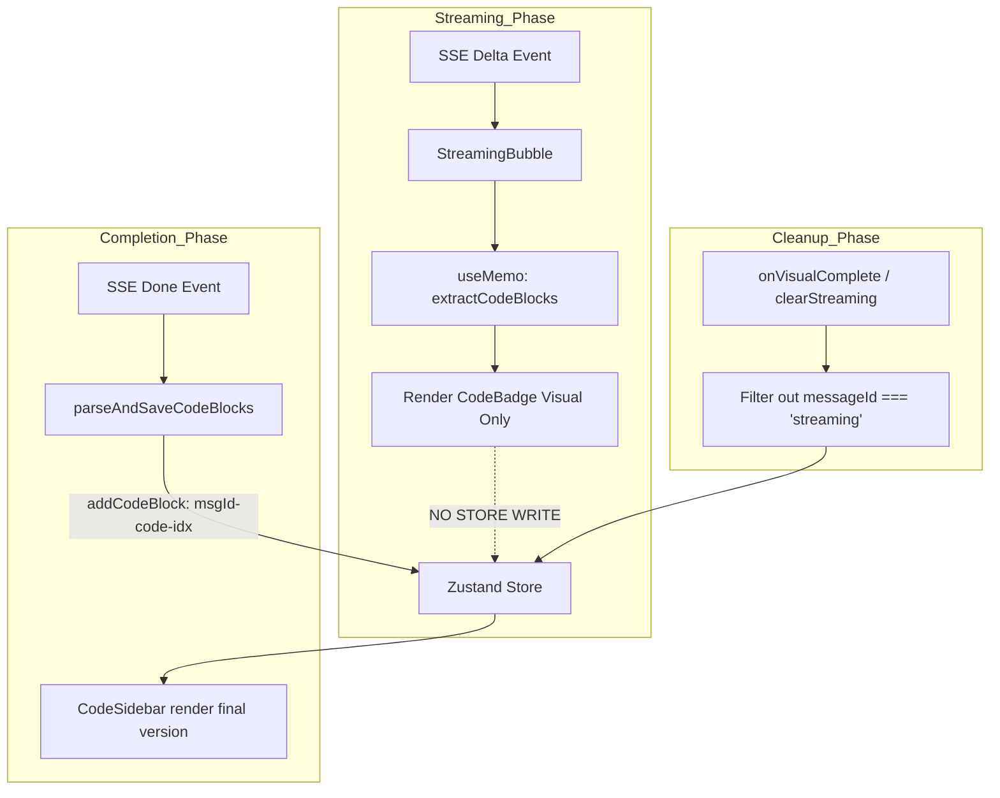

# BLUEPRINT: Perbaikan Duplikasi File di Code Panel (Sidebar)

## A. RINGKASAN SISTEM
Menyelesaikan bug duplikasi file kode di dalam Code Panel (Sidebar) yang terjadi selama proses streaming AI. Masalah utama adalah adanya "double registration" di mana `StreamingBubble` mendaftarkan blok kode secara spekulatif ke Zustand store, sementara `useChatStream` juga mendaftarkan blok kode final saat event `done` tiba. Karena perbedaan ID, logika deduplikasi di store gagal dan menyebabkan file muncul dua kali.

### Target Arsitektur:
1. **Single Source of Truth for Store**: Hanya blok kode final (setelah SSE `done`) atau blok kode dari chat historis yang boleh masuk ke Zustand store.
2. **Visual-Only Speculation**: `StreamingBubble` tetap menampilkan badge file secara real-time menggunakan state lokal (`useMemo`), tanpa memanipulasi store global.
3. **Orphan Cleanup**: Memastikan semua blok kode sementara (`messageId === 'streaming'`) dibersihkan saat proses streaming selesai atau di-reset.

---

## B. PEMETAAN FILE

| File | Aksi | Deskripsi |
|------|------|-----------|
| [`src/lib/store.ts`](src/lib/store.ts) | **UBAH** | Update `clearStreaming` untuk membersihkan orphaned streaming blocks. |
| [`src/components/chat/message-list.tsx`](src/components/chat/message-list.tsx) | **UBAH** | Hapus `useEffect` yang memanggil `addCodeBlock` di dalam `StreamingBubble`. |
| [`src/components/chat/code-sidebar.tsx`](src/components/chat/code-sidebar.tsx) | **UBAH** | Implementasi filter versi terbaru per `fileName` sebelum rendering (Defense-in-Depth). |

---

## C. SPESIFIKASI MODUL

### 1. `src/lib/store.ts` $\rightarrow$ `clearStreaming`
- **Logika Baru**:
  - Selain mereset content dan status streaming, tambahkan filter pada `codeBlocks`.
  - `codeBlocks: state.codeBlocks.filter(b => b.messageId !== 'streaming')`
  - Reset `selectedCodeBlock` ke `null` jika block yang terpilih saat ini adalah block streaming.

### 2. `src/components/chat/message-list.tsx` $\rightarrow$ `StreamingBubble`
- **Perubahan**:
  - Hapus `addCodeBlock` dari destructuring `useChatStore`.
  - Hapus `useEffect` yang memantau `extractedBlocks` untuk melakukan registrasi spekulatif dengan ID `streaming-code-${idx}`.
  - **Tetap Pertahankan**: `extractedBlocks` (useMemo) untuk me-render `<CodeBadge>` secara visual. Ini memastikan UX tetap interaktif tanpa mengotori store.

### 3. `src/components/chat/code-sidebar.tsx` $\rightarrow$ `groupedEntries`
- **Logika Baru**:
  - Sebelum melakukan grouping berdasarkan bahasa, filter `codeBlocks` untuk mendapatkan hanya satu versi terbaru per `fileName`.
  - Gunakan `Map<string, CodeBlock>` untuk menyimpan block dengan `version` tertinggi untuk setiap `fileName`.
  - Hasil filter inilah yang kemudian di-sort dan di-group.

---

## D. ALUR DATA & ERROR

### Alur Registrasi Code Block (Fixed):

### Penanganan Kegagalan:
- Jika proses streaming terputus sebelum `done` event, `clearStreaming` akan dipanggil (lewat error path di `useChatStream`), sehingga tidak akan ada block "sampah" yang tertinggal di sidebar.

---

## E. URUTAN EKSEKUSI

1. **Step 1: Store Cleanup**
   - Modifikasi [`src/lib/store.ts`](src/lib/store.ts) bagian `clearStreaming`.
   - Verifikasi bahwa `codeBlocks` difilter dari `messageId === 'streaming'`.

2. **Step 2: Remove Speculative Write**
   - Modifikasi [`src/components/chat/message-list.tsx`](src/components/chat/message-list.tsx) di dalam komponen `StreamingBubble`.
   - Hapus `useEffect` yang memanggil `addCodeBlock`.

3. **Step 3: Sidebar Defense-in-Depth**
   - Modifikasi [`src/components/chat/code-sidebar.tsx`](src/components/chat/code-sidebar.tsx) pada bagian `groupedEntries`.
   - Tambahkan logika dedup berbasis versi terbaru per `fileName`.

4. **Step 4: Verification**
   - Test case: Kirim pesan "buatkan html sederhana".
   - Cek badge di bubble (harus 1).
   - Cek list file di sidebar (harus 1, tidak boleh duplikat setelah streaming selesai).
