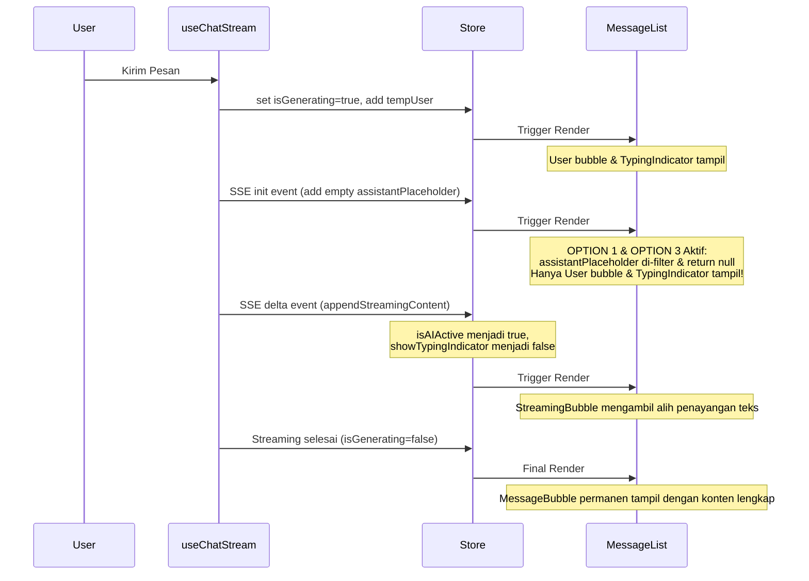

# Blueprint: Fix Double AI Bubble Bug (Combination of Option 1 + Option 3)

## A. RINGKASAN SISTEM
**Target**: Menghilangkan munculnya dua bubble AI (bubble kosong + typing indicator) secara bersamaan saat mengirim pesan sebelum streaming dimulai.
**Scope**: Perbaikan dilakukan pada layer presentasi (UI) menggunakan pendekatan pertahanan berlapis (defense-in-depth) dengan mengombinasikan dua metode:
1. **Option 1 (MessageList)**: Menyembunyikan placeholder pesan assistant selama fase inisialisasi/menunggu respon (`showTypingIndicator`).
2. **Option 3 (MessageBubble)**: Memberikan defensive guard agar `MessageBubble` tidak me-render elemen visual apa pun jika data pesannya benar-benar kosong.

## B. PEMETAAN FILE

| File | Action | Description |
|---|---|---|
| [`src/components/chat/message-list.tsx`](src/components/chat/message-list.tsx) | Modify | Perbarui filter loop mapping agar menyembunyikan assistant placeholder ketika `showTypingIndicator` bernilai true. |
| [`src/components/chat/message-bubble.tsx`](src/components/chat/message-bubble.tsx) | Modify | Tambahkan guard clause di awal render `MessageBubble` AI untuk me-return `null` jika tidak memiliki konten teks, thinking, maupun file kode. |

## C. SPESIFIKASI MODUL

### 1. Modul [`message-list.tsx`](src/components/chat/message-list.tsx)
- **Logika Saat Ini**:
  ```typescript
  {messages.map((msg) => {
    if (isAIActive && msg.id === latestAssistantMessageId) {
      return null;
    }
    return ( ... );
  })}
  ```
- **Masalah**: Pada saat event `init` diterima dari SSE, `isAIActive` bernilai `false` karena `streamingContent` masih kosong, sedangkan `showTypingIndicator` bernilai `true`. Hal ini membuat placeholder pesan asisten kosong ikut di-render.
- **Solusi**: Tambahkan `showTypingIndicator` ke dalam kondisi penyembunyian:
  ```typescript
  if ((isAIActive || showTypingIndicator) && msg.id === latestAssistantMessageId) {
    return null;
  }
  ```

### 2. Modul [`message-bubble.tsx`](src/components/chat/message-bubble.tsx)
- **Logika Saat Ini**: Elemen asisten langsung me-render container visual (`flex items-start gap-2.5 ...`) tanpa memeriksa kelayakan isi pesan terlebih dahulu.
- **Solusi (Defensive Guard)**:
  Sebelum `return` bagian AI message, tambahkan pengecekan apakah pesan asisten benar-benar kosong:
  ```typescript
  const hasTextContent = displayContent.length > 0;
  const hasThinking = !!thinkingContent;
  const hasCodeBlocks = extractedBlocks.length > 0;

  if (!isUser && !hasTextContent && !hasThinking && !hasCodeBlocks) {
    return null;
  }
  ```

## D. ALUR DATA & ERROR (DIAGRAM)



## E. URUTAN EKSEKUSI UNTUK CODE MODE

1. **Langkah 1**: Edit [`src/components/chat/message-list.tsx`](src/components/chat/message-list.tsx) pada line ~509 untuk memasukkan kondisi `showTypingIndicator` ke dalam filter rendering placeholder.
2. **Langkah 2**: Edit [`src/components/chat/message-bubble.tsx`](src/components/chat/message-bubble.tsx) sebelum blok return AI message (~line 736) untuk menambahkan defensive guard `return null` jika pesan asisten kosong.
3. **Langkah 3**: Jalankan unit test dengan `pnpm test` untuk memastikan perubahan tidak mematahkan fungsionalitas rendering chat yang sudah ada.
4. **Langkah 4**: Lakukan pengujian visual secara manual di browser untuk memastikan tidak ada flicker bubble kosong ketika mengirim pesan.
