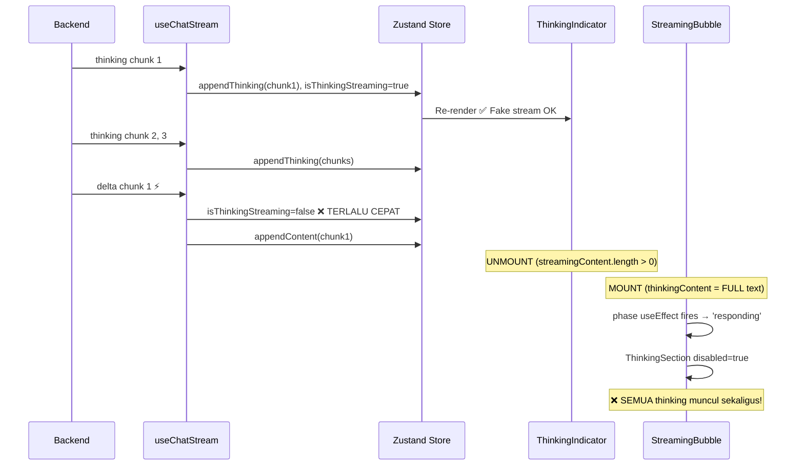
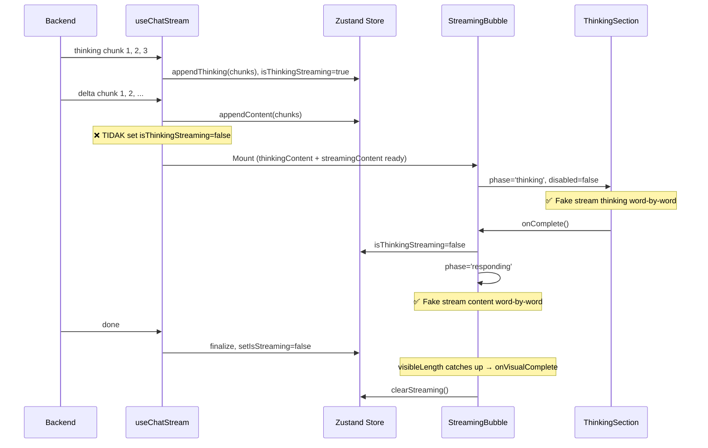
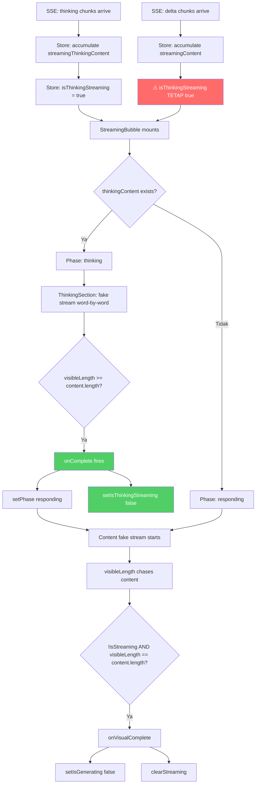

# Blueprint: Fake Stream Thinking Phase Synchronization

**Date:** 2026-06-02
**Scope:** Fix fake stream thinking animation — thinking content appears all at once instead of word-by-word
**Mode:** Architect → Code Handoff

---

## A. RINGKASAN SISTEM

### Target Architecture

Implementasi dua fase animasi yang terpisah dan berurutan:

1. **Phase 1 — Fake Stream Thinking:** Semua thinking chunks dari backend diakumulasi, lalu direveal word-by-word menggunakan animasi
2. **Phase 2 — Fake Stream Content:** Setelah thinking animation selesai, semua content chunks direveal word-by-word

### Current Behavior (Bermasalah)



### Desired Behavior (Target)



### Scope

- Perbaikan timing transisi `ThinkingIndicator` → `StreamingBubble`
- Perbaikan phase management di `StreamingBubble`
- Perbaikan `isThinkingStreaming` lifecycle
- Cleanup dead code (`FakeStreamRenderer.tsx`)
- **TIDAK** ada perubahan: backend SSE, store schema, data persistence

---

## B. PEMETAAN FILE

### Files to Modify

| File | Change Type | Description |
|------|-------------|-------------|
| [`src/hooks/useChatStream.ts`](src/hooks/useChatStream.ts) | Modify | Hapus `setIsThinkingStreaming(false)` dari delta handler (line 336-338) |
| [`src/components/chat/message-list.tsx`](src/components/chat/message-list.tsx) | Modify | Fix phase management di StreamingBubble + ThinkingIndicator visibility |
| [`src/components/chat/message-bubble.tsx`](src/components/chat/message-bubble.tsx) | Verify | Pastikan permanent bubble ThinkingSection sudah `disabled={true}` ✅ (sudah benar di line 748) |

### Files to Delete

| File | Reason |
|------|--------|
| [`src/components/FakeStreamRenderer.tsx`](src/components/FakeStreamRenderer.tsx) | Dead code — tidak di-import di mana pun. Fake streaming dilakukan inline di StreamingBubble dan ThinkingIndicator |

### Files NOT Modified

| File | Reason |
|------|--------|
| [`src/lib/store.ts`](src/lib/store.ts) | Store schema sudah benar |
| [`src/config/stream-config.ts`](src/config/stream-config.ts) | Config values adequate |

---

## C. SPESIFIKASI MODUL

### Module 1: SSE Delta Handler — Stop Killing Thinking Flag

**File:** [`src/hooks/useChatStream.ts`](src/hooks/useChatStream.ts:334-342)

**Current Code:**
```typescript
case 'delta': {
  console.log(`...Delta event...`);
  if (useChatStore.getState().isThinkingStreaming) {
    setIsThinkingStreaming(false);  // ❌ ROOT CAUSE
  }
  fullContent += event.content;
  appendStreamingContent(event.content);
  break;
}
```

**Problem:** `isThinkingStreaming` di-set `false` saat delta pertama tiba. Ini menyebabkan:
1. `ThinkingIndicator` unmount (karena `isThinkingStreaming=false` AND `streamingContent.length > 0`)
2. `StreamingBubble` mount dengan `thinkingContent` penuh
3. `ThinkingSection` di dalam `StreamingBubble` langsung menerima `disabled=true`
4. Semua thinking text muncul sekaligus tanpa animasi

**Fix:**
```typescript
case 'delta': {
  console.log(`...Delta event...`);
  // JANGAN setIsThinkingStreaming(false) di sini!
  // Biarkan StreamingBubble yang mengelola phase transition
  // via ThinkingSection.onComplete() callback.
  // isThinkingStreaming akan di-set false oleh onComplete
  // SAAT animasi thinking fake stream BENAR-BENAR selesai.
  fullContent += event.content;
  appendStreamingContent(event.content);
  break;
}
```

**Impact:** `isThinkingStreaming` tetap `true` sampai ThinkingSection selesai animate. Content tetap di-append ke store (accumulates invisibly). Phase transition dikontrol oleh UI, bukan oleh SSE event timing.

---

### Module 2: StreamingBubble Phase Management

**File:** [`src/components/chat/message-list.tsx`](src/components/chat/message-list.tsx:195-215)

**Current Code:**
```typescript
// Line 195 — Initial phase
const [phase, setPhase] = useState<'thinking' | 'responding'>(
  !thinkingContent ? 'responding' : 'thinking'
);

// Line 209-215 — Phase sync from store
useEffect(() => {
  if (isThinkingStreaming) {
    setPhase('thinking');
  } else {
    setPhase('responding');  // ❌ Overwrites onComplete callback
  }
}, [isThinkingStreaming]);
```

**Problem:** `useEffect` ini overwrite `phase` setiap kali `isThinkingStreaming` berubah. Jika `ThinkingSection.onComplete()` memanggil `setPhase('responding')`, useEffect ini akan langsung override-nya karena `isThinkingStreaming` masih `true` (sebelum onComplete juga memanggil `setIsThinkingStreaming(false)`).

**Fix:**
```typescript
// Line 209-215 — Replace with simpler logic
useEffect(() => {
  // Hanya set 'responding' jika tidak ada thinking content sama sekali.
  // Untuk kasus dengan thinking, phase DIKONTROL oleh ThinkingSection.onComplete().
  if (!thinkingContent) {
    setPhase('responding');
  }
}, [thinkingContent]);
```

**Rationale:** Phase transition harus dikontrol oleh satu sumber kebenaran: `ThinkingSection.onComplete()`. Store flag `isThinkingStreaming` tidak boleh mengontrol phase secara langsung karena ada mismatch timing antara SSE events dan animasi UI.

---

### Module 3: ThinkingSection onComplete — Bridge Between Phases

**File:** [`src/components/chat/message-list.tsx`](src/components/chat/message-list.tsx:346-362)

**Current Code:**
```typescript
{thinkingContent && (
  <div className="relative streaming-reveal-container">
    <ThinkingSection
      content={thinkingContent}
      initialExpanded={true}
      onComplete={() => setPhase('responding')}
      disabled={phase === 'responding'}
      onScroll={onScroll}
    />
    ...
  </div>
)}
```

**Problem:** `onComplete` hanya memanggil `setPhase('responding')` tapi TIDAK memanggil `setIsThinkingStreaming(false)`. Jadi store flag tetap `true` dan `ThinkingIndicator` masih muncul.

**Fix:**
```typescript
{thinkingContent && (
  <div className="relative streaming-reveal-container">
    <ThinkingSection
      content={thinkingContent}
      initialExpanded={true}
      onComplete={() => {
        setPhase('responding');
        // Bridge: beri tahu store bahwa thinking animation selesai
        useChatStore.getState().setIsThinkingStreaming(false);
      }}
      disabled={phase === 'responding'}
      onScroll={onScroll}
    />
    ...
  </div>
)}
```

---

### Module 4: ThinkingIndicator Visibility

**File:** [`src/components/chat/message-list.tsx`](src/components/chat/message-list.tsx:331)

**Current Code:**
```typescript
const showThinkingIndicator = isGenerating && (
  isThinkingStreaming ||
  (streamingThinkingContent.length > 0 && streamingContent.length === 0)
);
```

**Problem:** Saat delta pertama tiba, `streamingContent.length > 0` menjadi `true`, sehingga `showThinkingIndicator` menjadi `false` meskipun `isThinkingStreaming` masih `true`. Ini menyebabkan `ThinkingIndicator` unmount sebelum animasi thinking selesai.

**Fix:**
```typescript
const showThinkingIndicator = isGenerating && isThinkingStreaming && streamingContent.length === 0;
```

**Rationale:** `ThinkingIndicator` hanya ditampilkan saat:
1. Sedang generating
2. Thinking masih streaming (animasi belum selesai)
3. Belum ada content yang tiba

Begitu content mulai tiba, `StreamingBubble` yang mengambil alih (termasuk menampilkan thinking section + content section).

---

### Module 5: StreamingBubble Visibility — Allow Thinking+Content Coexistence

**File:** [`src/components/chat/message-list.tsx`](src/components/chat/message-list.tsx:332)

**Current Code:**
```typescript
const showStreamingBubble = isGenerating && streamingContent.length > 0;
```

**Problem:** Ini sudah benar untuk kasus normal. Tapi setelah Fix 4, `StreamingBubble` juga harus muncul saat thinking masih berlangsung DAN content sudah mulai tiba. Kondisi ini sudah terpenuhi (`streamingContent.length > 0`).

**No Change Needed** — Kondisi ini sudah benar.

---

### Module 6: `isAIActive` Condition

**File:** [`src/components/chat/message-list.tsx`](src/components/chat/message-list.tsx:489)

**Current Code:**
```typescript
const isAIActive = isGenerating && (
  isThinkingStreaming || streamingThinkingContent.length > 0 || streamingContent.length > 0
);
```

**Problem:** Setelah Fix 1, `isThinkingStreaming` tetap `true` sampai animasi thinking selesai. Ini berarti `isAIActive` akan tetap `true` selama thinking animation berlangsung, yang benar — permanent MessageBubble tetap tersembunyi.

**No Change Needed** — Kondisi ini sudah benar setelah Fix 1 diterapkan.

---

## D. ALUR DATA & ERROR HANDLING

### Data Flow After Fix



### Edge Cases

| Scenario | Current Behavior | Fixed Behavior |
|----------|-----------------|----------------|
| Thinking only (no content) | ThinkingIndicator shows, fake stream OK | No change needed |
| Content only (no thinking) | StreamingBubble with responding phase | No change needed |
| Thinking + Content | ❌ Thinking appears all at once | ✅ Thinking fake streams, then content |
| Error mid-stream | clearStreaming wipes state | No change needed |
| Very long thinking (30s+) | ThinkingIndicator fake streams OK | No change needed (but content accumulates invisibly) |
| Backend sends delta BEFORE thinking ends | isThinkingStreaming flips false | isThinkingStreaming stays true |

### Failure Modes

1. **ThinkingSection onComplete never fires** → Phase stuck in 'thinking', content never shows
   - Mitigation: ThinkingSection's useEffect at line 502-509 guarantees onComplete fires when `visibleLength >= content.length`
   - Edge case: If `content` is empty string → `visibleLength(0) >= content.length(0)` → onComplete fires immediately ✅

2. **Race: done event arrives while thinking still animating** → `isStreaming=false`, but `isThinkingStreaming=true`
   - Mitigation: Visual completion check at line 243 requires `!isStreaming && visibleLength === content.length`. Since phase is still 'thinking', content visibleLength hasn't started yet. When thinking onComplete fires and phase switches to 'responding', content fake stream starts and chases the full content. When it catches up, onVisualComplete fires. ✅

3. **clearStreaming called prematurely** → State wiped mid-animation
   - Mitigation: `clearStreaming()` is only called from `onVisualComplete` (line 527) and error/empty handlers. After Fix 1, it won't be called from `done` handler for non-empty responses (line 423-426 checks `fullContent.length === 0 && fullThinkingContent.length === 0`). ✅

---

## E. URUTAN EKSEKUSI

### Step 1: Fix Delta Handler (useChatStream.ts)

**File:** [`src/hooks/useChatStream.ts`](src/hooks/useChatStream.ts:334-342)

Hapus 3 baris (336-338):
```typescript
// HAPUS:
if (useChatStore.getState().isThinkingStreaming) {
  setIsThinkingStreaming(false);
}
```

### Step 2: Fix Phase useEffect (message-list.tsx)

**File:** [`src/components/chat/message-list.tsx`](src/components/chat/message-list.tsx:209-215)

Ganti useEffect:
```typescript
// GANTI dari:
useEffect(() => {
  if (isThinkingStreaming) {
    setPhase('thinking');
  } else {
    setPhase('responding');
  }
}, [isThinkingStreaming]);

// MENJADI:
useEffect(() => {
  if (!thinkingContent) {
    setPhase('responding');
  }
}, [thinkingContent]);
```

### Step 3: Fix ThinkingSection onComplete (message-list.tsx)

**File:** [`src/components/chat/message-list.tsx`](src/components/chat/message-list.tsx:351)

Tambahkan store update di onComplete:
```typescript
onComplete={() => {
  setPhase('responding');
  useChatStore.getState().setIsThinkingStreaming(false);
}}
```

### Step 4: Fix ThinkingIndicator Visibility (message-list.tsx)

**File:** [`src/components/chat/message-list.tsx`](src/components/chat/message-list.tsx:331)

Ganti kondisi:
```typescript
// GANTI dari:
const showThinkingIndicator = isGenerating && (isThinkingStreaming || (streamingThinkingContent.length > 0 && streamingContent.length === 0));

// MENJADI:
const showThinkingIndicator = isGenerating && isThinkingStreaming && streamingContent.length === 0;
```

### Step 5: Delete Dead Code

**File:** Hapus [`src/components/FakeStreamRenderer.tsx`](src/components/FakeStreamRenderer.tsx)

Tidak di-import di mana pun. Fake streaming dilakukan inline di StreamingBubble (visibleLength mechanism) dan ThinkingIndicator.

### Step 6: Verify Permanent Bubble (message-bubble.tsx)

**File:** [`src/components/chat/message-bubble.tsx`](src/components/chat/message-bubble.tsx:748)

Sudah benar — `disabled={true}` sudah ada:
```typescript
{thinkingContent && <ThinkingSection content={thinkingContent} disabled={true} />}
```

**Tidak perlu perubahan.**

---

## F. TESTING CHECKLIST

| # | Test Case | Expected Result |
|---|-----------|----------------|
| 1 | Kirim pesan dengan thinking enabled | Thinking fake streams word-by-word, LALU content fake streams |
| 2 | Kirim pesan tanpa thinking | Content fake streams langsung (tidak ada thinking phase) |
| 3 | Kirim pesan dengan thinking panjang (>30 detik) | Thinking tetap animate, content accumulates, transisi smooth |
| 4 | Regenerate pesan | Sama seperti test case 1 |
| 5 | Error saat streaming | State cleanup OK, tidak ada animasi stuck |
| 6 | Kirim pesan baru saat sebelumnya ada thinking | State reset OK, pesan baru mulai fresh |
| 7 | Scroll ke atas saat thinking animate | Auto-scroll tidak terganggu |
| 8 | Expand/collapse thinking section | Toggle berfungsi, content tetap animate |

---

## G. RISIKO & MITIGASI

| Risk | Probability | Impact | Mitigation |
|------|-------------|--------|------------|
| ThinkingSection onComplete timing | Low | High | useEffect di ThinkingSection guarantee onComplete fires |
| Content accumulates invisibly during thinking | Low | Medium | Acceptable — user melihat thinking animate, content muncul setelahnya |
| store.getState() di onComplete | Very Low | Low | Zustand getState() always returns current state |
| FakeStreamRenderer deletion breaks imports | None | None | Verified: no imports found |

---

## H. SUMMARY PERUBAHAN

| # | File | Line(s) | Change | Type |
|---|------|---------|--------|------|
| 1 | [`useChatStream.ts`](src/hooks/useChatStream.ts:336) | 336-338 | Hapus `setIsThinkingStreaming(false)` dari delta handler | Remove 3 lines |
| 2 | [`message-list.tsx`](src/components/chat/message-list.tsx:209) | 209-215 | Ganti phase useEffect → kontrol dari onComplete | Replace 7 lines |
| 3 | [`message-list.tsx`](src/components/chat/message-list.tsx:351) | 351 | Tambahkan `setIsThinkingStreaming(false)` di onComplete | Add 1 line |
| 4 | [`message-list.tsx`](src/components/chat/message-list.tsx:331) | 331 | Simplify ThinkingIndicator condition | Replace 1 line |
| 5 | [`FakeStreamRenderer.tsx`](src/components/FakeStreamRenderer.tsx) | — | Delete file | Delete file |

**Total: 3 files modified, 1 file deleted, ~12 lines changed**
