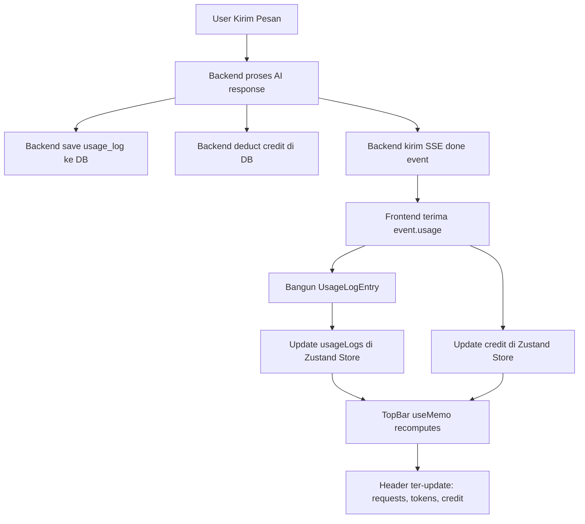

# Blueprint: Header Stats Not Updating After AI Response

**Tanggal**: 2026-06-02
**Probabilitas Bug**: 98% (Sangat Tinggi)
**Scope**: 1 file utama + 1 file pendukung
**Impact**: Semua user, semua model (free & paid)

---

## A. RINGKASAN SISTEM

### Masalah
Setelah response AI selesai, informasi di header (request count, token count, credit) tidak ter-update. Masih menampilkan 0 meskipun sudah beberapa kali chat. Untuk model free memang benar 0 credit, tapi request dan token juga tetap 0.

### Akar Masalah
Backend sudah menyimpan usage log ke database dan mengirim data usage lengkap via SSE `done` event, tapi frontend **mengabaikan data usage tersebut** dan tidak pernah memperbarui Zustand store.

### Target Arsitektur Setelah Fix
```
Backend (SSE done event)
  └─ event.usage {inputTokens, outputTokens, totalCost, creditRemaining, logId}
       │
       ▼
Frontend (useChatStream.ts)
  └─ case 'done' handler
       ├─ 1. Build UsageLogEntry dari event.usage
       ├─ 2. Update usageLogs di store (langsung, tanpa POST ulang)
       └─ 3. Update credit di store dari event.usage.creditRemaining
            │
            ▼
       Zustand Store (useChatDataStore)
         └─ usageLogs + credit ter-update
              │
              ▼
       TopBar Component
         └─ useMemo recomputes sessionStats → UI ter-update
```

---

## B. PEMETAAN FILE

### File Yang Diubah

| File | Aksi | Keterangan |
|------|------|------------|
| [`src/hooks/useChatStream.ts`](src/hooks/useChatStream.ts) | **MODIFIKASI** | Tambahkan store update di `case 'done'` (streaming) dan `handleNonStreamingResponse` |
| [`src/hooks/useChatActions.ts`](src/hooks/useChatActions.ts) | **TIDAK DIUBAH** | `addUsageLog()` sudah ada, tapi tidak dipanggil (backend sudah save ke DB, jadi kita update store langsung) |

### File Yang Tidak Diubah

| File | Alasan |
|------|--------|
| [`src/services/chat-orchestrator.service.ts`](src/services/chat-orchestrator.service.ts) | Backend sudah benar: save usage log + deduct credit + kirim via SSE |
| [`src/components/chat/top-bar.tsx`](src/components/chat/top-bar.tsx) | TopBar sudah benar: membaca `usageLogs` dari store via `useMemo` |
| [`src/lib/store.ts`](src/lib/store.ts) | Store sudah benar: `setUsageLogs()` dan `setCredit()` tersedia |

---

## C. SPESIFIKASI MODUL

### Bug #1 (UTAMA): `case 'done'` mengabaikan `event.usage` [PROBABILITY: 98%]

**Lokasi**: [`useChatStream.ts` line 374-402](src/hooks/useChatStream.ts:374)

**Saat Ini**:
```typescript
case 'done': {
  streamDone = true;
  setIsStreaming(false);
  setGenerationStatus('');
  // ... finalize message, update conversation ...
  
  // NOTE: Usage log and credit deduction are handled by backend
  // No need to call addUsageLog or deductCredit here to avoid duplicate entries
  // ❌ TIDAK ADA update ke store
}
```

**Yang Harus Terjadi**:
```typescript
case 'done': {
  streamDone = true;
  setIsStreaming(false);
  setGenerationStatus('');
  // ... finalize message, update conversation ...
  
  // ✅ Update usageLogs di store (backend sudah save ke DB, tidak perlu POST ulang)
  const usageEntry: UsageLogEntry = {
    id: event.usage.logId,
    conversationId: convId,
    modelId: event.usage.modelId,
    modelName: event.usage.modelName,
    provider: event.usage.provider,
    inputTokens: event.usage.inputTokens,
    outputTokens: event.usage.outputTokens,
    inputCost: event.usage.inputCost,
    outputCost: event.usage.outputCost,
    totalCost: event.usage.totalCost,
    category: activeCategoryRef.current,
    createdAt: event.usage.createdAt,
  };
  const currentLogs = useChatDataStore.getState().usageLogs;
  if (!currentLogs.find(l => l.id === usageEntry.id)) {
    useChatDataStore.getState().setUsageLogs([usageEntry, ...currentLogs]);
  }
  
  // ✅ Update credit dari backend response
  if (event.usage.creditRemaining !== undefined) {
    useChatDataStore.getState().setCredit(event.usage.creditRemaining);
  }
}
```

### Bug #2 (PENDUKUNG): `handleNonStreamingResponse` juga mengabaikan `data.usage` [PROBABILITY: 98%]

**Lokasi**: [`useChatStream.ts` line 508-509](src/hooks/useChatStream.ts:508)

**Saat Ini**:
```typescript
// NOTE: Usage log and credit deduction are handled by backend
// No need to call addUsageLog or deductCredit here to avoid duplicate entries
```

**Yang Harus Terjadi**: Sama seperti Bug #1, tapi menggunakan `data.usage` dari parameter.

### Bug #3 (SEKUNDER): `credit` dan `totalSpent` tidak dipersist ke localStorage [PROBABILITY: 30%]

**Lokasi**: [`store.ts` line 494-508](src/lib/store.ts:494)

**Saat Ini**: `partialize` config tidak menyertakan `credit` dan `totalSpent`:
```typescript
partialize: (state) => ({
  activeModel: state.activeModel,
  // ... lainnya ...
  usageLogs: state.usageLogs.slice(0, 100),
  creditLogs: state.creditLogs.slice(0, 50),
  // ❌ credit tidak ada
  // ❌ totalSpent tidak ada
})
```

**Impact**: Setelah page refresh, credit dan totalSpent reset ke 0 sampai `useAuthSession` selesai re-fetch. Ini bukan penyebab utama masalah (karena `useAuthSession` memang re-fetch), tapi menyebabkan flicker.

---

## D. ALUR DATA & ERROR HANDLING

### Data Flow Setelah Fix



### Error Handling

| Skenario | Penanganan |
|----------|------------|
| `event.usage` null/undefined | Guard check sebelum build entry; skip update jika data tidak lengkap |
| `event.usage.logId` duplikat | Cek `currentLogs.find(l => l.id === usageEntry.id)` sebelum insert |
| Store update gagal | Log error tapi tidak crash; UI tetap menampilkan response AI |
| `creditRemaining` undefined | Skip update credit; gunakan value lama |

---

## E. URUTAN EKSEKUSI (untuk Code Mode)

### Step 1: Fix `case 'done'` di streaming path
- **File**: `src/hooks/useChatStream.ts`
- **Lokasi**: Line 394-396 (ganti comment dengan kode update store)
- **Import**: Pastikan `UsageLogEntry` dan `useChatDataStore` sudah di-import (sudah ada)
- **Tambahkan**:
  1. Bangun `UsageLogEntry` dari `event.usage`
  2. Guard check duplikat
  3. Update `usageLogs` via `useChatDataStore.getState().setUsageLogs()`
  4. Update `credit` via `useChatDataStore.getState().setCredit()`

### Step 2: Fix `handleNonStreamingResponse` di fallback path
- **File**: `src/hooks/useChatStream.ts`
- **Lokasi**: Line 508-509 (ganti comment dengan kode update store)
- **Tambahkan**: Logika yang sama seperti Step 1, tapi menggunakan `data.usage` dari parameter

### Step 3: Tambahkan guard untuk `event.usage` yang tidak lengkap
- Pastikan `event.usage` ada sebelum build entry
- Jika `event.usage` undefined (edge case), log warning dan skip

### Step 4: Verifikasi
- Jalankan `pnpm dev`
- Kirim pesan ke model free → header harus menampilkan 1 request, N tokens
- Kirim pesan ke model paid → header harus menampilkan updated credit
- Refresh page → stats harus persist (dari `useAuthSession` re-fetch)

---

## F. CANDIDATE BUG LAIN (TIDAK DIPILIH)

| Bug | Probabilitas | Alasan Tidak Dipilih |
|-----|-------------|---------------------|
| `credit`/`totalSpent` tidak dipersist di localStorage | 30% | `useAuthSession` re-fetch saat mount; flicker saja |
| `resetChat()` clear semua `usageLogs` | 20% | Intentional behavior untuk new chat context |
| WebSocket `credit_update` tidak update `usageLogs` | 15% | WS hanya untuk real-time credit; utama tetap SSE |
| `useChatStore()` merge object tiap render | 10% | Shallow comparison cukup; bukan root cause |
| `sessionStats` useMemo dependency array | 5% | Dependency `usageLogs` sudah benar |
