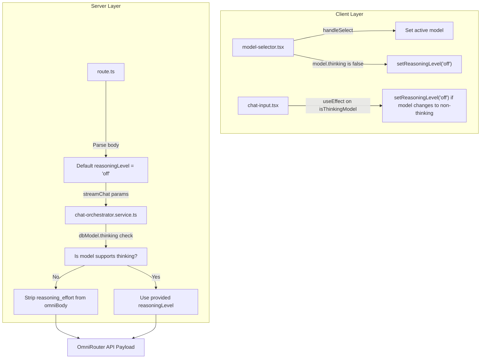

# Blueprint: Non-Thinking Model Reasoning Effort Payload Fix

This blueprint details the changes required to ensure that model settings with `thinking: false` (or `thinking: 0` in the database) never send any `reasoning_effort` or `thinking`/`reasoning` parameters in the payload to the LLM router, and that the client-side state is synchronized robustly.

## A. SYSTEM OVERVIEW

When a user selects a model that does not support thinking, or when an administrator updates an active model's capabilities to disable thinking, the system must guarantee that:
1. The global Zustand store's `reasoningLevel` gets immediately set/reset to `'off'` to reflect the current model capability.
2. The REST API endpoint does not default to `'medium'` reasoning for requests that should not have reasoning.
3. The server-side orchestrator uses the database configuration of the model to strip out `reasoning_effort` payloads, even if the client mistakenly transmits a reasoning level.



---

## B. FILE MAPPING

No files are created or deleted. The following files will be modified:
- [`src/components/chat/model-selector.tsx`](src/components/chat/model-selector.tsx) (Client UI - Model switching state sync)
- [`src/components/chat/chat-input.tsx`](src/components/chat/chat-input.tsx) (Client UI - Reactive model status sync)
- [`src/app/api/chat/route.ts`](src/app/api/chat/route.ts) (Server API - Route safety defaults)
- [`src/services/chat-orchestrator.service.ts`](src/services/chat-orchestrator.service.ts) (Server Service - Final backend authority check)

---

## C. MODULE SPECIFICATIONS

### 1. [`src/components/chat/model-selector.tsx`](src/components/chat/model-selector.tsx:324)
- **Function:** `handleSelect`
- **Logic:** Extracts the selected model. If the selected model exists and has `thinking: false` (or falsy), it calls `setReasoningLevel('off')` immediately before closing the selector.
- **Zustand imports:** Ensure `setReasoningLevel` is pulled from `useChatStore` alongside `activeModel`, `setActiveModel`, and `models`.

### 2. [`src/components/chat/chat-input.tsx`](src/components/chat/chat-input.tsx:38)
- **Function:** Component top-level hooks
- **Logic:** A new `useEffect` hook that triggers when `isThinkingModel` becomes false/falsy. If it does and `reasoningLevel` is currently anything other than `'off'`, it resets the store's `reasoningLevel` to `'off'`. This covers the edge case where an administrator dynamically disables thinking for the active model via administrative actions, which syncs in real-time over WebSockets.

### 3. [`src/app/api/chat/route.ts`](src/app/api/chat/route.ts:26)
- **Function:** `POST`
- **Logic:** Adjusts the destructuring default parameter from `reasoningLevel = 'medium'` to `reasoningLevel = 'off'` to prevent accidental application of reasoning when unspecified.

### 4. [`src/services/chat-orchestrator.service.ts`](src/services/chat-orchestrator.service.ts:149)
- **Function:** `streamChat`
- **Logic:** 
  - Identifies if the database-loaded model supports thinking using `const modelSupportsThinking = dbModel ? Boolean(dbModel.thinking) : false`.
  - Protects payload assembly: HANYA inject `omniBody.reasoning_effort = reasoningLevel` if `modelSupportsThinking && reasoningLevel && reasoningLevel !== 'off'`.
  - Protects response parsing: HANYA extract `fullThinkingContent` if `modelSupportsThinking && reasoningLevel && reasoningLevel !== 'off'`. Otherwise, empty string is set.

---

## D. DATA FLOW & ERROR HANDLING
- If a non-thinking model is active, the value of `reasoningLevel` is forced to `'off'` on both Client and Server.
- If an API request bypasses the client-side safeguards, the Server-side database model metadata check acts as the final gatekeeper, discarding any incoming `reasoningLevel` values if `dbModel.thinking` is false.

---

## E. EXECUTION SEQUENCE

### Step 1: Update client-side manual model selection
Modify [`src/components/chat/model-selector.tsx`](src/components/chat/model-selector.tsx):
1. Locate the destructuring assignment of `useChatStore()` around line 196.
2. Add `setReasoningLevel` to the list of destructured variables.
3. Modify `handleSelect` to check `!model.thinking` and call `setReasoningLevel('off')`.
4. Add `setReasoningLevel` to the `useCallback` dependency array.

### Step 2: Update client-side reactive protection
Modify [`src/components/chat/chat-input.tsx`](src/components/chat/chat-input.tsx):
1. Verify `isThinkingModel` is fetched from store/computed.
2. Add a `useEffect` hook looking at `isThinkingModel` and `reasoningLevel`:
   ```typescript
   useEffect(() => {
     if (!isThinkingModel && reasoningLevel !== 'off') {
       setReasoningLevel('off');
     }
   }, [isThinkingModel, reasoningLevel, setReasoningLevel]);
   ```

### Step 3: Update API Route safety defaults
Modify [`src/app/api/chat/route.ts`](src/app/api/chat/route.ts):
1. In the `POST` function destructuring block, change `reasoningLevel = 'medium'` to `reasoningLevel = 'off'`.

### Step 4: Update final backend orchestrator authority
Modify [`src/services/chat-orchestrator.service.ts`](src/services/chat-orchestrator.service.ts):
1. Under the database model check block around line 179-183, declare:
   ```typescript
   const modelSupportsThinking = dbModel ? Boolean(dbModel.thinking) : false;
   ```
2. Modify the OmniRouter payload assignment around line 436:
   ```typescript
   if (modelSupportsThinking && reasoningLevel && reasoningLevel !== 'off') {
     omniBody.reasoning_effort = reasoningLevel;
   }
   ```
3. Modify the thinking extraction around line 497:
   ```typescript
   if (modelSupportsThinking && reasoningLevel && reasoningLevel !== 'off') {
     fullThinkingContent = messageData?.thinking || messageData?.reasoning_content || '';
   } else {
     fullThinkingContent = '';
   }
   ```

---

### Step 5: Verification and Test Run
Run the test suite to ensure no existing orchestrator tests or client tests are broken:
- `pnpm test`
- Specifically test the orchestrator: `pnpm test -- --testPathPattern="chat-orchestrator.service"`
