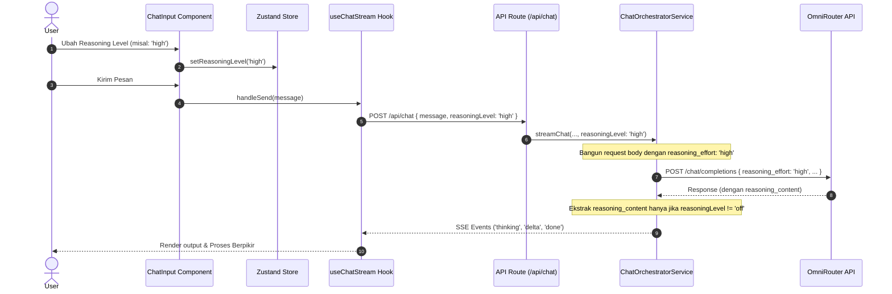

# Blueprint Arsitektur: Integrasi OpenAI Reasoning Levels (low, medium, high, xhigh) dan Perbaikan Bug Thinking Mode

## A. RINGKASAN SISTEM

### Target Arsitektur
Memperkenalkan opsi tingkat penalaran (*reasoning effort levels*) standard OpenAI (`low`, `medium`, `high`, `xhigh`) untuk menggantikan toggle biner `thinkingEnabled` (ON/OFF). Ketika penalaran dinonaktifkan (`off`), backend akan secara aktif mengabaikan dan tidak mengekstraksi konten pemikiran (*thinking content/reasoning_content*) untuk memastikan AI tidak memberikan respon *thinking* yang bocor ke frontend.

### Scope Fitur & Bugfix
1. **Pencegahan Kebocoran Thinking (Bugfix Utama):** Jika tingkat penalaran berada pada kondisi `off`, backend tidak boleh membaca, mengurai, atau mentransfer data `thinking_content` / `reasoning_content` ke client lewat SSE, bahkan jika provider LLM secara default mengirimkannya.
2. **Standardisasi Parameter OpenAI (`reasoning_effort`):** Mengirim parameter `reasoning_effort` dengan opsi `low`, `medium`, `high`, `xhigh` ke API OmniRouter, menggantikan model `thinking = { type: 'enabled' }`.
3. **Upgrade State Management & UI:** Mengubah toggle biner di UI Chat Input menjadi pilihan menu / dropdown untuk memilih tingkat penalaran. Default level adalah `medium` (aktif) dan `off` jika dimatikan.

---

## B. PEMETAAN FILE

Daftar file yang akan diubah untuk mengimplementasikan solusi ini:

```
src/
├── lib/
│   └── store.ts                    # Mengubah thinkingEnabled: boolean menjadi reasoningLevel: ReasoningLevel
├── components/
│   └── chat/
│       └── chat-input.tsx          # Mengganti UI toggle dengan dropdown selector tingkat penalaran
├── hooks/
│   └── useChatStream.ts            # Memperbarui logic streaming payload & ref reference
├── app/
│   └── api/
│       └── chat/
│           └── route.ts            # Menyesuaikan penanganan body request dari client
├── services/
│   └── chat-orchestrator.service.ts # Implementasi filtering response dan mapping parameter reasoning_effort
```

---

## C. SPESIFIKASI MODUL

### 1. Model & Types (`src/lib/store.ts`)
*   **ReasoningLevel Type**:
    ```typescript
    export type ReasoningLevel = 'off' | 'low' | 'medium' | 'high' | 'xhigh';
    ```
*   **State & Action Updates**:
    *   Hapus `thinkingEnabled: boolean` dan `setThinkingEnabled: (enabled: boolean) => void`.
    *   Hapus `toggleThinking: () => void`.
    *   Tambahkan `reasoningLevel: ReasoningLevel` (default: `'medium'`).
    *   Tambahkan `setReasoningLevel: (level: ReasoningLevel) => void`.
    *   Pastikan migrasi cache otomatis pada `partialize` (jika `thinkingEnabled` bernilai true, set `reasoningLevel: 'medium'`, jika false set `'off'`).

### 2. UI Selector (`src/components/chat/chat-input.tsx`)
*   Ganti toggle button `Thinking Mode` dengan dropdown menu (menggunakan UI Component dropdown-menu atau sejenisnya) yang memungkinkan user memilih:
    *   `Disabled / Off` (Tanpa reasoning)
    *   `Low` (Penalaran cepat)
    *   `Medium` (Default)
    *   `High` (Penalaran mendalam)
    *   `XHigh` (Penalaran ekstra)
*   Komponen selector ini hanya akan dirender jika model yang aktif mendukung thinking (`currentModel?.thinking === 1`).

### 3. API Handler (`src/app/api/chat/route.ts`)
*   Ubah destrukturisasi body parameter:
    *   Hapus `thinkingEnabled`.
    *   Tambahkan `reasoningLevel = 'medium'`.
*   Pass parameter `reasoningLevel` ke dalam `ChatOrchestratorService.streamChat`.

### 4. Orchestration (`src/services/chat-orchestrator.service.ts`)
*   Ubah signature `streamChat` untuk menerima `reasoningLevel: ReasoningLevel`.
*   Sesuaikan pembentukan `omniBody` sebelum mengirim request ke OmniRouter:
    ```typescript
    if (reasoningLevel !== 'off') {
      omniBody.reasoning_effort = reasoningLevel; // Sesuai standar OpenAI
    }
    ```
*   Perbaiki penanganan output (`messageData`):
    ```typescript
    // HANYA ekstrak thinking content jika reasoningLevel bukan 'off'
    if (reasoningLevel !== 'off') {
      fullThinkingContent = messageData?.thinking || messageData?.reasoning_content || '';
    } else {
      fullThinkingContent = ''; // Aktif membersihkan jika terkirim secara default oleh provider
    }
    ```
*   Kirim pesan SSE `thinking` hanya jika `fullThinkingContent` tidak kosong.

---

## D. ALUR DATA & ERROR

### Data Flow



---

## E. URUTAN EKSEKUSI

Langkah-langkah detail pengerjaan untuk **Code Mode**:

1.  **Langkah 1 (Zustand Store):** Perbarui `src/lib/store.ts` untuk menambahkan tipe `ReasoningLevel`, perbarui skema state, dan terapkan fungsi migrasi dari cache lama.
2.  **Langkah 2 (API Route):** Perbarui `src/app/api/chat/route.ts` agar menangani `reasoningLevel` alih-alih `thinkingEnabled`.
3.  **Langkah 3 (Orchestrator Service):** Ubah `src/services/chat-orchestrator.service.ts` untuk memetakan parameter `reasoning_effort` dan mencegah ekstraksi konten pemikiran saat mode `off`.
4.  **Langkah 4 (Stream Hook):** Sesuaikan `src/hooks/useChatStream.ts` agar mengambil dan mengirim data `reasoningLevel` dari store terbaru.
5.  **Langkah 5 (UI Frontend):** Ubah komponen `src/components/chat/chat-input.tsx` untuk menampilkan menu selector level penalaran.
6.  **Langkah 6 (Unit Tests & Verifikasi):** Sesuaikan seluruh unit test terkait (`useChatStream.test.tsx`, `chat-orchestrator.service.test.ts`, dll.) untuk menyesuaikan dengan parameter baru, lalu jalankan `pnpm test`.
