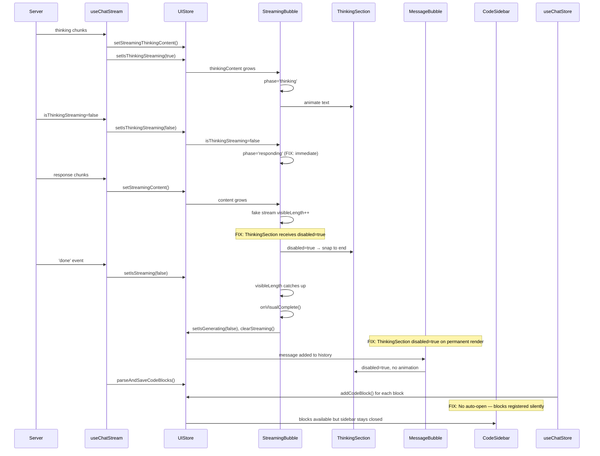

# Blueprint: Streaming Phase Synchronization Fixes

**Date:** 2026-06-02
**Scope:** Fix race conditions between fake streaming animations and AI response state
**Mode:** Architect → Code Handoff

---

## A. RINGKASAN SISTEM

### Target Architecture

Eliminate three synchronization bugs in the streaming UI:

1. **Thinking-vs-Response Race** — Response content accumulates invisibly while thinking animation runs
2. **Finalization Re-animation** — ThinkingSection restarts animation when message moves to history
3. **Premature Code Sidebar** — Code sidebar auto-opens when finalization parses code blocks

### Scope

Fix the visual timing of the `StreamingBubble` → `MessageBubble` transition and the code sidebar auto-open behavior. No changes to server-side streaming, store schema, or data persistence.

---

## B. PEMETAAN FILE

### Files to Modify

| File | Change Type | Description |
|------|-------------|-------------|
| `src/components/chat/message-list.tsx` | Modify | Fix phase transition logic in `StreamingBubble` (lines 209-215) |
| `src/components/chat/message-bubble.tsx` | Modify | Fix `ThinkingSection` disabled snap (line 496-507) and add `disabled` prop to permanent bubble usage (line 745) |
| `src/hooks/useChatStream.ts` | Modify | Gate auto-open of code sidebar at finalization (lines 171-173) |

### Files NOT Modified

| File | Reason |
|------|--------|
| `src/lib/store.ts` | `addCodeBlock` does NOT open sidebar — verified |
| `src/components/FakeStreamRenderer.tsx` | Separate component, not used in streaming flow |
| `src/components/chat/code-sidebar.tsx` | No changes needed — sidebar is a passive recipient |
| `src/config/stream-config.ts` | No config changes needed |

---

## C. SPESIFIKASI MODUL

### Module 1: StreamingBubble Phase Logic

**File:** [`src/components/chat/message-list.tsx`](src/components/chat/message-list.tsx:209)

**Current Code (lines 209-215):**
```typescript
useEffect(() => {
  if (isThinkingStreaming) {
    setPhase('thinking');
  } else if (!thinkingContent) {
    setPhase('responding');
  }
}, [isThinkingStreaming, thinkingContent]);
```

**Bug:** Phase only switches to `responding` when `thinkingContent` is empty. If thinking content exists but `isThinkingStreaming` is false, phase stays stuck as `thinking`.

**Fix:** Always switch to `responding` when `isThinkingStreaming` is false:
```typescript
useEffect(() => {
  if (isThinkingStreaming) {
    setPhase('thinking');
  } else {
    setPhase('responding');
  }
}, [isThinkingStreaming]);
```

**Rationale:** The `!thinkingContent` guard was intended to prevent flash before thinking starts, but it creates the race condition. When `isThinkingStreaming` is false, thinking is done — response should begin immediately.

---

### Module 2: ThinkingSection Disabled Snap

**File:** [`src/components/chat/message-bubble.tsx`](src/components/chat/message-bubble.tsx:496)

**Current Code (lines 496-507):**
```typescript
useEffect(() => {
  if (disabled) return;  // Early return — visibleLength stays frozen at intermediate value

  if (visibleLength < content.length) {
    const timer = setTimeout(() => {
      setVisibleLength((prev) => Math.min(prev + FAKE_STREAM_CONFIG.AVG_WORD_LENGTH, content.length));
    }, FAKE_STREAM_CONFIG.MS_PER_WORD);
    return () => clearTimeout(timer);
  } else if (onComplete) {
    onComplete();
  }
}, [visibleLength, content.length, onComplete, disabled]);
```

**Bug:** When `disabled` flips from `false` to `true`, the early return preserves `visibleLength` at its last value. Text freezes mid-animation.

**Fix:** Snap to full content when `disabled` becomes true:
```typescript
useEffect(() => {
  if (disabled) {
    setVisibleLength(content.length);  // Snap to end
    return;
  }

  if (visibleLength < content.length) {
    const timer = setTimeout(() => {
      setVisibleLength((prev) => Math.min(prev + FAKE_STREAM_CONFIG.AVG_WORD_LENGTH, content.length));
    }, FAKE_STREAM_CONFIG.MS_PER_WORD);
    return () => clearTimeout(timer);
  } else if (onComplete) {
    onComplete();
  }
}, [visibleLength, content.length, onComplete, disabled]);
```

**Edge Case:** If `disabled` is initially `true` (permanent bubble), the `useState` already initializes `visibleLength` to `content.length`. The new `setVisibleLength(content.length)` call is harmless — it's a no-op when already at full length.

---

### Module 3: Permanent Bubble ThinkingSection

**File:** [`src/components/chat/message-bubble.tsx`](src/components/chat/message-bubble.tsx:745)

**Current Code (line 745):**
```tsx
{thinkingContent && <ThinkingSection content={thinkingContent} />}
```

**Bug:** No `disabled` prop. Every finalized message re-renders the thinking animation from scratch.

**Fix:** Pass `disabled={true}` to skip animation on finalized messages:
```tsx
{thinkingContent && <ThinkingSection content={thinkingContent} disabled={true} />}
```

**Rationale:** Finalized messages should display their full thinking content immediately without animation.

---

### Module 4: Code Sidebar Auto-Open

**File:** [`src/hooks/useChatStream.ts`](src/hooks/useChatStream.ts:171)

**Current Code (lines 171-173):**
```typescript
if (hasNewCode) {
  useChatStore.getState().setCodeSidebarOpen(true);
}
```

**Bug:** Auto-opens the code sidebar every time `parseAndSaveCodeBlocks` runs (during finalization). Users experience a jarring sidebar pop-open when the response contains any code.

**Fix:** Remove the auto-open. Code blocks are already registered in the store and visible via badge clicks:
```typescript
// Remove or comment out:
// if (hasNewCode) {
//   useChatStore.getState().setCodeSidebarOpen(true);
// }
```

**Rationale:** Users should control sidebar visibility. The `StreamingCodeContainer` in the streaming bubble already shows incomplete code. Complete code blocks show as clickable badges. Auto-open is an interruption.

---

## D. ALUR DATA & ERROR HANDLING

### Data Flow Diagram



### Error Handling

| Scenario | Current Behavior | Fixed Behavior |
|----------|-----------------|----------------|
| Thinking content empty | Phase starts as `responding` | Same — unchanged |
| `isThinkingStreaming` never becomes false | Phase stays `thinking`, content hidden | Same — no fix needed (server bug) |
| `disabled` flips mid-animation | Text freezes mid-word | Text snaps to full content |
| User clicks code badge during streaming | Sidebar opens with block | Same — user-initiated |
| Finalization with no code blocks | No sidebar interaction | Same — unchanged |
| Multiple rapid thinking/response switches | Phase flickers | Phase follows `isThinkingStreaming` cleanly |

---

## E. URUTAN EKSEKUSI

### Step 1: Fix StreamingBubble Phase Logic
**File:** `src/components/chat/message-list.tsx`
**Lines:** 209-215
**Action:** Replace the `else if (!thinkingContent)` with unconditional `else`
**Validation:** Run `pnpm test -- --testPathPattern="useChatStream"` and `pnpm test -- --testPathPattern="useChatActions"`

### Step 2: Fix ThinkingSection Disabled Snap
**File:** `src/components/chat/message-bubble.tsx`
**Lines:** 496-507
**Action:** Add `setVisibleLength(content.length)` when `disabled` is true
**Validation:** Run `pnpm test -- --testPathPattern="message"` (if exists) or manual browser test

### Step 3: Fix Permanent Bubble ThinkingSection
**File:** `src/components/chat/message-bubble.tsx`
**Line:** 745
**Action:** Add `disabled={true}` prop to `<ThinkingSection>`
**Validation:** Manual browser test — send message with thinking, verify no re-animation

### Step 4: Remove Code Sidebar Auto-Open
**File:** `src/hooks/useChatStream.ts`
**Lines:** 171-173
**Action:** Remove or comment out `setCodeSidebarOpen(true)` call
**Validation:** Run `pnpm test -- --testPathPattern="useChatStream"` and manual test

### Step 5: Run Full Test Suite
**Command:** `pnpm test`
**Validation:** All existing tests pass (no regressions)

### Step 6: Run Lint
**Command:** `pnpm lint`
**Validation:** No new lint errors introduced

---

## F. TESTING CHECKLIST

- [ ] Thinking-to-response transition is seamless (no "jump")
- [ ] ThinkingSection snaps to full text when response starts
- [ ] Finalized messages show thinking content without animation
- [ ] Code sidebar does NOT auto-open on finalization
- [ ] Code sidebar opens when user clicks a code badge
- [ ] StreamingCodeContainer still shows incomplete code during stream
- [ ] Blinking cursor still works correctly
- [ ] All existing tests pass
- [ ] No lint errors

---

## G. RISK ASSESSMENT

| Risk | Impact | Mitigation |
|------|--------|------------|
| Phase switches too early if server sends response before thinking ends | Response appears while thinking is still visible | Acceptable — server controls `isThinkingStreaming` flag |
| `setVisibleLength(content.length)` called on every render when disabled | Performance: harmless state update to same value | React bails out of re-render when state is same |
| Removing auto-open confuses users who expect sidebar | UX regression | Users can click badge; visual feedback via StreamingCodeContainer is sufficient |
