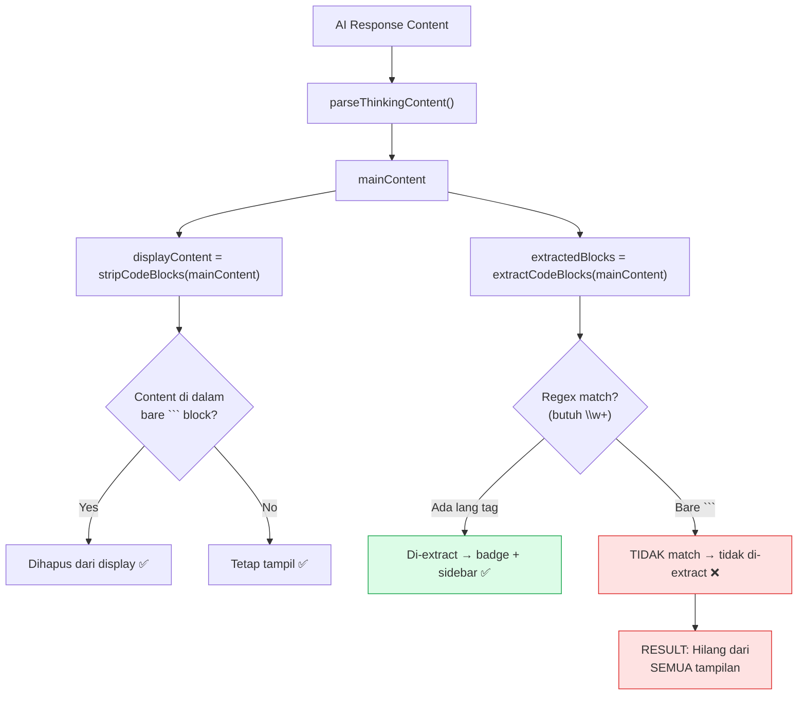
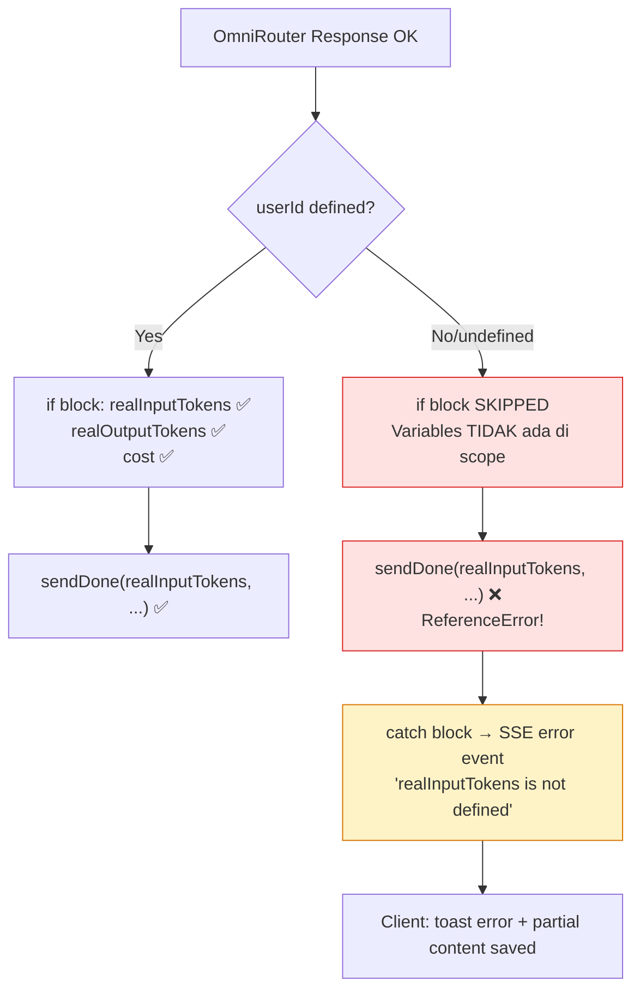

# Blueprint: 3 Bugfix — Tree Structure, Thinking Animation, realInputTokens Error

**Tanggal:** 2026-06-02  
**Scope:** 3 bug fix pada rendering chat, SSE streaming, dan backend orchestrator  
**Mode:** Code Mode (implementasi)

---

## A. RINGKASAN SISTEM

### Target Arsitektur
Perbaikan 3 bug kritis yang mempengaruhi UX chat AI:

1. **Tree Structure Disappearing** — Code block tanpa language tag (`bare ``` `) di-strip dari display tapi tidak di-extract → konten hilang total
2. **Thinking Phase Animation** — Thinking section muncul tiba-tiba tanpa animasi karena backend mengirim thinking+delta event secara simultan dan tidak ada CSS transition
3. **`realInputTokens is not defined`** — Variable scoping bug di backend — `const` deklarasi di dalam blok `if (userId)` di-referensi di luar blok

### Scope Fitur
- Perbaikan regex code block extraction (5 functions, 2 files)
- Perbaikan SSE event timing di backend + animasi CSS di frontend
- Perbaikan variable scoping di chat-orchestrator.service.ts

---

## B. PEMETAAN FILE

```
Yang DIPERBAIKI (6 file):
├── src/components/chat/message-bubble.tsx     ← extractCodeBlocks, extractIncompleteCodeBlock, stripIncompleteCodeBlock
├── src/components/chat/message-list.tsx       ← ThinkingSection animation + phase transition
├── src/hooks/useChatStream.ts                 ← parseAndSaveCodeBlocks regex
└── src/services/chat-orchestrator.service.ts  ← variable scoping + SSE event timing

Yang TIDAK diubah:
├── src/lib/store.ts
├── src/components/FakeStreamRenderer.tsx
└── src/components/chat/code-sidebar.tsx
```

---

## C. SPESIFIKASI MODUL

### Bug 1: Regex Mismatch — Code Block Extraction

#### Masalah
`stripCodeBlocks()` menggunakan regex `/ ```[\s\S]*?```/g` yang cocok untuk SEMUA code block (dengan/without language tag). Tapi `extractCodeBlocks()` dan 4 function lainnya menggunakan regex `/ ```(\w+).../g` yang MEMBUTUHKAN language tag (`\w+` tanpa `?`).

Ketika AI mengoutput code block tanpa language tag (bare ` ``` `), konten di-strip dari display tapi tidak pernah di-extract → hilang total dari bubble, badge, dan sidebar.

#### Affected Functions (exact line numbers, verified)

| # | Function | File | Line | Regex Saat Ini |
|---|----------|------|------|----------------|
| 1 | `extractCodeBlocks` | `message-bubble.tsx` | 364 | `` /```(\w+)(?::([^\n]+))?\n([\s\S]*?)```/g `` |
| 2 | `extractIncompleteCodeBlock` | `message-bubble.tsx` | 384 | `` /```(\w+)(?::([^\n]+))?\n[\s\S]*?```/g `` (line 384) |
| 3 | `extractIncompleteCodeBlock` | `message-bubble.tsx` | 385 | `` /```(\w+)(?::([^\n]+))?\n([\s\S]*)$/ `` |
| 4 | `stripIncompleteCodeBlock` | `message-bubble.tsx` | 397 | `` /```(\w+)(?::([^\n]+))?\n[\s\S]*?```/g `` |
| 5 | `stripIncompleteCodeBlock` | `message-bubble.tsx` | 398 | `` /```(\w+)(?::([^\n]+))?\n[\s\S]*$/ `` |
| 6 | `parseAndSaveCodeBlocks` | `useChatStream.ts` | 129 | `` /```(\w+)(?::([^\n]+))?\n([\s\S]*?)```/g `` |

**Regex yang TIDAK berubah (sudah benar):**

| Function | File | Line | Regex |
|----------|------|------|-------|
| `stripCodeBlocks` | `message-bubble.tsx` | 373 | `` /```[\s\S]*?```/g `` |

#### Solusi
Ubah `(\w+)` → `(\w+)?` (tambah `?`) di semua 6 regex di atas. Fallback `|| 'text'` sudah ada di semua function.

---

### Bug 2: Thinking Phase Animation

#### Masalah Layer 1 — Backend Event Timing
Di `chat-orchestrator.service.ts` line 497-503:
```typescript
if (fullThinkingContent) {
  safeEnqueue(sendEvent({ type: 'thinking', content: fullThinkingContent }));
}
if (fullContent) {
  safeEnqueue(sendStatus('Menampilkan jawaban...'));
  safeEnqueue(sendEvent({ type: 'delta', content: fullContent }));
}
```

Backend menggunakan `stream: false` (line 426) → mendapat seluruh response sekaligus → memancarkan thinking dan delta event **berurutan tanpa delay** → frontend menerima keduanya hampir instan.

#### Masalah Layer 2 — Tidak Ada Animasi Entry
Di `message-list.tsx` line 345-347:
```tsx
{thinkingContent && (
  <div className="relative">  {/* ← TIDAK ada streaming-reveal-container */}
    <ThinkingSection ... />
  </div>
)}
```

Sedangkan MarkdownContent (line 368) punya animasi:
```tsx
<div className="streaming-reveal-container">  {/* ← ADA animasi */}
  <MarkdownContent ... />
</div>
```

#### Solusi
1. **Backend**: Tambah `await new Promise(resolve => setTimeout(resolve, 800))` setelah thinking event (line 498)
2. **Frontend**: Tambah class `streaming-reveal-container` ke ThinkingSection wrapper div (line 347)

---

### Bug 3: `realInputTokens is not defined`

#### Masalah
Di `chat-orchestrator.service.ts`:
- Line 508: `if (userId) {` — blok if dimulai
- Line 509: `const realInputTokens = ...` — dideklarasikan DI DALAM blok if (block-scoped)
- Line 510: `const realOutputTokens = ...` — dideklarasikan DI DALAM blok if
- Line 511: `const cost = ...` — dideklarasikan DI DALAM blok if
- Line 582: `}` — blok if berakhir → semua `const` di dalamnya HANCUR dari scope
- Line 584-588: `sendDone({ inputTokens: realInputTokens, ... })` — referensi DI LUAR blok if

Ketika `userId` falsy (undefined/null/empty), blok if tidak dieksekusi → `realInputTokens` tidak pernah dideklarasikan → **ReferenceError** → error dikirim ke client sebagai SSE error event.

**Note:** `sendDone()` sendiri (line 230-254) sudah punya komputasi internal `realInputTokens` (line 234). Jadi passing argument dari luar sebenarnya redundan.

#### Solusi
Pindahkan deklarasi `realInputTokens`, `realOutputTokens`, `cost` ke **sebelum** blok `if (userId)` (setelah line 494), dan hapus deklarasi duplikat di dalam blok.

---

## D. ALUR DATA & ERROR HANDLING

### Alur Data Bug 1 (Code Block Extraction)



### Alur Data Bug 3 (realInputTokens Scoping)



### Error Handling

| Bug | Error Impact | Fallback |
|-----|-------------|----------|
| Bug 1 | Konten hilang tanpa error | Tidak ada — silent data loss |
| Bug 2 | UX jarring, thinking section tidak terlihat | Tidak ada — visual glitch |
| Bug 3 | SSE error event → client toast "Koneksi AI Error" | Partial content disimpan (line 648-667 useChatStream.ts) |

---

## E. URUTAN EKSEKUSI

### Step 1: Fix Variable Scoping (Bug 3) — PRIORITAS TERTINGGI

**File:** `src/services/chat-orchestrator.service.ts`

**Aksi:**
1. Pindahkan baris 509-511 ke **sebelum** baris 508 (setelah baris 494):
   ```typescript
   // Setelah baris 494 (setelah resultData.usage block)
   const realInputTokens = inputTokens > 0 ? inputTokens : estimatedInputTokens;
   const realOutputTokens = outputTokens > 0 ? outputTokens : ChatUsageTrackingService.estimateTokens(fullContent);
   const cost = ChatUsageTrackingService.calculateCost(realInputTokens, realOutputTokens, modelPricing);
   
   // Baris 508: if (userId) { — HAPUS deklarasi duplikat di dalam
   if (userId) {
     // ❌ HAPUS 3 baris ini:
     // const realInputTokens = ...
     // const realOutputTokens = ...
     // const cost = ...
     // ... sisanya tetap ...
   }
   ```

**Verifikasi:** `pnpm lint` + `pnpm test`

---

### Step 2: Fix Regex Mismatch (Bug 1) — PRIORITAS TINGGI

**File 1:** `src/components/chat/message-bubble.tsx`

**Aksi — 3 functions, 5 regex:**

1. `extractCodeBlocks` (line 364):
   ```
   /```(\w+)(?::([^\n]+))?\n([\s\S]*?)```/g
   → /```(\w+)?(?::([^\n]+))?\n([\s\S]*?)```/g
   ```

2. `extractIncompleteCodeBlock` (line 384):
   ```
   /```(\w+)(?::([^\n]+))?\n[\s\S]*?```/g
   → /```(\w+)?(?::([^\n]+))?\n[\s\S]*?```/g
   ```

3. `extractIncompleteCodeBlock` (line 385):
   ```
   /```(\w+)(?::([^\n]+))?\n([\s\S]*)$/$
   → /```(\w+)?(?::([^\n]+))?\n([\s\S]*)$/ $
   ```

4. `stripIncompleteCodeBlock` (line 397):
   ```
   /```(\w+)(?::([^\n]+))?\n[\s\S]*?```/g
   → /```(\w+)?(?::([^\n]+))?\n[\s\S]*?```/g
   ```

5. `stripIncompleteCodeBlock` (line 398):
   ```
   /```(\w+)(?::([^\n]+))?\n[\s\S]*$/$
   → /```(\w+)?(?::([^\n]+))?\n[\s\S]*$/ $
   ```

**File 2:** `src/hooks/useChatStream.ts`

**Aksi — 1 function, 1 regex:**

6. `parseAndSaveCodeBlocks` (line 129):
   ```
   /```(\w+)(?::([^\n]+))?\n([\s\S]*?)```/g
   → /```(\w+)?(?::([^\n]+))?\n([\s\S]*?)```/g
   ```

**Verifikasi:** `pnpm test -- --testPathPattern="useChatActions"` + `pnpm test -- --testPathPattern="useChatStream"`

---

### Step 3: Fix Thinking Phase Animation (Bug 2) — PRIORITAS SEDANG

**File 1:** `src/services/chat-orchestrator.service.ts`

**Aksi — Tambah delay setelah thinking event (setelah baris 498):**
```typescript
if (fullThinkingContent) {
  safeEnqueue(sendEvent({ type: 'thinking', content: fullThinkingContent }));
  // Tambah delay agar thinking section sempat terlihat oleh user
  await new Promise(resolve => setTimeout(resolve, 800));
}
```

**File 2:** `src/components/chat/message-list.tsx`

**Aksi — Tambah animasi entry pada ThinkingSection (baris 347):**
```tsx
// SEBELUM (line 347):
<div className="relative">

// SESUDAH:
<div className="relative streaming-reveal-container">
```

**Verifikasi:** `pnpm lint` + manual visual test via `pnpm dev`

---

### Step 4: Run Full Test Suite

```bash
pnpm lint
pnpm test
pnpm test:coverage
```

### Step 5: Visual Verification

1. Jalankan `pnpm dev`
2. Kirim pesan ke AI → pastikan tree structure muncul di bubble (atau sebagai badge)
3. Pastikan thinking section muncul dengan animasi fade-in
4. Pastikan tidak ada error "realInputTokens is not defined" di console
5. Test dengan user yang tidak login (userId undefined) untuk memastikan Bug 3 teratasi

---

## Catatan Tambahan

### Risk Assessment
- **Bug 1 fix:** Minimal risk — hanya menambah `?` ke regex. Fallback `|| 'text'` sudah ada.
- **Bug 2 fix:** Low risk — delay 800ms bisa disesuaikan. CSS class sudah ada.
- **Bug 3 fix:** Minimal risk — hanya memindahkan posisi deklarasi. Logika tetap sama.

### Backward Compatibility
- Semua fix backward compatible — tidak mengubah API, tidak mengubah store schema
- Existing tests harus tetap pass karena fix hanya menambah kapabilitas (bukan mengubah behavior existing)
