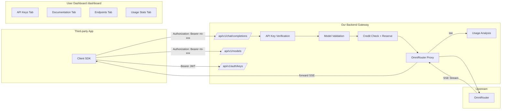
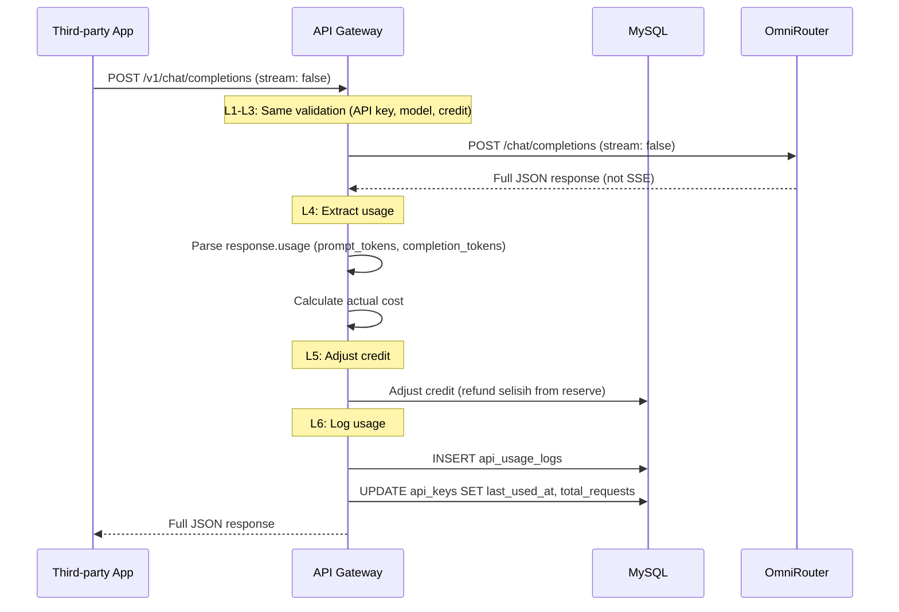

# BYOK API Gateway — Full Blueprint

> **Scope**: User-generated API keys (`mi-` prefix), OpenAI-compatible v1 endpoints, backend as proxy gateway to OmniRouter, sidebar UI redesign, user dashboard for API management.

---

## A. SYSTEM OVERVIEW



### Key Design Decisions

- **API Key Format**: `mi-{random42chars}` — prefix `mi-` identifies our platform, total 45 chars
- **Key Storage**: bcrypt hash in `api_keys` table; prefix (`mi-xxxxxxxx`) stored separately for display lookup
- **Key Lifecycle**: Generate → Show ONCE → Store hash → Revoke/Regenerate on demand
- **Streaming**: `ReadableStream.tee()` — zero-buffer passthrough + background analysis
- **Non-Streaming**: Buffer full JSON response → extract usage → deduct credit → return
- **Credit Safety**: Pre-reserve before proxy, post-adjust after completion, `SELECT ... FOR UPDATE` for race conditions
- **Model Security**: Only `models.status = 'active'` visible to API users; unknown models return 404 (never expose OmniRouter)
- **Rate Limiting**: Per API key, in-memory Map with sliding window
- **CORS**: `middleware.ts` for `/api/v1/*` routes — allow cross-origin for third-party apps
- **Auth Split**: `/v1/chat/*`, `/v1/models` use Bearer API key; `/v1/auth/keys` uses Bearer JWT (browser session)

---

## B. FILE MAPPING

```
NEW FILES:
├── src/types/openai-api.ts                      # OpenAI-compatible TypeScript types
├── src/app/api/v1/chat/completions/route.ts     # Chat endpoint (streaming + non-streaming)
├── src/app/api/v1/auth/keys/route.ts            # API key CRUD (generate/revoke/regenerate/list)
├── src/app/api/v1/models/route.ts               # REPLACE — show only active models
├── src/app/api/v1/usage/route.ts                # API usage stats
├── src/app/api/v1/health/route.ts               # Health check (no auth)
├── src/app/dashboard/page.tsx                   # User dashboard
├── src/app/dashboard/layout.tsx                 # Dashboard layout + auth guard
├── src/components/dashboard/api-keys-tab.tsx    # API key UI (generate/revoke/regenerate)
├── src/components/dashboard/docs-tab.tsx        # API documentation
├── src/components/dashboard/endpoints-tab.tsx   # Endpoint reference
├── src/components/dashboard/usage-tab.tsx       # Usage analytics
├── src/lib/api-key-auth.ts                      # API key verification
├── src/lib/api-rate-limiter.ts                  # Per-API-key rate limiting
├── src/lib/openai-errors.ts                     # OpenAI-compatible errors
├── src/lib/migration-api-keys.sql               # DB migration
├── src/repositories/api-key.repo.ts             # API key CRUD
├── src/repositories/api-usage.repo.ts           # Usage log CRUD
├── src/services/api-gateway.service.ts          # Proxy + streaming + analysis
└── middleware.ts                                # CORS for /api/v1/*

MODIFIED FILES:
├── src/components/chat/sidebar.tsx              # Three-dots dropdown
├── src/lib/schema.sql                           # Add tables
├── src/lib/init-db.js                           # Add migration runner
└── src/config/index.ts                          # Add API_KEY_SECRET
```

---

## C. MODULE SPECIFICATIONS

### C1. TypeScript Types — `src/types/openai-api.ts`

```typescript
// OpenAI-compatible request
export interface OpenAIChatCompletionRequest {
  model: string;
  messages: Array<{ role: 'system' | 'user' | 'assistant'; content: string }>;
  stream?: boolean;           // default: false
  temperature?: number;       // 0-2
  max_tokens?: number;        // max output tokens
  top_p?: number;
  frequency_penalty?: number;
  presence_penalty?: number;
  stop?: string | string[];
}

// OpenAI-compatible response (non-streaming)
export interface OpenAIChatCompletionResponse {
  id: string;                 // "chatcmpl-xxx"
  object: "chat.completion";
  created: number;            // unix timestamp
  model: string;
  choices: Array<{
    index: number;
    message: { role: 'assistant'; content: string };
    finish_reason: 'stop' | 'length' | 'content_filter';
  }>;
  usage: {
    prompt_tokens: number;
    completion_tokens: number;
    total_tokens: number;
  };
}

// OpenAI-compatible SSE chunk (streaming)
export interface OpenAIChatCompletionChunk {
  id: string;
  object: "chat.completion.chunk";
  created: number;
  model: string;
  choices: Array<{
    index: number;
    delta: { role?: 'assistant'; content?: string };
    finish_reason: 'stop' | 'length' | null;
  }>;
  usage?: { prompt_tokens: number; completion_tokens: number; total_tokens: number };
}

// OpenAI-compatible error
export interface OpenAIErrorResponse {
  error: {
    message: string;
    type: string;             // "invalid_request_error", "authentication_error", etc.
    param: string | null;
    code: string | null;
  };
}

// Model list
export interface OpenAIModel {
  id: string;
  object: "model";
  created: number;
  owned_by: string;
}

export interface OpenAIModelList {
  object: "list";
  data: OpenAIModel[];
}
```

---

### C2. Database Schema — `api_keys` table

```sql
CREATE TABLE IF NOT EXISTS api_keys (
  id VARCHAR(64) PRIMARY KEY,
  user_id VARCHAR(64) NOT NULL,
  name VARCHAR(255) NOT NULL DEFAULT 'Default Key',
  key_prefix VARCHAR(30) NOT NULL,        -- 'mi-xxxxxxxx' (first 12 chars for display)
  key_hash VARCHAR(255) NOT NULL,         -- bcrypt hash of full key
  is_active TINYINT(1) DEFAULT 1,
  last_used_at TIMESTAMP NULL,
  total_requests INT DEFAULT 0,
  created_at TIMESTAMP DEFAULT CURRENT_TIMESTAMP,
  FOREIGN KEY (user_id) REFERENCES users(id) ON DELETE CASCADE,
  INDEX idx_user (user_id),
  INDEX idx_prefix (key_prefix),
  INDEX idx_active (is_active)
) ENGINE=InnoDB;
```

### C2. Database Schema — `api_usage_logs` table

```sql
CREATE TABLE IF NOT EXISTS api_usage_logs (
  id VARCHAR(64) PRIMARY KEY,
  user_id VARCHAR(64) NOT NULL,
  api_key_id VARCHAR(64) NOT NULL,
  model VARCHAR(100) NOT NULL,
  input_tokens INT DEFAULT 0,
  output_tokens INT DEFAULT 0,
  total_cost DECIMAL(12,6) DEFAULT 0,
  latency_ms INT DEFAULT 0,
  status ENUM('success','error','stream_interrupted','credit_refunded') DEFAULT 'success',
  error_message TEXT DEFAULT NULL,
  created_at TIMESTAMP DEFAULT CURRENT_TIMESTAMP,
  FOREIGN KEY (user_id) REFERENCES users(id) ON DELETE CASCADE,
  FOREIGN KEY (api_key_id) REFERENCES api_keys(id) ON DELETE CASCADE,
  INDEX idx_user (user_id, created_at DESC),
  INDEX idx_key (api_key_id, created_at DESC),
  INDEX idx_status (status)
) ENGINE=InnoDB;
```

### C3. API Key Generation — `src/lib/api-key-auth.ts`

- **Generate**: `mi-` + 42 random chars (crypto.randomBytes)
- **Hash**: bcrypt with salt rounds 10
- **Verify**: Extract prefix → lookup by `key_prefix` → bcrypt compare
- **Display**: Only `key_prefix` + `...mi-xxxxxxxxxxxx` shown after generation (full key shown ONCE)
- **Revoke**: Set `is_active = 0`

### C4. API Gateway Service — `src/services/api-gateway.service.ts`

Core responsibilities:

1. **`proxyChatCompletion(userId, apiKeyId, model, body)`**: Main proxy orchestrator
   - Pre-reserve credit via `transaction()` with `SELECT ... FOR UPDATE`
   - **If `stream: true`**: POST to OmniRouter with `stream: true` → `tee()` split → forward SSE + background analysis
   - **If `stream: false`**: POST to OmniRouter with `stream: false` → buffer full response → extract usage → deduct credit → return JSON
   - Post-proxy: calculate actual cost, adjust credit, log usage
   - On error: refund reserved credit, log error

2. **`validateApiKey(bearerToken)`**: Lookup by `key_prefix` → bcrypt compare → return user + apiKeyId
3. **`validateModel(modelId)`**: Check `models` table for `status = 'active'` — return 404 if not found
4. **`handleStreamingResponse()`**: tee + forward SSE chunks real-time + background usage analysis
5. **`handleNonStreamingResponse()`**: Buffer full OmniRouter JSON → extract `response.usage` → deduct credit synchronously → return JSON
6. **`analyzeStreamInBackground(userId, apiKeyId, model, stream)`**: Parse SSE chunks, extract usage, deduct credit
7. **`adjustCredit(userId, reserved, actual)`**: Refund selisih (reserved - actual)
8. **`logApiUsage(data)`**: DB write with file fallback chain

### C5. Rate Limiter — `src/lib/api-rate-limiter.ts`

Separate from existing [`rate-limiter.ts`](src/lib/rate-limiter.ts) (which is for OTP). Per-API-key rate limiting.

```typescript
// In-memory Map with sliding window (same pattern as existing rate-limiter)
const apiKeyAttempts = new Map<string, { count: number; resetTime: number }>();

export function checkApiKeyRateLimit(apiKeyId: string, maxPerMinute: number): boolean
export function getApiKeyRateLimitInfo(apiKeyId: string): { remaining: number; resetTime: number }
export function cleanupExpiredApiEntries(): void  // Call periodically
```

- Default: 60 requests/minute per API key
- Returns `X-RateLimit-Remaining` and `X-RateLimit-Reset` headers in response

### C6. CORS Middleware — `middleware.ts`

New file at project root (Next.js middleware). Handles cross-origin requests for `/api/v1/*` routes.

```typescript
// middleware.ts (root level)
export function middleware(request: NextRequest) {
  // Only for /api/v1/* routes
  if (request.nextUrl.pathname.startsWith('/api/v1/')) {
    // Handle preflight
    if (request.method === 'OPTIONS') {
      return new NextResponse(null, {
        headers: {
          'Access-Control-Allow-Origin': '*',
          'Access-Control-Allow-Methods': 'GET, POST, DELETE, OPTIONS',
          'Access-Control-Allow-Headers': 'Content-Type, Authorization',
          'Access-Control-Max-Age': '86400',
        },
      });
    }
    // Add CORS headers to response
    const response = NextResponse.next();
    response.headers.set('Access-Control-Allow-Origin', '*');
    return response;
  }
}

export const config = { matcher: '/api/v1/:path*' };
```

### C7. Health Check — `src/app/api/v1/health/route.ts`

Simple endpoint for connectivity verification. No auth required.

```typescript
export async function GET() {
  return Response.json({
    status: 'ok',
    timestamp: new Date().toISOString(),
    version: '1.0.0',
  });
}
```

### C5. OpenAI-Compatible Error Responses — `src/lib/openai-errors.ts`

```typescript
// Format: { error: { message, type, param, code } }
function oaiError(status, type, message, param?, code?): Response
```

| HTTP Status | Type | When |
|---|---|---|
| 400 | `invalid_request_error` | Missing/invalid body fields |
| 401 | `authentication_error` | Invalid/expired/missing API key |
| 402 | `payment_required` | Insufficient credits |
| 404 | `not_found` | Model not found or not active |
| 429 | `rate_limit_exceeded` | Rate limit hit |
| 500 | `server_error` | Internal server error |
| 502 | `bad_gateway` | OmniRouter upstream error |
| 504 | `gateway_timeout` | OmniRouter timeout (30s) |

### C6. Model Security — `/api/v1/models/route.ts`

- REPLACE existing file (currently syncs from OmniRouter)
- New behavior: Return only `models` where `status = 'active'`
- Response format: OpenAI-compatible `{ object: "list", data: [...] }`
- NEVER expose disabled/maintenance models or OmniRouter model list

### C7. Sidebar Redesign — `src/components/chat/sidebar.tsx`

Current state: Logout button standalone at line 625-632

Change to: Three-dots dropdown menu (⋮) replacing the Logout button

```
User profile row at bottom:
  [Avatar] [Name + Role Badge] [⋮ dropdown button]
  
Dropdown contents:
  ├─ Control Panel (admin only) → /admin
  ├─ Dashboard → /dashboard
  ├─ separator
  └─ Keluar → logout
```

Remove: Admin "Control Panel" inline button at line 512-540 (now moved to dropdown)

### C8. User Dashboard — `/dashboard`

**Auth Guard**: `src/app/dashboard/layout.tsx` is a server component that calls `verifyAuth(request)`. If no valid session → redirect to `/login`. Same pattern as admin page.

Four tabs:

1. **API Keys Tab** (`api-keys-tab.tsx`):
   - **Generate button**: Opens dialog → input key name → click "Generate" → show full `mi-xxx` key ONCE in a copyable field with warning "Simpan key ini, tidak akan ditampilkan lagi" → copy button
   - **Key list table**: Columns: Name, Key Prefix (`mi-xxxxxxxx...`), Status (Active/Revoked), Last Used, Total Requests, Created, Actions
   - **Actions per key**:
     - **Revoke**: Confirmation dialog → set `is_active = 0` → key immediately invalid
     - **Regenerate**: Confirmation dialog → revoke old key → generate new key → show new full key ONCE
   - **Key limit**: Max 5 active keys per user (prevent abuse)
2. **Documentation Tab** (`docs-tab.tsx`): API docs with curl/Python/JS examples, auth section, error codes reference
3. **Endpoints Tab** (`endpoints-tab.tsx`): `/v1/chat/completions`, `/v1/models`, `/v1/health` schemas
4. **Usage Stats Tab** (`usage-tab.tsx`): Charts for requests, tokens, cost — filter by API key, model, date

### C9. Old `api_key` Column Deprecation

The existing [`users.api_key`](src/lib/schema.sql:21) column (`VARCHAR(255) DEFAULT NULL`) will be deprecated:

- **Phase 1**: Keep column, ignore it — no existing code reads it for auth
- **Phase 2**: Migration script to copy any existing keys to new `api_keys` table
- **Phase 3**: Future — drop column in a separate migration

### C10. Migration Execution Plan

- Create `src/lib/migration-api-keys.sql` with `CREATE TABLE IF NOT EXISTS` for both tables
- Add to `src/lib/init-db.js` migration runner (same pattern as existing schema.sql)
- Run migration on app startup (idempotent via `IF NOT EXISTS`)

---

## D. DATA FLOW & ERROR HANDLING

### D1. Streaming Proxy Flow

```mermaid
sequenceDiagram
    participant Client as Third-party App
    participant GW as API Gateway
    participant DB as MySQL
    participant Omni as OmniRouter

    Client->>GW: POST /v1/chat/completions (Bearer mi-xxx)
    
    Note over GW: L1: Verify API Key
    GW->>DB: SELECT WHERE key_prefix = ? AND is_active = 1
    DB-->>GW: api_key record
    GW->>GW: bcrypt.compare(fullKey, key_hash)
    alt Invalid key
        GW-->>Client: 401 {error: authentication_error}
    end

    Note over GW: L2: Validate Model
    GW->>DB: SELECT WHERE id = ? AND status = 'active'
    alt Model not found
        GW-->>Client: 404 {error: not_found}
    end

    Note over GW: L3: Pre-reserve Credit
    GW->>DB: BEGIN; SELECT credit FOR UPDATE; UPDATE credit; COMMIT;
    alt Insufficient
        GW-->>Client: 402 {error: payment_required}
    end

    Note over GW: L4: Proxy to OmniRouter
    GW->>Omni: POST /chat/completions (stream: true)
    alt OmniRouter error
        GW-->>Client: 502 {error: bad_gateway}
        GW->>DB: Refund reserved credit
    end

    Note over GW: L5: tee() — split stream
    GW-->>Client: SSE chunk 1 ⚡
    GW-->>Client: SSE chunk 2 ⚡
    GW-->>Client: data: [DONE] ⚡

    Note over GW: L6: Background Analysis (parallel)
    GW->>GW: Parse usage from chunks
    GW->>DB: Calculate actual cost, adjust credit
    GW->>DB: INSERT api_usage_logs
    GW->>DB: UPDATE api_keys SET last_used_at, total_requests
```

### D1b. Non-Streaming Proxy Flow (`stream: false`)



**Key differences from streaming:**
- No `tee()` needed — simpler flow
- Credit deduction is **synchronous** (before response sent to client)
- Usage extracted from `response.usage` field directly
- Edge case: if OmniRouter returns SSE despite `stream: false`, consume full stream then parse as JSON
- Timeout: 60s (longer than streaming's 30s, since full response must complete)

### D2. Error Handling Matrix

| Scenario | HTTP | Action | Credit | Log |
|---|---|---|---|---|
| Missing `Authorization` header | 401 | Reject immediately | No change | No log |
| Invalid API key hash | 401 | Reject | No change | No log |
| API key `is_active = 0` | 401 | Reject | No change | No log |
| Missing `model` field | 400 | Reject | No change | No log |
| Missing `messages` field | 400 | Reject | No change | No log |
| Model not in DB or `status != 'active'` | 404 | Reject | No change | No log |
| Credit < estimated cost | 402 | Reject | No change | No log |
| OmniRouter connection fails | 502 | Reject | Refund if reserved | Log error |
| OmniRouter returns 4xx/5xx | 502 | Reject | Refund if reserved | Log error |
| OmniRouter timeout (30s) | 504 | Reject | Refund if reserved | Log error |
| Stream interrupted mid-way | — | Client gets partial | Adjust actual cost | Log `stream_interrupted` |
| Usage parse fails (no usage in chunks) | — | Stream succeeds | Keep reserved (estimate) | Log with estimated tokens |
| Credit deduction DB fails | — | Stream succeeds | Retry 3x, then queue | Log anomaly |
| Usage log DB fails | — | Stream succeeds | No change | Fallback: file log |

### D3. Race Condition Protection

```
Two simultaneous requests for same user:

Request A: SELECT credit FOR UPDATE → 10.00 → Reserve 3.00 → credit = 7.00
Request B: SELECT credit FOR UPDATE → (waits for A commit) → credit = 7.00 → Reserve 5.00 → credit = 2.00
```

Using `transaction()` from `src/lib/db.ts` with `SELECT ... FOR UPDATE` ensures serialized access.

---

## E. EXECUTION SEQUENCE

### Phase 1: Database & Infrastructure

1. Create `src/lib/migration-api-keys.sql` with `api_keys` + `api_usage_logs` tables
2. Add tables to `src/lib/schema.sql`
3. Add `API_KEY_SECRET`, `API_GATEWAY_TIMEOUT_MS`, `API_GATEWAY_MAX_TOKENS`, `API_RATE_LIMIT_PER_MINUTE` to `src/config/index.ts`
4. Add migration runner to `src/lib/init-db.js`
5. Create `src/repositories/api-key.repo.ts` — CRUD for `api_keys` table
6. Create `src/repositories/api-usage.repo.ts` — CRUD for `api_usage_logs` table

### Phase 2: Types & Utilities

7. Create `src/types/openai-api.ts` — All OpenAI-compatible TypeScript interfaces
8. Create `src/lib/openai-errors.ts` — `oaiError()` helper
9. Create `src/lib/api-rate-limiter.ts` — Per-API-key rate limiting (same pattern as existing `rate-limiter.ts`)

### Phase 3: API Key Service

10. Create `src/lib/api-key-auth.ts` — `generateApiKey()`, `verifyApiKey()`, `hashKey()`
11. Create `src/app/api/v1/auth/keys/route.ts`:
    - `POST` — Generate new API key (requires JWT auth, max 5 keys per user)
    - `GET` — List user's API keys (show prefix only, never full hash)
    - `DELETE` — Revoke API key by ID (`is_active = 0`)

### Phase 4: Model Validation & Health Check

12. Replace `src/app/api/v1/models/route.ts` — Return only `status = 'active'` models in OpenAI format `{ object: "list", data: [...] }`
13. Create `src/app/api/v1/health/route.ts` — Simple health check, no auth

### Phase 5: API Gateway Core

14. Create `src/services/api-gateway.service.ts`:
    - `validateApiKey(bearerToken)` — Lookup by prefix, bcrypt compare
    - `validateModel(modelId)` — Check `models` table for `status = 'active'`
    - `preReserveCredit(userId, model, maxTokens)` — Transaction with `SELECT ... FOR UPDATE`
    - `proxyToOmniRouter(body, model)` — Fetch with timeout (30s stream, 60s non-stream), error translation
    - `handleStreamingResponse()` — `tee()` + forward SSE real-time + background analysis
    - `handleNonStreamingResponse()` — Buffer full JSON, extract usage, deduct credit synchronously
    - `adjustCredit(userId, reserved, actual)` — Refund selisih
    - `logApiUsage(data)` — DB write with file fallback chain

### Phase 6: API Routes

15. Create `src/app/api/v1/chat/completions/route.ts`:
    - `POST` — Full pipeline: validate API key → rate limit → validate model → reserve credit → proxy to OmniRouter → stream/intercept → adjust credit → log usage
    - Support both `stream: true` (default) and `stream: false`
16. Create `src/app/api/v1/usage/route.ts`:
    - `GET` — Return user's API usage stats (requests, tokens, cost by model/date)

### Phase 7: CORS Middleware

17. Create `middleware.ts` at project root:
    - CORS headers for `/api/v1/*` routes
    - OPTIONS preflight handling
    - `Access-Control-Allow-Origin: *`

### Phase 8: Sidebar UI Redesign

18. Modify `src/components/chat/sidebar.tsx`:
    - Replace Logout button (line 625-632) with three-dots `DropdownMenu`
    - Remove inline Admin Control Panel button (line 512-540)
    - Dropdown items: Control Panel (admin only), Dashboard, separator, Keluar
    - Use `DropdownMenu` from `@/components/ui/dropdown-menu`

### Phase 9: User Dashboard

19. Create `src/app/dashboard/layout.tsx` — Auth guard (server component, `verifyAuth()` → redirect if no session)
20. Create `src/app/dashboard/page.tsx` — Tab navigation (API Keys, Documentation, Endpoints, Usage)
21. Create `src/components/dashboard/api-keys-tab.tsx`:
    - **Generate button** → dialog with name input → generate → show full `mi-xxx` key ONCE → copy button → warning text
    - **Key list table**: Name, Prefix, Status, Last Used, Total Requests, Created, Actions
    - **Revoke button** → confirmation dialog → `is_active = 0`
    - **Regenerate button** → confirmation dialog → revoke old + generate new → show new key ONCE
22. Create `src/components/dashboard/docs-tab.tsx`:
    - API docs with curl, Python, JS examples
    - Authentication section (`Authorization: Bearer mi-xxx`)
    - Error codes reference table
23. Create `src/components/dashboard/endpoints-tab.tsx`:
    - `/v1/chat/completions` — request/response schema (streaming + non-streaming)
    - `/v1/models` — model list schema
    - `/v1/health` — health check schema
24. Create `src/components/dashboard/usage-tab.tsx`:
    - Charts: requests, tokens, cost over time
    - Filter by API key, model, date range

### Phase 10: Testing

25. Create `src/lib/__tests__/api-key-auth.test.ts`
26. Create `src/services/__tests__/api-gateway.service.test.ts`
27. Create `src/repositories/__tests__/api-key.repo.test.ts`

---

## F. CONFIGURATION

```env
# .env additions
API_KEY_SECRET=your-secret-for-api-key-hashing  # Used for additional HMAC layer
OMNIROUTER_BASE_URL=http://localhost:20128/v1    # Already exists
OMNIROUTER_API_KEY=your-omnirouter-key           # Already exists
API_GATEWAY_TIMEOUT_MS=30000                     # OmniRouter request timeout
API_GATEWAY_MAX_TOKENS=8192                      # Default max_tokens cap
API_RATE_LIMIT_PER_MINUTE=60                     # Per-key rate limit
```

---

## G. SECURITY CHECKLIST

- [ ] API keys hashed with bcrypt (salt rounds 10) before storage
- [ ] Full key shown only ONCE on generation, then never again
- [ ] Key prefix (`mi-xxxxxxxx`) used for lookup, hash for verification
- [ ] `is_active` flag for instant key revocation
- [ ] Model validation against local DB only — never forward unknown models to OmniRouter
- [ ] OmniRouter errors masked — generic error returned to client, detail logged server-side
- [ ] Credit pre-reserve with `SELECT ... FOR UPDATE` to prevent race conditions
- [ ] Rate limiting per API key (separate from web chat rate limits)
- [ ] `Authorization: Bearer mi-xxx` header only — no cookie fallback for API endpoints
- [ ] CORS enabled via middleware for `/api/v1/*` — `Access-Control-Allow-Origin: *` for third-party apps
