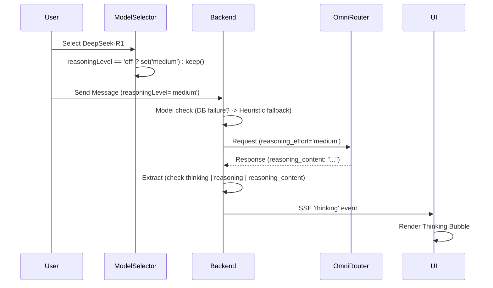

# Blueprint: Fix Thinking Bubble Visibility & Reasoning Extraction

## A. SYSTEM OVERVIEW

### Target Architecture
Improve the reliability of the "Thinking" (reasoning) phase in the chat UI by ensuring the backend correctly identifies reasoning-capable models and extracts reasoning content regardless of payload field variations or database availability.

### Feature Scope
- **DB Fallback**: Ensure `modelSupportsThinking` is correctly set even if the database is temporarily unavailable.
- **UX Auto-Activation**: Automatically enable a default reasoning level when a user switches to a model that supports thinking.
- **Diverse Extraction**: Support multiple payload fields for reasoning content (`thinking`, `reasoning`, `reasoning_content`).
- **Observability**: Add detailed server-side logging to trace reasoning extraction failures.

## B. FILE MAPPING

| File | Action | Description |
|---|---|---|
| [`src/services/chat-orchestrator.service.ts`](src/services/chat-orchestrator.service.ts) | Modify | Update `modelSupportsThinking` fallback, expand extraction fields, and add debug logs. |
| [`src/components/chat/model-selector.tsx`](src/components/chat/model-selector.tsx) | Modify | Add auto-activation logic for `reasoningLevel` when selecting thinking models. |

## C. MODULE SPECIFICATIONS

### 1. `ChatOrchestratorService` (Backend)

#### `modelSupportsThinking` Logic
- **Current**: Defaults to `false` if DB lookup fails.
- **New**: If DB lookup fails, use a regex heuristic on `modelId` to determine support.
- **Heuristic**: `/deepseek.*r1|reasoner|step.*flash|o1|o3/i`

#### Reasoning Content Extraction
- **Current**: `messageData?.thinking || messageData?.reasoning_content || ''`
- **New**: `messageData?.thinking || messageData?.reasoning || messageData?.reasoning_content || ''`

#### Debug Logging
- Add a `console.log` after extraction to trace:
  - `modelSupportsThinking` status
  - `reasoningLevel` value
  - Presence of each potential field in `messageData`
  - Final `fullThinkingContent` length

### 2. `ModelSelector` (Frontend)

#### `handleModelSelect` Logic
- **Current**: Resets `reasoningLevel` to `'off'` if model doesn't support thinking.
- **New**: If model supports thinking AND current `reasoningLevel` is `'off'`, set it to `'medium'` to ensure the user doesn't accidentally disable thinking for a reasoning model.

## D. DATA FLOW & ERROR HANDLING

### Data Flow

### Failure Handling
- If DB is down, the heuristic prevents the "silent failure" where thinking is disabled for all models.
- If the model returns an unexpected field, the expanded extraction list catches it.
- If the user manually set reasoning to `'off'`, the backend still respects this (unless the auto-activation logic is triggered on model switch).

## E. EXECUTION SEQUENCE

1. **Backend - DB Fallback**: Modify `src/services/chat-orchestrator.service.ts` to implement the regex fallback for `modelSupportsThinking` in the `catch` block of the model lookup.
2. **Backend - Extraction**: Update the extraction line in `src/services/chat-orchestrator.service.ts` to include `messageData?.reasoning`.
3. **Backend - Logging**: Implement the debug `console.log` in `src/services/chat-orchestrator.service.ts` to facilitate future troubleshooting.
4. **Frontend - Auto-activation**: Update `src/components/chat/model-selector.tsx` to automatically set `reasoningLevel` to `'medium'` when a thinking-capable model is selected and the current level is `'off'`.
