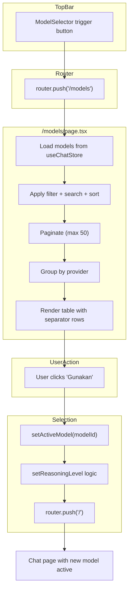

# Blueprint: Model Catalog — Modal to Full Page Table

**Date:** 2026-06-03  
**Status:** Approved  
**Scope:** Ubah katalog model dari Dialog/Modal overlay menjadi halaman penuh dengan layout tabel

---

## A. SYSTEM OVERVIEW

### Current State
- [`ModelSelector`](../src/components/chat/model-selector.tsx) (840 baris) menggunakan shadcn `Dialog` sebagai modal overlay
- Model ditampilkan dalam **grid card** (1-4 kolom responsive)
- Trigger: tombol di [`TopBar`](../src/components/chat/top-bar.tsx) → `setOpen(true)` → muncul Dialog
- Select: `setActiveModel(modelId)` → `setOpen(false)`

### Target State
- Katalog model menjadi **halaman penuh** di route `/models`
- Model ditampilkan dalam **tabel** dengan kolom: No, Model, Speed, Input, Output, Context, Action
- Provider icons menggunakan package `@lobehub/icons`
- Trigger: tombol di TopBar → `router.push('/models')` → halaman penuh
- Select: `setActiveModel(modelId)` → `router.push('/')` (kembali ke chat)

---

## B. FILE MAPPING

```
src/
├── lib/
│   └── model-utils.ts              ← [BARU] Shared utilities (formatPrice, getProviderIcon, dll)
├── app/
│   └── models/
│       └── page.tsx                ← [BARU] Halaman katalog model (tabel)
└── components/
    └── chat/
        └── model-selector.tsx      ← [UBAH] Hapus Dialog, ganti jadi router.push
```

| File | Aksi | Perkiraan Baris |
|------|------|-----------------|
| `src/lib/model-utils.ts` | BUAT | ~80 baris |
| `src/app/models/page.tsx` | BUAT | ~350 baris |
| `src/components/chat/model-selector.tsx` | UBAH | 840 → ~100 baris |

---

## C. MODULE SPECIFICATIONS

### C.1 New Package

```bash
pnpm add @lobehub/icons
```

Provider icon mapping dari `@lobehub/icons`:

| Provider | Import | Komponen |
|----------|--------|----------|
| `OpenAI` | `@lobehub/icons` | `<OpenAI />` |
| `Anthropic` | `@lobehub/icons` | `<Anthropic />` |
| `Google` | `@lobehub/icons` | `<Google />` |
| `DeepSeek` | `@lobehub/icons` | `<DeepSeek />` |
| `Meta` | `@lobehub/icons` | `<Meta />` |
| `xAI` | `@lobehub/icons` | `<XAI />` |
| Other | `lucide-react` | `<Cpu />` (fallback) |

---

### C.2 `src/lib/model-utils.ts` (BARU ~80 baris)

Ekstrak utility functions dari [`model-selector.tsx`](../src/components/chat/model-selector.tsx) agar bisa dipakai di halaman baru dan di `ModelSelector`.

**Exports:**

```tsx
// --- Provider Icon Mapping ---
import { OpenAI, Anthropic, Google, DeepSeek, Meta, XAI } from '@lobehub/icons';
import { Cpu } from 'lucide-react';

const PROVIDER_ICON_MAP: Record<string, React.ComponentType<any>> = {
  OpenAI, Anthropic, Google, DeepSeek, Meta, xAI: XAI,
};

export function getProviderIcon(provider: string): React.ComponentType<any>;

// --- Price Formatting (dipindah dari model-selector.tsx:76-91) ---
export function formatPrice(price: number): string;
export function getEffectivePrice(
  originalPrice: number,
  discountPercent: number,
  discountType: string,
  isOutput: boolean
): number;

// --- Context Formatting (dipindah dari model-selector.tsx:69-73) ---
export function formatContext(tokens: number): string;

// --- Constants (dipindah dari model-selector.tsx) ---
export const SPEED_CONFIG: Record<string, {
  label: string;
  icon: typeof Zap;
  color: string;
  bgColor: string;
  order: number;
}>;

export const PROVIDER_COLORS: Record<string, string>;

export const SORT_OPTIONS: { id: SortOption; label: string }[];

export type SortOption = 'default' | 'expensive' | 'cheap' | 'fastest' | 'slowest';
export type FilterTab = 'online' | 'free' | 'discount';
```

---

### C.3 `src/app/models/page.tsx` (BARU ~350 baris)

Halaman full-page katalog model dengan layout tabel.

**State Variables:**
- `search: string` — keyword pencarian
- `filter: FilterTab` — tab filter (online / free / discount), default `'online'`
- `sort: SortOption` — sorting, default `'default'`
- `selectedProviders: string[]` — filter provider
- `currentPage: number` — pagination halaman, default `1`
- `copiedId: string | null` — tracking public ID yang sedang di-copy

**Derived State (useMemo):**
- `visibleModels` — base: `models.filter(m => m.status === 'active' || m.status === 'maintenance')`
- `filteredModels` — apply filter tab + provider filter + search
- `sortedModels` — apply sort (sama logic seperti [`model-selector.tsx:247-294`](../src/components/chat/model-selector.tsx))
- `paginatedModels` — slice by `pageSize = 50`
- `groupedModels` — group `paginatedModels` by `provider` (untuk separator rows)
- `totalPages` — `Math.ceil(sortedModels.length / pageSize)`
- `onlineCount`, `freeCount`, `discountCount` — untuk filter tab badges

**Event Handlers:**
- `handleSelect(modelId)` — `setActiveModel(modelId)` + reasoning level logic + `router.push('/')`
- `handleCopyPublicId(publicId, modelId)` — `navigator.clipboard.writeText()` + toast "Tersalin!" + set `copiedId` + reset after 2s
- `handleOpenChange` — reset state (search, filter, sort, providers, page) — tidak perlu di page, karena navigasi keluar sudah reset

**Hooks:**
- `useRouter()` dari `next/navigation`
- `useChatStore()` — `activeModel`, `setActiveModel`, `models`, `reasoningLevel`, `setReasoningLevel`
- `useToast()` dari `@/hooks/use-toast`

#### Layout Structure

```
┌─────────────────────────────────────────────────────────────────┐
│ STICKY HEADER                                                    │
│ ┌──┐ ┌──────────────┐ ┌──────────────────────────────────────┐  │
│ │← │ │Katalog Model  │ │🔍 Cari model, provider, atau fitur  │  │
│ └──┘ └──────────────┘ └──────────────────────────────────────┘  │
│                                                                  │
│ ┌─────────┐ ┌─────────┐ ┌──────────┐ ┌──────┐ ┌──────────────┐ │
│ │ Online 3│ │ Free 1  │ │ Diskon 2 │ │Sort ▼│ │ Provider  ▼  │ │
│ └─────────┘ └─────────┘ └──────────┘ └──────┘ └──────────────┘ │
└─────────────────────────────────────────────────────────────────┘

┌─────────────────────────────────────────────────────────────────┐
│ TABLE (overflow-x-auto for mobile)                               │
│                                                                  │
│ ┌────┬──────────────────┬───────┬────────┬────────┬───────┬────┐│
│ │ No │ Model            │ Speed │ Input  │ Output │ Ctx   │ Act││
│ ├────┴──────────────────┴───────┴────────┴────────┴───────┴────┤│
│ │  🔵 OpenAI (3 models)                                        ││
│ ├────┬──────────────────┬───────┬────────┬────────┬───────┬────┤│
│ │ 1  │ 🟩 GPT-4o        │⚡Cepat│ $2.50  │ $10.00 │ 128K  │ ✅ ││
│ │    │   gpt-4o 📋       │       │        │        │       │    ││
│ ├────┼──────────────────┼───────┼────────┼────────┼───────┼────┤│
│ │ 2  │ 🟩 GPT-4o Mini   │⚡Cepat│ $0.15  │ $0.60  │ 128K  │ ✅ ││
│ │    │   gpt-4o-mini 📋  │       │        │        │       │    ││
│ ├────┴──────────────────┴───────┴────────┴────────┴───────┴────┤│
│ │  🟤 Anthropic (2 models)                                     ││
│ ├────┬──────────────────┬───────┬────────┬────────┬───────┬────┤│
│ │ 3  │ 🟩 Claude 3.5 Son│🕐Lambat│ $3.00 │ $15.00 │ 200K  │ ✅ ││
│ │    │   claude-3-5 📋   │       │        │        │       │    ││
│ └────┴──────────────────┴───────┴────────┴────────┴───────┴────┘│
│                                                                  │
│ ┌──────────────────────────────────────────────────────────────┐ │
│ │ Prev │ Halaman 1 dari 3 │ Next                               │ │
│ └──────────────────────────────────────────────────────────────┘ │
└─────────────────────────────────────────────────────────────────┘

┌─────────────────────────────────────────────────────────────────┐
│ FOOTER LEGEND                                                    │
│ Free = tanpa biaya │ Thinking = berpikir mendalam │ ...          │
└─────────────────────────────────────────────────────────────────┘
```

#### Kolom Detail

##### Kolom 1: No (`w-12`)
```tsx
<TableCell className="text-muted-foreground text-xs tabular-nums text-center">
  {offset + idx + 1}
</TableCell>
```

##### Kolom 2: Model (`flex-1 min-w-[200px]`)
```
┌────────────────────────────────────────┐
│ [🔹14px] GPT-4o     FREE  💡 -20%     │  ← baris 1
│   gpt-4o  📋                           │  ← baris 2
└────────────────────────────────────────┘
```

- **Provider icon**: 14px, inline dengan nama, dari `@lobehub/icons`
- **Nama model**: `text-sm font-bold truncate`
- **Badges** (setelah nama, inline): FREE, Thinking (💡), Discount (-%)
- **Baris 2**: `publicId` dalam `text-[10px] text-muted-foreground font-mono` + copy icon button

```tsx
<TableCell>
  <div className="flex items-start gap-2.5">
    <ProviderIcon size={14} className="mt-0.5 shrink-0 text-muted-foreground/60" />
    <div className="min-w-0">
      <div className="flex items-center gap-1.5 flex-wrap">
        <span className="text-sm font-bold truncate">{model.name}</span>
        {model.free && <Badge className="text-[7px] px-1 py-0 bg-primary/8 text-primary/80">FREE</Badge>}
        {model.thinking && <Lightbulb className="h-3 w-3 text-amber-500 shrink-0" />}
        {hasDiscount && (
          <Badge className="text-[7px] px-1 py-0 bg-emerald-500/10 text-emerald-600 font-bold">
            -{model.discountPercent}%
          </Badge>
        )}
      </div>
      <div className="flex items-center gap-1 mt-0.5">
        <code className="text-[10px] text-muted-foreground font-mono truncate">
          {model.publicId || model.id}
        </code>
        <button
          onClick={() => handleCopyPublicId(model.publicId || model.id, model.id)}
          className="shrink-0 hover:bg-accent rounded p-0.5 transition-colors"
        >
          {copiedId === model.id
            ? <Check className="h-3 w-3 text-green-500" />
            : <Copy className="h-3 w-3 text-muted-foreground/40 hover:text-foreground" />
          }
        </button>
      </div>
    </div>
  </div>
</TableCell>
```

##### Kolom 3: Speed (`w-24 text-center`)
```tsx
<TableCell className="text-center">
  {speedCfg ? (
    <span className={`inline-flex items-center gap-1 text-[10px] font-medium ${speedCfg.color}`}>
      <SpeedIcon className="h-3 w-3" />
      {speedCfg.label}
    </span>
  ) : (
    <span className="text-[10px] text-muted-foreground/40">—</span>
  )}
</TableCell>
```

Speed tiers (dari [`SPEED_CONFIG`](../src/components/chat/model-selector.tsx:61)):
| Speed | Icon | Label | Color |
|-------|------|-------|-------|
| `fast` | `Zap` | Cepat | emerald |
| `normal` | `Gauge` | Normal | sky |
| `slow` | `Clock` | Lambat | amber |
| `overloaded` | `AlertTriangle` | Overload | red |

##### Kolom 4: Input Price (`w-28 text-right`)
```tsx
<TableCell className="text-right text-xs font-mono tabular-nums">
  {model.free ? (
    <Badge variant="secondary" className="text-[9px] bg-emerald-500/10 text-emerald-600 font-bold">
      Free
    </Badge>
  ) : hasDiscount && (model.discountType === 'input' || model.discountType === 'both') ? (
    <div className="flex flex-col items-end">
      <span className="line-through text-muted-foreground/35 text-[10px]">{formatPrice(model.inputPrice)}</span>
      <span className="text-emerald-600 dark:text-emerald-400 font-medium">{formatPrice(effInput)}</span>
    </div>
  ) : (
    <span className="text-muted-foreground">{formatPrice(model.inputPrice)}</span>
  )}
</TableCell>
```

##### Kolom 5: Output Price (`w-28 text-right`)
- Format sama dengan Input Price, tapi pakai `model.outputPrice` dan `effOutput`

##### Kolom 6: Max Context (`w-20 text-right`)
```tsx
<TableCell className="text-right text-xs text-muted-foreground tabular-nums">
  {formatContext(model.maxContext)}
</TableCell>
```

`formatContext`: 1000000 → "1.0M", 128000 → "128K", 500 → "500"

##### Kolom 7: Action (`w-28 text-center`)

Status model HANYA ditampilkan di kolom ini, bukan di kolom Model.

```tsx
<TableCell className="text-center">
  {model.status === 'maintenance' ? (
    <Badge variant="secondary" className="text-[9px] bg-amber-500/10 text-amber-600 border border-amber-500/20">
      <AlertTriangle className="h-2.5 w-2.5 mr-0.5" />
      Maintenance
    </Badge>
  ) : model.status === 'disabled' ? (
    <Badge variant="secondary" className="text-[9px] bg-red-500/10 text-red-500 border border-red-500/20">
      <Ban className="h-2.5 w-2.5 mr-0.5" />
      Disabled
    </Badge>
  ) : (
    <Button
      size="sm"
      variant={isSelected ? 'default' : 'outline'}
      className="h-7 text-[10px] px-3 gap-1"
      onClick={() => handleSelect(model.id)}
    >
      {isSelected && <Check className="h-3 w-3" />}
      {isSelected ? 'Aktif' : 'Gunakan'}
    </Button>
  )}
</TableCell>
```

#### Provider Separator Row

Antar grup provider ditambahkan garis sekat dengan icon provider BESAR (24px):

```tsx
<TableRow key={`sep-${provider}`} className="border-b-2 border-border/30 hover:bg-transparent">
  <TableCell colSpan={7} className="py-3 px-4">
    <div className="flex items-center gap-3">
      <ProviderIcon size={24} className="text-muted-foreground/70" />
      <Badge variant="secondary" className={`text-xs px-2 py-0.5 ${PROVIDER_COLORS[provider] || ''}`}>
        {provider}
      </Badge>
      <span className="text-xs text-muted-foreground/50 tabular-nums">
        {providerModels.length} model{providerModels.length !== 1 ? 's' : ''}
      </span>
      <div className="flex-1 h-px bg-border/30" />
    </div>
  </TableCell>
</TableRow>
```

#### Row Highlight

Baris model yang sedang aktif di-highlight:

```tsx
<TableRow className={cn(
  'transition-colors',
  isSelected && 'bg-primary/5 border-primary/10',
  !isOnline && 'opacity-60',
)}>
```

#### Toolbar (Filter + Sort + Provider Filter)

Sama persis dengan logic di [`model-selector.tsx`](../src/components/chat/model-selector.tsx:673-765):
- **Filter tabs**: Online, Free, Diskon (dengan count badge)
- **Sort dropdown**: Default (A-Z), Termahal, Termurah, Tercepat, Terlambat
- **Provider filter dropdown**: checkbox multi-select per provider

#### Pagination

- `pageSize = 50` (max 50 per halaman)
- Controls: Prev + "Halaman X dari Y" + Next
- Sama logic seperti [`model-selector.tsx:787-815`](../src/components/chat/model-selector.tsx)

#### Footer Legend

Sama seperti [`model-selector.tsx:820-835`](../src/components/chat/model-selector.tsx):
- Free = tanpa biaya
- Thinking = berpikir mendalam
- Konteks = kapasitas ingatan
- Kecepatan = cepat/normal/lambat
- Diskon = harga setelah diskon
- Harga = arahkan kursor

---

### C.4 `src/components/chat/model-selector.tsx` (UBAH — 840 → ~100 baris)

#### Yang DIHAPUS:
- Import `Dialog`, `DialogContent`, `DialogHeader`, `DialogTitle`, `DialogDescription` (baris 28-34)
- Import `DropdownMenu`, `DropdownMenuContent`, `DropdownMenuCheckboxItem`, `DropdownMenuTrigger` (baris 35-40)
- Import `Search`, `X`, `Filter`, `ArrowUpDown`, `Info`, `ArrowLeft`, `Ban`, `Zap`, `Clock`, `AlertTriangle`, `Gauge`, `Percent`, `Lightbulb` (baris 7-23, sebagian)
- Import `Input` (baris 27)
- Import `Separator` (baris 26)
- Local `formatPrice` dan `getEffectivePrice` functions (baris 76-91) — dipindah ke `model-utils.ts`
- Local `formatContext` function (baris 69-73) — dipindah ke `model-utils.ts`
- Local `SPEED_CONFIG` constant (baris 61-66) — dipindah ke `model-utils.ts`
- Local `PROVIDER_COLORS` constant (baris 50-57) — dipindah ke `model-utils.ts`
- Type `FilterTab`, `SortOption`, `SORT_OPTIONS` (baris 182-193) — dipindah ke `model-utils.ts`
- State: `open`, `search`, `filter`, `sort`, `selectedProviders`, `currentPage` (baris 197-202)
- `visibleModels`, `allProviders`, `filteredModels`, `sortedModels`, `paginatedModels`, `groupedModels` useMemo (baris 208-305)
- `handleOpenChange` callback (baris 312-321)
- `handleSelect` callback (baris 324-339)
- `toggleProvider` callback (baris 342-348)
- `renderModelCard` function (baris 350-498)
- `renderGroupedList` function (baris 500-524)
- `triggerButtonClass` computation (baris 527-538)
- Seluruh JSX `<DialogContent>` (baris 598-836)

#### Yang DISIMPAN/DITAMBAH:
```tsx
'use client';
import { useRouter } from 'next/navigation';
import { useMemo } from 'react';
import { Cpu, Lightbulb, Ban, Percent, Zap, Clock, AlertTriangle, Gauge, Check } from 'lucide-react';
import { Button } from '@/components/ui/button';
import { Badge } from '@/components/ui/badge';
import { useChatStore } from '@/lib/store';
import { formatPrice, getEffectivePrice, SPEED_CONFIG, PROVIDER_COLORS } from '@/lib/model-utils';

export function ModelSelector() {
  const router = useRouter();
  const { activeModel, models } = useChatStore();
  const activeModelData = models.find((m) => m.id === activeModel);

  // Trigger button class logic (baris 527-538 — SAMA)
  const triggerButtonClass = useMemo(() => {
    if (!activeModelData || activeModelData.status === 'active') {
      return 'gap-1.5 rounded-lg border-border/50 bg-card px-2 py-1 hover:bg-accent h-8 text-xs';
    }
    if (activeModelData.status === 'maintenance') {
      return 'gap-1.5 rounded-lg border-amber-500/40 bg-amber-500/[0.06] px-2 py-1 hover:bg-amber-500/[0.1] h-8 text-xs';
    }
    if (activeModelData.status === 'disabled') {
      return 'gap-1.5 rounded-lg border-red-500/40 bg-red-500/[0.06] px-2 py-1 hover:bg-red-500/[0.1] h-8 text-xs';
    }
    return 'gap-1.5 rounded-lg border-border/50 bg-card px-2 py-1 hover:bg-accent h-8 text-xs';
  }, [activeModelData]);

  return (
    <Button
      variant="outline"
      onClick={() => router.push('/models')}
      className={triggerButtonClass}
    >
      {/* Status icon */}
      <Cpu className={`h-3.5 w-3.5 shrink-0 ${
        activeModelData && activeModelData.status !== 'active'
          ? activeModelData.status === 'maintenance' ? 'text-amber-500' : 'text-red-500'
          : 'text-primary/70'
      }`} />

      {/* Model name */}
      <span className={`font-medium truncate max-w-[100px] sm:max-w-[160px] ${
        activeModelData && activeModelData.status !== 'active'
          ? activeModelData.status === 'maintenance' ? 'text-amber-600 dark:text-amber-400' : 'text-red-600 dark:text-red-400'
          : ''
      }`}>
        {activeModelData?.name || 'Pilih Model'}
      </span>

      {/* Status badges */}
      {activeModelData?.status === 'maintenance' && (
        <Badge variant="secondary" className="text-[8px] px-1 py-0 leading-tight bg-amber-500/15 text-amber-600/90 dark:text-amber-400/80 font-semibold shrink-0 border border-amber-500/20">
          Maintenance
        </Badge>
      )}
      {activeModelData?.status === 'disabled' && (
        <Badge variant="secondary" className="text-[8px] px-1 py-0 leading-tight bg-red-500/15 text-red-600/90 dark:text-red-400/80 font-semibold shrink-0 border border-red-500/20">
          Disabled
        </Badge>
      )}
      {activeModelData?.free && activeModelData.status === 'active' && (
        <Badge variant="secondary" className="text-[8px] px-1 py-0 leading-tight bg-primary/8 text-primary/80 dark:text-primary/70 font-bold shrink-0">
          FREE
        </Badge>
      )}
      {activeModelData?.thinking && activeModelData.status === 'active' && (
        <Lightbulb className="h-3 w-3 text-amber-500 shrink-0 hidden sm:block" />
      )}
      {activeModelData && activeModelData.discountPercent > 0 && activeModelData.discountType !== 'none' && activeModelData.status === 'active' && (
        <Badge variant="secondary" className="text-[8px] px-1 py-0 leading-tight bg-emerald-500/10 text-emerald-600 dark:text-emerald-400 font-bold shrink-0">
          <Percent className="h-2 w-2 mr-0.5" />
          {activeModelData.discountPercent}%
        </Badge>
      )}
    </Button>
  );
}
```

---

## D. DATA FLOW & ERROR HANDLING

### Data Flow



### Error Handling

| Scenario | Handling |
|----------|----------|
| Model `publicId` undefined | Fallback ke `model.id` |
| Provider tidak dikenali di `@lobehub/icons` | Fallback ke `<Cpu />` dari lucide-react |
| Copy clipboard gagal | `try/catch` + toast error |
| Tidak ada model ditemukan (search/filter) | Tampilkan empty state: "Tidak ada model ditemukan" |
| `useChatStore` models kosong | Tampilkan skeleton/loading spinner |
| Halaman diakses tanpa session | Tetap bisa diakses (model list public), action button disabled jika belum login |

---

## E. EXECUTION SEQUENCE

### Step 1: Install Package
```bash
pnpm add @lobehub/icons
```

### Step 2: Create `src/lib/model-utils.ts`
- Pindahkan `formatPrice`, `getEffectivePrice`, `formatContext`, `SPEED_CONFIG`, `PROVIDER_COLORS`, `SORT_OPTIONS` dari `model-selector.tsx`
- Tambahkan `getProviderIcon` mapping dengan `@lobehub/icons`
- Export semua types (`SortOption`, `FilterTab`)

### Step 3: Create `src/app/models/page.tsx`
- Import utilities dari `model-utils.ts`
- Implement state management (search, filter, sort, providers, page, copiedId)
- Implement filtering/sorting/pagination logic
- Implement table layout dengan 7 kolom
- Implement provider separator rows
- Implement sticky header dengan search + toolbar
- Implement pagination controls
- Implement footer legend
- Implement mobile horizontal scroll (`overflow-x-auto`)
- Implement copy public ID dengan toast
- Implement model selection + navigate back

### Step 4: Modify `src/components/chat/model-selector.tsx`
- Hapus semua Dialog-related code (content, state, handlers)
- Hapus local utility functions (pindah ke model-utils.ts)
- Import utilities dari `model-utils.ts`
- Ganti trigger: `setOpen(true)` → `router.push('/models')`
- Simpan hanya trigger button JSX dengan status badges
- Verify: import `useRouter` dari `next/navigation`

### Step 5: Verify
- Pastikan trigger button di TopBar masih berfungsi
- Pastikan navigasi ke `/models` berhasil
- Pastikan model selection + navigate back ke `/` berhasil
- Pastikan copy public ID + toast berfungsi
- Pastikan filter/sort/search/pagination berfungsi
- Pastikan mobile horizontal scroll berfungsi
- Pastikan provider separator lines muncul
- Pastikan row highlight untuk model aktif berfungsi
- Pastikan tidak ada broken import di file lain
