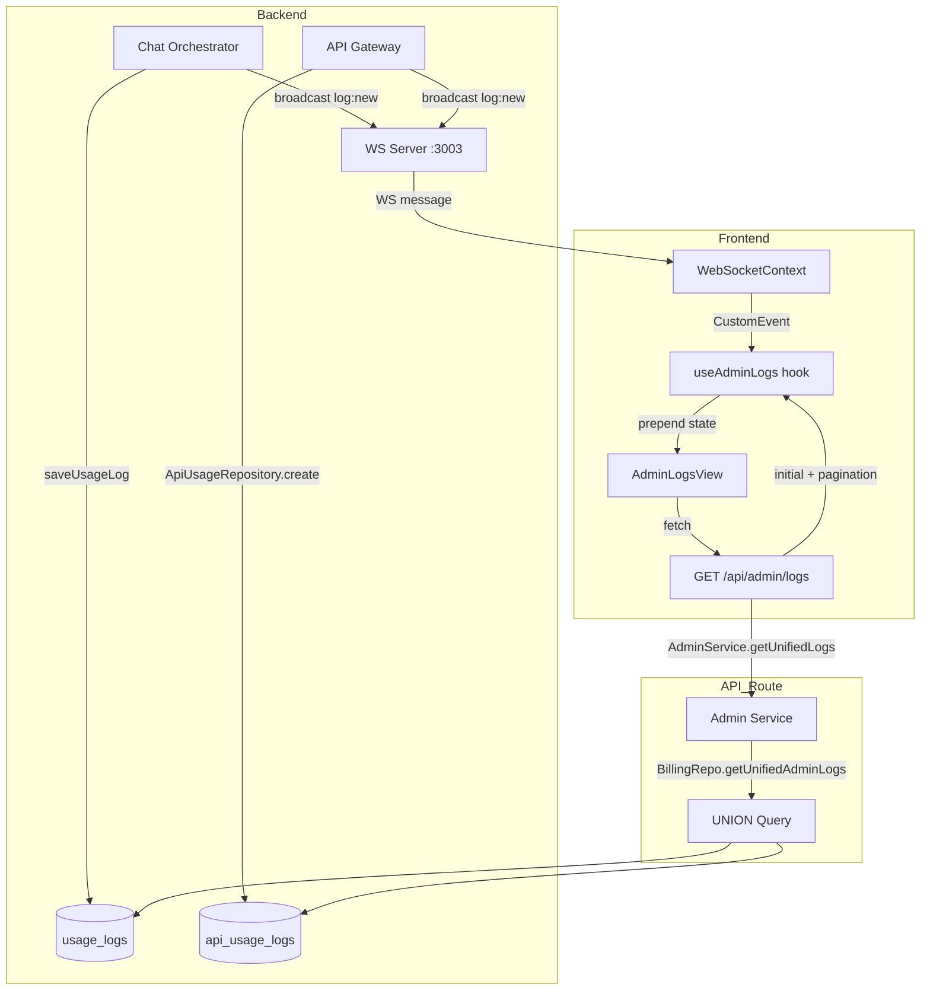

# Admin Logs Real-Time — Unified Chat + BYOK with WebSocket

**Date:** 2026-06-04  
**Status:** Blueprint — Ready for Code Mode  
**Scope:** Replace static placeholder admin logs with real-time unified log table (Web Chat + BYOK API Gateway)

---

## A. SYSTEM OVERVIEW

### Problem
[`AdminLogsView`](src/components/admin/admin-logs-view.tsx:4) is a static placeholder showing "Log belum tersedia". Backend API route and database tables already exist but the frontend was never connected.

### Goal
- Display unified logs from **both** `usage_logs` (Web Chat) and `api_usage_logs` (BYOK Gateway) in a single table
- Badge to distinguish Chat vs BYOK requests
- **Real-time updates** via WebSocket — new logs appear instantly without page refresh
- Search, period filter, type filter, and pagination

### Architecture

```
User Request (Chat or BYOK)
  → Service saves log to DB
  → Service broadcasts `log:new` event via NotificationService
  → WS Server (port 3003) relays to all connected clients
  → WebSocketContext receives event, dispatches CustomEvent
  → AdminLogsView hook listens, prepends to local state
```

---

## B. FILE MAPPING

| # | File | Action | Purpose |
|---|------|--------|---------|
| 1 | [`src/lib/ws-events.ts`](src/lib/ws-events.ts:1) | **Edit** | Add `log:new` event type to `WSEvent` union |
| 2 | [`src/repositories/billing.repo.ts`](src/repositories/billing.repo.ts:87) | **Edit** | Add `getUnifiedAdminLogs()` — UNION query `usage_logs` + `api_usage_logs` |
| 3 | [`src/services/admin.service.ts`](src/services/admin.service.ts:72) | **Edit** | Add `getUnifiedLogs()` — mapper for unified log data |
| 4 | [`src/app/api/admin/logs/route.ts`](src/app/api/admin/logs/route.ts:6) | **Edit** | Update to call `getUnifiedLogs()` with type filter param |
| 5 | [`src/services/chat-orchestrator.service.ts`](src/services/chat-orchestrator.service.ts:510) | **Edit** | Broadcast `log:new` after `saveUsageLog()` (Web Chat) |
| 6 | [`src/services/api-gateway.service.ts`](src/services/api-gateway.service.ts:418) | **Edit** | Broadcast `log:new` after `ApiUsageRepository.create()` (BYOK) |
| 7 | [`src/context/websocket-context.tsx`](src/context/websocket-context.tsx:90) | **Edit** | Handle `log:new` → dispatch `CustomEvent` to window |
| 8 | [`src/components/admin/admin-logs-view.tsx`](src/components/admin/admin-logs-view.tsx:4) | **Full Rewrite** | Real-time log table with badges, filters, pagination |

### New File

| # | File | Purpose |
|---|------|---------|
| 9 | `src/hooks/useAdminLogs.ts` | Custom hook: fetch initial logs, listen to WS real-time events, manage log buffer state |

---

## C. MODULE SPECIFICATIONS

### 1. WS Event Type — [`src/lib/ws-events.ts`](src/lib/ws-events.ts:15)

Add to `WSEvent` union:

```typescript
| {
    type: 'log:new';
    log: {
      id: string;
      userId: string;
      userName: string;
      userEmail: string;
      logType: 'chat' | 'byok';       // Badge区分
      model: string;
      provider: string;               // "openai" (chat) or API key name (BYOK)
      inputTokens: number;
      outputTokens: number;
      cost: number;
      creditBefore?: number;          // BYOK only
      creditAfter?: number;           // BYOK only
      status: 'success' | 'error';
      createdAt: string;
    }
  }
```

### 2. Repository — [`src/repositories/billing.repo.ts`](src/repositories/billing.repo.ts:87)

New method `getUnifiedAdminLogs()` using UNION:

```sql
-- Chat logs (from usage_logs)
SELECT
  ul.id,
  u.name as user_name,
  u.email as user_email,
  'chat' as log_type,
  ul.model_name as model,
  ul.provider,
  ul.input_tokens,
  ul.output_tokens,
  ul.total_cost as cost,
  NULL as credit_before,
  NULL as credit_after,
  'success' as status,
  ul.created_at
FROM usage_logs ul
JOIN users u ON u.id = ul.user_id

UNION ALL

-- BYOK logs (from api_usage_logs)
SELECT
  aul.id,
  u.name as user_name,
  u.email as user_email,
  'byok' as log_type,
  aul.model,
  COALESCE(ak.name, aul.api_key_id) as provider,
  aul.prompt_tokens as input_tokens,
  aul.completion_tokens as output_tokens,
  aul.cost,
  aul.credit_before,
  aul.credit_after,
  aul.status,
  aul.created_at
FROM api_usage_logs aul
JOIN users u ON u.id = aul.user_id
LEFT JOIN api_keys ak ON ak.id = aul.api_key_id

ORDER BY created_at DESC
LIMIT ? OFFSET ?
```

**Parameters:**
- `page`, `limit`, `search`, `period` — same as current
- New: `type` filter (`all` | `chat` | `byok`)

**Search:** across `user_name`, `user_email`, `model`, `provider`
**Period:** same logic as current (`today`, `24h`, `7d`, `30d`, `1y`, default = all)

### 3. Service — [`src/services/admin.service.ts`](src/services/admin.service.ts:72)

New method `getUnifiedLogs()`:

```typescript
async getUnifiedLogs(page, limit, search, period, type) {
  const result = await BillingRepository.getUnifiedAdminLogs(page, limit, search, period, type);
  const mappedLogs = result.logs.map((log: any) => ({
    id: log.id,
    userName: log.user_name,
    userEmail: log.user_email,
    logType: log.log_type,        // 'chat' | 'byok'
    model: log.model,
    provider: log.provider,
    inputTokens: log.input_tokens,
    outputTokens: log.output_tokens,
    cost: log.cost,
    creditBefore: log.credit_before,
    creditAfter: log.credit_after,
    status: log.status,
    createdAt: log.created_at,
  }));
  return { ...result, logs: mappedLogs, page, limit };
}
```

### 4. API Route — [`src/app/api/admin/logs/route.ts`](src/app/api/admin/logs/route.ts:6)

Update to:
- Read `type` query param (`all` | `chat` | `byok`)
- Call `AdminService.getUnifiedLogs()` instead of `getUsageLogs()`

```typescript
const type = searchParams.get('type') || 'all';
const result = await AdminService.getUnifiedLogs(page, limit, search, period, type);
```

### 5. Broadcast — Web Chat — [`src/services/chat-orchestrator.service.ts`](src/services/chat-orchestrator.service.ts:510)

After line 522 (`await ChatUsageTrackingService.saveUsageLog(usageLog)`), add:

```typescript
// Broadcast real-time log to admin
try {
  const { NotificationService } = await import('@/services/notification.service');
  await NotificationService.broadcast({
    type: 'log:new',
    log: {
      id: logId,
      userId,
      userName: '',        // Will be fetched from user context or left empty
      userEmail: '',
      logType: 'chat',
      model: modelPricing.name,
      provider: modelPricing.provider,
      inputTokens: realInputTokens,
      outputTokens: realOutputTokens,
      cost: cost?.totalCost ?? 0,
      status: 'success',
      createdAt: new Date().toISOString(),
    }
  });
} catch (e) {
  // Don't fail the main flow if broadcast fails
}
```

> **Note:** userName/userEmail can be left empty for the broadcast (fast path). The frontend can display "Loading..." or fetch from a cache. Alternatively, we can fetch user info before the broadcast — check if user data is already available in scope.

### 6. Broadcast — BYOK — [`src/services/api-gateway.service.ts`](src/services/api-gateway.service.ts:418)

After line 433 (after `ApiUsageRepository.create` succeeds), add broadcast for non-stream. Similarly after lines 630 and 656 for stream.

```typescript
try {
  const { NotificationService } = await import('@/services/notification.service');
  await NotificationService.broadcast({
    type: 'log:new',
    log: {
      id: usageLogId,
      userId,
      userName: '',
      userEmail: '',
      logType: 'byok',
      model: body.model,
      provider: apiKeyName,      // API key name if available
      inputTokens: promptTokens,
      outputTokens: completionTokens,
      cost: finalCost,
      creditBefore: reservation.creditBefore,
      creditAfter: creditAfter,
      status: 'success',
      createdAt: new Date().toISOString(),
    }
  });
} catch (e) {
  // Don't fail the main flow
}
```

**3 injection points in api-gateway.service.ts:**
1. Line ~433 (non-stream success)
2. Line ~630 (stream success)
3. Line ~656 (stream error — status: 'error')

### 7. WebSocket Context — [`src/context/websocket-context.tsx`](src/context/websocket-context.tsx:90)

In the `handleWSEvent` switch statement, add case:

```typescript
case 'log:new':
  // Dispatch CustomEvent for admin logs view to pick up
  window.dispatchEvent(new CustomEvent('admin:log:new', { detail: data.log }));
  break;
```

### 8. Custom Hook — `src/hooks/useAdminLogs.ts` (NEW)

```typescript
export function useAdminLogs() {
  const [logs, setLogs] = useState<UnifiedLog[]>([]);
  const [total, setTotal] = useState(0);
  const [totalPages, setTotalPages] = useState(0);
  const [loading, setLoading] = useState(true);
  const [error, setError] = useState<string | null>(null);
  
  const [page, setPage] = useState(1);
  const [search, setSearch] = useState('');
  const [period, setPeriod] = useState('');
  const [typeFilter, setTypeFilter] = useState<'all' | 'chat' | 'byok'>('all');
  
  const MAX_LIVE_BUFFER = 100;
  
  // Fetch initial + pagination
  async function fetchLogs() { /* GET /api/admin/logs */ }
  
  // Listen to real-time events
  useEffect(() => {
    const handler = (e: CustomEvent) => {
      const newLog = e.detail as UnifiedLog;
      setLogs(prev => [newLog, ...prev.slice(0, MAX_LIVE_BUFFER - 1)]);
      setTotal(prev => prev + 1);
    };
    window.addEventListener('admin:log:new', handler);
    return () => window.removeEventListener('admin:log:new', handler);
  }, []);
  
  return { logs, total, totalPages, loading, error, page, search, period, typeFilter,
           setPage, setSearch, setPeriod, setTypeFilter, fetchLogs };
}
```

**Key behaviors:**
- On page change: re-fetch from API (server-side pagination)
- On search/period/type change: reset to page 1, re-fetch
- Real-time logs prepend to buffer (max 100), auto-increment total count
- When user navigates pages, real-time buffer is cleared to avoid confusion

### 9. Frontend — [`src/components/admin/admin-logs-view.tsx`](src/components/admin/admin-logs-view.tsx:4)

**Full rewrite.** UI structure:

```
┌─────────────────────────────────────────────────┐
│ Logs                                            │
│ Log aktivitas sistem                [WS: ● on]  │
├─────────────────────────────────────────────────┤
│ [🔍 Search... ] [Type ▼] [Period ▼]            │
├─────────────────────────────────────────────────┤
│ ┌─────┬──────┬──────┬───────┬──────┬────┬─────┐ │
│ │Time │User  │Type  │Model  │Tokens│Cost│Stat │ │
│ ├─────┼──────┼──────┼───────┼──────┼────┼─────┤ │
│ │2m   │John  │💬Chat│GPT-4o │1.2k  │$.02│  ✅ │ │
│ │1m   │Jane  │🔑BYOK│Claude │3.5k  │$.15│  ✅ │ │
│ │30s  │Bob   │🔑BYOK│GPT-4  │800   │$.08│  ❌ │ │
│ └─────┴──────┴──────┴───────┴──────┴────┴─────┘ │
│                                      [1] 2 3 > │
└─────────────────────────────────────────────────┘
```

**Components to use:**
- [`Table`](src/components/ui/table.tsx) — for the data table
- [`Badge`](src/components/ui/badge.tsx) — for type/status badges
- [`Input`](src/components/ui/input.tsx) — for search
- [`Select`](src/components/ui/select.tsx) — for period/type filters
- [`Skeleton`](src/components/ui/skeleton.tsx) — for loading state
- [`Pagination`](src/components/ui/pagination.tsx) — for pagination
- lucide-react icons: `FileText`, `Search`, `Activity`, `Wifi`, `WifiOff`

**Badge Colors:**
- Type `Chat` → `variant="default"` (blue)
- Type `BYOK` → `variant="secondary"` (purple-ish)
- Status `success` → green dot/text
- Status `error` → red dot/text

---

## D. DATA FLOW & ERROR HANDLING

### Data Flow



### Error Handling

| Scenario | Handling |
|----------|----------|
| WS not connected | Show "Disconnected" indicator (red dot), logs still load via API |
| Broadcast fails | `try/catch` — logged to console, main flow continues |
| API fetch fails | Show error state in table with retry button |
| Duplicate log (race) | Frontend dedup by `log.id` before prepend |
| Log buffer overflow | FIFO — oldest beyond 100 entries dropped silently |
| Admin not on logs page | `CustomEvent` dispatched but no listener — no memory leak (event fires and disappears) |

### Security
- API route already checks `auth.role === 'admin'`
- WS `log:new` event is broadcast to ALL connected clients
- **Important:** The `log:new` event contains minimal data (no sensitive info like full email, just display name). Full data comes from the authenticated API endpoint.

---

## E. EXECUTION SEQUENCE

### Step 1: WS Event Type
**File:** [`src/lib/ws-events.ts`](src/lib/ws-events.ts:15)
- Add `log:new` variant to `WSEvent` union type
- Define `AdminLogEvent` interface for the log payload

### Step 2: Repository — Unified Query
**File:** [`src/repositories/billing.repo.ts`](src/repositories/billing.repo.ts:87)
- Add `getUnifiedAdminLogs(page, limit, search, period, type)` method
- UNION query between `usage_logs` and `api_usage_logs`
- Support `type` parameter to filter by `chat`, `byok`, or `all`
- Reuse existing period/search logic pattern

### Step 3: Service — Mapper
**File:** [`src/services/admin.service.ts`](src/services/admin.service.ts:72)
- Add `getUnifiedLogs()` method
- Map raw DB rows to camelCase response shape

### Step 4: API Route
**File:** [`src/app/api/admin/logs/route.ts`](src/app/api/admin/logs/route.ts:6)
- Read `type` query param
- Call `AdminService.getUnifiedLogs()` instead of `getUsageLogs()`

### Step 5: Broadcast — Web Chat
**File:** [`src/services/chat-orchestrator.service.ts`](src/services/chat-orchestrator.service.ts:510)
- After `saveUsageLog()` call, add `NotificationService.broadcast({ type: 'log:new', log: ... })`
- Wrap in try/catch to not break chat flow

### Step 6: Broadcast — BYOK
**File:** [`src/services/api-gateway.service.ts`](src/services/api-gateway.service.ts:418)
- 3 injection points: non-stream (line ~433), stream success (line ~630), stream error (line ~656)
- Each: `NotificationService.broadcast({ type: 'log:new', log: ... })`
- Include `creditBefore`, `creditAfter`, `status`

### Step 7: WS Context Handler
**File:** [`src/context/websocket-context.tsx`](src/context/websocket-context.tsx:90)
- Add `case 'log:new':` in `handleWSEvent` switch
- Dispatch `window.dispatchEvent(new CustomEvent('admin:log:new', { detail: data.log }))`

### Step 8: Custom Hook
**File:** `src/hooks/useAdminLogs.ts` (NEW)
- `fetchLogs()` — fetch from `/api/admin/logs` with pagination/filter params
- Real-time listener via `CustomEvent('admin:log:new')`
- Dedup by log.id on prepend
- Max buffer 100 entries
- State: logs, total, totalPages, loading, error, page, search, period, typeFilter

### Step 9: Frontend Component
**File:** [`src/components/admin/admin-logs-view.tsx`](src/components/admin/admin-logs-view.tsx:4)
- Full rewrite using shadcn/ui components
- Table with columns: Time, User, Type Badge, Model, Provider, Tokens (In/Out), Cost, Status
- Search input + Type filter dropdown + Period filter dropdown
- Pagination component
- WS connection indicator
- Loading skeleton
- Empty state message
- Auto-refresh indicator when new logs arrive

### Step 10: Test & Verify
- Test Web Chat: send a message → verify log appears in admin logs table instantly
- Test BYOK: make API call via API key → verify BYOK log appears with badge
- Test filters: search by user, filter by type, filter by period
- Test pagination: navigate between pages
- Test WS disconnect/reconnect: verify graceful degradation

---

## NOTES FOR CODE MODE

- Keep the old `getUsageLogs()` and `getAdminUsageLogs()` methods intact (backward compatibility). Add new methods alongside them.
- The UNION query in repository may need subquery wrapping for pagination to work correctly with ORDER BY.
- For BYOK broadcast, check if `apiKeyName` is available in scope — the API gateway may need to pass it through.
- Consider adding a small debounce (100ms) on real-time log prepend to batch rapid-fire logs.
- The `CustomEvent` approach avoids modifying the zustand store and keeps admin log state ephemeral.
