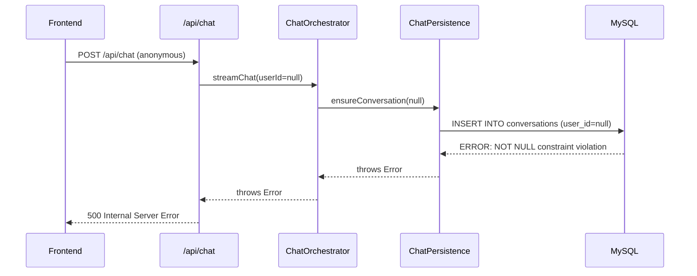
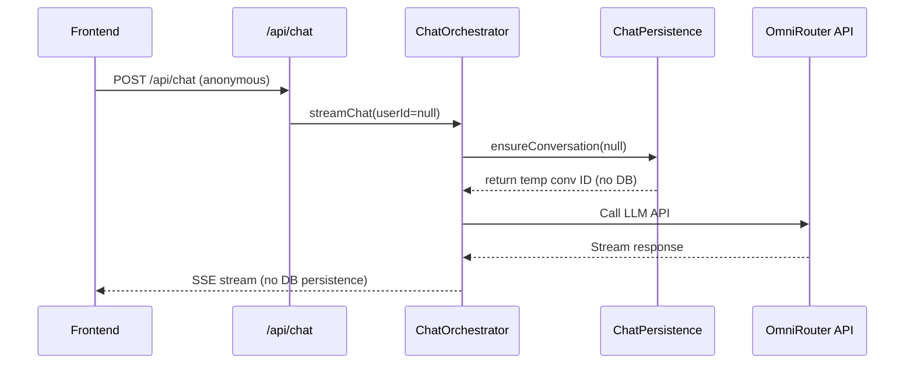

# Anonymous Chat 500 Error Fix

**Date:** 2026-06-04
**Scope:** Fix 500 Internal Server Error when anonymous users send messages via free models

---

## A. System Overview

Anonymous users can chat with free models without authentication. The `/api/chat` route checks `verifyAuth(request)` and if null, verifies the model is free before calling `ChatOrchestratorService.streamChat()` with `userId = null`.

**Problem:** `ensureConversation()` in `ChatPersistenceService` passes `userId = null` to `ChatRepository.createConversation()`, which executes `INSERT INTO conversations (id, user_id, ...) VALUES (..., NULL, ...)`. The `conversations` table has `user_id VARCHAR(64) NOT NULL` + `FOREIGN KEY (user_id) REFERENCES users(id)`, so MySQL rejects the INSERT → 500 error.

---

## B. File Mapping

```
src/
├── services/
│   ├── chat-persistence.service.ts    # MODIFY — ensureConversation() handle userId=null
│   ├── chat-usage-tracking.service.ts # MODIFY — getCreditRemaining() handle null
│   └── chat-orchestrator.service.ts   # NO CHANGE (already guards persistence with if(userId))
└── repositories/
    └── chat.repo.ts                   # NO CHANGE (type stays string, caller handles null)
```

---

## C. Module Specifications

### Bug #9: `ensureConversation()` crashes on null userId

- **File:** `src/services/chat-persistence.service.ts` line 194
- **Signature:** `ensureConversation(conversationId, userId, message, modelId, category): Promise<string>`
- **Problem:** `userId: string` — does not accept null. Passes null to DB INSERT which violates NOT NULL + FK constraint.
- **Fix:** Change signature to `userId: string | null`. Add early return when `userId === null`:
  - Generate temporary conversation ID (same pattern as current: `conv_${Date.now()}_${hrtime}_${random}`)
  - Return the generated ID without any DB operation
  - This allows frontend Zustand store to track the conversation locally

### Bug #10: `getCreditRemaining()` does not handle null userId

- **File:** `src/services/chat-usage-tracking.service.ts` line 133
- **Signature:** `getCreditRemaining(userId: string): Promise<number>`
- **Problem:** Type signature does not accept null. Callers pass null for anonymous users.
- **Fix:** Change signature to `userId: string | null`. Add early return `if (!userId) return -1` at the top of the function body.

### Already Correct (no change needed)

- **`chat-orchestrator.service.ts` line 480:** Phase 4 persistence guarded with `if (userId)` — skips DB save for anonymous ✅
- **`chat-orchestrator.service.ts` line 329:** Credit check guarded with `if (!modelPricing.free)` — skips for free models ✅
- **`useChatStream.ts`:** Frontend already handles anonymous flow with `isFreeModel` check ✅

---

## D. Data Flow & Error Handling

### Before Fix (broken)



### After Fix (working)



### Error Handling Matrix

| Scenario | Before | After |
|----------|--------|-------|
| Anonymous + free model | 500 error | Stream normally, no DB persistence |
| Anonymous + paid model | 401 Unauthorized | 401 Unchanged |
| Authenticated + free model | Works, saves to DB | Unchanged |
| Authenticated + paid model | Works, saves to DB | Unchanged |

---

## E. Execution Sequence

### Step 1: Fix `ensureConversation()` in `chat-persistence.service.ts`

- Change parameter type: `userId: string` → `userId: string | null`
- Add guard at the top of the function:
  ```typescript
  if (!userId) {
    // Anonymous user — generate temp ID without DB persistence
    return conversationId || `conv_${Date.now()}_${process.hrtime.bigint().toString(36)}_${Math.random().toString(36).slice(2, 4)}`;
  }
  ```
- The rest of the function remains unchanged (only executes for authenticated users)

### Step 2: Fix `getCreditRemaining()` in `chat-usage-tracking.service.ts`

- Change parameter type: `userId: string` → `userId: string | null`
- Add early return: `if (!userId) return -1;`
- Rest of the function unchanged

### Step 3: Verify build

- Run `npx tsc --noEmit` to ensure no type errors introduced
