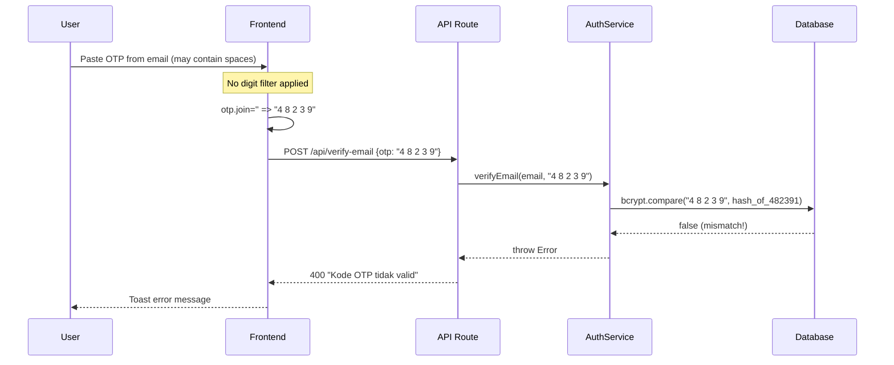
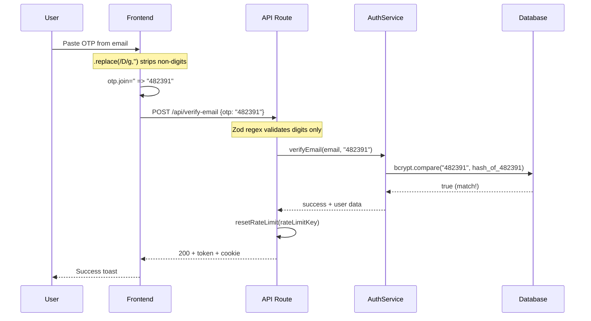

# Blueprint: Auth Verification OTP Bugfix

**Date:** 2026-06-04  
**Scope:** Fix 7 bugs in registration → verification → login workflow  
**Root Cause:** OTP input handling allows non-digit characters, causing `bcrypt.compare` to fail even when user enters correct code

---

## A. SYSTEM OVERVIEW

### Problem Statement
User reports: "Kode verifikasi tidak valid padahal sudah sama dengan yang dikirimkan."  
Audit reveals the OTP paste handler does not filter non-digit characters (spaces, symbols) that email clients may insert when copying OTP codes. Combined with 6 additional bugs affecting the full auth lifecycle.

### Target Architecture
Add defensive validation at 3 layers: frontend input, API schema, and business logic. No schema/database changes required.

### Scope
- 5 files modified
- 0 files created
- 0 files deleted
- 0 database migrations

---

## B. FILE MAPPING

```
src/
├── components/auth/
│   └── email-verification-dialog.tsx    ← MODIFIED (Bug #1, #2, #7)
├── app/api/
│   └── verify-email/route.ts            ← MODIFIED (Bug #4, #6)
├── app/
│   └── login/page.tsx                   ← MODIFIED (Bug #5)
├── services/
│   └── auth.service.ts                  ← MODIFIED (Bug #3)
└── lib/
    └── rate-limiter.ts                  ← UNCHANGED (Bug #4 fix uses existing resetRateLimit)
```

---

## C. MODULE SPECIFICATIONS

### Bug #1 — Paste OTP non-digit filter (CRITICAL)

**File:** `src/components/auth/email-verification-dialog.tsx` lines 53-61  
**Function:** `handlePaste`

- **Current:** `e.clipboardData.getData('text').slice(0, 6)` — no digit filter
- **Change:** Apply `.replace(/\D/g, '')` before slicing
- **Also:** Reset array to `['','','','','','']` before filling (fixes Bug #7)
- **Also:** Auto-focus last filled input and auto-submit when 6 digits pasted
- **Risk:** Low — purely additive validation

### Bug #2 — Input OTP digit-only validation (CRITICAL)

**File:** `src/components/auth/email-verification-dialog.tsx` lines 34-45  
**Function:** `handleOtpChange`

- **Current:** `if (value.length > 1) return;` — accepts any character
- **Change:** Filter with `value.replace(/\D/g, '').slice(0, 1)` before storing
- **Also:** Change `<input type="text">` to `type="tel"` and add `pattern="[0-9]*"` in JSX
- **Risk:** Low — blocks invalid input at source

### Bug #3 — Email fire-and-forget (SIGNIFICANT)

**File:** `src/services/auth.service.ts` line 62-65  
**Function:** `register`

- **Current:** `sendVerificationEmail(...).catch(...)` — fire-and-forget
- **Change:** Wrap in `try { await ... } catch { ... }` with console.error
- **Note:** Still returns success to user even if email fails (user can resend from dialog)
- **Risk:** Low — only changes await timing, not business logic

### Bug #4 — Rate limiter counts successful attempts (MODERATE)

**File:** `src/app/api/verify-email/route.ts` lines 48-56  
**Function:** `POST`

- **Current:** `checkRateLimit` increments counter before verification, never resets on success
- **Change:** Import `resetRateLimit` and call `resetRateLimit(rateLimitKey)` after successful verification
- **Risk:** Low — uses existing `resetRateLimit` function from `rate-limiter.ts`

### Bug #5 — Login unverified flow no auto-resend (MODERATE)

**File:** `src/app/login/page.tsx` lines 84-91  
**Function:** `handleLogin`

- **Current:** Shows verification dialog but does NOT resend OTP
- **Change:** Add `resendVerification(email).catch(() => {})` call after showing dialog
- **Also:** Import `resendVerification` from `@/services/auth-api`
- **Risk:** Low — additive feature, fallback is manual resend button

### Bug #6 — Zod schema no digit regex (MINOR)

**File:** `src/app/api/verify-email/route.ts` line 11  
**Schema:** `VerifyEmailSchema`

- **Current:** `z.string().length(6, '...')` — accepts any 6-char string
- **Change:** `z.string().regex(/^\d{6}$/, 'Kode OTP harus tepat 6 digit angka')`
- **Risk:** Low — stricter validation, no functional change for valid inputs

### Bug #7 — Paste does not reset old OTP array (MINOR)

**File:** `src/components/auth/email-verification-dialog.tsx` line 56  
**Resolved within Bug #1 fix** — paste handler resets array before filling

---

## D. DATA FLOW & ERROR HANDLING

### Current (Buggy) Flow


### Fixed Flow


### Error Handling Matrix

| Scenario | Current Behavior | Fixed Behavior |
|----------|-----------------|----------------|
| Paste with spaces | OTP mismatch → "tidak valid" | Spaces stripped → works |
| Type letter in OTP field | Letter accepted → mismatch | Letter blocked → input stays empty |
| 3 failed attempts | Locked 1 hour, even after success | Reset on success |
| SMTP fails silently | User stuck, no OTP received | Logged, user can resend |
| Login with unverified email | Dialog shows, no OTP sent | Auto-resend OTP |

---

## E. EXECUTION SEQUENCE

### Step 1: Fix OTP Input Validation (Bug #1 + #2 + #7)
**File:** `src/components/auth/email-verification-dialog.tsx`
- [ ] Modify `handleOtpChange` to filter non-digit characters
- [ ] Modify `handlePaste` to filter digits, reset array, auto-focus, auto-submit
- [ ] Change `<input type="text">` to `type="tel"` with `pattern="[0-9]*"`

### Step 2: Fix Server-Side Validation (Bug #6)
**File:** `src/app/api/verify-email/route.ts`
- [ ] Change OTP schema from `.length(6)` to `.regex(/^\d{6}$/)`

### Step 3: Fix Rate Limiter Reset (Bug #4)
**File:** `src/app/api/verify-email/route.ts`
- [ ] Import `resetRateLimit` from `@/lib/rate-limiter`
- [ ] Add `resetRateLimit(rateLimitKey)` after successful verification

### Step 4: Fix Email Fire-and-Forget (Bug #3)
**File:** `src/services/auth.service.ts`
- [ ] Change `sendVerificationEmail(...).catch(...)` to `try { await ... } catch { ... }`

### Step 5: Fix Auto-Resend on Login (Bug #5)
**File:** `src/app/login/page.tsx`
- [ ] Import `resendVerification` from `@/services/auth-api`
- [ ] Add `resendVerification(email).catch(() => {})` in `handleLogin` unverified branch

### Step 6: Verification
- [ ] Manual test: Register → receive OTP → type OTP → verify → login
- [ ] Manual test: Register → copy OTP from email → paste OTP → verify → login
- [ ] Manual test: Login with unverified email → receive new OTP → verify
- [ ] Manual test: Enter wrong OTP 3 times → rate limited → after 1 hour can retry
