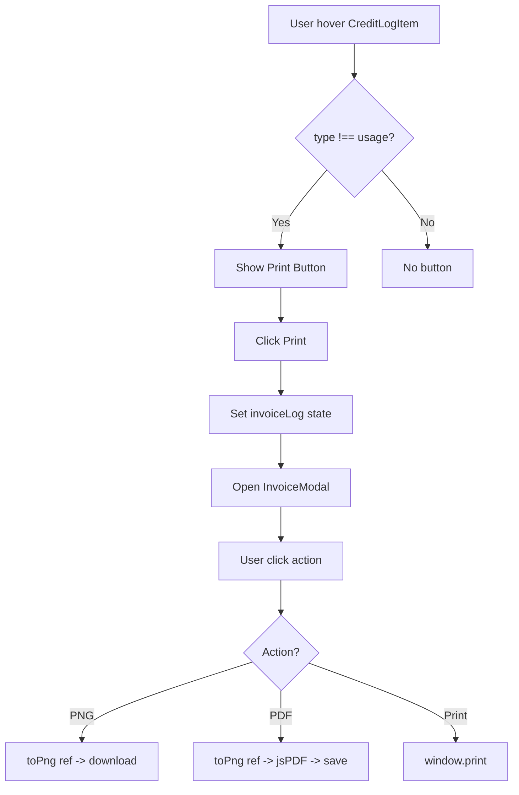
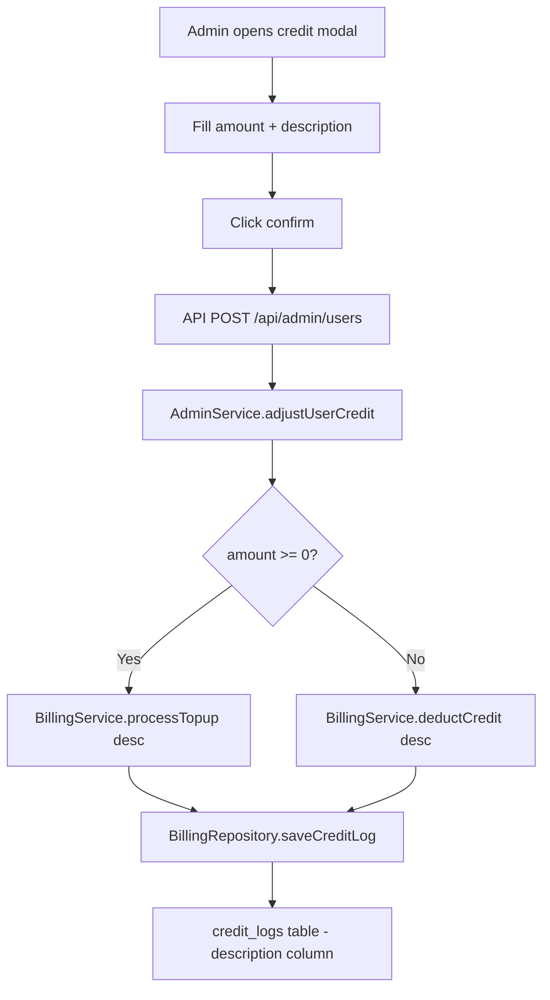

# Blueprint: Fitur Cetak Invoice Transaksi Kredit

**Tanggal:** 2026-06-04
**Scope:** Invoice print (PNG/PDF/Print) untuk semua credit log + deskripsi manual admin

---

## A. SYSTEM OVERVIEW

### Tujuan
Menambahkan fitur cetak invoice untuk setiap transaksi kredit (topup, bonus, deduct, admin_set, admin_adjust) di dialog akun pengguna. Setiap entry credit log akan memiliki tombol "Cetak" yang membuka modal invoice, dengan opsi download PNG, download PDF, atau print langsung.

### Ruang Lingkup
1. **Invoice Modal** - Komponen baru untuk preview dan export invoice
2. **Tombol Cetak** - Ditambahkan ke CreditLogItem (kecuali type `usage`)
3. **Deskripsi Admin** - Admin bisa isi deskripsi/keterangan saat atur kredit (saat ini hardcode `'Admin adjustment'`)
4. **Backend Fix** - `processTopup()` perlu param `description` opsional

### Dependencies Baru
- `html-to-image` (v1.11.11+) - Konversi DOM → PNG
- `jspdf` (v2.5.2+) - Generasi PDF dari gambar

---

## B. FILE MAPPING

```
src/
├── components/
│   ├── chat/
│   │   └── account-dialog/
│   │       ├── components/
│   │       │   ├── credit-log-item.tsx    [MODIF] Tambah tombol cetak
│   │       │   ├── invoice-modal.tsx      [NEW]   Modal invoice + export
│   │       │   └── overview-tab.tsx       [MODIF] Pass onPrintInvoice prop
│   │       └── index.tsx                  [MODIF] State invoiceLog + render modal
│   └── admin/
│       ├── admin-credit-modal.tsx         [MODIF] Tambah Textarea deskripsi
│       └── admin-user-table.tsx           [MODIF] Update prop types
├── app/
│   ├── api/admin/users/route.ts           [MODIF] Ambil description dari body
│   ├── admin/page.tsx                     [MODIF] Pass description ke hook
│   └── globals.css                        [MODIF] @media print styles
├── hooks/
│   └── useAdminUsers.ts                   [MODIF] Tambah param description
└── services/
    ├── admin.service.ts                   [MODIF] Pass description ke processTopup
    └── billing.service.ts                 [MODIF] processTopup accept description
```

---

## C. MODULE SPECIFICATIONS

### C1. Invoice Modal (`invoice-modal.tsx`) [NEW]

**Props:**
```typescript
interface InvoiceModalProps {
  log: CreditLogEntry | null;
  open: boolean;
  onClose: () => void;
}
```

**Konten Invoice (adaptif per type):**

| Field | Content |
|-------|---------|
| Header | Logo "AI Chat" + "INVOICE TRANSAKSI" |
| Invoice No | Format: `INV-{YYYYMMDD}-{4char}` |
| Tanggal | `formatFullTime(log.createdAt)` |
| Tipe | Label per type (lihat mapping di bawah) |
| Deskripsi | `log.description \|\| '-'` |
| Jumlah | `{sign}{amount} kredit` |
| Harga/kredit | `Rp 15.000` (hanya untuk topup/bonus) |
| Total | `\|amount\| x Rp 15.000` |
| Saldo Akhir | `formatCurrency(log.balance)` |
| Status | `Berhasil` (selalu, karena sudah tercatat) |

**Type Mapping:**
```
topup       → "Top Up Kredit"        | PlusCircle  | emerald
bonus       → "Bonus Selamat Datang" | Gift        | amber
deduct      → "Pengurangan Kredit"   | MinusCircle | red
admin_set   → "Atur Kredit (Admin)"  | Shield      | blue
admin_adjust → "Penyesuaian (Admin)" | Settings    | violet
```

**Export Functions:**
- **PNG**: `toPng(invoiceRef, { quality: 1, pixelRatio: 2 })` → blob → download `<a>`
- **PDF**: `toPng()` → `new jsPDF('p', 'mm', 'a4')` → `addImage(dataUrl, 'PNG', 10, 10, 190, h)` → `save()`
- **Print**: `window.print()` dengan CSS `@media print` yang sembunyikan semua kecuali `.invoice-print-area`

**UI Layout:**
```
Dialog (max-w-lg)
├── DialogHeader
│   ├── DialogTitle: "Invoice Transaksi"
│   └── DialogDescription: "Detail transaksi kredit Anda"
├── Invoice Preview Area (.invoice-print-area, ref)
│   ├── Brand Header (logo + "AI Chat")
│   ├── Invoice Meta (no, tanggal)
│   ├── Detail Table (tipe, deskripsi, jumlah, harga, total)
│   ├── Footer (saldo akhir, status)
│   └── Watermark / Garis pembatas
└── DialogFooter (3 tombol)
    ├── Button "Unduh PNG" (Download icon)
    ├── Button "Unduh PDF" (FileText icon)
    └── Button "Cetak" (Printer icon)
```

### C2. CreditLogItem Modifikasi

**Perubahan:**
- Tambah prop `onPrint?: (log: CreditLogEntry) => void`
- Tambah tombol "Cetak" (icon `Printer`) di sisi kanan entry
- Visibility: `log.type !== 'usage'` (gunakan `Exclude` type guard)
- Styling: `opacity-0 group-hover:opacity-100 transition-opacity`

```typescript
// Tambah di props
interface CreditLogItemProps {
  log: CreditLogEntry;
  onPrint?: (log: CreditLogEntry) => void;
}

// Tambah di JSX (setelah amount)
{log.type !== 'usage' && onPrint && (
  <button
    onClick={(e) => { e.stopPropagation(); onPrint(log); }}
    className="opacity-0 group-hover:opacity-100 transition-opacity p-1.5 rounded-md hover:bg-muted/30"
    title="Cetak Invoice"
  >
    <Printer className="h-3.5 w-3.5 text-muted-foreground/60" />
  </button>
)}
```

### C3. OverviewTab Modifikasi

**Perubahan:**
- Tambah prop `onPrintInvoice: (log: CreditLogEntry) => void` ke `OverviewTabProps`
- Pass ke `<CreditLogItem onPrint={onPrintInvoice} />`

### C4. AccountDialog (index.tsx) Modifikasi

**State baru:**
```typescript
const [invoiceLog, setInvoiceLog] = useState<CreditLogEntry | null>(null);
```

**Handler:**
```typescript
const handlePrintInvoice = useCallback((log: CreditLogEntry) => {
  setInvoiceLog(log);
}, []);
```

**Render:**
```tsx
<OverviewTab
  // ... existing props
  onPrintInvoice={handlePrintInvoice}
/>

<InvoiceModal
  log={invoiceLog}
  open={!!invoiceLog}
  onClose={() => setInvoiceLog(null)}
/>
```

### C5. Admin Description Feature

#### C5a. `admin-credit-modal.tsx` - Tambah Textarea

```typescript
// State baru
const [description, setDescription] = useState('');

// Di handleConfirm, pass description ke callback
if (activeTab === 'set') {
  result = await onSetCredit(user.id, numAmount, description);
} else if (activeTab === 'topup') {
  result = await onAddCredit(user.id, numAmount, description);
} else if (activeTab === 'reduce') {
  result = await onAddCredit(user.id, -numAmount, description);
}

// Reset setelah sukses
setDescription('');
```

**UI:** Tambah `<Textarea>` di bawah input amount, placeholder "Keterangan (opsional)"

#### C5b. `admin-user-table.tsx` - Update Props

```typescript
interface AdminUserTableProps {
  // Ubah:
  onSetCredit: (id: string, amount: number, description?: string) => Promise<{ success: boolean }>;
  onAddCredit: (id: string, amount: number, description?: string) => Promise<{ success: boolean }>;
}
```

#### C5c. `admin/page.tsx` - Pass description

```typescript
const handleSetCredit = async (userId: string, amount: number, description?: string) => {
  return await setCredit(userId, amount, description);
};
const handleAddCredit = async (userId: string, amount: number, description?: string) => {
  return await addCredit(userId, amount, description);
};
```

#### C5d. `useAdminUsers.ts` - Tambah param description

```typescript
const setCredit = useCallback(async (userId: string, amount: number, description?: string) => {
  const response = await fetch('/api/admin/users', {
    method: 'POST',  // FIX: ubah dari PUT ke POST, karena PUT hanya untuk role
    headers: { 'Content-Type': 'application/json' },
    body: JSON.stringify({ userId, amount, description, action: 'set-credit' }),
  });
  // ...
}, []);

const addCredit = useCallback(async (userId: string, amount: number, description?: string) => {
  const response = await fetch('/api/admin/users', {
    method: 'POST',
    headers: { 'Content-Type': 'application/json' },
    body: JSON.stringify({ action: 'add-credit', userId, amount, description }),
  });
  // ...
}, []);
```

#### C5e. `/api/admin/users POST` - Ambil description

```typescript
const body = await request.json();
const { userId, amount, description } = body;

// Pass description ke service
await AdminService.adjustUserCredit(userId, Number(amount), description || 'Admin adjustment');
```

#### C5f. `admin.service.ts` - Pass description ke processTopup

```typescript
async adjustUserCredit(userId: string, amount: number, reason: string): Promise<void> {
  if (amount >= 0) {
    await BillingService.processTopup(userId, amount, reason);  // FIX: pass reason
  } else {
    await BillingService.deductCredit(userId, -amount, reason);
  }
}
```

#### C5g. `billing.service.ts` - processTopup accept description

```typescript
async processTopup(userId: string, amount: number, description?: string): Promise<void> {
  // ...
  const log: CreditLog = {
    id: uuidv4(),
    user_id: userId,
    type: 'topup',
    amount: amount,
    balance: newBalance,
    description: description || `Top-up of ${amount} credits`,  // FIX: gunakan custom description
    created_at: new Date(),
  };
  // ...
}
```

---

## D. DATA FLOW & ERROR HANDLING

### Data Flow: Cetak Invoice



### Data Flow: Admin Description



### Error Handling

| Scenario | Handling |
|----------|----------|
| `toPng()` gagal | Toast error "Gagal membuat gambar invoice" |
| `jsPDF` gagal | Toast error "Gagal membuat PDF" |
| `window.print()` dibatalkan | Tidak perlu handling (browser native) |
| `log` null di modal | Modal tidak render (guard `if (!log) return null`) |
| Admin description kosong | Fallback ke default: `'Admin adjustment'` / `'Top-up of X credits'` |

---

## E. EXECUTION SEQUENCE

### Phase 1: Dependencies
1. `pnpm add html-to-image jspdf`

### Phase 2: Backend - Admin Description Pipeline
2. **`billing.service.ts`** - Modifikasi `processTopup()` signature: tambah optional `description` param, gunakan di log creation
3. **`admin.service.ts`** - Modifikasi `adjustUserCredit()`: pass `reason` ke `processTopup()` (saat ini hanya pass ke `deductCredit()`)
4. **`/api/admin/users POST`** - Ambil `description` dari request body, pass ke `AdminService.adjustUserCredit()`

### Phase 3: Admin UI - Description Input
5. **`useAdminUsers.ts`** - Tambah param `description` ke `setCredit()` dan `addCredit()`, pass ke API body. FIX: `setCredit` gunakan POST (bukan PUT) karena PUT hanya untuk role
6. **`admin/page.tsx`** - Update `handleSetCredit` dan `handleAddCredit` untuk pass `description`
7. **`admin-user-table.tsx`** - Update prop types `onSetCredit` dan `onAddCredit`
8. **`admin-credit-modal.tsx`** - Tambah state `description`, `<Textarea>`, pass ke callbacks

### Phase 4: Invoice Modal
9. **`invoice-modal.tsx`** - Buat komponen baru dengan:
   - Invoice preview area (ref for export)
   - Adaptive content per credit type
   - 3 export buttons (PNG, PDF, Print)
10. **`globals.css`** - Tambah `@media print` styles

### Phase 5: Wire Up Invoice
11. **`credit-log-item.tsx`** - Tambah prop `onPrint`, tombol cetak (Printer icon, hover visible, kecuali type usage)
12. **`overview-tab.tsx`** - Tambah prop `onPrintInvoice`, pass ke CreditLogItem
13. **`index.tsx`** - Tambah state `invoiceLog`, handler, render InvoiceModal + pass prop ke OverviewTab

### Phase 6: Testing & Polish
14. Test semua flow: cetak topup, bonus, deduct, admin_set, admin_adjust
15. Test export: PNG download, PDF download, Print langsung
16. Test admin: isi deskripsi, cek muncul di invoice
17. Verify `@media print` tidak mengganggu UI lain
